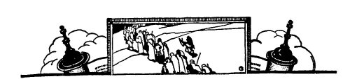
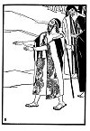
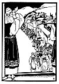
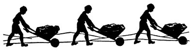
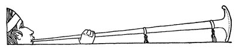
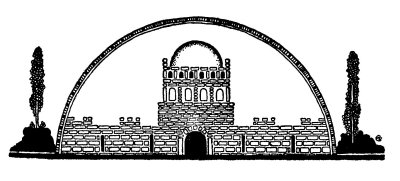

  
[Intangible Textual Heritage](../../index)  [Judaism](../index) 
[Index](index)  [Previous](tgm03)  [Next](tgm05) 

------------------------------------------------------------------------

p. 1

 

# 1. THE HAPPY RETURN

*Clish, clash, clash!  
Troot, toot, too!  
Tra, la, la, la!  
Boom, boom, boom*!

LISTEN to those noises! Do you hear the clash of the swords; and the
thump, thump, thump, of the marching soldiers?

And oh! that crying and moaning and wailing!

The Temple, that beautiful building, has fallen. Jerusalem, the holy
city, the city which we thought would never, never, be destroyed lies in
ruins--a heap of little stones.

Look at the people. They are pale. Their hands tremble. They cannot
walk. They escaped the sword of the enemy and now they are dying of
hunger and thirst. A little boy cries: "Mamma, mamma, I want something
to eat--just a little piece of bread."

"Mamma, mamma, I am thirsty. I want some water. Oh, please give me just
one little drink," moans another.

p. 2

What can their mothers do? They have no bread for their children, they
have no water for them.

Nebuchadnezzar, the mighty king, is taking those who, are still living,
to his own city, Babylon. They must leave their once beautiful city and
their wonderful temple, the temple which King Solomon has built, and
they must become prisoners-prisoners in a strange land.

Do you see that blind man walking straight into that tree? Yes, he is
Zedekiah, the blind Jewish king. The cruel king, Nebuchadnezzar of
Babylonia, has placed him at the head of all the people. And now with
only their blind king to lead them, the Jews leave their beloved city.

Listen to their mournful chant as they trudge wearily on:

*Jerusalem the holy,  
No more, no more,  
Jerusalem the good,  
No more, no more,  
The Temple, the beautiful  
All,--all are gone*.

Thus slowly and sadly they leave Jerusalem.

\*        \*        \*

 

[  
Click to enlarge](img/00300.jpg)

 

p. 4

MANY years passed. The little children became big men and women. But
they never forgot Jerusalem and the Temple. Ceaselessly they worked and
worked, and planned and planned, until they were at last able to return
to their dear Jerusalem. They then began to rebuild the Temple which
Nebuchadnezzar had destroyed. By this time they were old men and women.
Even these people who had never seen Jerusalem and the Temple, but had
only heard of it from their grandparents wanted to help in the
rebuilding of the Temple.

And many were the little boys and girls who pulled loads of stones,
carted dirt, and ran errands for the older people. Oh, they helped all
they could and never seemed to get tired. They pulled the stones and
pulled the stones for many, many miles. They filled one wagon of dirt
and rode away with it, and then another wagon and still another wagon.
Not until sunset did they leave off working and go home.

I remember two little boys in particular. They were called Sallu and
Nob. At the end of the day you could often hear one say to the other,
"Sallu, how many stones did you pull over to the Temple today?"

"More than you did, anyway," Nob would sneer

"Well, I pulled two more than yesterday," Sallu would say, his black
eyes sparkling with glee.

 

[  
Click to enlarge](img/00500.jpg)

 

p. 6

"But, how many altogether?"

"Suppose you tell me first."

"Oh, I pulled twenty stones," Nob would say proudly but quietly.

"Well, I'll pull more than that tomorrow."

And so every day they would ask each other how many loads each had taken
away and how many stones each had brought. And the little boy who had
done more was the happier.

 

In the meantime, day after day and week after week, the elders were busy
collecting gold and silver and fine stones for the Temple.

One day when they were busier than ever before, the Samaritans, who you
know were not Jews, came over and said:

"Let us help you build. We too need a temple. We want to pray together
with you."

But the Jews loved the Temple so much that they wanted to do everything,
every little bit, all by

p. 7

themselves. Do you blame them? So they answered: "You are not Jews. Why
should you do our work? We thank you very much, but we want to do the
work ourselves."

For the next few days the Jews, as usual, worked very hard in peace and
quiet. Alas! this did not last long. The Samaritans went to the king of
the country and said:

"The Jews are building a temple in Jerusalem. The city, too, they are
rebuilding. When all their work is done, O King, they will make war
against you. Do not let them finish their work."

So the king sent out an order that all work on the Temple should be
stopped. The next day the bricklayers stopped laying the bricks, the
carpenters stopped sawing the wood, and the children stopped carting the
dirt. Everybody stopped working and that little worker, Sallu, said to
Nob:

"Some day I am going to fight those Samaritans. I will gather all the
children. I will be the captain. Do you want to join the army?"

"Of course, of course," cried Nob, forgetting his rivalry with Sallu and
jumping for joy.

But before Sallu had a chance to gather his army, news came that the
Jews were once more permitted to take up the work.

p. 8

 

Oh, how happy everybody was! The Temple would at last be finished. But
this time they put on their swords. They would take no chances! Now they
would be prepared should the Samaritans attack them again. So with sword
buckled to belt, each went back to his special task.

Many, many weeks had passed. At last, the great Temple was finished. On
a warm summer day, the priests and the singers, the children and all the
rest of the people entered the newly built Temple for the first time.

The priests were dressed in long white silk robes. Their jewels shone
brightly in the sun as they led the procession into the Temple. Then
came the singers dressed in gowns of purple and red, trimmed with gold.
After them followed the children, in loose, flowing garments. And who do
you think led the children? Why, Sallu and Nob, of course. They had
gathered their army but instead of leading it against the Samaritans,
they were leading it up, up, up the many stairs to the Temple. Lastly
followed the multitude. They all had trumpets and timbrels and harps. At
the

p. 9

command of the high priest they began to play their instruments, and
sing and shout and dance.

That was indeed a happy day for the Jews. Jerusalem the beloved, the
city of David and Solomon, once more had a beautiful Temple. And merrily
did the people dance and happily did they sing:

*Jerusalem, Jerusalem,  
Jerusalem the dear,  
Oh how happy, happy  
Are we to be here*!

*Jerusalem, Jerusalem,  
Jerusalem the dear,  
Oh how happy, happy  
Are we to be here*!

 

 

 

------------------------------------------------------------------------

[Next: 2. With Peace They Conquer](tgm05)
