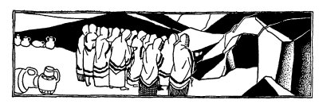
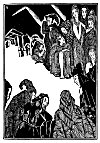

  
[Intangible Textual Heritage](../../index)  [Judaism](../index) 
[Index](index)  [Previous](tgm07)  [Next](tgm09) 

------------------------------------------------------------------------

p. 30

 

# 5. WALKING BETWEEN RAINDROPS

AT THE time of Rabbi Simon ben Shetach, there lived eighty witches in a
cave.

"That must not be," said Rabbi Simon. "Eighty women just wasting away
their time."

One day when the rain was pouring down in torrents, Simon gathered
eighty tall young men. To each man he gave a new pitcher. Into this
pitcher, each one put a clean new Talis (prayer shawl). Then they turned
the pitchers upside down over their heads. In this way, the prayer
shawls were kept dry.

Rabbi Simon then said to the young men:

"When we arrive at the cave, this is what you'll do. When I whistle
once, put the wraps on; when I whistle again, come into the cave at
once. As each of you enters, lift a young woman off the floor. (Once the
witches are off the floor, they lose their power.)"

And so they all set out for the cave.

p. 31

When they reached the cave, the Rabbi knocked at the door and said:

"*Oo-yim--  
Oo-yim,  
Open the door,  
I'm one of you*."

"What did you come to do here?"

"To learn and also to teach," said the Rabbi. "Each one of you will do
some magic for me."

The witches opened the door. The young men quickly hid themselves
outside the cave.

When the Rabbi came into the cave, one of the witches noticed that in
spite of the rain he was perfectly dry.

"How is it you're dry when it's raining so hard outside?" she asked in
wonder.

"I walked between the raindrops," answered the Rabbi simply.

Satisfied with the answer, the witches began to show their magic. One
witch came forward and said:

"*Mee-lee, mee-lee,  
Oak, too, too,  
Here's some bread  
I've baked for you*."

p. 32

Saying these words, she produced a piece of bread. When she had finished
her trick, she turned to the Rabbi and asked:

"And you, what can you do?"

Then another witch came up and said:

"*Boss-nee, boss-nye,  
Zubedee,--bye  
Here's some meat!  
That's nice to fry*."

And with that, she handed him some meat. When she had finished her
stunt, she turned to the Rabbi and asked:

"And you, what can you do?"

Then the third witch said, as she knocked on the floor with a stick:

"*Goo goo goo  
Doo  doo doo  
This is pudding  
For me and for you*."

Saying that, she brought out some pudding. When she had finished her
stunt, she turned to the Rabbi and said:

"And you, what can you do?"

p. 33

 

[  
Click to enlarge](img/03300.jpg)

 

p. 34

Then a fourth witch, very tall and very lanky, came up. She stretched
out her arms and began to move them round and round in a circle, as she
said:

"*Round and round  
Curl and wound,  
Cocoa, tea, and coffee, too,  
Wine the best I bring to you*.

And she handed the Rabbi some wine. When she had finished her stunt, she
turned to the Rabbi and said:

"And you, what can you do?"

The Rabbi answered, "I can whistle twice, and so bring eighty men
dressed in dry wraps. They will entertain you. And you will surely enjoy
them."

So the Rabbi whistled once and the young men put on their wraps, which
they had kept dry under the pitchers. Then the Rabbi whistled again and
they all rushed into the cave.

Each young man picked up a witch, put her on his camel, and rode away
with her.

The witches all married the nice Jewish young men. They became good
hard-working women and were the mothers of some great scholars in
Israel.

------------------------------------------------------------------------

[Next: 6. School on the Roof](tgm09)
