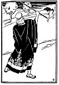

  
[Intangible Textual Heritage](../../index)  [Judaism](../index) 
[Index](index)  [Previous](tgm10)  [Next](tgm12) 

------------------------------------------------------------------------

p. 44

 

# 8. TORAH ON ONE FOOT

AT another time the heathens wanted to make fun of the Torah, and of the
rabbis. They asked one another:

"Are all rabbis as kind as, Hillel? Are all Jewish teachers as good as
Hillel? Are all rabbis as patient as Hillel?"

So one of them said:

"I shall go and find out." He came to Shammai, also a famous rabbi, and
cried:

"Your Torah, your wonderful Torah--I can learn it while I stand on one
foot. Rabbi Shammai, you teach it to me while I stand on one foot." You
see, he was just making fun of the Torah.

Now what do you suppose Shammai did? Do you think he had patience with a
man who was making fun of the Torah? Who ever heard of learning the
whole Torah while standing on one foot? The rabbis had spent all their
lives in studying the Torah and even then they were not sure that they
knew all of it.

Rabbi Shammai took a stick and shouted angrily:

"Get out of here, you scoffer I Do you think I have

p. 45

 

[  
Click to enlarge](img/04500.jpg)

 

p. 46

time to waste on people who mock our holy Torah?" The heathen ran away.
He thought he would go to Hillel and see what Hillel would do.

All out of breath, he came to Hillel's home. Hillel thought the man had
come for something very important. So Hillel said:

"What is the matter, my good man?" And the heathen answered:

"Teach me the Torah while I stand on one foot."

Of course Hillel, too, saw that the heathen was scoffing, but calmly and
patiently he said:

"You want to learn a great deal quickly, don't you? Very well, I shall
teach you the Torah while you stand on one foot. This is our Holy Torah:
'What is hateful to you, do not do unto others.'"

The heathen forgot that he had come only to jeer.

"Does it mean that the heathens and the Jews and all of us are brothers?
Does it mean that we must be kind to one another like brothers?" asked
the heathen, wonderingly.

"That's it, my son. That's the meaning of the whole Torah. All the rest
is only an explanation of that. Go, go, my son. Go and study it," said
Hillel kindly.

"When may I come for another lesson?" asked the heathen humbly.

------------------------------------------------------------------------

[Next: 9. Two Who Were Wrong](tgm12)
