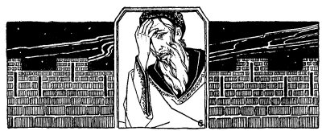
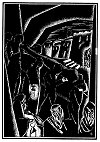

  
[Intangible Textual Heritage](../../index)  [Judaism](../index) 
[Index](index)  [Previous](tgm12)  [Next](tgm14) 

------------------------------------------------------------------------

p. 52

 

# 10. THE SCHOOL THAT SAVED A PEOPLE

### I

RABBI Johanan ben Zakkai saw that the end of Jerusalem was near. Every
day he walked up and down in his room. His forehead was wrinkled with
worry. He was not only worrying; he was thinking very hard.

Finally he exclaimed: "I have it. I know what I shall do!"

Soon you could have seen him hurrying to his pupils at his school. There
they were, not children, but men. He found them talking about the siege,
and worrying about the lack of food in Jerusalem. As Johanan entered,
all became silent.

"I must leave Jerusalem. I must go to see the emperor himself,"
announced Johanan in a sad voice.

Of course his pupils were eager to know why the rabbi wished to leave
the city; but they dared not ask.

p. 53

Then one plucked up enough courage to say:

"But, Rabbi, you know, that those Jews, who do not want to surrender to
the Romans, those Jews who believe we must fight the Romans, they will
not--"

"Let anybody either enter or leave the city. They will kill anyone who
wants to make peace with the Romans," another pupil ended the sentence.

"We shall find a way. I have something very important to ask of the
Emperor. It is the only thing that will save the Jewish people. And they
must, they shall be saved!"

There was silence for a while. Everyone was deeply moved. Yet no one had
any idea as to what could be done.

"I have a plan. Listen carefully while I tell it to you." The Rabbi did
not have to ask this of his pupils. They were only too eager to listen.

"We will spread a rumor," began the Rabbi in a low, clear voice, "that I
am sick. And after a few days we will spread another rumor that I am
dead."

The eyes of some of the young men lit up. They were beginning to see.
Yes, they understood the Rabbi's plan.

"You will get a coffin," continued the Rabbi, "and put me into it. Then
you will get permission to bury me."

p. 54

"Splendid! Fine idea!" cried some.

"But, Rabbi, a dead body always seems much heavier than a living one.
Suppose the officers lift the coffin. They will notice that it seems too
light," said another pupil slowly and timidly.

The pupils were getting excited. Each one had something to say. They
found it hard to listen patiently to one another, as they had always
done. Before they knew it, they were all talking together. No one knew
what the other was saying.

"Fill the coffin with rags," one voice called loudly above the rest.
"Yes, fill it with rags to make it heavier." But even though he screamed
he could hardly be heard. Only when the Rabbi began to speak were they
all hushed.

"Yes," said the Rabbi, "Joshua made a fine suggestion. We will fill up
the coffin, but we must find something heavier than rags."

"Stones will be good," called Eliezer ben Arakh, warmly.

So it was decided that the coffin would be filled with stones and then
the pupils would carry it out of the city.

The Rabbi and the pupils went home. Soon the people of Jerusalem,
prompted by Johanan's pupils, were saying to one another:

p. 55

"How sad! Johanan, the great teacher in Israel, is sick, very sick.
Johanan, the great rabbi, may die."

A few days later, everybody was mourning for Johanan.

Late at night, when everybody was in bed and even the night-watchmen
around the city walls were beginning to get sleepy, the pupils of Rabbi
Johanan came to his home all ready to carry the coffin containing the
Rabbi and the stones.

It was getting chilly. The Rabbi covered himself with many wraps. The
pupils, too, dressed themselves warmly. The Rabbi got into the coffin
and it was locked. The students, three at each side and one at each end,
carried the coffin. About fourteen walked ahead carrying lanterns to
light the way, and so they passed through the city. Not a person could
be seen or heard. Not even a dog barked. Neither the moon nor the stars
were out.

Can you see them as they walked along? They were hopeful, yet a little
afraid.

"How will it all turn out?" they wondered. They stopped once to relieve
those who were carrying the coffin.

Suddenly they heard an officer calling to them. Trembling, they stopped.
Those who were holding the coffin could hardly keep from dropping it.

p. 56

 

[  
Click to enlarge](img/05600.jpg)

 

p. 57

"What are you doing out here, so late?" asked the officer sternly.

"Rabbi Johanan died and we are carrying his body out of the city to be
buried," answered Joshua, whom they had chosen as their spokesman. The
officer hardly listened to their answer, commanding them to pass on.

And on they continued in silence. They were just aching to speak to the
Rabbi. They were just aching to find out how he was feeling and to tell
him that all was well. They did not know whether he could hear
everything or not. But on they had to walk in silence. They dared not
take any chances. Suppose someone should come along and hear them talk
into the coffin. No. They had to hurry out of the city as quickly as
possible.

Ben Biatach, one of the Jews who believed that they must fight the
Romans, was a friend of Rabbi Johanan. So, when the pupils had at last
reached the city walls they had no trouble there.

Soon they found themselves outside the city walls. There were the Roman
soldiers, drinking and singing. Some could hardly stand on their feet
from drunkenness. But they still knew what they were there for. As the
lanterns and the coffin approached them, one of the soldiers staggered
over and said:

p. 58

"Don't you know the law?"

"Yes, but all we want is to bury our Rabbi."

On hearing this, a few of the officers came over to the coffin. The
students could hear their hearts thump. What would the officers do?

Sure enough, they lifted up the coffin and found it quite heavy.

"Heavy man, your Rabbi," one laughed.

"From this it does not seem that they are starving yet in Jerusalem,"
jeered another.

The students remained quiet all this time.

Then one of the soldiers took out his spear and motioning to them to
open the coffin, he said, "I'll just stab once to make sure he is dead."

This was altogether unexpected. Beads of cold sweat stood out on the
students' foreheads. What should they do? What should they say?

Then Joshua walked over and made as if he were going to unlock the
coffin. But he stopped and in a tearful voice begged the soldiers:

"Please, please don't dishonor, don't defile the body of our Rabbi.
Among us Jews it is a great insult to stab a body. You know only too
well, that our Rabbi is dead."

"Aw, let them pass. They have wasted too much of our time as it is.
Come, come let us go back. Let

p. 59

us drink a little more for the night will soon be over." Saying this,
they threw their arms across one another's shoulders and walked away.

The students could hear the soldiers singing as they went on their way:

"*Hey-ho-hey-ho,  
Then fill another cup,--  
Hey-ho-hey-ho*."

They smiled to each other and began to sing along with the soldiers:
"Hey-ho-hey-ho-----."

They were so very happy. In a few minutes, they would be a safe distance
from the walls. Then they would open the coffin and all their fears
would be over.

At last--it seemed like years to them--they set down the coffin.
Breathlessly they opened it. Then they heaved one long sigh-h-h-h-h--as
the Rabbi greeted them with a smile.

They did not wait to be thanked, but wishing Rabbi Johanan success,
returned home.

The Jerusalem sky was ablaze with many, many colors. A new day was
dawning. What would it bring?

### II

Now what was Rabbi Johanan's wish? Was it really so important? Think of
it, the Rabbi had risked

p. 60

his life for it! His pupils had helped him most willingly, but they had
no idea why the Rabbi had gone to the general, Vespasian.

It was afternoon when Rabbi Johanan appeared before Vespasian, the
general. Vespasian had heard of Rabbi Johanan. He knew that the Rabbi
had always desired peace with the Romans. So he felt kindly towards
Johanan.

"Blessed be the Emperor Vespasian," said Rabbi Johanan as he came in.

"For that, you ought to die twice," Vespasian answered angrily. "First
of all, I am not an emperor; so you are just making fun of me. Secondly,
if I am the Emperor, why haven't you come to me before this?"

"I didn't come to you sooner because they would not let me out of the
city. And I tell you again you are, you are the Emperor."

Just as Rabbi Johanan was saying these words, a messenger from Rome was
ushered in.

"Hail to the Emperor Vespasian!" saluted the messenger. "The Emperor has
just died and you have been made the new Emperor."

Vespasian was of course very happy. He liked Rabbi Johanan even better
than ever.

"Is there anything I can do for you?" he asked.

p. 61

"Yes, I came to ask a little favor," answered the Rabbi. "Sooner or
later the Romans will capture Jerusalem. Now all I ask is that you allow
me to build a Jewish School in Javneh. That is a little town not far
from Jerusalem."

"Your wish will surely be granted," said Vespasian. To himself he
thought, "That Rabbi is foolish, after all. He could have asked for a
high position in the kingdom, or for some expensive jewels--something
worth while, something big, something important. Instead he asked for
such a trifle."

Rabbi Johanan, however, was very happy. He had staked his life. He might
have been killed in the coffin but he had succeeded in the end. Perhaps
Jerusalem would be destroyed. Jews would be killed or driven out of
Jerusalem. Perhaps they would be driven all over the world. But they
would not die out. They would have the school in Javneh. That school
would teach the Jewish children and the Jewish young men and women. That
school at Javneh would tell them of the sad and the happy days of the
Jews. That school would tell them of the wonderful, wonderful heroes of
the Jews. That school would keep the Jewish people together. That school
would keep the Jewish people alive. Johanan journeyed to Javneh
immediately and began to build that most important school.

------------------------------------------------------------------------

[Next: 11. Enough for Wash Day](tgm14)
