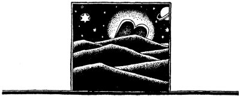
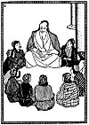

  
[Intangible Textual Heritage](../../index)  [Judaism](../index) 
[Index](index)  [Previous](tgm20)  [Next](tgm22) 

------------------------------------------------------------------------

p. 99

 

# 18. THE GUARDIANS OF THE TORAH

RABBI MEIR was very, very bright. So bright was he, that they called him
"Light." (You know "Meir" in Hebrew means "giver of light.") Meir made
everything clear to his big pupils, and he made his little pupils bright
and happy. Meir liked little children even more than any of the other
rabbis did. One day, when a strong wind was blowing outside, many
children came into the large synagogue. Rabbi Meir sat down and they
formed a circle about him. They stopped all their talking. They didn't
even whisper. "Oh, why doesn't he begin?" they wondered. "And why does
Rabbi Meir look so sad?"

"Children," said Rabbi Meir at last, "today I shall not tell you a funny
story. The story I shall tell you is not sad either, but it's hard to
understand. So listen very carefully.

p. 100

"Once upon a time--long, long ago--God wanted to give the Torah to us
Jews. 'But,' the Lord said, 'they will have to give me something very
dear to them. If they don't live up to the laws of the Torah, then I
shall not return that which they have given me.' So all the Jewish
people gathered around Mount Sinai and the Lord called out:

"'Here is the Torah. I will give it to you--if you give me good
security.'

"There was a general bustle among the people. One man said, 'Let us give
a large sum of money.' Another said, 'No, let us give all our jewelry.'
Still another said, 'Let us give our very finest silks and velvets.'

"'You speak foolishly,' said a third man. 'All of these things are
nothing. Today they are won, tomorrow they are gone. Let us offer the
stars. If we break this Law--this Torah, then may the stars never shine
for us again.'

"'That's too much to give,' said a younger man. 'Think of it, what will
this world be without the beautiful, shining, twinkling stars in the
sky?'

"'Oh, you foolish young man,' said several people at once. 'We shall
hold the Torah dear and the stars will always shine for us.'

"At last they all turned to the Lord and called:

p. 101

 

[  
Click to enlarge](img/10100.jpg)

 

p. 102

'*Neither money nor jewels  
Do we offer thee,  
But the stars, the twinkling stars  
Our security shall be*.'

"'I cannot accept them, O Israel,' said the Lord. 'These are not
lasting. Perhaps the stars will not shine forever.'

"Again the people all spoke at once,

"'Let us give the moon,' said they. 'We shall have to be very careful
indeed. Think what it would mean if we did not have the beautiful moon
at night.' So they said to the Lord:

'*Neither money nor stars  
Do we offer thee,  
But the moon, the beautiful moon  
Our security shall be*.'

"'I cannot accept that,' said the Lord. 'That too may not last forever.'

"'Let us give the sun. That surely will be accepted.'

"So they shouted:

'*Neither Gold nor silver  
Do we offer thee*.p. 103  
*The sun, the gleaming sun  
Our security shall be*.'

"'No, I cannot accept even that. The sun, too, may not last forever,'
said the Lord.

"Now all became silent. Neither money, nor jewels, nor the stars, nor
the moon, nor the sun was accepted. Everybody was puzzled. No one could
think of anything more costly, more valuable than what had been offered.
A deep silence reigned. It seemed as if the Jews would have to do
without the Torah.

"The Lord was about to take the Torah away when a woman cried:

"'Lord, O Lord. Wait--please wait. I know what we will give--our
children. Yes, our children--our very children we shall offer.'

"All were waiting breathlessly. Would the Lord accept the children?
Would he consider them good guardians of the Torah? As they were
wondering, they heard the Lord say:

"'Yes, your children shall be the guardians of the Torah. Here it is.
Take it, but your children shall guard it.' And so the Torah was given
to the Jews."

Rabbi Meir stopped speaking. Not a sound could be heard. There was no
clapping of hands. No one even stirred.

p. 104

After a long silence, one little boy asked:

"Rabbi Meir, does it mean that we children sitting here must be good
Jews, or else the Torah will be taken from us?"

"That's right, Simeon, that's exactly it," answered the Rabbi. "You
sitting here, and your children after you--and your children's children
after them--and so on forever and ever. Do you see how important you
are, and all children after you?"

The children looked very happy. They liked this story even more than the
funny ones. They felt grown up and responsible.

"If it depends on us," they said, "then we know that the Jews will
never, never have to give back the Torah."

 

 

 

------------------------------------------------------------------------

[Next: 19. Ki-Tov--’Twas Good](tgm22)
