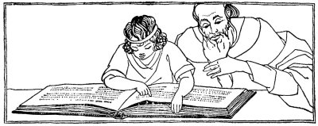
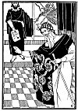

  
[Intangible Textual Heritage](../../index)  [Judaism](../index) 
[Index](index)  [Previous](tgm24)  [Next](tgm26) 

------------------------------------------------------------------------

p. 122

 

# 22. EVEN THOUGH I LOSE

IN THE DAYS of Saadiah Gaon, a rich man lived in Babylonia. This rich
man had two sons, whose names were Uri and Naphtali. One day the rich
man died suddenly, and left no will. Who would now get all the money
that the rich man had left? Would it be Uri or Naphtali?

The law of the land was that each son was to get an equal share. But
Uri, the older son, did not like this idea. "Here is a chance to get
very, very rich," he thought. So without a word to anyone he went to the
Head of the Jews and said:

"When the case comes up between my brother and me, will you rule that
all the money is to go to the older son? If you do this, I will make you
a rich man. Think of it! just by giving a little different explanation,
you can become a very rich man."

"Let me think it over," said the Prince.

p. 123

The Prince put his hand to his forehead and sat thinking very hard. At
last he said:

"All right, that's agreed."

Uri left, feeling very happy.

The Prince, however, could not eat nor could he sleep. Every minute he
was thinking: "I am going to give an unfair decision. I am going to take
away from Naphtali what rightfully belongs to him." Yet he was happy
too, for he was also thinking: "In a few weeks I shall be a very rich
man." But his conscience kept on troubling him so that he could not rest
at all. At last he found a way of making his decision seem less wicked.
He would have the Geonim agree in writing that his decision was just.

So the Prince sent messengers to get the signatures of the Geonim. When
the Geonim saw the decision they were very much surprised. And they
wondered what could have come over the Prince. One did not dare to ask
any questions. He was told to sign, and sign he did.

Since Saadiah was the other Gaon at that time, he, too, was asked to
sign the decision, but he refused to do so. He said that justice was
justice and not even the Prince could make him say that that ruling was
right.

"Saadiah," his friends warned, "don't be so stubborn.

p. 124

\[paragraph continues\] Don't you know you will lose your office?"

"Suppose I do," said Saadiah firmly, "is that a good reason for giving
an unfair decision?" And Saadiah did not sign the note.

On the following day, Saadiah was removed from his office.

A good many years had passed. Saadiah was again put back into office.
The Prince, who was Saadiah's enemy, was very old, and a new prince was
to be put at the head of the Jews. Who would be chosen? Saadiah did not
think of himself, nor of his enemy. Saadiah thought only of what would
be good for the Jewish people. He decided that his enemy's son was a
brave and just man, and that he should be chosen as the Prince.
Therefore, Saadiah did all he could to have his enemy's son made Prince.

Many more years passed, and the young Prince died. Then Saadiah took the
son of the Prince into his own home. There Saadiah educated him, just as
he would have educated his own son. He prepared him to be Prince just as
his father and grandfather had been before him. In this way, Saadiah did
all he could even for a man who was his enemy. That was the kind of a
man Saadiah was.

p. 125

 

[  
Click to enlarge](img/12500.jpg)

 

------------------------------------------------------------------------

[Next: 23. A Gift to the Caliph](tgm26)
