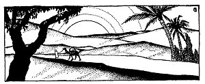
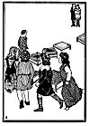

  
[Intangible Textual Heritage](../../index)  [Judaism](../index) 
[Index](index)  [Previous](tgm29)  [Next](tgm31) 

------------------------------------------------------------------------

p. 153

 

# 27. IN THE EAST IS MY HEART

"LET'S play school and I will be teacher," said Miriam, a dark-haired
little girl.

"No, no, play making bricks in Egypt."

"Oh, I don't want to think of the Jews in Egypt."

"Better play 'Going to Jerusalem,'" said Judah, a little boy of ten.

"Don't you ever get tired of that game, Judah? After all that playing
and marching, you could be in Jerusalem by now."

"I am going to Jerusalem some day," Judah answered proudly. His eyes
filled up with tears. Oh, how he wanted to go to Jerusalem! "All right,
let's play 'Going to Jerusalem.' You know how the game is played."

The children began to march around chairs. At the end of each round some
child was left out. Someone stayed behind. Someone did not reach

p. 154

 

[  
Click to enlarge](img/15400.jpg)

 

p. 155

\[paragraph continues\] Jerusalem. Who do you think did get to
Jerusalem? Who do you think won the game? No, it was not Judah, not yet.
Not even in the game did he get his wish fulfilled. Miriam won the game.

That evening at the table his father asked Judah kindly:

"Well, Judah, did you get to Jerusalem yet?" Judah hung his head.

"No," he answered sadly, "not yet, but I will some day."

Many days passed. Then many years. Judah grew up and went to college in
Spain. One day Judah, now tall and handsome, was sitting on a big rock,
facing east and writing a poem. He looked up and recited:

"*O city, far-off East, the beautiful,  
The blest,  
My Spirit longs for thee  
From out the far-off West.  
If only I had an eagle's wings,  
Straight would I fly to thee,  
And I would moisten thy holy dust  
With tears ever running free*."

 [1](#fn_0)

\[paragraph continues\] Some of his college friends came over and
listened.

p. 156

"Well, Judah," said one, 'care you studying hard for the doctor's exam?"

"Oh, bother! Exam!" replied Judah angrily. "I'm writing poetry to my
beloved."

His friends drew back, surprised. So Judah had a girl! They didn't know
that.

When Judah saw their surprise he asked:

"Want to hear one of the poems? How do you like this one?

"*O city, far-off East, the beautiful, the blest,  
My Spirit longs for thee  
From out the far-off West.  
If only I had an eagle's wings,  
Straight would I fly to thee,  
And I would moisten thy holy dust  
With tears ever running free*."

The friends all agreed that the poem was beautiful. They saw their
mistake. Judah had no real girl. His girl was Jerusalem.

"Please read us another one," they begged. And they didn't have to coax
Judah. Immediately he began:

"*In the East, in the East  
Is my heart,  
And I dwell in the end of the West.  
All the beauties and treasures of Spain* p.
157  
*Are worthless as dust  
In mine eyes;  
But the dust of the ruined Temple  
As a treasure of beauty I prize*."'

 [1](#fn_1)

When he finished reading, one of the boys said:

"Beautiful poems--but how will that help you pass the exam?"

"That's true," sighed Judah. "Thinking and dreaming and writing of the
Holy Land won't help me pass the exams. And I do want to become a
doctor. I shall earn a lot of money and then I shall go to my beloved
city, Jerusalem."

Judah was graduated from college. He became a very successful doctor. He
was so busy that he hardly found time to write poems to his beloved.

Years passed. Judah married and had one daughter. As soon as she could
speak she, too, sang songs about Erets Israel.

One day when she was about eight years old, she suddenly turned to her
father and said:

"Father, I've heard so much about Jerusalem, and I know so many songs
and poems about it, but I have never seen Jerusalem. Won't we ever go
there?"

Then Judah took her on his knee, and told her at her age, he had always
played "Going to Jerusalem,"

p. 158

and how he, too, had made up his mind that when he grew up he would
surely go there.

"Oh, how I long to go there now!" he ended. "But all my brothers and
sisters are here and my dear friends, too. I hate to leave them all. And
besides, your mother doesn't want to go."

More years passed. Judah already had a grandchild, and even his
grandchild kept on singing:

"*In the East, in the East,  
Is my heart,  
And I dwell in the end of the West.  
All the beauties and treasures of Spain  
Are just like the dust  
In mine eyes;  
But the dust of the ruined Temple  
As a treasure of beauty I prize*."

At last the day came when Judah could wait no longer. He tore himself
away from his beloved family--his wife, his daughter, and his only
grandchild. He left his many, many friends. He gave up his work as a
doctor, and started for Jerusalem.

When Judah's ship was well out to sea, a strong wind arose which soon
became a storm. The waves kept dashing higher and higher. The boat was
tossed hither and thither. It seemed as though they would

p. 159

never reach the holy city. Days passed before the storm quieted down. At
last, tired but hopeful, he arrived in the Holy Land.

Judah had worked, and worked, and waited. But at last he had his reward.
Was this really Jerusalem? Was this really Judah in the streets of his
beloved city? It didn't seem possible. It didn't seem true!

Judah visited the Cave of Macpelah, the Wailing Wall, Rachel's Tomb, and
all the other places he so longed to see. He touched each building, each
stone, with his hands to make sure that he wasn't dreaming. While on the
boat, Judah had begun to write a book about Judaism, and many new poems.
He was now able to finish his books in the place where he had always
longed to be.

But Judah wasn't lucky enough to enjoy his beloved Jerusalem very long.
Only a few months after he had reached the city, he was kneeling outside
the city walls, chanting a song to Zion. While the great poet of Zion
was singing his song, a Mohammedan horseman came along. When he saw
Judah, a Jew, praying at the Wall, it made him very angry. So angry did
he become that he fell upon Judah and killed him.

Now, I know you feel sorry for Judah. But don't forget that he did reach
Jerusalem, his beloved city. And even to this day his poems to Zion are
sung.

------------------------------------------------------------------------

### Footnotes

[155:1](tgm30.htm#fr_0) Adapted from the
translation by Emma Lazarus.

[157:1](tgm30.htm#fr_1) Adapted from the
translation by Emma Lazarus.

------------------------------------------------------------------------

[Next: 28. An Angel Did It](tgm31)
