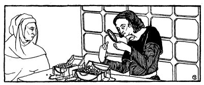
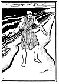

  
[Intangible Textual Heritage](../../index)  [Judaism](../index) 
[Index](index)  [Previous](tgm34)  [Next](tgm36) 

------------------------------------------------------------------------

p. 191

 

# 32. NOT FOR HIS CROWN

RASHI'S father lived in a small town in France, near the sea. He was
very poor, and he had to work very hard, loading and unloading the
boats. One day as he was walking near the harbor, he thought he saw
something very bright in the dirty sand. He stopped, and sure enough
there, between two little pebbles, lay a very precious pearl.

Hardly believing his eyes, Reb Isaac picked up the jewel and ran home.
His wife, Sarah, when she saw him running towards the house, became
worried. What could have happened? Why was Isaac coming home so early?
And why was he running? In her great anxiety, Rashi's mother began to
run towards her husband.

"Look! Look, Sarah!" called Isaac all out of breath. "See," he said
between gasps, "see, I just found this pearl at the harbor."

p. 192

 

[  
Click to enlarge](img/19200.jpg)

 

p. 193

"Isaac!" cried his wife with joy, "you'll never have to carry those
heavy loads again."

"And I shall be able to sit and study the Torah all the time. Just think
of that!" replied Isaac, his eyes filling with tears.

"I shall take it to the jeweler immediately," said Sarah as Isaac
carefully handed her the jewel.

With trembling hands and a very fast beating heart, Sarah ran into the
store of the jeweler.

"Look at this pearl. Isn't it very, very precious indeed?" she asked
tremblingly.

The jeweler examined it carefully with his magnifying glass. (You know
that's a glass that makes everything look much, much bigger than it
really is.) He held the pearl up to the sun and then again in front of
his candle.

"Yes, yes," the jeweler at last said slowly, as if talking to himself.
"This jewel is worth a lot. I will give you 10,000 ducats for it."

Now it happened that on that very day, the jeweler had received an order
from the bishop for a very expensive jewel, one that would be fit to set
in his crown. So the jeweler was very anxious to buy this pearl from
Rashi's mother.

"Yes," the jeweler said again, "I need this pearl to adorn the bishop's
crown, and even though it's not

p. 194

worth 10,000 ducats, I will pay you that much so that I may have it for
the bishop's crown."

"Oh, is it that bishop who hates the Jews? That bishop who wants all the
Jews to become Christians?"

The jeweler continued to examine the pearl, as if he hadn't heard what
Sarah had said.

"Is that the bishop?" Sarah asked again.

Looking up, the jeweler smiled and said: "Well, I guess he is the one
you mean."

Without saying another word, Sarah took the jewel from him and carefully
wrapped it up. The jeweler watched her, wondering what she was going to
do next. As he saw her turn to walk out, he said:

"What's the matter, woman, don't you think 10,000 is enough for that
pearl?"

"Oh, indeed, more than enough, I'm sure, but I must go home to ask my
husband's advice."

Do you think Sarah was foolish for not selling the pearl to the jeweler
immediately? Do you know why she didn't sell the jewel?

Just listen to what happened. Sarah came home and told her husband the
whole story. So he said:

"Well, Sarah, you didn't sell the jewel to him, did you?"

"Why, how did you guess?" asked Sarah wonderingly.

p. 195

"Because I know you wouldn't want to have your jewel adorn the crown of
a wicked man."

"That's it exactly. I was hoping you wouldn't be angry with me," Sarah
answered smilingly.

"No, no, far from it," and with those words Isaac took the jewel from
his wife's hands and threw it into the sea.

"I would rather the sea had it, than that it should adorn that man's
crown," he said.

Now if this was the kind of people Rashi's parents were, what would you
expect of their son? And what might have happened, had Isaac and Sarah
kept the jewel? Think of that!

 

 

 

------------------------------------------------------------------------

[Next: 33. How Rashi was Saved](tgm36)
