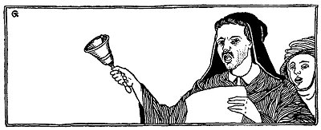
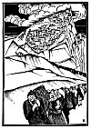
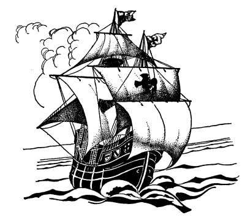

  
[Intangible Textual Heritage](../../index)  [Judaism](../index) 
[Index](index)  [Previous](tgm40) 

------------------------------------------------------------------------

p. 222

 

# 38. WHITHER--NOW?

"*Granada* *has fallen  
Gone are the Moors--  
Gone are these infidels  
Why not the Jews*?"

So chanted the crowds as Ferdinand and Isabella marched victoriously
into Granada. Banners were waving; bells were ringing; people were
shouting: "Down with the Moors! Down with the Jews!" And soon a
proclamation was sent throughout the whole of Spain which read:

"By the thirteenth of July not a Jew shall be found in any part of
Spain."

"Have you heard the proclamation?" Don Caesar, a very rich Jew, asked
Don Pedro.

"Which proclamation?" Don Pedro asked, rather ashamed that he wasn't
keeping up with the times.

p. 223

"Don't you know that in four months we Jews shall have to leave Spain?"
Don Caesar replied.

"Oh! I can't believe it. It isn't possible. It can't be true. Don't
Ferdinand and Isabella know that Halevi, Ibn Gabirol, Maimonides, and
Ibn Ezra were all Jews? Don't they know that their greatest philosophers
and poets were Jews? What can the King and Queen be thinking of?" Don
Pedro was getting more and more excited.

"Why, our ablest financiers, our greatest business men are Jews. Even at
this very moment Isaac Abravanel, a Jew, is holding a very high position
at the court," added Don Caesar.

But in a few days the King's messengers were calling throughout the
land:

"Jews! Hear ye. All you who do not accept Christianity must leave this
realm--or die."

Now, only one who has lived in Spain knows how beautiful that country
is. Only one who has lived in Spain knows how difficult it is to leave
it. The Jews had lived there for hundreds of years. They had made Spain
rich, and, as a result, they themselves had become rich. They loved the
country and they could not bear to leave it now. Over and over again
they said to one another:

"We shall not go. We shall refuse to leave!"

p. 224

Don Caesar Arobio and Don Pedro were chosen to write a letter to
Abravanel, who was at the court. Don Caesar and Don Pedro ended the
letter with these words: "Don Abravanel, you have power. You know how
much the Jews have done for Spain. You know how they hate to leave it.
Our fate is in your hands. You must appeal to the King and Queen. We
look to you to save us!"

What could Abravanel do? He was sorry for his brother Jews. He tried to
argue and plead with the King, but it did not help. At last Abravanel
took money, hundreds, thousands, even millions of ducats and heaped up
great piles of gold before the King. Abravanel knew that the King liked
money more than anything in the world, better than his religion, and
better even than his God.

At the sight of the money Ferdinand softened. He began to smile and
asked:

"Perhaps; but how much will you pay?"

"You can set your own price," said Abravanel.

Ferdinand was about to answer when in walked the cruel Torquemada, one
of the heads of the Catholic Church.

"Will you sell the Church for money?" he shouted. "Remember, the curse
of the Church will fall on your head."

p. 225

Everyone feared Torquemada, even the King himself. This decided it for
Ferdinand.

"I'm sorry, Abravanel," he said to his Jewish financier, it the Jews
must leave Spain. And neither gold nor silver will they be allowed to
take with them." Then in a low tone he said to Abravanel:

"Of course, Abravanel, you are welcome to stay here as long as you
live." Abravanel bowed and politely said:

"Thank you, we shall see about that later."

Soon the date for the expulsion came. It happened to be the ninth of Ab,
the same day on which the Temple in Jerusalem had fallen. Long and loud
was the wailing of the Jews. Not only were they being driven out of
their beloved country, but they were being sent away penniless. They
were not allowed to take gold or silver with them, so they had to
exchange their belongings for almost nothing. For many acres of land
they had to accept a few sheep; for their beautiful houses, a few
horses.

Left without a home, without a country, without their wealth, old and
young had to go. Some were sick and some were dying of grief. But
Torquemada did not want Spain to be filled with "unbelievers." So the
Jews had to go.

Many were robbed and murdered on the sea.

p. 226

 

[  
Click to enlarge](img/22600.jpg)

 

p. 227

\[paragraph continues\] Many never lived to see the land to which they
were fleeing for protection. Some were captured by sea vessels, and when
they had no money to give to the captain they were thrown into the sea.
Others, who were allowed to live, were sold as slaves.

And where were they going? One group with Isaac Abravanel as its leader
went to Italy, for you surely did not think that Abravanel would remain
in Spain, while his brother Jews were driven to strange lands. Abravanel
was very famous, not only in Spain but also in many other countries of
Europe. So he and the group of Jews who went with him were welcomed in
Italy.

Some Jews went to Africa, and still others went to Turkey. Many were
sold as slaves, and parents had to be separated from their children.

And so Spain was cleared of her Jews. But at the same time that the Jews
were driven from Spain, Columbus started on his voyage to East India.
The Jews had given their money not knowing that it would help Columbus
discover a new land--a land of refuge for all the suffering Jews, as
well as for other people. Into this land the Jews would bring their
Bible and their Talmud. Forgetting their troubles, they would carry over
their high ideals, and live on as a great people for centuries to come.

p. 228

Now Spain became less and less important, while this new land, which
granted religious freedom to its people, became one of the greatest
countries in the world. Some day we shall see how the Jews came to
America and how they lived in this new land of freedom.

 

 

 
