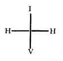

  
[Intangible Textual Heritage](../../index)  [Judaism](../index) 
[Index](index)  [Previous](tku04)  [Next](tku06) 

------------------------------------------------------------------------

# CHAPTER II.

1\. The beard of truth. (That is, now followeth a description of the
beard of Macroprosopus, and its thirteen parts, which are more fully
described in the "Idra Rabba.")

\[The beard is the influx which descends from the first Sephira through
all the others. Macroprosopus is of course, as I have fully explained in
the Introduction. the first Sephira, Kether, or the crown; also called
the Ancient One.\]

2\. Of the beard mention hath not been made. (The correct Mantuan Codex
hath this correction, so that the word DQNA, *Deqena*, is here inserted
in the original text. The meaning is, that Solomon in the "Song of
Songs" maketh mention of all the other members, but not of the beard.)
Because this is the ornament of all. (It is called an ornament because
it covereth the rest, just as a garment which ornamenteth the body
covereth that. But this beard covereth not only the Macroprosopus, but
also the father and the mother, and descendeth even unto Microprosopus.
Whence, on account of the communication of so copious a light, it hath
also itself been clothed as with a garment with the great reverence of
silence.)

(By this beard, covering "not only Macroprosopus, but also the rather
and the mother," is meant that, while it is an important attribute of
Macroprosopus (who is, be it carefully remembered by the reader
*Eheieh*, AHIH, and not IHVH, in which latter name he

p. 67

is only alluded to as "the uppermost point of the letter I, *Yod*"), it
also extends through the Sephiroth, for it covers the father and the
mother (*i.e.*, the second Sephira, *Chokmah*, wisdom. and the third
Sephira, *Binah*, understanding, the IH of IHVH). Thus, therefore,
though properly speaking a part of AHIH, and *not* of IHVH, it extends
through the Tetragrammaton IHVH, for it "descendeth even unto
Microprosopus," the next six Sephiroth, the V of IHVH.)

3\. From the ears it proceedeth about the circumference of the open
space; the white locks ascend and descend. Into thirteen portions it is
distributed in adornment. (Of all these see the explanation in the "Idra
Rabba" and "Idra Zuta.")

\[These thirteen divisions of the beard of Macroprosopus are all
descanted upon at length in both the "Greater" and "Lesser Holy
Assembly," in the first mentioned of which a chapter is devoted to the
consideration of each division. I therefore shall not need to enter into
the subject here. as the reader will find all the information he
requires in the latter part of this volume. By Gematria (see
Introduction). the word AChD, *Achad*, one, unity = 13. The beard
therefore is a glyph of the unity.\]

4\. Concerning that ornamentation it is written (Jer. ii. 6). "No man
passed through it; and where no man dwelt." Man is without, man is not
included therein; much less the male.

\[The verse runs in the English version: "Through a land that no man
passed through, and where no man dwelt."\]

5\. Through thirteen springs are the fountains distributed (by which
there is an influx upon Microprosopus and the inferiors). Four are
separately joined together, but nine flow upon the body (or, as others
read, by advice of the correct Mantuan Codex), encircle the garden (that
is, the Microprosopus).

\[The four, separately joined, probably refer to the four letters of the
Tetragrammaton, and the nine to the last nine Sephiroth--*i.e.*,
exclusive of Kether. The Garden, or Paradise, is another term expressive
of the whole Sephirotic system in Atziloth the archetypal world.\]

p. 68

6\. This ornamentation beginneth to be formed before the gate of the
ears.

7\. It descendeth in beauty into the beginning of the lips; from this
beginning into that beginning.

8\. There existeth a path which goeth out beneath the two galleries of
the nostrils, in order that he may seek to pass over transgression; like
as it is written, Prov. xix. 11. "And it is glory to pass over a
transgression."

\[The parting of the moustache on the centre of the upper lip. "It is
his glory to pass over a transgression."\]

9\. Beneath the lips the beard goeth about into another beginning.

10\. Beneath that another path goeth forth.

11\. It covereth the approaches to the aromatic beginning which is
above.

12\. Two apples are beheld, to illuminate the lights.

\[The two "apples," or "apple-trees," are the cheeks. Compare with this
the imagery of the Song of Solomon.\]

13\. The influence of all floweth down as far as the heart (therein hang
suspended the superiors and the inferiors).

14\. Among those locks which hang down, none shineth forth above
another.

15\. The lesser cover the throat like an ornament; the greater are
restored to perfect proportion.

16\. The lips are free on every side. Blessed is he who shall become the
receiver of their kisses.

17\. In that influence of all stream down thirteen drops of most pure
balm.

18\. In this influence all things exist and are concealed.

19\. At that time, when the seventh month draweth nigh, those months
shall be found to be thirteen (for in the Codex, so often said to be
correct, this word ThRISR, *Tharisar*, or twelve, is expunged; as if it
were then shown to be a year of thirteen months, according to the

p. 69

number of those thirteen divisions of the influence) in the supernal
world, and the thirteen gates of mercy are opened. At that time (by
which principally the day of expiation is meant, according to that
passage of Isaiah, iv. 6): "Seek ye the Lord while He can be found."

\[The "thirteen divisions of the influence in the supernal world are of
course these thirteen parts of the beard of Macroprosopus considered in
the sense of Atziloth, the archetypal world, the habitation of the pure
Sephiroth alone: "Seek ye the LORD while he may be found."\]

20\. It is written, Gen. i. 11. "And the Lord said, Let the earth bring
forth germination; (let there be) grass yielding seed." (If here the
word IHI, *Yehi*, "let there be," be inserted, they make nine words.)
This is that which is written: "And humble your bodies in the ninth of
the month at even." (This is to be understood concerning that time
concerning which we have spoken above, because then the Lord is to be
sought out.)

\[VIAMR ALHIM ThDShA HARTz DShA OShB MZRIO ZRO, eight words, to which if
IHI be added, we have nine. The English version = "And God said, Let the
earth bring forth grass, the herb yielding seed."\]

21\. (In that passage, Deut. iii. 24, where it is written): "Adonai
Jehovah, thou hast begun to show unto Thy servant Thy greatness," the
name, Tetragrammaton, IHVH existeth perfectly written in its sides. (So
that the name ADNI, *Adonai*, denoteth the inferior H, *He*, from the
one side; and the points of the name ALHIM, *Elohim*, denote the
superior H, *He*, from the other side.)

\["In its sides"--*i.e.*, in its aspects. The points are the vowel
marks.\]

22\. But here in this progermination of the earth it is not perfect,
because IHI, *Yehi* (let there be), is not written. (But we read it so
that also these letters do not represent a perfect name.)

23\. (But therein is represented to us) the superior I,

p. 70

\[paragraph continues\] *Yod* (that is, the mark of supernal mercy,
which is that most holy Ancient One, as the correct Mantuan Codex shows
in a marginal note), and the inferior I, *Yod* (that is, the mark of
inferior mercy, which is Microprosopus with the influence which he hath
from Macroprosopus, which two II, *Yods*, are also represented in that
passage, Gen. ii. 7): VIITzR IHVH, *Vayeyetsir, Yod, He, Vau, He*, and
Tetragrammaton formed (the supernal I, *Yod*, (and the inferior I,
*Yod*).

\[The only way that I can possibly see that VIITzR IHVH will bear the
construction put upon it here is this (in which an eminent Hebrew
scholar, Mr. Mew, agrees with me): V, *Vau*, and I, *Yod*, the Yod,
ITzR, *Yetzer*, be formed (namely, the) IHVH, Tetragrammaton. In this
construction the first letter Yod in the word VIITzR is taken as the
object of the verb ITzR, and not as a pronominal prefix. The most holy
Ancient One is the origin of Kether in Ain Soph when in the condition of
the Ain Soph Aur (see Introduction), while the inferior Yod is the
symbol of Yesod.\]

24\. (But in) IHI (besides) the superior and inferior (also existeth)
the H, *He*, between both (like as) a connexion of perfection (whereby
the influx is derived from the Macroprosopus and passed on to the
Microprosopus.)

25\. (Wherefore) it is perfect (since it is this name without
separation), but it is not turned to every side (because therein is no
symbol of the bride of Microprosopus). (Therefore) this name is taken
out from this place and planted in another (that is, those letters also
receive another signification from the inferior paths).

26\. (For) it is written, Gen. ii. 8: "And the Tetragrammaton Elohim
planted." (Whereby is understood) that H, *He*, which is between the two
II, *Yods*, of the word IHI, *Yehi*, which in the supernals is) the
position of the nose of the more Ancient One over the Microprosopus
(concerning which see further in the "Idra Rabba," § 175). (For this)
existeth not without the spirit.

\[For this H, *He*, symbolised in Elohim, is rather the supernal

He

p. 71

alone, than either the inferior *He* alone, or both conjoined. The nose
of Macroprosopus is said in the "Idra Rabba" to be life in every
part--*i.e.*, it, the life, existeth not therefore without the influx of
the spirit which rusheth forth therefrom (See *ante*, Chapter I. §
15.)\]

27\. Through H, *He*, therefore, it is perfected (rather by reason of
the mother than by reason of the bride, of whom it is the soul). For the
one H, *He*, is above (namely, designating the first understanding of
the Tetragrammaton; and the other is) the H, *He*, below (denoting the
queen and the bride).

29\. Like as it is written, Jer. xxxii. 17: AHH ADNI IHVH, *Ahah,
Adonai, Yod He Vau He*: "Ah, Lord Jehovah," &c., where there is a
cohesion of the connecting links (that is, in the word AHH, *Ahah*,
those two HH, *He's*, are combined which elsewhere are the media of the
connecting path). For by the spirit is made the connection of the
balanced equilibria (that is, of the combinations as well of the father
and mother as of the Microprosopus and his bride).

29\. (Now the author of the "Siphra Dtzenioutha" descendeth to the
inferior paths, leaving out Macroprosopus, and examineth the name IHV,
*Yod He Vau*. In this are represented father and mother and
Microprosopus. And first occurreth) the supernal I, *Yod* (the symbol of
the father), which is crowned with the crown of the more Ancient One
(that is, whose highest apex denoteth the highest crown, or
Macroprosopus; or, according to another reading of the passage, "which
is surrounded by the secret things"--that is by the influence or beard
of Macroprosopus, which covereth both the father and the mother). it is
that membrane of the supernal brain which, on account of its excellency,
both shineth and is concealed. (Concerning this matter further, see the
"Idra Rabba," § 58.)

30\. The supernal H, *He* (then presenteth itself), which is surrounded
by the spirit which rusheth forth from the

p. 72

entrances of the galleries (or the nostrils of Macroprosopus), that it
may give life to all things.

P. The supernal V, *Vau*, is that tremendous flashing flame (which is
the beginning of Judgment, seeing that doubtless hitherto the
Microprosopus existeth in the mother) which is surrounded by its crown
(namely, the mother).

32\. And after are the letters taken in extended form (so that this name
is written at length, in this manner: VV, *Vau*, HH, *He*, IVD, *Yod*,
which form, when it is perfect, is usually called BN, Ben, because its
numeration is 52), and in Microprosopus are they comprehended (seeing
that then he embraceth his bride).

\[See Introduction, page 33, Table showing the writing of the
Tetragrammaton in the four worlds.\]

33\. When (this form) beginneth, they are discovered in the cranium
(namely, these letters, and therein are they distributed in the most
supernal part of Macroprosopus).

\["In the cranium" (or skull), BGVLGLThA. *Begolgoltha*, or in
Golgoltha. In the New Testament it is worthy of note that Jesus Christ
(the Son) is said to be crucified at Golgotha (the skull): while here,
in the Qabalah, Microprosopus (the Son), as the Tetragrammaton, is said
to be extended in the form of a cross, thus--

 

 

 

--in Golgotha (the skull). The text above says, at the end of section
33, "of Macroprosopus"; but I think this is a misprint for "of
Microprosopus."\]

34\. Thence are they extended throughout his whole form (from the
original benignity), even to the foundation of all things (namely, as
the soul of the inferiors).

p. 73

35\. When it is balanced in the pure equilibrium (that is, when the
white locks of the most holy Ancient One send down the lights or names)
then are those letters equilibrated. (That is, from their virtue cometh
the light.)

\[The "lights or names" are the ten Sephiroth and the Divine names
associated with them (see Introduction), which are (with the exception
of the first Sephira) comprehended in the Tetragrammaton IHVH.\]

36\. When he is manifested in Microprosopus (namely, Macroprosopus), in
him are those letters, and by them is he named.

37\. IVD, *Yod*, of the Ancient One, is hidden in its origin (that is,
the father, who is usually symbolized by I, *Yod*, and is himself also
called the Ancient One, is shrouded by the beard of Macroprosopus; or
otherwise. Instead of that manner in which the other two letters
duplicate their literal parts--*e.g.*, HH and VV--I, *Yod*, by reason of
his very nature, cannot be expressed by this duplication, but remaineth
one and alone), because the name is not found; that is, because if II be
put, it can no longer be pronounced as I, *Yod*; therefore is it written
IVD).

\[The "Ancient One" is one of the titles of Macroprosopus, the first
Sephira. But the letter I, *Yod*. of the Tetragrammaton is referred to
the second Sephira, *Chokmah*, which is also called the Father. See
Introduction, § 67.\]

38\. HA, *He*, is extended by another (*He*, as it is written HH in open
and plain writing; but also it is sometimes written in another way, HI,
also HA; the one in the name OB, *Aub*, the other in the name MH,
*Mah*), and in the feminine symbol it denoteth the two females (namely,
the supernal mother and the inferior mother; the understanding and the
kingdom). And it is discovered through the forms. (That is, when the
beard of Macroprosopus, and its forms or parts, send down his light into

p. 74

\[paragraph continues\] Microprosopus; then herein is his bride produced
in the light, and the supernal H, *He*, is reflected by another inferior
H, *He*.)

\[See introduction, wherein a table is given showing the writing of the
Tetragrammaton in the four worlds.\]

39\. VV, *Vau*, is extended by another (*Vau*, as it is written VV, for
likewise it is elsewhere written with I in the name OB, *Aub*, and by A
in the names SG, *Seg*, and MH, *Mah*, in this manner VAV. So also in
the name BN, *Ben*, it is thus written, VV. But to be disclosed it is
fully written). Like as it is written, Cant. vii. 9, "Going down sweetly
to my delight" (whereby "sweetly" are understood these two letters VV
properly extended).

\[The Authorised Version renders it: "And the roof of thy mouth like the
best wine for my beloved, that goeth down sweetly. causing the lips of
those that are asleep to speak."\]

40\. In that tremendous flashing flame (is he found--*i.e.*, in
Microprosopus, seeing that in a lesser degree he hath in himself unmixed
judgments), for the purpose of enshrouding that gate (that is, in order
that he may be advanced to the condition of maturity, and may then
superumbrate his mother, who is symbolised by the fifty gates).

\["He," that is the letter V, *Vau*, of the Tetragrammaton. I have
before noticed that the fifty gates of the understanding are equivalent
to I and H, 10 and 5, multiplied together, which yield 50 = numerical
value of the letter N. *Nun*.\]

41\. (He is therefore called) the supernal V, *Vau* (Daath or knowledge,
and) the inferior V, *Vau* (that is, the external Microprosopus. And
thus also) the supernal H, *He* (the mother), the inferior H, *He* (the
bride). But I, *Yod*, is above all (symbolizing the father), and with
him is none other associated; he is I, *Yod*, as at first; neither
ascendeth he in himself (through the height of the numeration, like as
with H, *He*, the

p. 75

pentad, with *Vau*, the hexad, ascend to a similar height) except as a
symbolic glyph. (That is, the decad, which is expressed not in that same
letter I, *Yod*, but by a hexad and a tetrad).

\[But *Vau*, V, is produced by *adding* the numerical values of I and H
(the father and the mother of the Tetragrammaton), and then taking the
*last number* of the result, thus: I + H = 10 + 5 = 15, and by adding
the digits of 15 together, 1 + 5, we obtain 6 = V, *Vau*. By the phrase
"with H, *He*, the pentad (5), with V, *Vau*, the hexad (6), ascend," is
implied the numerical value of those letters *taken as symbolical
sephirotic glyphs*. The decad is repeated in the word IVD, Yod, by the
addition of the last two letters, V and D, which = 6+4 = 10. I, *Yod*,
again.\]

42\. For when the double forms are manifested (namely, the letters of
the name in the above proposed form, as HH and VV) and are united in one
path, in one combination, in order that they may be explained (that is,
when they are fully written out in the above manner), then VD, *Vau*,
*Daleth* (and *not* another I, *Yod*), are added unto I, *Yod* (so that
also in it there may be a certain hidden analogy of the equilibrium).

43\. Woe! woe! when this is taken away, and when the other two alone are
manifested (that is, when from those two letters VD, in the word IVD,
the letter I is taken away; seeing it representeth the abstraction of
the father from the Microprosopus and his bride, who are as yet hidden
in the mother, so that the disclosure of these two is vain and abortive,
because the generative power of the father is absent \* \*) \* \* \*.
(Or, in another sense, if the influx be hindered and the supernal paths
suffer disruption). Far, far from us be that effect!

44\. (But that this may be done by the sins of the inferiors is clear
from these words) Ezek. i. 14: "And the living creatures rush forth and
return." Also Num. xxiv. iii: 'Flee unto thy place." Also Obad. i. 4:
"Though thou exalt thyself as the eagle, and though

p. 76

thou set thy nest among the stars, thence will I cast thee down."

45\. (Again it is said) Gen. i. 12: "And the earth brought forth
germination." When? When the name is planted therein (that is, when
Microprosopus receiveth his proper conformation, according to the
requisite numbers--248 of the members, and 365 of the veins.)

\[These numbers, 248 and 365, are formed by an elaborate combination of
Gematria, too complicated to enter upon here.\]

46\. And then the wind bloweth (that is, the vital influx rusheth forth
from Macroprosopus) and the spark of flame is prepared (that is,
Microprosopus, who, great as he is, yet is in respect of the superiors
only as a spark compared with fire, as he is produced from that terrific
light.)

47\. And amid the insupportable brilliance of that mighty light, as it
were, the likeness of a head appeareth. (That is, the highest crown is
found in Macroprosopus.)

48\. And above him is the plenteous dew, diverse with two-fold colour.
(Like as in Macroprosopus it is white alone, so here it is white and
red, on account of the judgments. See "Idra Rabba," § 44.)

\[Above Microprosopus, *not* Macroprosopus.\]

49\. Three hollow places are manifested, wherein the letters are
expressed. (These are to be understood as symbolizing his three-fold
brain, of wisdom, understanding, and knowledge, which here appear more
plainly; whereas in the supernals they are more concealed.)

\["The letters," that is, IHV, the first three letters of the
Tetragrammaton.\]

50\. The black (locks issuing) from the four (sides of the head) float
down over the curved openings of the ears, so that he may not hear.

\["So that he may not hear." Remember, this is Microprosopus, or Zauir
Anpin. not Macroprosopus, or Arikh Anpin.\]

p. 77

51\. Right and left is here given (in all parts of the face and head).

\["Right and left:" that is, Microprosopus is symbolized by a face in
full; while in Macroprosopus "all is right"--*i.e.*, he is symbolized by
a profile. This and the following sections are considered at length in
the "Idra Rabba Qadisha" ("The Greater Holy Assembly"), and the "Idra
Zuta Qadisha" ("The Lesser Holy Assembly"), to which the reader is
referred.\]

52\. One slender higher path existeth. (The parting of the hair.)

53\. His forehead, which shineth not, regulating the far distant future
when it is his will to behold the same. (All the qualities, with their
antitheses, which are found in Macroprosopus, are more fully described
in the "Idra Rabba" and "Idra Zuta," which see).

54\. His eyes are of triple colour (that is, red, black and gold) so
that terror may go before them; and with glittering glory are they
glazed.

55\. It is written, Isa. xxxiii. 20: "Thine eyes shall behold Jerusalem
at peace, even thy habitation."

56\. Also it is written, Isa. i. 21: "Righteousness dwelled in it."

57\. The "peaceful habitation" is the Ancient One, who is hidden and
concealed. Wherefore "thine eyes" is written OINK, *Auinak* (without the
letter *Yod*. All these things are explained in the "Idra Rabba.")

58\. There is also the nose, to dignify the face of Microprosopus.

59\. Through its nostrils three flames rush forth.

60\. The profound path existeth in his ears for hearing both the good
and the evil.

61\. It is written, Isa. xiii. 8: "I am the Tetragrammaton, that is my
name, and my glory I give not to another." (Now the author of the
"Siphra Dtzenioutha" beginneth to explain the ulterior difference
between Microprosopus and Macroprosopus, even as to their appellations;
where the word ANI, *Ani*, "I," in the above passage referreth to

p. 78

the Microprosopus, since it involveth the idea of the bride.) Also it is
written, Deut. xxxii. 39: "I slay, and I make alive." Also it is
written, Isa. xlvi. 4: "I will bear, and I will deliver you."

\[In the word ANI, *Ani*, the idea of the bride (Malkuth, the H final of
the Tetragrammaton) is implied by the letter I, *Yod*, being last, where
it symbolizes the ninth Sephira, *Yesod*, which is the connecting link
between Microprosopus and the queen. Also N, the second letter,
symbolizes the conjunction of the father and the mother, I and H, as I
have before observed.\]

62\. (Now, indeed, Macroprosopus is not so closely known by us as to
address us in the first person; but he is called in the third person,
HVA, *Hoa*, he.) Like as it is said, Ps. c. 3: "*He* hath made us, and
not we ourselves." And again in Job xxiii. 13: "And *He* existeth in the
unity, and who can turn *Him* aside?"

\[For Macroprosopus is only the *commencement of manifested Deity*.\]

63\. (Therefore in the third person, HVA, *Hoa*, is He called who is the
Concealed One, and is not found of any. He, who cometh not before the
eyes, of man; He, who is not called by the Name.

\["He, who is not called by the Name;" for, as I have frequently before
noticed, the first Sephira is not comprehended in the Tetragrammaton.\]

64\. (Hitherto hath the disquisition been concerning Microprosopus, to
whom also was referred that fulness of form of the letter H, *He*,
wherein it is written by the duplicated HH. But now another point is
taken into consideration, namely, concerning the remaining two modes of
writing that letter, when It is written with A, *Aleph*, and with I,
*Yod*; of which the former is made in the name MH, *Mah*, and the latter
in the names OB, *Aub*, and SG, *Seg*; which two forms are given
conjoined in the name AHIH, *Eheieh* (translated "I am" in Exodus).
Therefore are to be considered) HA and HI. (Whilst, therefore, it is
written HA, this form can be resolved into HVA, *Hoa*, he, that pronoun
of the third person concerning which mention

p. 79

hath been made above: because A, *Aleph*, in itself containeth V, *Vau*;
to which latter letter the middle line, in the form of the character of
the letter *Aleph*, can be assimilated. And thus, while it is written
HA, the word HVA can be symbolized; but not *vice versâ*. For although)
V in itself containeth A (because the figure of the letter A may be said
to be composed of VIV, if its middle line be divided; so, that also,
without taking the whole character A into consideration, it may be read
HV: this HV) nevertheless doth not contain in itself any real form of
writing H, so that it can be read HV or HI.

\[The reader must remember that the argument in this section is
concerning the *shape* of the Hebrew letters mentioned, alone, and that
neither their numerical value nor articulate power is taken into
consideration. The shape of the Hebrew letters can be seen in the Table
of the Alphabet.\]

65\. (Moreover, in that same form of writing HA, like as A passeth into
V, so that HVA, *Hoa*, may be read: so also) A is pronounced *Aleph*
(and this is the second way of pronouncing the writing HA, which simply
is referred unto MH, *Mah*. But, moreover, also) Aleph is pronounced as
IVD, *Yod* (because the form of the letter A is usually resolved into
these three letters, so that *Yod* may be above, *Vau* in the middle,
and *Daleth* below. So that same written form HA in itself comprehendeth
also that sublimer triune idea. But not *vice versâ*, from HI is HA to
be understood, for I, *Yod*, is not pronounced Aleph; but IVD is
pronounced as I, *Yod*, which is concealed with all concealments, and to
which VD are not joined (like as that form is to be found in the shape
of the letter *Aleph*.)

\[H, *He*, in Hebrew is the definite article; so that H-A may be read
*He-Aleph*, the Aleph.\]

66\. (But this form, which in itself includeth V, *Vau*, and D,
*Daleth*, is usual in the inferior paths, and also in the father. And)
Woe! when I, *Yod*, irradiateth not the letters V, *Vau*, and D,
*Daleth*; (and much more) when I, *Yod*, is

p. 80

taken away from V, *Vau*, D, *Daleth*, through the sins of the world;
(because then) the nakedness of them all is discovered.

67\. Therefore it is written, Lev. xviii. 7: "The nakedness of thy
father thou shalt not uncover." (For VD, *Vau Daleth* are the same as H,
*He*; and when it is written IVD, it is the same as if it were called IH
(namely if V, *Vau*, be inserted in D, *Daleth*). Woe! when *Yod* is
taken away from *He* (that is, wisdom from understanding, which is the
conceiving mother) because it is written, Lev. xviii. 7. "And the
nakedness of thy mother thou shalt not uncover; she is thy mother, thou
shalt not uncover her nakedness." Revere her; she is thy mother; because
it is written, Prov. ii. 3: "Because thou shalt call understanding thy
mother." (This is arrived at by reading the word AM in this passage with
the pointing *Tsere*, instead of with the usual *Chireq* pointing.)

\["VD = H." This is again referring to the shape of the letter in
question.\]

\[I have already stated in the Introduction, for the benefit of those of
my readers who are not Hebrew or Chaldee scholars. that the Hebrew
alphabet is chiefly consonantal, the vowels being supplied by small
points or marks placed close to the letters.\]

------------------------------------------------------------------------

[Next: Chapter III.](tku06)
