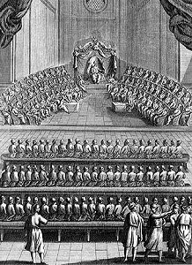

  
[Intangible Textual Heritage](../../index)  [Judaism](../index) 

------------------------------------------------------------------------

<table width="75%">
<colgroup>
<col style="width: 50%" />
<col style="width: 50%" />
</colgroup>
<tbody>
<tr class="odd">
<td width="50%" data-valign="TOP"></td>
<td width="50%" data-valign="CENTER"><h1 id="tractate-sanhedrin-mishnah-and-tosefta" data-align="CENTER">Tractate Sanhedrin, Mishnah and Tosefta</h1>
<h2 id="by-herbert-danby" data-align="CENTER">by Herbert Danby</h2>
<h4 id="section" data-align="CENTER">[1919]</h4></td>
</tr>
</tbody>
</table>

------------------------------------------------------------------------

[Contents](#contents)    [Start Reading](tsa00)

------------------------------------------------------------------------

This is a translation of the Talmud tractate Sanhedrin, which deals with
judicial procedure, particularly relating to capital punishment. The
author is a Christian academic, and the translation includes the primary
text (Mishna) and the second-level commentary (Tosefta). This book is a
good supplement to the [Rodkinson translation](../t08/index) of the same
tractate, particularly because this version has extensive scholarly
apparatus lacking in the Rodkinson translation.

------------------------------------------------------------------------

 [Title Page](tsa00)  
[Introduction](tsa01)  
[Synopsis of Contents](tsa02)  

### Jurisdiction of the Various Courts

[Cases which can be tried by Three Judges](tsa03)  
[Cases which must be tried by the Lesser Sanhedrin](tsa04)  
[Cases which must be tried by the Greater Sanhedrin](tsa05)  
[Concerning the Number of Members in the Greater and Lesser
Sanhedrins](tsa06)  
[The Duties and Restrictions relating to the High-Priest](tsa07)  
[The Duties and Restrictions relating to the King](tsa08)  

### II. Judicial Procedure

[Those who are Eligible and those who are Ineligible as Judges or
Witnesses](tsa09)  
[The Method of Legal Procedure in Non-Capital Cases](tsa10)  
[Differences in Legal Procedure distinguishing Capital from Non-Capital
Cases](tsa11)  
[The Arrangement of the Court, and the Method adopted for adding to the
Number of the Judges](tsa12)  
[The Method of admonishing Witnesses in Capital Cases](tsa13)  
[The Method of Legal Procedure in Capital Cases](tsa14)  

### III. The Four Capital Punishments

[The Carrying out of the Sentence of Stoning](tsa15)  
[The Hanging and Ultimate Disposal of the Corpse](tsa16)  
[The other Forms of Death Penalty: Burning, Decapitation, and
Strangulation](tsa17)  

### IV. Offenders Liable to Capital Punishment

[A. Those Who Are Punishable By Stoning:](tsa18)  
[1-6. Those Guilty of Incestuous and Unnatural Crimes](tsa19)  
[7. The Blasphemer](tsa20)  
[8. The Idolater](tsa21)  
[9. He who offers his Children to Moloch](tsa22)  
[10-11. The Ba‘al ‘Ob and the Yidd‘oni](tsa23)  
[12. The Sabbath-breaker](tsa24)  
[13. Who curses His Parents](tsa25)  
[14. The Seducer of a Betrothed Damsel](tsa26)  
[15. The Beguiler to Idolatry](tsa27)  
[16. He who leads a Town astray](tsa28)  
[17. The Sorcerer](tsa29)  
[18. The Stubborn and Rebellious Son](tsa30)  
[The Housebreaker](tsa31)  
[Those who may be killed untried](tsa32)  
[B. Those Who Are Punishable By Burning](tsa33)  
[C. Those Who Are Punishable By Decapitation:](tsa34)  
[1. The Murderer](tsa35)  
[Irregular Justice](tsa36)  

### Interpolated Section

[Those Who have no Share in the World to Come](tsa37)  

### Those Punishable By Decapitation (continued)

[(2) The Members of a Beguiled City](tsa38)  
[D. Those Who Are Punishable By Strangulation:](tsa39)  
[(1) Who strikes his Father or Mother](tsa40)  
[(2) Who steals a Soul from Israel](tsa41)  
[(3) The Elder who defies the Court](tsa42)  
[(4) The False Prophet](tsa43)  
[(5) He who prophesies in the Name of a False God](tsa44)  
[(6) The Adulterer](tsa45)  
[(7) The False Witnesses against a Priest's Daughter](tsa46)  

 

[Index To Biblical Quotations In Mishnah And Tosefta](tsa47)  
[Rabbinical Authorities Mentioned or Quoted in Text](tsa48)  
[General Index](tsa49)  
[Advertisements](tsa50)  
