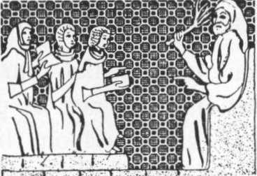

  
[Intangible Textual Heritage](../../index)  [Judaism](../index) 

------------------------------------------------------------------------

[Buy this Book at
Amazon.com](https://www.amazon.com/exec/obidos/ASIN/B000BD19YW/internetsacredte)

------------------------------------------------------------------------

<table width="75%">
<colgroup>
<col style="width: 50%" />
<col style="width: 50%" />
</colgroup>
<tbody>
<tr class="odd">
<td width="50%" data-valign="TOP"> 
The meaning of the bitter herb, from the Sarajevo Haggadah</td>
<td width="50%" data-valign="CENTER"><h1 id="the-union-haggadah" data-align="CENTER">The Union Haggadah</h1>
<h3 id="ed.-the-central-conference-of-american-rabbis" data-align="CENTER">ed. The Central Conference of American Rabbis</h3>
<h4 id="section" data-align="CENTER">[1923]</h4></td>
</tr>
</tbody>
</table>

------------------------------------------------------------------------

[Contents](#contents)    [Start Reading](uh00)    [Page
Index](pageidx)    [Text \[Zipped\]](uhtxt.zip)

------------------------------------------------------------------------

|                                                                                                                           |
|---------------------------------------------------------------------------------------------------------------------------|
|  |

*Should enemies again assail us, the remembrance of the exodus of our
fathers from Egypt will never fail to inspire us with new
courage...*--[p. 34](uh14)

This is the text of a Haggadah, a book which describes the Seder dinner
service at Pesach (Passover). The moving, participatory ceremony
remembers the story of the liberation of the Jews from Egypt. This
edition is a Reform Haggadah published in the early 20th century in the
United States. It includes practical notes about staging the ceremony,
and an appendix which describes the historical context of the
celebration.

This online edition includes all of the gorgeous black and white
illustrations and initials, (credited to Isidore Lipton in the
appendix). The printed edition includes the Hebrew text and about forty
pages of sheet music which had to be left out of this online
presentation for technical reasons. Incidental Hebrew in the English
text is presented using [Unicode](../../unicode).

------------------------------------------------------------------------

 [Title Page](uh00)  
[Contents](uh01)  
[Illustrations](uh02)  
[The Seder—A Foreword](uh03)  
[The Union Haggadah](uh04)  
[Rites and Symbols of the Seder](uh05)  
[Directions for Setting the Table](uh06)  
[Order of the Service](uh07)  

### The Seder Service

[Lighting the Festival Lights](uh08)  
[Kiddush](uh09)  
[The Four Questions](uh10)  
[The Four Sons](uh11)  
[The Story of the Oppression](uh12)  
[Dayenu](uh13)  
[The Passover Symbols](uh14)  
[The Watch-night of the Eternal](uh15)  
[Hallel](uh16)  
[Blessings](uh17)  

### After the Meal

[Grace after the Meal](uh18)  
[The Final Benediction](uh19)  
[A Madrigal of Numbers](uh20)  
[Ḥad Gadyo](uh21)  
[Vay’hi Baḥatzi Halay'loh](uh22)  

### Passover in History, Literature and Art

[History of the Passover](uh23)  
[Preparations for Passover](uh24)  
[Survivals of the Ancient Passover](uh25)  
[Passover and Christendom](uh26)  
[Reform Judaism and Passover](uh27)  
[The Haggadah](uh28)  
