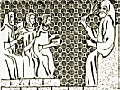

  
[Intangible Textual Heritage](../../index)  [Judaism](../index) 
[Index](index)  [Previous](uh00)  [Next](uh02) 

------------------------------------------------------------------------

[Buy this Book at
Amazon.com](https://www.amazon.com/exec/obidos/ASIN/B000BD19YW/internetsacredte)

------------------------------------------------------------------------

  
*The Union Haggadah*, ed. by The Central Council of American Rabbis
\[1923\], at Intangible Textual Heritage

------------------------------------------------------------------------

p. v

### CONTENTS

|                                                   |                            |
|---------------------------------------------------|----------------------------|
|       The Seder—A Foreword                        | [vii](uh03.htm#page_vii)   |
|       The Union Haggadah                          | [viii](uh04.htm#page_viii) |
|       Rites and Symbols of the Seder              | [xi](uh05.htm#page_xi)     |
|       Directions for Setting the Table            | [xiv](uh06.htm#page_xiv)   |
|       Order of the Service                        | [xvi](uh07.htm#page_xvi)   |
| THE SEDER SERVICE                                 |                            |
|    A. Before the Meal                             |                            |
|       Lighting of the Festival Lights             | [3](uh08.htm#page_3)       |
|       Kiddush—text and music                      | [4](uh09.htm#page_4)       |
|       The Festive Cup, music                      | [14](uh09.htm#page_14)     |
|       The Spring-tide of the Year, music          | [17](uh09.htm#page_17)     |
|       The Four Questions                          | [18](uh09.htm#page_18)     |
|       The Four Sons                               | [20](uh10.htm#page_20)     |
|       The Story of the Oppression                 | [24](uh12.htm#page_24)     |
|       Dayenu                                      | [28](uh13.htm#page_28)     |
|       The Passover Symbol                         | [34](uh14.htm#page_34)     |
|       The Watchnight of the Eternal               | [38](uh15.htm#page_38)     |
|       Psalms CXIII and CXIV—text and music        | [42](uh16.htm#page_42)     |
|       Blessings                                   | [48](uh17.htm#page_48)     |
| B. After the Meal                                 |                            |
|    To Thee Above, music                           | [54](uh18.htm#page_54)     |
|       Grace after the Meal                        | [56](uh18.htm#page_56)     |
|       Psalms CXVII and CXVIII: 1-4—text and music | [62](uh18.htm#page_62)     |
|       Psalms CXVIII: 5-29—text and music          | [70](uh18.htm#page_70)     |
|       The Final Benediction                       | [78](uh19.htm#page_78)     |
|       God of Might, music                         | [80](uh19.htm#page_80)     |
|       Addir Hu, music                             | [81](uh19.htm#page_81)     |
|       Our Souls We Raise, music                   | [82](uh19.htm#page_82)     |
|       Ki Lo Noeh, music                           | [84](uh19.htm#page_84)     |
|       A Madrigal of Numbers—text and music        | [86](uh20.htm#page_86)     |
|       Ḥad Gadyo—text and music                    | [94](uh21.htm#page_94)     |
|       Vay’hi Baḥatzi Halay’loh                    | [115](uh22.htm#page_115)   |
|       En Kelohenu, music                          | [118](uh22.htm#page_118)   |
|       America, music                              | [120](uh22.htm#page_120)   |
| THE PASSOVER IN HISTORY, LITERATURE AND ART       |                            |
|    History of the Passover                        |                            |
|       A. The Festival of the Shepherds            | [125](uh23.htm#page_125)   |
|       B. The Farmer's Spring Festival             | [127](uh23.htm#page_127)   |
|       C. The Feast of Israel's Birth              | [129](uh23.htm#page_129)   |
| p. vi                   |                            |
|       D. The National Celebration                 |                            |
|          1. The Passover during the Second Temple | [130](uh23.htm#page_130)   |
|          2. The Passover Sacrifice                | [131](uh23.htm#page_131)   |
|       E. The Feast of Freedom                     | [133](uh23.htm#page_133)   |
|       The Ethical Significance of the Passover    | [134](uh23.htm#page_134)   |
|       Moses                                       | [137](uh23.htm#page_137)   |
|    Preparation for the Passover                   |                            |
|       A. Time of the Feast                        | [139](uh24.htm#page_139)   |
|       B. Matzo-Baking                             | [140](uh24.htm#page_140)   |
|       C. Removing the Leaven                      | [141](uh24.htm#page_141)   |
|       D. Kashering the Utensils                   | [142](uh24.htm#page_142)   |
|    Survivals of the Ancient Passover              |                            |
|       A. The Samaritan Passover                   | [143](uh25.htm#page_143)   |
|       B. The Passover as observed by the Falashas | [145](uh25.htm#page_145)   |
|    Passover and Christendom                       |                            |
|       A. Passover and Easter                      | [147](uh26.htm#page_147)   |
|       B. Passover and Prejudice                   | [148](uh26.htm#page_148)   |
|       C. Blood Accusation                         | [148](uh26.htm#page_148)   |
|       D. Christian Protests                       | [149](uh26.htm#page_149)   |
|    Reform Judaism and Passover                    | [151](uh27.htm#page_151)   |
|       Israel's Journey                            | [152](uh27.htm#page_152)   |
|       Freedom                                     | [152](uh27.htm#page_152)   |
|       The Season of Joy                           | [153](uh27.htm#page_153)   |
|       The Secret of the Feast                     | [153](uh27.htm#page_153)   |
|    The Haggadah                                   |                            |
|       A. Growth of its Literature                 | [155](uh28.htm#page_155)   |
|       B. Reform Judaism and the Haggadah          | [157](uh28.htm#page_157)   |
|       C. Illuminated Haggadahs                    | [159](uh28.htm#page_159)   |

------------------------------------------------------------------------

[Next: Illustrations](uh02)
