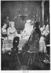
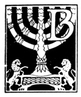

  
[Intangible Textual Heritage](../../index)  [Judaism](../index) 
[Index](index)  [Previous](uh07)  [Next](uh09) 

------------------------------------------------------------------------

[Buy this Book at
Amazon.com](https://www.amazon.com/exec/obidos/ASIN/B000BD19YW/internetsacredte)

------------------------------------------------------------------------

  
*The Union Haggadah*, ed. by The Central Council of American Rabbis
\[1923\], at Intangible Textual Heritage

------------------------------------------------------------------------

p. 1

# The Seder Service

## A. Before the Meal

p. 2

 
[  
Click to enlarge](img/sedereve.jpg)

p. 3

### 1. ‏קַדֵּשׁ‎

#### Lighting the Festival Lights

To symbolize the joy which the festival brings into the Jewish home, the
mistress kindles the lights and recites the following blessing:

‏בָּרוּךְ אַתָּה יְיָ אֱלֹהֵֽינוּ מֶֽלֶךְ הָֽעוֹלָֽם אֲשֶׁר קִדְּשָֽׁנוּ
בְּמִצְוֹתָיו וְצִוָּֽנוּ לְהַדְלִיק נֵר שֶׁל-(שַׁבָּת וְשֶׁל)-יוֹם
טוֹב.‎

|                    |
|--------------------|
|  |

BORUCH ATTO ADONOI ELOHENU MELECH HO‘OLOM ASHER KIDD’SHONU B’MITZVOSOV
V’TZIVONU L’HADLIK NER SHEL (on Sabbath add: SHABBOS V’SHEL) YOM TOV.

‏בָּרוּךְ אַתָּה יְיָ אֱלֹהֵֽינוּ מֶֽלֶךְ הָֽעוֹלָֽם. שֶׁהֶֽחֱיָֽנוּ
וְקִיְּמָֽנוּ וְהִגִּיעָֽנוּ לַזְּמַן הַזְּה׃‎

BORUCH ATTO ADONOI ELOHENU MELECH HO‘OLOM SHEHEḤEYONU V’KIY’MONU
V’HIGIONU LAZMAN HAZZEH.

Praised art Thou, O Lord our God, King of the universe, who hast
sanctified us by Thy commandments, and hast commanded us to kindle the
(*on Sabbath add:* Sabbath and) festival lights.

Praised art Thou, O Lord our God, King of the universe, who hast kept us
alive and sustained us and brought us to this season.

May our home be consecrated, O God, by the light of Thy countenance,
shining upon us in blessing, and bringing us peace!

*Company:* Amen.

------------------------------------------------------------------------

[Next: Kiddush](uh09)
