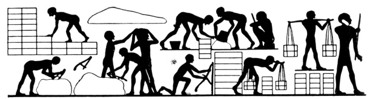
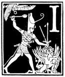
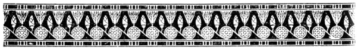

  
[Intangible Textual Heritage](../../index)  [Judaism](../index) 
[Index](index)  [Previous](uh11)  [Next](uh13) 

------------------------------------------------------------------------

[Buy this Book at
Amazon.com](https://www.amazon.com/exec/obidos/ASIN/B000BD19YW/internetsacredte)

------------------------------------------------------------------------

  
*The Union Haggadah*, ed. by The Central Council of American Rabbis
\[1923\], at Intangible Textual Heritage

------------------------------------------------------------------------

p. 23 p. 24

 

#### The Story of the Oppression

|                    |
|--------------------|
|  |

IT IS well for all of us whether young or old to consider how God's help
has been our unfailing stay and support through ages of trial and
persecution. Ever since He called our father Abraham from the bondage of
idolatry to His service of truth, He has been our Guardian; for not in
one country alone nor in one age have violent men risen up against us,
but in every generation and in every land, tyrants have sought to
destroy us; and the Holy One, blessed be He, has delivered us from their
hands.

The Torah tells us that when Jacob our father was a homeless wanderer,
he went down into Egypt, and sojourned there, few in number. All the
souls of his household were threescore and ten. And Joseph was already
in Egypt; he was the governor over the land. And Joseph placed his
father and his brethren, and gave them a possession, as Pharaoh had
commanded. And Israel dwelt in the land of Goshen; and they got them
possessions therein, and were fruitful, and multiplied exceedingly.

And Joseph died, and all his brethren, and all that generation. Now
there arose a new king over Egypt, who knew not Joseph. And he said unto
his people: 'Behold, the people of the children of Israel are too many
and too mighty for us; come, let us deal wisely

p. 25 p. 26

with them, lest they multiply, and it come to pass, that when there
befalleth us any war, they also join themselves unto our enemies, and
fight against us, and get them up out of the land'. Therefore they set
over them taskmasters to afflict them with burdens. And they built for
Pharaoh store-cities, Pithom and Raamses. But the more the Egyptians
afflicted them, the more the Israelites multiplied and the more they
spread abroad.

And the Egyptians dealt ill with us, and afflicted us, and laid upon us
cruel bondage. And we cried unto the Lord, the God of our fathers, and
the Lord heard our voice and saw our affliction and our toil and our
oppression. And the Lord brought us forth out of Egypt, with a mighty
hand and with an outstretched arm and with great terror and with signs
and with wonders. He sent before us Moses and Aaron and Miriam. And He
brought forth His people with joy, His chosen ones with singing. And He
guided them in the wilderness, as a shepherd his flock.

Therefore He commanded us to observe the Passover in its season, from
year to year, that His law shall be in our mouths, and that we shall
declare His might unto our children, His salvation to all generations.

All read in unison:

Who is like unto Thee, O Lord, among the mighty?  
  Who is like unto Thee, glorious in holiness,  
  Fearful in praises, doing wonders?  
The Lord shall reign for ever and ever.

 

------------------------------------------------------------------------

[Next: Dayenu](uh13)
