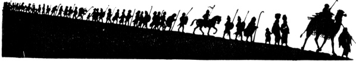

  
[Intangible Textual Heritage](../../index)  [Judaism](../index) 
[Index](index)  [Previous](uh14)  [Next](uh16) 

------------------------------------------------------------------------

[Buy this Book at
Amazon.com](https://www.amazon.com/exec/obidos/ASIN/B000BD19YW/internetsacredte)

------------------------------------------------------------------------

  
*The Union Haggadah*, ed. by The Central Council of American Rabbis
\[1923\], at Intangible Textual Heritage

------------------------------------------------------------------------

 

p. 37 p. 38

### The Watch-night of the Eternal

|                    |
|--------------------|
|  |

IN EVERY generation, each Jew should regard himself as though he too
were brought out of Egypt. Not our fathers alone, but us also, did the
Holy One redeem; for not alone in Egypt but in many other lands, have we
groaned under the burden of affliction and suffered as victims of
malice, ignorance and fanaticism. This very night which we, a happy
generation, celebrate so calmly and safely and joyfully in our
habitations was often turned into a night of anxiety and of suffering
for our people in former times. Cruel mobs were ready to rush upon them
and to destroy their homes and the fruit of their labors. But
undauntedly they clung to their faith in the ultimate triumph of right
and of freedom. Champions of God, they marched from one Egypt into
another—driven in haste, their property a prey to the rapacious foe,
with their bundles on their shoulders, and God in their hearts.

Because God, "the Guardian of Israel, who sleepeth not nor slumbereth"
revealed Himself on that Watch-night in
Egypt and in all dark periods of our past, as the Redeemer of the
enslaved, we keep this as a Watch-night for all
the Children of Israel, dedicated to God our redeemer.

p. 39 p. 40

While enjoying the liberty of this land, let us strive to make secure
also our spiritual freedom, that, as the delivered, we may become the
deliverer, carrying out Israel's historic task of being the messenger of
religion unto all mankind.

All read in unison:

So it is our duty to thank, praise and glorify God, who brought us and
our forefathers from slavery unto freedom, from sorrow unto joy, from
mourning unto festive gladness, from darkness unto light. Let us
therefore proclaim His praise.

 

p. 41

  [  
Click to enlarge](img/04100.jpg)  
THE EXODUS (G. Doré)  

------------------------------------------------------------------------

[Next: Hallel](uh16)
