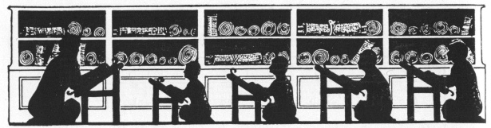
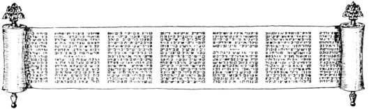

  
[Intangible Textual Heritage](../../index)  [Judaism](../index) 
[Index](index)  [Previous](uh19)  [Next](uh21) 

------------------------------------------------------------------------

[Buy this Book at
Amazon.com](https://www.amazon.com/exec/obidos/ASIN/B000BD19YW/internetsacredte)

------------------------------------------------------------------------

  
*The Union Haggadah*, ed. by The Central Council of American Rabbis
\[1923\], at Intangible Textual Heritage

------------------------------------------------------------------------

p. 86

 

### A Madrigal of Numbers

The leader asks the questions. The whole company
responds, each reading as fast as possible, in the effort to finish the
answer first.

Who knows One?

I know One: One is the God of the World.

Who knows Two?

I know Two: Two Tables of the Covenant. One God of the World.

Who knows Three?

I know Three: Three Patriarchs; Two Tables of the Covenant; One God of
the World.

Who knows Four?

I know Four: Four Mothers of Israel; Three Patriarchs; Two Tables of the
Covenant; One God of the World.

 

p. 87 p. 88

Who knows Five?

I know Five: Five Books of Moses; Four Mothers of Israel; Three
Patriarchs; Two Tables of the Covenant; One God of the World.

Who knows Six?

I know Six: Six Days of Creation; Five Books of Moses; Four Mothers of
Israel; Three Patriarchs; Two Tables of the Covenant; One God of the
World.

Who knows Seven?

I know Seven: Seven Days of the Week; Six Days of Creation; Five Books
of Moses; Four Mothers of Israel; Three Patriarchs; Two Tables of the
Covenant; One God of the World.

Who knows Eight?

I know Eight: Eight Lights of Ḥanukkah; Seven Days of the Week; Six Days
of Creation; Five Books of Moses; Four Mothers of Israel; Three
Patriarchs; Two Tables of the Covenant; One God of the World.

Who knows Nine?

I know Nine: Nine Festivals [\*](#fn_0); Eight
Lights of

p. 89 p. 90

\[paragraph continues\] Ḥanukkah; Seven
Days of the Week; Six Days of Creation; Five Books of Moses; Four
Mothers of Israel; Three Patriarchs; Two Tables of the Covenant; One God
of the World.

Who knows Ten?

I know Ten: Ten Commandments; Nine Festivals; Eight Lights of Ḥanukkah;
Seven Days of the Week; Six Days of Creation; Five Books of Moses; Four
Mothers of Israel; Three Patriarchs; Two Tables of the Covenant; One God
of the World.

Who knows Eleven?

I know Eleven: Eleven Stars in Joseph's Dream; Ten Commandments; Nine
Festivals; Eight Lights of Ḥanukkah; Seven Days of the Week; Six Days of
Creation; Five Books of Moses; Four Mothers of Israel; Three Patriarchs;
Two Tables of the Covenant; One God of the World.

Who knows Twelve?

I know Twelve: Twelve Tribes; Eleven Stars; Ten Commandments; Nine
Festivals; Eight Lights of Ḥanukkah; Seven Days of the Week; Six Days of
Creation; Five Books of Moses; Four Mothers of Israel; Three Patriarchs;
Two Tables of the Covenant; One God of the World.

Who knows Thirteen?

I know Thirteen: Thirteen Attributes of God [\*](#fn_1); Twelve Tribes; Eleven Stars; Ten
Commandments; Nine Festivals; Eight Lights of Ḥanukkah; Seven Days of
the Week; Six Days of Creation; Five Books of Moses; Four Mothers of
Israel; Three Patriarchs; Two Tables of the Covenant; One God of the
World.

p. 91 p. 92 p. 93

------------------------------------------------------------------------

### Footnotes

[88:\*](uh20.htm#fr_0) The nine Jewish festivals
are: 1. Pesaḥ (Passover), 2. Shabuoth (Feast of Weeks, or Pentecost) 3.
Rosh Hashanah (New Year) 4. Yom Kippur (Day of Atonement) 5. Succoth
(Feast of Tabernacles) 6. Sh’mini Atzereth (Eighth Day of Solemn
Assembly) 7. Simḥath Torah (Rejoicing in the Law), 8. Ḥanukkah (Feast of
Dedication or Feast of Lights) 9. Purim (Feast of Lots)

[90:\*](uh20.htm#fr_1) Exodus XXXIV: 6-7.

------------------------------------------------------------------------

[Next: Ḥad Gadyo](uh21)
