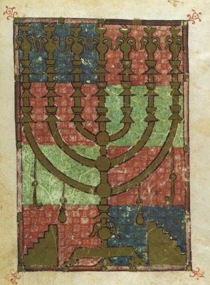

  
[Intangible Textual Heritage](../../index)  [Judaism](../index)  [Wisdom
of the East](../../woe/index) 

------------------------------------------------------------------------

<table width="75%">
<colgroup>
<col style="width: 50%" />
<col style="width: 50%" />
</colgroup>
<tbody>
<tr class="odd">
<td width="50%" data-valign="TOP"></td>
<td width="50%" data-valign="CENTER"><h1 id="the-wisdom-of-israel" data-align="CENTER">The Wisdom of Israel</h1>
<h2 id="by-edwin-collins" data-align="CENTER">by Edwin Collins</h2>
<h4 id="section" data-align="CENTER">[1910]</h4></td>
</tr>
</tbody>
</table>

------------------------------------------------------------------------

[Contents](#contents)    [Start Reading](wois00)    [Page
Index](pageidx)    [Text \[Zipped\]](wois.txt.gz)

------------------------------------------------------------------------

This is a short anthology of passages from the Jewish wisdom literature
of the Talmud and Midrash, part of the Wisdom of the East series. Unlike
some similar compilations, Collins documents where possible the source
of his quotations. He also apparently translated from the originals
rather than reusing existing English renderings.

------------------------------------------------------------------------

 [Title Page](wois00)  
[Contents](wois01)  
[Editorial Note](wois02)  
[Introduction](wois03)  
[Why God Permits Idolatry](wois04)  
[The Lamp that Goes Out when its Light is Done, and the Figs that are
Gathered in their Due Season](wois05)  
[The Labourers in the Vineyard](wois06)  
[The Likeness of a Palm-Tree](wois07)  
[The Tutor and the Naughty Princeling](wois08)  
[Those Nearest](wois09)  
[The Heritage of the Unborn Prince](wois10)  
[The Traveller and the Tree in the Desert](wois11)  
[Better Feed the Poor than Entertain the Angels](wois12)  
[The Sand, and the Furnace that Purifies](wois13)  
[The Stars are not envious!](wois14)  
[The King Talks with all His Servants, Small and Great](wois15)  
[The Pavilion of the King's Daughter](wois16)  
[The Greedy Prince: The Vine is not Watered with Wine](wois17)  
[The Potter and his Wares: The Trials of the Righteous](wois18)  
[The Education of the Prince](wois19)  
[The Induction Robe of the Elder](wois20)  
[The King and the Weary Travellers: The Righteous know what is in
Store](wois21)  
[Equality of all Before God: and the Parable of a Princess Attacked by
Robbers](wois22)  
[The Father and his Son: The Bath and the Ocean](wois23)  
[The Tutor who Corrupted the King's Son](wois24)  
[The After-Life, and the Banquet of the King](wois25)  
[Many Mansions in the Life to Come](wois26)  
[The Labourers in the Garden](wois27)  
[The Old Man and the Acorn](wois28)  
[The Wise and the Foolish Guests at the King's Feast](wois29)  
[The Briar Rose that Saved the Trees](wois30)  
[The Two Pilots](wois31)  
[R. Judah as Prototype of the Ancient Mariner](wois32)  
[The Likeness of the King](wois33)  
[Revelations of Mercy and of Punishment](wois34)  
[The Citizen Married to the King's Daughter](wois35)  
[The Father's Voice](wois36)  
[The Parable of the Two Ships](wois37)  
[The Child who Questioned though Carried by his Father](wois38)  
[The King's Son without Rations](wois39)  
[The Poor Woman's Mite](wois40)  
[He who Reproacheth the Poor Insults his Maker](wois41)  
[The Voiceless Deeps that Praise the Lord: The Parable of the Mutes who
Praised the King](wois42)  
