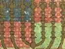

  
[Intangible Textual Heritage](../../index)  [Judaism](../index)  [Wisdom
of the East](../../woe/index)  [Index](index)  [Previous](wois12) 
[Next](wois14) 

------------------------------------------------------------------------

  
*The Wisdom of Israel*, by Edwin Collins, \[1910\], at Intangible
Textual Heritage

------------------------------------------------------------------------

### THE SAND, AND THE FURNACE THAT PURIFIES.

Israel has been compared to the sand of the seashore. What meaneth this?

Men take of the sand and cast it into a fiery furnace and it comes out
clear and bright, and they make glass vessels of it through which the
light shines. So Israel is cast into the fiery furnace of persecution,
and not only are they

p. 29

saved to come out alive (Dan. iii.), but they are purified and they are
knit closer together, and help mankind to see the light of heaven.

------------------------------------------------------------------------

[Next: The Stars are not envious!](wois14)

