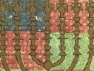

  
[Intangible Textual Heritage](../../index)  [Judaism](../index)  [Wisdom
of the East](../../woe/index)  [Index](index)  [Previous](wois41) 

------------------------------------------------------------------------

  
*The Wisdom of Israel*, by Edwin Collins, \[1910\], at Intangible
Textual Heritage

------------------------------------------------------------------------

p. 59

### THE VOICELESS DEEPS THAT PRAISE THE LORD: THE PARABLE OF THE MUTES WHO PRAISED THE KING.

"Let the waters be gathered together."

Rabbi Abba bar Cahanah said, in the name of Rabbi Levi:

"Let the waters hope in Me and wait for Me," said the Holy One, blessed
be He, "let them wait in hope for what I am about to do with them."

For the Spirit of God had brooded over the silent waters, and the
voiceless deeps had sung His praise, and done His will in awe. All
voiceless Nature had adored Him. The waters had not transgressed the
limit placed for them, and the mighty deep, vast and wide, had humbled
itself before Him.

This may be likened in a parable to a king who built a palace and put
dumb people to dwell in it. And they used to rise early in the morning
to greet the king, and to ask, by means of signs and dumb show, after
his well-being, uncovering their heads and bowing down to do him honour.

And the king. said: "If this palace were inhabited by rational beings
endowed with speech and full intelligence, how much more would they
honour me with their works and with their praise." And he made to dwell
in the palace intelligent and speaking people.

But instead of praising him and serving him, they rose up and seized
upon the palace of the king, and said: "This palace belongs to no one
but to us."

p. 60

In that hour the king said: "Let the palace be as it was at first, a
home for only the dumb to dwell in."

Thus from the beginning of His creation of the world the only praise
that went up to God was from the waters. . . . Then said the Holy One,
blessed be He: "If these that have no mouth and no tongue, no speech and
no words to set in logical order, can thus praise and honour Me, how
much more will be My praise when I have created mankind?"

And when He had created the sons of man, there arose the generations of
Enosh and of the time of the flood, and rebelled against Him. In that
hour the Holy One, blessed be He, said: "Let the world return to what it
was at first," as it is written (Gen. vii.), "and let the heavy rain be
upon the earth." [\*](#fn_17)

*Bereshith Rabbah*, Chap. V.

 

------------------------------------------------------------------------

### Footnotes

[60:\*](wois42.htm#fr_18) Compare also Mid.
Aycha Rabathi, Chap. "Zion spreadeth, etc.," where the same parable is
used, but the hope held out to the waters is that one day they shall be
raised by the Creator to the honour of being His tears to express
eternal grief for the fall of His people into sin and punishment. For,
says the midrash, the words, "Oh that my head were water," etc.
(Jeremiah ix.), are the words of God and not of the prophet. Of course
none of these interpretations were meant as *peshat* (see Introduction,
[p. 12](wois03.htm#page_12)).

 
