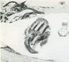
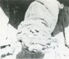

  
[Intangible Textual Heritage](../../index)  [Legendary
Creatures](../index)  [Index](index)  [Previous](abs03)  [Next](abs05) 

------------------------------------------------------------------------

[Buy this Book at
Amazon.com](https://www.amazon.com/exec/obidos/ASIN/1931882584/internetsacredte)

------------------------------------------------------------------------

[Buy this Book on
Kindle](https://www.amazon.com/exec/obidos/ASIN/B002G9UG0W/internetsacredte)

------------------------------------------------------------------------

  
*Abominable Snowmen*, by Ivan T. Sanderson, \[1961\], at Intangible
Textual Heritage

------------------------------------------------------------------------

 

  [  
Click to enlarge](img/pl01.jpg)  
1: Track of Meh-Teh on upper snowfield of Southern Tibetan Rim. (Eric
Shipton & the Mt. Everest Foundation)  

  [  
Click to enlarge](img/pl02.jpg)

  [  
Click to enlarge](img/pl03.jpg)

2 & 3 (above). Desiccated hand of alleged ABSM from Pangboche, Nepal;

Fig. 3 as seen from below. (Slick-Johnson Exp.)

  [  
Click to enlarge](img/pl04.jpg)  
4 (left, below): Another desiccated hand from Pangboche. (Prof. Teizo
Ogawa)  

  [  
Click to enlarge](img/pl05.jpg)  
5 (right, below): Desiccated forearm of Snow Leopard from Makalu
village, Nepal. (Slick-Johnson Exp.)  

  [  
Click to enlarge](img/pl06.jpg)  
6 (left, above): A Sherpa Headman wearing a cap made in imitation of a
Meh-Teh scalp. (Slick-Johnson Exp.)  

  [  
Click to enlarge](img/pl07.jpg)  
7 (right, above): Same scalp, seen from inside. Preserved at Pangboche.
(Slick-Johnson Exp.)  

  [  
Click to enlarge](img/pl08.jpg)  
8 (left, below): Same scalp, showing holes for insertion of tassels.
(Navnit Parekh, Bombay)  

  [  
Click to enlarge](img/pl09.jpg)  
9 (right, below): Another fur cap. These are used for traditional
pantomime. (Slick-Johnson Exp.)  

  [  
Click to enlarge](img/pl10.jpg)  
10: Himalayan Black Bear.  

  [  
Click to enlarge](img/pl11.jpg)  
11: American (Kodiak) Brown Bear.  

 

FAECAL MASSES

  [  
Click to enlarge](img/pl12.jpg)  
12: Giant Panda.  

  [  
Click to enlarge](img/pl13.jpg)  
13: Californian ABSM (Oh-Mah).  

(All photos by Prof. W. C. Osman Hill)

  [  
Click to enlarge](img/pl14.jpg)  
14: Himalayan Black Bear (near tip) (X400).  

  [  
Click to enlarge](img/pl15.jpg)  
15. Same Himalayan Black Bear (near root) (X400).  

  [  
Click to enlarge](img/pl16.jpg)  
16: Lowland Gorilla (X250).  

  [  
Click to enlarge](img/pl17.jpg)  
17: Orang-Utan (X250).  

 

HIGHLY MAGNIFIED HAIRS

  [  
Click to enlarge](img/pl18.jpg)  
18: Caucasoid Human head-hair (X550).  

  [  
Click to enlarge](img/pl19.jpg)  
19: Tibetan Langur Monkey (X470).  

  [  
Click to enlarge](img/pl20.jpg)  
20: Tibetan Blue Bear (Ursus arctos pruinosus)—fine hair (X400).  

  [  
Click to enlarge](img/pl21.jpg)  
21: Tibetan Blue Bear—coarse hair (X400).  

(All photomicrographs by Prof. W. C. Osman Hill)

  [  
Click to enlarge](img/pl22.jpg)  
22: A Neanderthaler-type Hominid from the Crimea (from above). (Dr. W.
Tschernezky)  

  [  
Click to enlarge](img/pl23.jpg)  
23 (left, below): A Human. (American Museum of Natural History)  

  [  
Click to enlarge](img/pl24.jpg)  
24 (right, below): A Lowland Gorilla. (American Museum of Natural
History)  

 

SKELETONS OF RIGHT FOOT

  [  
Click to enlarge](img/pl25.jpg)  
25: Feet of Lowland Gorilla in quadrupedal stance. (University Museum,
University of Pennsylvania)  

  [  
Click to enlarge](img/pl26.jpg)  
26: Abnormal (Human) feet of an Australoid. (Dr. W. Tschernezky)  

  [  
Click to enlarge](img/pl27.jpg)  
27: Abnormal feet of a Caucasoid. (Freiherr E. von Eickstedt)  

  [  
Click to enlarge](img/pl28.jpg)  
28: Sole of foot of an African Negrillo (Pigmy). (Freiherr E. von
Eickstedt)  

  [  
Click to enlarge](img/pl29.jpg)  
29: Sole of foot of adult Negroid man, used to going barefoot. (Dr. W.
Tschernezky)  

  [  
Click to enlarge](img/pl30.jpg)  
30: Casts of soles of hind feet of Man and various other Primates.
(American Museum of Natural History)  

 

IMPRINTS OF:

  [  
Click to enlarge](img/pl31.jpg)  
31 (left) Fore and hind right feet of Eurasian Brown Bear, in snow;  

  [  
Click to enlarge](img/pl32.jpg)  
32 (center) Hind right foot of Himalayan Langur, in snow;  

  [  
Click to enlarge](img/pl33.jpg)  
33 (right) Right foot of Gorilla, in snow (made from a cast). (All
photos by Dr. W. Tschernezky)  

 

IMPRINTS OF RIGHT FOOT OF:

  [  
Click to enlarge](img/pl34.jpg)  
34 (above) Meh-Teh-type ABSM from Nepal, in snow. (Eric Shipton & the
Mt. Everest Foundation);  

  [  
Click to enlarge](img/pl35.jpg)  
35 (below) Californian Oh-Mah, in soft clay. (Author)  

  [  
Click to enlarge](img/pl36.jpg)  
36: Adult male and female Lowland Gorillas. (Philadelphia Academy of
Natural Sciences)  

  [  
Click to enlarge](img/pl37.jpg)  
37 (below): Wow-Wow Gibbon walking. (Roy Pinney)  

  [  
Click to enlarge](img/pl38.jpg)  
38 (above): Corpse of Sloth Bear killed in Nepal and at first alleged to
be that of an ABSM. (Slick-Johnson Exp.)  

  [  
Click to enlarge](img/pl39.jpg)  
39: Reconstruction of Meh-Teh (and photo) by Dr. W. Tschernezky.  

  [  
Click to enlarge](img/pl40.jpg)  
40: Artist's conception of a female Sasquatch. (Morton Kunstler)  

  [  
Click to enlarge](img/pl41.jpg)  
41: Field-sketch of head of male Sasquatch (and photo) by the author,
under the direction of Mr. Albert Ostman.  

  [  
Click to enlarge](img/pl42.jpg)  
42: Drawing of a Gin-Sung (giant ABSM type of Szechwan) from an
18th-century Mongolian manuscript. (Prof. Emmanuel Vlec)  

  [  
Click to enlarge](img/pl43.jpg)  
43: Reproduction of the above in a later Chinese manuscript. (Prof.
Emmanuel Vlec)  

  [  
Click to enlarge](img/pl44.jpg)  
44 (left, above): Reconstruction of an Australopithecine. (M. Wilson,
1950)  

  [  
Click to enlarge](img/pl45.jpg)  
45 (right, above): Reconstruction of head of Zinjanthropus. (World Wide
Photos)  

  [  
Click to enlarge](img/pl46.jpg)  
46 (left, below): Reconstruction of head of Pithecanthropus. (University
Museum, University of Pennsylvania)  

  [  
Click to enlarge](img/pl47.jpg)  
47 (right, below): Reconstruction of head of a Neanderthaler.
(University Museum, University of Pennsylvania)  

  [  
Click to enlarge](img/pl48.jpg)  
48: Head of an Australoid. (Author)  

  [  
Click to enlarge](img/pl49.jpg)  
49: African Negrillos (Pigmies). (University Museum, University of
Pennsylvania)  

  [  
Click to enlarge](img/pl50.jpg)  
50: Negrito girls, Philippine Islands. (University Museum, University of
Pennsylvania)  

  [  
Click to enlarge](img/pl51.jpg)  
51: Head of girl, Negroid type. (Quentin Keynes)  

  [  
Click to enlarge](img/pl52.jpg)  
52: Head of girl, Caucasoid type. (Photo Library, Inc.)  

  [  
Click to enlarge](img/pl53.jpg)  
53: Head of girl, Mongoloid type. (Philip E. Pegler, Inc.)  

  [  
Click to enlarge](img/pl54.jpg)  
54: Man with (abnormal) tail (the Philippines). (Author)  

  [  
Click to enlarge](img/pl55.jpg)  
55 (below): The famous Tensing Norgay, Conqueror of Everest, and his
family at home. It is his people, the Sherpas of Nepal, who first led
the world to the ABSMs. (Information Bureau, Government of India)  

  [  
Click to enlarge](img/pl56.jpg)  
56 (above): The author with a family of Mayan friends—the Het
Zooz-Mukuls of Tekom, Yucatan. The mother is holding one of the author's
god-children, Manuelita. Note: all are standing on the same level. The
author is 6 feet tall. (Author)  

 

------------------------------------------------------------------------

[Next: 1. A Certain Unpleasantness](abs05)
