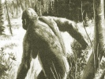

  
[Intangible Textual Heritage](../../index)  [Legendary
Creatures](../index)  [Index](index)  [Previous](abs19)  [Next](abs21) 

------------------------------------------------------------------------

[Buy this Book at
Amazon.com](https://www.amazon.com/exec/obidos/ASIN/1931882584/internetsacredte)

------------------------------------------------------------------------

[Buy this Book on
Kindle](https://www.amazon.com/exec/obidos/ASIN/B002G9UG0W/internetsacredte)

------------------------------------------------------------------------

  
*Abominable Snowmen*, by Ivan T. Sanderson, \[1961\], at Intangible
Textual Heritage

------------------------------------------------------------------------

p. 351

**16. Our Revered Ancestors**

*Unless you believe in spontaneous creation, we, like everything else,
must have had an origin. And this goes for ABSMs as well.*

We now seem to have done several things, which had better be
straightened out before we go further. (1) We have hinted at just how
many of the "skeptics" have blundered into absurdities, contradictions,
and frauds. (2) We have destroyed the value of most of the physical
evidence, by subjecting it to some proper examination. (3) We have, as a
result of the above, "canceled" ourselves out rather neatly, and now
need a fresh line of approach, in order to see if any valid avenues
still remain to be examined.

Positive arguments put forward against the existence of ABSMs really
fall under four heads. These are that the whole thing is (a) lies, (b)
hallucinations, (c) hoaxes, or (d) repeated cases of misidentification.
That they could all be nothing more than straight lies is, I feel
confident in saying, quite impossible. Too many people, fortuitously
associated at the time, have actually found the foot-tracks, and all
over the world. Moreover, it seems highly improbable that all the
reputable people, so many of them well-known, listed in the previous
chapters would all make up the same lie to describe the same creature
and then say they saw it. For similar reasons, we may dispose also of
the hallucination theory. First of all, there is a considerable doubt
about the very existence of "mass hallucination" in which several people
think they see the same thing at the same time. Then, hallucinations
don't leave foot-tracks, hairs, or excrement; make wild yells, or move
cairns. This brings us to the hoax theory.

p. 352

  [  
Click to enlarge](img/map13.jpg)  
MAP XIII. THE OLD WORLD  

MAP XIII THE OLD WORLD

Showing the over-all limits of distribution of the living Pongids and
the location of finds of the remains of fossil Pongids and Hominids.
There are those among anthropologists today who maintain that the entire
tropical and the whole of both the north and the south temperate belts
of the Old World were inhabited in succession by, first, sub-hominids,
then Australopithecine forms, then Pithecanthropines, then
Neanderthalers, and finally (either contemporaneous with the last or
following them) by Modern Man. Whether or not the Neanderthaler type
preceded Modern Man does not alter the fact that the type of stone
implements that the former made is found at lower levels all across
Eurasia; a western form, reaching to the Great Barrier; and an eastern,
beyond that essential divide on the great upland plateau of Mongolia.
The distribution of reports of ABSMs coincides closely with that of
fossil Hominids and Pongids in eastern Eurasia, Orientalia, and
Ethiopia.

|                                  |                                 |
|----------------------------------|---------------------------------|
| Numbers                          | Numbers                         |
| 1\. = Oreopithecus               | 1\. = Oreopithecus              |
| 2\. = Atlanthropus               | 2\. = Pliopithecus              |
| 3\. = Zinjanthropus              | 3\. = Austriacopithecus         |
| 4\. = Africanthropus             | 4\. = Paidopithex               |
| 5\. = Australopithecus           | 5\. = Hispanopithecus           |
| 6\. = Plesianthropus             | 6\. = Dryopithecus              |
| 7\. = Pithecanthropus pekinensis | 6a. = Dryopithecus keiyuanensis |
| 8\. = Pithecanthropus robustus   | 7\. = Propliopithecus           |
| 9\. = Pithecanthropus erectus    | 8\. = Limnopithecus             |
| 10\. = Meganthropus              | 9\. = Proconsul                 |
| 11\. = Gigantopithecus           | 10\. = Xenopithecus             |
| 12\. = Homo heidelbergensis      | 11\. = Udnabopithecus           |
| 13\. = Homo rhodesiensis         | 12\. = Sivapithecus             |
| 14\. = Homo saldhanensis         | 13\. = Hylopithecus             |
| 15 =Homo soloensis               | 14\. = Sugrivapithecus          |
| 16\. = \[Recent Find\]           | 15\. =Bramapithecus             |
|                                  | 16\. = Ramapithecus             |
|                                  | 17\. = Pondaungia.              |

\[*Numbers in this table on the left side are enclosed in a square, on
the right with a circle. These numbers refer to points in map
XIII*—*JBH*\].

p. 353

This is the most difficult one because it is *possible*, however
improbable it may appear to be, and whether you can suggest any way in
which it could be done or not. As to the latter, I personally don't have
the slightest idea, or any reasonable suggestions to make, though in
some special cases I think I could duplicate some of the observed
results by the exercise of a lot of energy, time, and money. However, I
will repeat once more, magicians and professional conjurers can do the
most amazing things that sometimes seem, to the rest of us uninitiated,
to be quite impossible and even illogical, while

p. 354

hoaxers and funsters have gone to the most extraordinary lengths to pull
their stunts. One of the classic examples was the famous Würzburg
"Fossils." These were a number of little clay tablets inscribed with
crude drawings of animals and ancient Hebrew and other scripts which
some students planted in a quarry where very ancient fossils were being
brought to light by their professor. The nature of fossils was in
dispute in those days, the general opinion being that the Almighty had
put them into the rocks to test man's faith in the Biblical tale of
creation. Another classic hoax *may* *be* \[and I say this advisedly for
reasons that we will see in a moment\] the allegation of faking of the
lower jaw of the very famous Piltdown Man. Anybody can comprehend how
such as these were done once one knows that they *are* hoaxes but it is
sometimes hard if not impossible for us to see how conjuring tricks are
accomplished. However, while I haven't the foggiest notion *how* such
tricks as "abominable snowman" tracks might be made in the circumstances
among which they have been found, I *do* have a suggestion to offer a
bit later on as to *why* they should be. For the nonce, however, let us
just say that the hoax theory is extremely abstruse and has probably
been adequately disproved, or, at least as of now, proved to be
impossible. This leaves us with the business of mistaken identity.

I went over this briefly in the last chapter and can only add that,
while in some cases a known local animal can be conjured up to possibly
explain the alleged "sightings" of the creatures themselves, and even
for the excrement and the hairs, there are no living animals known that
can make any one of the four main types of footprints. Further, I would
again stress the fact that the idea of some of them being made by
four-footed beasts putting their hind feet into the imprints of their
front ones, or more especially of a series of animals all jumping into
the same hole for miles on end, is quite absurd and impossible.

This completes the roster of debunking explanations. Are there any
positive suggestions as to what ABSMs might be?

p. 355

\[paragraph continues\] There is one and
it comes in three parts: to wit, that ABSMs are as yet uncaught and
unidentified living creatures. There are three suggestions here: first,
that all or some are unknown apes; second, that all or some are
left-over relics of sub-men \[i.e. what used to be called "ape-men" and
"men-apes"\]; or third, that all or some are remnants of very primitive
humans. And, in view of everything else, this would certainly seem to be
the best, most logical, and most probable suggestion; especially since
the really extraordinary galaxy of other animals both small, large, and
enormous which have come to light only in this century and right up to
this decade \[i.e. the new herd of Woodland Bison in Canada in 1960\].
The question then immediately arises: What kinds of animals, sub-men, or
primitives? Let us examine this straightforward question.

The first thing we have to do is to list the ABSMs and try to classify
them according to whatever characters and characteristics they have or
are alleged to have. To lead you through all the arguments by which I
have arrived at the following general descriptions would take volumes,
and be most irksome and dull. Most of the essential facts have already
come out as we have reported the stories about them, and from what
little physical evidence there has been left to us. The rest is
technicalities, but each and all of the facts have been checked and the
data on them is on file.

First, we should understand that the number of names for ABSMs (see
Appendix A) has nothing to do with the number of different kinds of
these creatures. There are literally hundreds of names for ABSMs still
in use today, and hundreds more in over half the languages on earth and
in many more that have now passed from common usage. Second, the number
of individual localities where they have been reported is again not any
guide to the number of kinds there may be. Like other animals, ABSMs
seem to have wide distributions, some much wider than others, while some
\[and perhaps distinct species, or sub-species\] appear to have very
restricted distributions. Third, this distribution is not in any way as

p. 356

haphazard as it at first appears to be, while apparent inconsistencies
and complete illogicalities in it are not only perfectly logical if one
particular aspect of geography is taken into consideration—that is the
geography of vegetative forms (see [Map XVI](abs22.htm#img_map16) and
the explanation in Chapter 18)—but actually go far to confirming the
validity of the whole business. A fourth point we should bear in mind is
that size has nothing much to do with the matter, for the distinction
between the pigmy, man-sized, *Meh-Teh*, and giant forms is blurred in
any case, while there may be large, medium, and small races,
sub-species, or species of any genus of animals—and even in the same
locality. This assessment is therefore based on one major and several
subsidiary criteria.

The basis is the geography of vegetational types—desert, scrublands,
savannahs and prairies, orchard and parklands, woods and forests, and
most especially of montane forests on uplands and mountains. The
supporting data are, first, the degree of "humanity" or "humanoidness"
of the individual creatures as reported or alleged; second, the over-all
extent to which their bodies are human; third, the degree in which their
footprints approach those of man; and fourth, to some extent, how they
are said to behave. They are listed below in accordance with these
principles, those at the top being the most manlike, those at the bottom
the least manlike, but it should be clearly understood that this does
not mean that the latter are any more apelike. This is another matter
that will be tackled in a minute. ABSMs then, seem to go like this:

I. *SUB-HUMANS* (East Eurasian and Oriental). Of about standard man
size; hairy or partially hairy; head-hair differentiated from body hair;
occasional use of very primitive tools such as sticks, bark cloth,
clubs, hand stones; wary but not unfriendly; strong odor; some form of
vocal communication but no true speech; good rock-climbers and swimmers;
crepuscular and diurnal, possibly nocturnal also; may "trade."

\(1\) Proto-Malayans, as appeared on rubber estates 1953.

\(2\) Yunnan Hairy Primitives, as reported by Chinese.

p. 357

\(3\) *Ksy-Giiks*, of Central Eurasia; possibly a Neanderthaler.

\(4\) *The Almas*, of eastern Eurasia; a small kind of (3).

II\. *PROTO-PIGMIES* (Orient, Africa, and possibly Central and Northwest
South America). Smaller than average humans, to tiny; clothed in thick
black or red fur but with differentiated head-hair that usually forms a
mane. Go about in pairs or family groups; wary but inquisitive;
apparently a very primitive form of language; toes sub-equal and heels
small or pointed; good tree-climbers and swimmers; tropical forests down
to seashores and swamps; omnivorous, insect, fish, and small animal
eaters plus fruits, leaves; very nervous.

\(1\) *Dwendis*, of Central America, possibly only dwarf Mayas.

\(2\) *Shiru*, of Colombia, S.A.

\(3\) *Sedapas*, of Sumatra.

\(4\) *Sehites*, of West Africa.

\(5\) *Agogwes*, of East Africa.

\(6\) *Teh-lmas*, of valley forests of the Himalayas.

III\. *NEO-GIANTS* (Indo-China, East Eurasia, North and South America).
Taller than average man by at least a foot or two; much bulkier, with
enormous barrel torso and no neck; head small, practically no forehead;
heavy brow-ridge and continuous upcurled fringe of hair right across
same; head-hair not differentiated from body hair and all comparatively
short; dark gray to black when young, turning reddish or ocher-brown,
and getting silvered in old age; face light when young, black when
adult; prognathous face and very wide mouth but no lip eversion; eyes
small, round, very dark and directed straight forward; feet very
humanoid but for double pad under first toes, and indication of complete
webbing to base of last joints; has no language but a high-pitched
whistling call; nocturnal; does not have any tools; mostly vegetarian,
but takes some large animals and cracks bones; retiring and very alert,
wily, and afraid of man

p. 358

but will attack if cornered, molested, or scared. Indication that they
try to kidnap human females for breeding purposes. Food collectors; make
beds in open or in caves. Drink by sucking.

\(1\) *The Dzu-Teh* (*Gin-Sung*, *Tok*, *Kung-Lu*), of Indo-China and
Szechwan.

\(2\) *The Sasquatch* (*Oh-Mah*, *Sisemite*, etc.), of North and Central
America.

\(3\) *The Mapinguary* (and *Didi*), of South America.

IV\. *SUB-HOMINIDS* (south central Eurasia—i.e. Nan Shans, Himalayas,
and the Karakorams). In every way the least human. Somewhat larger than
man-sized and much more sturdy, with short legs and long arms; clothed
in long rather shaggy fur or hair, same length all over and not
differentiated. Naked face and other parts jet black; bull-neck and
small conical head with heavy brow-ridges; fanged canine teeth; can drop
hands to ground and stand on knuckles like gorilla; habitat upper
montane forests, but descends into valleys in bad weather and digs for
food under upland snowfields; color, dark brown; nocturnal and somewhat
inquisitive; usually flees but may make simulated attacks if scared, and
carry them through if the person gives ground and is alone;
temperamental and bestial when aroused, being destructive like an ape;
foot extremely un- or non-humanoid—second toe longer and larger than
first, and both these separated and semi-opposed to the remaining three
which are very small and webbed; heel very wide and foot almost square
and very large. Omnivorous but with a preference for insects, snails,
and small animals; will kill larger game. Lone hunter and food
collector; wide traveler like all carnivores.

\(1\) *Meh-Teh* (and by other names), of the Himalayas.

\(2\) *Golub-yavan* (and other rather similar names), of the Kunluns,
Nan Shans, and Tsin-Lings.

This completes the roster and calls for some comment. First, I have
omitted anything that might exist in the Colombian

p. 359

\[paragraph continues\] Massif of the
Andes except the little *Shiru* which seems in every way to agree with
the No. II class above—namely the Proto-Pigmies. Should it so prove to
be, then the *Dwendi* might probably go into the same group. At the
moment, and for reasons that I go into more fully in the next chapter,
it is my opinion that the latter are just groups of Mayas or related
peoples, some of whom are really almost pigmies (see [Fig.
56](abs04.htm#img_pl56), the photograph of a Mayan mother, standing
beside me, holding one of my godchildren).

I have also omitted the *Muhalu* and the Tano River giant of Africa as,
in view of Mr. Cordier's report, and the nature of the former's
footprint, the thing is definitely an ape. Left out also, are Dr.
Moore's tailed creatures which as I have already said I personally think
were large monkeys. This leaves but one form in doubt. This is the
little *Teh-lma* of the lower valley forests of the Himalayas. Of these
there are two conflicting and diametrically opposed opinions, which
cannot be reconciled. One party claims that they are giant Macaques or
Rhesus-type Monkeys, such as I discussed in the last chapter under their
proper name of *Lyssodes*. This is fair enough and well taken. However,
the tracks left by these *Teh-lmas* were found, copied, and examined by
none other than Gerald Russell who is, in my opinion, just about the one
man, apart from Mr. Cordier, who could really interpret footprints; and
he states categorically that those of the *Teh-lmas* are definitely
humanoid, and he demonstrates this with plaster casts. Also, he says,
the creatures always *run* on their hind legs, which simply is not a
simian \[or monkey\] characteristic. I think therefore that the
*Teh-lmas* must be classed in the Proto-Pigmy group. The only other
doubts are whether there really is any difference between the North
American, Central, and South American Neo-Giants; and between the
*Meh-Teh* of the Himalayas and the *Golub-yavans* of the ranges
immediately north of Tibet. In both cases the descriptions of the two
lots seem to be identical: they could, in each case, simply be races.
Therefore, after disposing of the "animals"—mostly apes but some may be
monkeys—we are left with eight or possibly twelve types.

p. 360

To reiterate, these are: Four very primitive sub-humans; four
proto-pigmies; two or three neo-giants; and one or two really
"abominable" and bestial creatures. It is of course possible that the
Proto-Malayans and the Yunnan primitives could be two forms of the same;
that the *Ksy-giiks* and the *Almas* are only a size difference of
another; that the *Dwendis* are fully human; that *Teh-lmas* and
*Sedapas* are only racial forms of the same creature; that all four
giants are but one form, for reasons of their distribution that we will
see later; and that, as we have just said, the two "abominable" ones are
the same. Such a further combination, or "lumping," gives us a fairly
manageable list and perhaps a more believable one. It also coincides
with geographical and other requirements. It goes like this:

I. SUB-HUMANS

\(1\) Indo-Chinese-Malay, and south Chinese.

\(2\) East Eurasian (*Ksy-giik-Almas*).

II\. PROTO-PIGMIES

\(1\) Oriental (*Sedapa-Teh-lmas*).

\(2\) African (*Sehite-Agogwes*).

\(3\) American (*Dwendi-Shirus*).

III\. NEO-GIANTS

1\) Oriental (*Dzu-Teh-Tok-gin-Sungs*).

\(2\) American (*Sasquatch-Oh-Mah-Didi-Mapinguarys*).

IV\. SUB-HOMINIDS

\(1\) Tibet and Himalayas (*Meh-Teh.-Golub-yavans*).

This is still rather a "tall order" but there it is; and, we can't just
sit back and deplore it. Something has to at least be suggested. The
next questions, therefore, are: if there are all these creatures still
running about waiting to be found, what exactly may they be? Also, do we
have any ready candidates on our own family tree that we *do* know to
have existed and to which we might assign any of them?

Here, for almost the first time, we are on surer ground, for we do
indeed have plenty of candidates and, moreover, all in most convenient
locations, and in many ways looking just right. All these, what is more,
are on *our* particular branch of the family tree, and on rather
convenient places

p. 361

thereupon to boot. This calls for said family tree, but even before we
look at this it might be worth-while turning to Appendix C and taking a
look at the much more extensive and general "Tribal Vine" as I call it,
of the major group of mammals to which we belong, and which is known as
that of the Primates, or Top Ones. On this you will be able to see at a
glance just who your relations are and also just how widely separated
you are from the less pleasant ones, and particularly from the Pongids
or Apes.

I include the apes in the accompanying tree because there is all this
endless talk about our being descended from them \[which we are not\]
and also because of the wide use of the terms Ape-Man and Man-Ape, both
of which now have to be abandoned; for, however non-human a *Meh-Teh*
may be, neither it nor anything else can be halfway between Man and Ape.

Here, there appear for the first time on our canvas a number of new
characters. These need introduction.

Since the publication of Charles Darwin's *Descent of Man*—not any
longer perhaps the incorrect title it once seemed—anthropologists have
been digging away all over the earth trying to find our ancestors. The
procedure has had its ups and downs; its sudden great discoveries, and
its patient piecing together of chance fragments; it has had its hoaxes,
false leads, and other alarms and excursions; and sometimes its
executors have gone a bit balmy; but, by and large, it has really made
the most remarkable progress. Much of the story has been oft-told, but
there is a crying need for a straightforward over-all account that
brings matters right up to date. It is an enormously complex story and
there remain in it both many blanks, great and small, and some appalling
muddles. The worst of the latter, currently and rather surprisingly,
concerns Modern Man (*Homo sapiens*) himself, and most especially in his
earlier forms. The archaeologists have pushed him back in time to
terrifying lengths on the grounds that he along with a few submen of the
Neanderthaler type were the only toolmakers, but then the paleo-physical
anthropologists \[which is to say the searchers after fossil men's

p. 362

anatomy\] suddenly popped up with two horribly nonhuman-looking types of
creatures, both of which seem to have made fairly good tools. These are
called the Australopithecines of South Africa, and the related
Zinjanthropines of East Africa. Also, another group of sub-hominids
called the Pithecanthropines of Indonesia and north China, proved in the
latter area not only to have made quite usable tools but to have used
fire in the latter. This has considerably upset our original ideas about
toolmakers.

While all this was going on, other archaeologists searching for
artifacts, as is their profession, and anthropologists searching for old
human bones, and also the zoologists searching for extinct animal
remains, and paleo-climatologists, and paleo-oceanographers, and
glaciologists, and a whole bunch of others, even to geomorphologists and
people concerned with wider matters like the IGY, kept turning up what
appears to be evidence of Modem Men in ever more ancient \[or earlier\]
deposits and strata. So, we have two sorts of floods of knowledge coming
from opposing directions—one working back from the present, the other
working forward from about a million years ago—not just meeting head on,
but overriding and infiltrating each other. While the existence of
modem-type Man himself has been pushed far back, the continuing
existence of sub-humans and even of sub-hominid creatures has crept
steadily forward in time.

Despite this, we find ourselves today no more advanced with the problem
of Man per se than we were at the beginning, while we are actually in a
greater muddle about both his beginnings, past distribution, and
affinities now than we ever were. There are other complications too. The
nice old idea that the Neanderthalers were a sort of Model-T Man, from
which we arose but which itself later died out, has also gone all
haywire. First, we now have bones of quite obvious modern-type men from
strata just as early, if not earlier than the first Neanderthalers, and
the Neanderthalers turn out to have been much more modern-man-like when
they began than when they finally died away. In fact, they progressed
backward as it were, getting ever coarser in appearance and

p. 363

structure. Then, there has been the distressing affair of Piltdown Man.

This character, in the form of several pieces of a cranium and most of
half a lower jaw was said to have been discovered in a gravel pit in the
south of England by a man named Dawson in the year 1911. These were
shown to Prof. Sir Arthur Smith Woodward, who declared them to
constitute the remains of a new and very primitive form of sub-man with
the brain of a human and the face and teeth of an ape. The fragments of
the skull were assembled in various different ways by various experts;
the mandible was completed in theory by extrapolation; and a single
canine tooth was fitted into the general scheme so that a pretty fair
assemblage was created upon which tendons, muscles, and skin were in due
course modeled, ending in some very fine "artists' conceptions" of the
original owner of the bits. And so it went till 1953 when investigations
made in the Department of Anatomy at Oxford and of Geology at the
British Museum using new and elaborate methods of dating materials,
indicated to some research workers that the lower jaw was a fake, and
made from that of a modern chimpanzee by coloring with chemicals,
artificial abrasion, and the filing of its teeth to match the human
pattern. The single upper canine tooth, which is rather doglike, was
declared also to be that of a modern chimpanzee, and also to have been
tampered with. This "disclosure" made a great splash in the press.
Unfortunately it now transpires that just about every aspect of it is as
phony as Piltdown Man himself is alleged to be.

First, even these researchers admitted readily that the bits of the
*skull* (cranium) are very old indeed. They are also very odd, being
enormously thick but showing, by their curvature that they belonged to a
very big brain-box. Comparison of the grains of rock still in their
interstices would seem to indicate that they came from an exceedingly
old strata for any hominid—no less than the Red Crag Beds of East
Anglia, which is actually far "worse" than anything claimed for them by
Messrs. Dawson and Woodward who said they came from a comparatively late
Pleistocene river gravel—a mere difference

p. 364

of a million years! Next, the fragment of lower jaw is not, by its
shape, that of a chimpanzee. It could possibly be that of a young
orang-utan but it has one feature \[called the simian shelf\] more in
conformity with some extinct apes than with any living one.

The final examinations made of the jaw \[the cranium had been admitted
by everybody to give good evidence of being hominid, human, and about
50,000 years old, *wherever* it came from\] were made by a man who
ought, above all others, to know what he was talking about. His name is
Dr. Alvan Marston, a dental surgeon and a trained anthropologist and,
furthermore, the discoverer of the famous Swanscombe Skull. He read a
paper on his findings to the Royal Society of Medicine in London.

To this most august body he showed radiographs of the teeth "in which it
was possible to see that the pulp chamber, or nerve canal, is filled
with grains of ironstone and sand. This points to the fact that it was a
young animal, which had not finished growing, and in whose tooth the
pulp canal was still empty. In the Piltdown tooth, the entrance to this
cavity is blocked with a piece of stone which has become cemented in, as
stones are cemented into stalagmites in caves. This shows that it could
not have come from a recent ape. Moreover, the crown is of a sort that
is never found in existing species. It is found in the fossil
*Proconsul*. The palatal surface of the root is flatter, too, than in
existing types. This suggests a smaller mouth, and this (in turn) is
borne out by the poorly developed *simian* *shelf*, such as those of
certain fossil apes."

Dealing with suggestions that the teeth of a modern ape had been taken
and deliberately ground into a shape more in keeping with human shape by
some unscrupulous person, Mr. Marston said (ex Leonard Bertin, Science
Correspondent of the *Daily Telegraph*, London):

I went into this matter very fully in a paper in 1952, after studying
the matter for several years, and I can say that neither the canine nor
the molar teeth have been mutilated, much less by Mr. Dawson (who
discovered the Piltdown skull), who knew nothing of dentistry.

p. 365

This is a very important matter to ABSMery for it points up two facts:
first, that a very modern type of man \[i.e. the cranium\] was around
Europe some 50,000 years ago; and second, that mandibles of most ancient
apes have been disinterred \[even if only in the Mediterranean area from
where Dawson, the alleged discoverer of the Piltdown Man seems to have
obtained many of his other fossils\] for a long time, and *can* *have*
most extremely hominid or humanoid-appearing molar teeth. These things
we must bear in mind. Thus, both the Piltdown cranium and jaw are
extremely ancient. However, it does seem to be true that they don't
belong together and that they were never deposited at Piltdown, but
probably were transported there by Mr. Dawson along with some phony bone
tools and a few other odd bones. The gravel beds in which they were
*said* to have been found have been extensively dug and sifted and not
so much as one bone of anything has ever been found in them.

I go into this not only because it is a pertinent example of a hoax,
plus the almost total unreliability of supposed "experts" \[on some
occasions, at least\], but also because it shows the limitations of the
much vaunted modern dating techniques, the manner in which the press can
be completely misled, the lack of knowledge of one speciality by persons
trained in another, and a galaxy of other obscenities that plague the
whole gamut of the sciences. In this case, we have the added importance
\[to us\] of evidence at the same time of a really very modern-type of
man which, if some experts are now finally correct, could antedate quite
a number of the so-called sub-humans, and sub-hominids. [\*](#fn_47)

In our search for candidates for living ABSMs, therefore, we need not go
dashing off into the remote past looking for bandy-legged, long-armed,
brainless, gibbering peoples, before considering very carefully the
large choice of manlike ones that have been around for a few thousand
years and, maybe, even since before the four recent crustal shifts or
ice-advances.

p. 366

We do not actually have a real definition of a true Man as opposed
either to a sub-man or a sub-hominid. Anatomically, we may be able to
draw a fairly fine line, saying that this, that, and the other cranial
characters are typically of *Homo sapiens*, whereas others are not.
However, I could name two prominent anthropologists who claim that they
themselves are almost perfect Neanderthalers—i.e. living examples of
sub-men! The reasons for their claims are perfectly valid as far as
their bone structure, and posture goes. Also, I may say, both of them
and especially one who is a North European are almost completely hairy
all over: a most startling sight on a white sand beach in summer! When
it comes to features other than osteological, such as skin color,
hairiness, shape and size of teeth, gait, length of arms, thumb
manipulation, toe agility, and so forth, we simply have no established
criteria. We have been wrestling with what we call "race" for so long we
have completely overlooked many much more important points about living
human beings. Skin color really has practically no significance
whatsoever, and it may change throughout life; as witness the number of
Congolese babies born bright pink. Head-hair does show some classifiable
features; so also do some oddities like "pepper-corn" hair growth as
found among the Bushmen-Hottentots, the Mongolian-fold on the upper
eyelids of Mongoloids, the "larkspur" heel of some of the Negroids, and
so forth. These are special adaptations and they have nothing to do with
basic hominid taxonomy.

The fact is, we cannot draw a line between "men" and "sub-men" and in
many parts of the world today all manner of intermediate forms—both
individuals, tribes, and whole races—still exist. It is only within the
last few years that anthropologists have seriously suggested that the
"Blackfellows" of Australia are really a separate sub-species of *Homo
sapiens*, if not a distinct full species, having all manner of
characteristics that most of the rest of us don't have—such as a
different heat-regulating system, and other features. Then again, the
yellow-skinned, glabrous Bushmen, with their steatopygy \[or fat
bottoms\], the strange form of the male penis which is

p. 367

often permanently semi-erect, and the odd development of the female
labia minora into huge flaps that may fall even to the knees, and which
are known as "Hottentot Aprons," it seems obvious, really stand quite
apart. Just because their head-hair is very tightly spiraled, and they
have greatly everted lips, it used to be thought that they were sort of
"primitive Negroes." This is quite absurd as they do not have any single
feature that is typically Negroid, nor do they share any of their own
odd ones with that race.

Likewise the Negrillos of Africa and the Negritos of the Orient, or
Pigmies, as we call them, were until recently also thought to be a sort
of offshoot of the great Negroid stock. But they too have practically
nothing in common with the true Negroes. Apart from their tiny stature
\[as opposed to the exceptional tall stature of Negroids\] their lower
leg is shorter than their upper, they have reddish skins, they are
covered with a yellow down sometimes developing on the limbs into quite
thick hair; their blood type is quite different, and they have many
other odd features, all of which are quite contrary to those of the
Negroids. So also are they to those of any other race—Bushman,
Australoid, Caucasoid, or Mongoloid. Then there were once the
Tasmanians. These seem to have been an extreme and almost pigmy form of
the Australoids and really to have been almost another species. They are
extinct.

The Negroid so-called "race" is apparently the newest, and it is the
least pongid-like of all. \[Apes have no lips, the straightest of hair,
the shortest legs and longest arms, and a host of other features that
are the exact opposite of those of the Negroes.\] The most pongid-like
are the Caucasoids which have non-everted lips, straight hair, and so
forth. The Mongoloids are really very different from both. Their absence
of body hair and very thick long straight head-hair, round in section,
is very odd; so also are the proportions of the parts of their limbs,
with small hands and feet, short lower limbs and long upper. It is also
curious that, despite their enormous fecundity, the Mongoloids become
"lost" in crossing with the Caucasoids and sometimes in one generation,
whereas they

p. 368

vanish completely at the first cross with Negroids. It has been
observed—and by entirely "unprejudiced" people—that it takes nine
crossings with Caucasoids for a Negroid to lose all his special
features. The Negro in fact is a strongly dominant type and also a very
new one who does not actually enter into our picture at all. Nor does
the Mongoloid unless, as was once suggested, he developed quite
separately from the Pithecanthropines. Rather is it with the Pigmies,
Bushmen, and Caucasoids that our story is concerned.

Even if we don't know where "sub-man" ends and "man" begins we do know
that, quite apart from myth, legend, and folklore, there was once \[and
in some cases still seems to be\] a group of not-quite-humans spread all
over a vast area from Morocco to the Pacific, and from the southern
border of Eurasia \[which, incidentally seems to have remained the
domain of the surviving Neanderthalers\] to central Africa, southern
Arabia, Ceylon, the East Indies, New Guinea, and the greater islands
immediately beyond. Everywhere we go throughout this vast swath of the
earth's surface we find traces of peoples so primitive that they are
variously alleged to have been hairy, to have had tails \[a mere
profligacy, as we have explained\], to dwell in trees, have had no
proper language, be cannibals, lack fire and even tools, and generally
to be "Those who lived in the land when our ancestors first came from …"
Osman Hill has brought to light some exceedingly interesting facts about
one of these races called the *Nittaewo* in Ceylon.

These little, mostly Pigmy, primitives that seem once to have inhabited
the whole of the tropical belt of the old world, provide us with most
suitable candidates for our Proto-Pigmy Class of ABSMs—the
*Sehite—Agogwes* of Africa, and the *Sedapa—Teh-lmas* of the Orient.
These little ones are alleged to be really very human in many respects
and their footprints are as human as they can be. The facts that they
are hairy and gibber do not, as we have seen, necessarily put them into
any bestial class nor even out of the human. They could just be
leftovers; the "Devil-*Sakai*" that can really use the trees as
highways. If there really are such Proto-Pigmies in

p. 369

the New World, represented by the *Dwendis* and the *Shirus*, they must
have traveled around the long way by the Bering Straits land-bridge at
an early date, and become isolated. These two little ABSMs would
certainly seem to be pigmy primitives, rather than sub-hominids or even
tiny races of sub-men.

We come now to the odoriferous characters who invaded the plantations of
Malaya in 1953 and who appear to have sent their females to solicit
young Chinese girls. These seem in almost every way to be thoroughly
human despite their odor, nasty teeth, and excessive hairiness. There is
no mention of them being *covered* with fur; rather, that they all had
great mustaches and long head-hair, and very hairy limbs: They were also
said to have light skins. All of this points clearly to a human type and
even Caucasoid at that, primitive maybe, but still not even a sub-man.
The same goes for the hairy primitives of inner Yunnan, reported by the
Chinese. There is no implication that these were sub-men or bestial;
just completely wild "people" without speech, and which could even be
tamed and which would then show what appeared to be pleasure at
accomplishing simple tasks and in the use of clothes. In fact, I feel
rather strongly that these two types—which, incidentally you may note
are the only two for which there are no recognized specific and
distinguishing names—are simply very primitive peoples that have somehow
managed to keep out of sight until things like the British bombings of
the Communists in Malaya and the Communist stirring-up of country life
in China brought them to light.

For the northern types—that is of Eurasia, in particular—we must wait
until we look into myth, legend, and folklore in the next chapter,
though, be it noted, that was the land of the Neanderthalers and
everything about the *Ksy-Giiks* and *Almas* and all the others reported
from that continent seems to point solidly to their being just such
creatures.

The two remaining types of ABSMs, the Neo-Giants and the *Meh-Tehs*,
present us with problems altogether different from any that we have so
far encountered. Here, we come to the real core of the matter. These are
the *Dzu-Teh*, *Tok,* *Gin-Sung*,

p. 370

*\[paragraph continues\] Sasquatch*,
*Oh-Mah*, *Sisemite*, *Didi*, *Mapinguary* type on the one hand, and the
*Meh-Teh*, *Golub-yavan* on the other. We may well call these the
"Inevitable No-men."

What could the Neo-Giants be and why should they have the apparently
extraordinary distribution that they are alleged to have? At first both
questions sound unanswerable but both are really amenable to very simple
suggestions. Some years ago (1937) one Dr. von Koenigswald was searching
through bottles of old fossil bones and teeth in a Chinese apothecary's
store in Hong Kong when he came across a human molar tooth that was at
least ten times in volume that of any ever grown by a man. And thus
started the affair of what has been named *Gigantopithecus*, an enormous
something, that once inhabited south China and left its bones in
limestone caves. The controversy about this creature has been extensive
and intense. Dr. Koenigswald's associate, Prof. Weidenreich, named the
tooth *Gigantopithecus*, which means the giant "monkey" or by license
"ape," rather than *Gigantothropus* or the Giant *Man*, because he was a
very conservative and ultra-cautious soul. However, even before further
remains of the brute had been found, other leading scholars stated that
it was misnamed and was definitely a Hominid. \[I had the privilege of
examining the tooth all one afternoon in the American Museum of Natural
History, and comparing it with the molars of all manner of men, current
and fossil, and with apes, and for what my opinion is worth, it is
certainly most strongly hominid.\]

The tooth remained a ghastly enigma until 1956 when a Chinese farmer by
the name of Chin Hsiu-Huai dug guano out of a cave in a mountain named
Luntsai in Szechwan and spread it on his field. In this was found a part
of a jaw with teeth of the same kind. Dr. Pei Wen-Chung, doyen of
Chinese anthropologists, set up a prolonged search and found some fifty
more teeth and, allegedly, a number of limb bones of the creature. He
said that these indicated that it was a 12-foot tall, bipedal,
carnivorous \[sic\] ape, than which there could hardly be a longer list
of *non* *sequiturs*. Its teeth are utterly human, not just humanoid or
hominid; if it walked erect, it was not an

p. 371

ape—not at that size and weight; and if it was carnivorous \[which its
teeth do not at all indicate\] it was, again, not an ape as that seems
to be just about the only distinguishing thing about the diet of that
group—they are all profoundly herbivorous, though gibbons will take
insects.

The other question debated about this brute has been whether \[if it is
*not* an ape but a Hominid\], it belongs with the Pithecanthropines of
North China and Java—to wit: *Sinanthropus*, *Pithecanthropus*, and the
giant *Meganthropus*. This is not really very important to us but the
manifest fact that it was a Hominid and not a Pongid is so, and leads to
certain potent observations. If it was really that size, or even over
six feet tall, it must have been a terrestrial creature, and if it was
an ape it would have walked on all fours like the gorilla. Nothing that
size can travel by treetops. If it was not an ape, it started out with
the hominid type of foot, which is what is called plantigrade, and
neither it nor its ancestors ever needed to develop a specialized great
toe, which was opposed and worked like a thumb. Thus, this creature,
primitive as it may have been, probably had a very human type of foot on
which to support its immense bulk. Whatever it was, it lived in what is
now southern China.

Now let us look at Map X. This area is a part of Orientalia, and is
today subtropical. The mountains that surround it are those of the
Indo-Chinese Massif and of the Szechwan Block. These areas are the lands
of the *Dzu-Tehs*, *Toks*, *Kung-Lus*, and *Gin-Sungs*—the huge, furred
"bear-men" or "men-bears" of ancient Chinese, Mongolian, and Tibetan
legend and of current ABSM lighters. But then comes another thing. What
else lives in and previously lived in this area? This is the land of the
Metasequoia, of the raccoons called pandas, of certain curious little
insectivorous mammals, of several odd amphibians, and of numerous
invertebrates including a lot of most rare and odd parasitic forms. And
where else, if anywhere, are any of these or their only relatives found
today? In the northwestern part of North America!

There is still a continuous causeway of mountains from Szechwan all the
way \[to the west of China proper\] to and

p. 372

through Manchuria to eastern Siberia. Because of increasing altitude
toward the south (see Chapter 18), this is clothed in the same type of
montane forest all the way. The same kinds of forest start again on the
other side of the paltry Bering Strait, in Alaska, and continue on down
in an almost unbroken chain to Tierra del Fuego at the very bottom end
of South America. Moreover, sometime during the recent ice-advances and
retreats, all manner of Siberian animals crossed over to the New
World—like the Brown Bears, the Moose, the Elk, and others; and finally,
the Amerinds, and then the Eskimos, did so too. Why on earth, should or
could not a large sub-hominid also have done so, and simply by following
the richly stocked montane forests all the way? That low temperatures
could have prevented or even dissuaded them from doing so is just not
valid, for, if the *Dzu-Tehs* are their living representatives, they can
travel in snow without any trouble, and crossing the Bering Straits
\[even without a land-bridge due to alterations in sea level or
elevation of the land\], is no problem, for you can always walk across
the ice in winter. It looks, therefore, very much as if Bernard
Heuvelmans might have been right when he suggested that the largest type
of ABSM in northern Orientalia could be a descendant of the
*Gigantopithecus*, and the bolder his suggestion seems now, when it is
realized that at *that* time (1952) the consensus was that that creature
was an ape.

There remains then the *Meh-Teh—Golub-yavan* group of creatures, the
original "Abominable Snowmen" which, as it now turns out seem to be the
least "human" of all. Their distribution is odd but may be fully
rationalized once again by referring to a map on which both topography
and vegetation are shown (see Maps [XI](abs16.htm#img_map11) and
[XVI](abs22.htm#img_map16)). The creature is obviously an inhabitant of
the upper montane forests, but of the temperate zones; not of the
tropical, such as occur on the Indo-Chinese Massif. As is explained in
Chapter 18 the various vegetational *belts* that girdle the earth are
repeated upward on mountains as *zones* and in the same succession as
found at sea level, traveling from the equator to either pole. Further,
in this arrangement, 600 feet of altitude is equivalent to

p. 373

one degree of latitude. Now, it so happens that the whole of central
eastern Eurasia rises steadily to its southern rim \[or, alternatively,
tilts down northward to the great depressions of the Tarim to the
Gobi\]; and it also so happens that this tilt is just enough to create
identical conditions for vegetation on the upper slopes of the enormous
Pamirs-Kunlun-Nan Shan string of mountain ranges which run along the
northern rim of the Tibetan Plateau, *and* along the mighty Himalayas to
the south. The Pamirs themselves are too high for this type of
vegetation, but it is continuous around their eastern face, so that one
can travel in the same type of forest all the way from northern Assam
west to those uplands, then north, and finally east all the way back to
the Tsin-Lings in central China. This great *U*, lying on its side, is
just the alleged distribution of these creatures. By this point, you
will notice that when we speak of ABSMs, we are really referring to
their alleged foot-tracks. Everything else about them stems from mere
reports. Our sole problem here is, then, what could leave footprints of
the nature attributed to these *Meh-Teh—Golub-yavans*.

These prints are really very odd indeed. Nothing at all like them is
known in any hominid *or pongid*, either living or extinct; the
outstanding difference between the two being that the big toe of apes is
enormous and widely opposed, while that of all known hominids, though
larger than any of the other toes, is not much separated from them and
lies parallel to, and is bound to them. The *Meh-Teh* prints are in some
respects intermediate, in that the big toe is considerably opposed; but
then, so also is the enormous second toe.

The opposition of the big toe of the Pongids is an extreme speciality
and was obviously developed by a tree-climbing animal, and, once
developed, it has persisted \[i.e. been unable to be gotten rid of\]. In
those apes—and notably the gorillas—which due to their weight have had
to come to the ground and stay on it, and would much better have a foot
like ours, it still persists. There is, however, the question of
rock-climbing, and there are monkeys that have brought this activity to
a high art, notably the baboons and macaques. However, these retain the
fully opposed big toe and do not in any known

p. 374

example show any signs of having so developed the second toe. Thus,
these *Meh-Tehs* must be a special evolutionary development of their
own, at present without known ancestors. Just because the
Pithecanthropines are known once to have existed in the
Malaysia-Indochinese-Chinese swath of provinces; and just because the
Himalayas are nearby and shown on all our atlases as being "in the same
continent," the suggestion has often been made that these ABSMs may be
descendants of those sub-hominids. We do not have the skeleton of a foot
of the Javanese Pithecanthropines but we do have some foot bones of the
north Chinese ones (known previously as *Sinanthropus*), and they are
quite human and do not show even any tendency to the extreme oddities of
the *Meh-Teh* feet, which are quite non-human. Dr. W. Tschernezky has
discussed these feet fully in a paper in *Nature* (Vol. 186, No. 4723,
May, 1960) and he therein shows, that despite these extraordinary big-
and second-toe arrangements, it is fully plantigrade. Hence it is
neither pongid nor hominid. What could it be?

I know of no answer to this question, and the only reasonable
suggestions are that it is either (1) a very primitive hominid that for
some reason developed that kind of foot, or (2) a very advanced pongid
that did so after coming to the ground at a very early time. Frankly, in
view of the "character" attributed to these ABSMs and their alleged
actions I personally think that they are more pongid. Also, it would
seem to be somewhat more in accord with what we know of the processes of
morphological evolution to suppose a further adaptation of a foot with
an already opposed big toe by changes in the second toe, rather than for
a human-type foot to develop not just one but two opposed toes. Thus, I
would place this type of ABSM as it is shown on the family tree; namely,
as an early offshoot of the Pongids.

------------------------------------------------------------------------

### Footnotes

[365:\*](abs20.htm#fr_48) By "sub-human" I mean
Hominids that are not evolved into a form we can call *Homo* *sapiens*:
by "sub-hominid" I mean species of Hominids of *genera* other than
*Homo*.

------------------------------------------------------------------------

[Next: 17. In the Beginning …](abs21)
