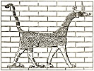

  
[Intangible Textual Heritage](../../index)  [Legendary
Creatures](../index)  [Index](index)  [Previous](eod06)  [Next](eod08) 

------------------------------------------------------------------------

[Buy this Book at
Amazon.com](https://www.amazon.com/exec/obidos/ASIN/1434685950/internetsacredte)

------------------------------------------------------------------------

[Buy this Book on
Kindle](https://www.amazon.com/exec/obidos/ASIN/B002G9UG48/internetsacredte)

------------------------------------------------------------------------

  
*Evolution of the Dragon*, by G. Elliot Smith, \[1919\], at Intangible
Textual Heritage

------------------------------------------------------------------------

#### THE ORIGIN OF EMBALMING.

I have already explained [2](#fn_22) how the
increased importance that came to be attached to the corpse as the means
of securing a continuance of existence led to the aggrandizement of the
tomb. Special care was taken to protect the dead and this led to the
invention of coffins, and to the making of a definite tomb, the size of
which rapidly increased as more and more ample supplies of food and
other offerings were made. But the very measures thus taken the more
efficiently to protect and tend the dead defeated the primary object of
all this care. For, when buried in such an elaborate tomb, the body no
longer became desiccated and preserved by the forces of nature, as so
often happened when it was placed in a simple grave directly in the hot
dry sand.

It is of fundamental importance in the argument set forth here to
remember that these factors came into operation before the time of the
First Dynasty. They were responsible for impelling the Proto-Egyptians
not only to invent the wooden coffin, the stone sarcophagus, the
rock-cut tomb, and to begin building in stone, but also to devise
measures for the artificial preservation of the body.

But in addition to stimulating the development of the first real
architecture and the art of mummification other equally far-reaching
results in the region of ideas and beliefs grew out of these practices.

From the outset the Egyptian embalmer was clearly inspired by two
ideals: (*a*) to preserve the actual tissues of the body with a minimum
disturbance of its superficial appearance; and (*b*) to preserve a
likeness of the deceased as he was in life. At first it

p. 16

was naturally attempted to make this simulacrum of the body itself if it
were possible, or alternatively, when this ideal was found to be
unattainable, from its wrappings or by means of a portrait statue. It
was soon recognized that it was beyond the powers of the early embalmer
to succeed in mummifying the body itself so as to retain a recognizable
likeness to the man when alive: although from time to time such attempts
were repeatedly made, [1](#fn_23) until the
period of the XXI Dynasty, when the operator clearly was convinced that
he had at last achieved what his predecessors, for perhaps twenty-five
centuries, had been trying in vain to do.

------------------------------------------------------------------------

### Footnotes

[15:2](eod07.htm#fr_22) *Op. cit. supra*.

[16:1](eod07.htm#fr_23) See my volume on "The
Royal Mummies," General Catalogue of the Cairo Museum.

------------------------------------------------------------------------

[Next: Early Mummies](eod08)
