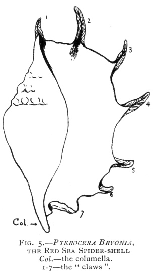

  
[Intangible Textual Heritage](../../index)  [Legendary
Creatures](../index)  [Index](index)  [Previous](eod35)  [Next](eod37) 

------------------------------------------------------------------------

[Buy this Book at
Amazon.com](https://www.amazon.com/exec/obidos/ASIN/1434685950/internetsacredte)

------------------------------------------------------------------------

[Buy this Book on
Kindle](https://www.amazon.com/exec/obidos/ASIN/B002G9UG48/internetsacredte)

------------------------------------------------------------------------

  
*Evolution of the Dragon*, by G. Elliot Smith, \[1919\], at Intangible
Textual Heritage

------------------------------------------------------------------------

#### THE OCTOPUS.

Aphrodite was associated not only with the cowry, the pearl, and the
mandrake, but also with the octopus, the argonaut, and other
cephalopods. Tümpel seems to imagine that the identification of the
goddess with the argonaut and the octopus necessarily excludes her
association with molluscs; and Dr. Rendel Harris attributes an equally
exclusive importance to the mandrake. But in such methods of argument
due recognition is not given to the outstanding fact in the history of
primitive beliefs. The early philosophers built up their great
generalizations in the same way as their modern successors. They were
searching for some explanation of, or a working hypothesis to include,
most diverse natural phenomena within a concise scheme. The very essence
of such attempts was the institution of a series of homologies and
fancied analogies between dissimilar objects. Aphrodite was at one and
the same time the personification of the cowry, the conch shell, the
purple shell, the pearl, the lotus, and the lily, the mandrake and the
bryony, the incense tree and the cedar, the octopus and the argonaut,
the pig, and the cow.

Every one of these identifications is the result of a long and chequered
history, in which fancied resemblances and confusion of meaning play a
very large part. But I cannot too strongly repudiate the claim made by
Sir James Frazer that such events are merely so

p. 166

many evidences of the innate human tendency to personify nature. The
history of the arbitrary circumstances that were responsible for the
development of each one of these homologies is entirely fatal to this
wholly unwarranted speculation. [1](#fn_293)
Tümpel claims [2](#fn_294) the Aphrodite was
associated more especially with "a species of *Sepia*". He refers to the
attempts to associate the goddess of love with amulets of univalvular
shells "in virtue of a certain peculiar and obscene symbolism". [3](#fn_295) Naturalists, however, designate with the
term *Venus Cytherea* certain gaping bivalve molluscs.

But, according to Tümpel (p. 386), neither univalvular nor bivalve
shells can be regarded as a real part of the goddess's cultural
equipment. There is no representation of Aphrodite coming in a shell
from across the sea. [4](#fn_296) The truly
sacred Aphrodite-shell was entirely different, so Tümpel believes: it
was obviously difficult to preserve, but for that reason more worthy of
notice, for the small χοιρίναι, (pectines), virginalia marina (Apuleius
de mag. 34, 35, and in reference thereto, Isidor. origg. 9, 5, 24) or
spuria (σπόρια) were only the commoner and more readily obtained
surrogates: the univalvular shells

p. 167

(μονοθυρα of Aristotle), such as those just mentioned, and the other
ὄστρεα of Aphrodite, the Nerites (periwinkles, etc.), the purple shell
and the Echineïs were also real Veneriae conchae. Among the Nerites
Aelian enumerates (N.A. 14, 28): Ἀφροδίτην δὲ συνδιαιτωμένην έν τῂ
θαλάττη ἡσθὴναί τε τῷ Νηρίτῃ τῷδε καὶ ἔχειν ἀυτὸν φίλον. On account of
their supposed medicinal value in cases of abortion and especially as a
prophylactic for pregnant women the Ἐχενηΐς (pure Latin re\[mi\]mora)
was called ὠδινολὐτη [1](#fn_297) (Pliny, 32,
1, 5: pisciculus!). According to Mutianus (Pliny, 9, 25 (41), 79 f.), it
was a species of purple shell, but larger than the true *Murex purpura*.
From this the sanctity of the Echineïs to the Cnidian Aphrodite is
demonstrated: "quibus (conchis) inhaerentibus plenam ventis stetisse
navem portantem Periandro, ut castrarentur nobilis pueros, conchasque,
quae id praestiterint, apud Cnidiorum Venerem coli" (Pliny).

Tümpel then (p. 387) accuses Stephani of being mistaken in his
interpretation of Martial's Cytheriacae (Epign. II, 47, 1 = purple
shells) as the amulets of Aphrodite, and claims that Jahn has given the
correct solution of the following passages from Pliny (N.H., 9, 33
\[52\], 103, compare 32, 11 \[53\]): "navigant ex his (conchis)
veneriae, praebentesque concavam sui partem et aurae opponentes per
summa aequorum velificant"; and further (9, 30 \[49\], 94): "in
Propontide concham esse acatii modo carinatam inflexa puppe, prora
rostrata, in hac condi nauplium animal saepiae simile ludendi societate
sola. duobus hoc fieri generibus: tranquillum enim vectorem demissis
palmulis ferire ut remis; si vero flatus invitet, easdem in usu
gubernaculi porrigi pandique buccarum sinus aurae".

Tümpel claims (pp. 387 and 388) that this quotation settles the
question. Aphrodite's "shell," according to him, is the *Nauplius*
(depicted as a shell-fish, with its sail-like palmulæ spread out to the
wind, but with the same sails flattened into plate-like arms for
steering), clearly "a species of *Sepia*," wholly like Aphrodite
herself, a ship-like shell-fish sailing over the surface of the water,
the concha veneria. \[The analogy to a ship bearing the Great Mother is
extremely ancient and originally referred to the crescent moon carrying
the moon-goddess across the heavenly ocean.\]

p. 168

Elsewhere (p. 399) he discusses the reasons for the connexion of
Aphrodite with the "nautilus," by which is meant the argonaut of
zoologists.

But if Jahn and Tümpel have thus clearly established the proof of the
intimate association of Aphrodite with certain cephalopods, they are
wholly unjustified in the assumption that their quotations from
relatively modern authors disprove the reality of the equally close
(though more ancient) relationship of the goddess to the cowry, the
pearl-shell, the trumpet-shell, and the purple-shell.

It must not be forgotten that, as we have already seen, the primitive
shell-cults of the Erythræan Sea had been diffused throughout the
Mediterranean area long before Aphrodite was born upon the shores of the
Levant, and possibly before Hathor came into existence in the south. The
use of the cowry and gold models of the cowry goes back to an early time
in Ægean history. [1](#fn_298) And the
influence of Aphrodite's early associations had become blurred and
confused by the development of new links with other shells and their
surrogates.

But the connexion of Aphrodite with the octopus and its kindred played a
very obtrusive part in Minoan and Mycenæan art; and its influence was
spread abroad as far as Western Europe [2](#fn_299) and towards the East as far as America.
In many ways it was a factor in the development of such artistic designs
as the spiral and the volute, and not improbably also of the swastika.

Starting from the researches of Tümpel, a distinguished French
zoologist, Dr. Frédéric Houssay, [3](#fn_300)
sought to demonstrate that the cult of Aphrodite was "based upon a
pre-existing zoological philosophy". The argument in support of his
claim that Aphrodite was a personification of the octopus must be
sharply differentiated into two parts: first, the reality of the
association of the octopus with the goddess, of which there can be no
doubt; and secondly, his explanation of it, which (however popular it
may be with classical writers and modern scholars) [4](#fn_301) is not only a gratuitous assumption, but
also, even if it were

  [  
Click to enlarge](img/fig22.jpg)  
Fig. 22  

Fig. 22.—(*a*) Sepia Officinalis, after Tryon, "Cephalopoda".

(*b*) Loligo Vulgaris, after Tryon.

(*c*) The position usually adopted by the
resting Octopus, after Tryon.

p. 169

based upon more valid evidence than the speculations of such recent
writers as Pliny, would not really carry the explanation very far.

I refer to his claim that "les premiers conquérants de la mer furent
induits en vénération du poulpe nageur (octopus) parce qu’ils crurent
que quelque-uns de ces céphalopodes, les poulpes sacrés (argonauta)
avaient, comme eux et avant eux, inventé la navigation" (*op. cit.*, p.
15). Idle fancies of this sort do not help us to understand the
arbitrary beliefs concerning the magical powers of the octopus.

The real problem we have to solve is to discover why, among all the
multitude of bizarre creatures to be found in the Mediterranean Sea, the
octopus and its allies should thus have been singled out for distinctive
appreciation, and also acquired the same remarkable attributes as the
cowry.

I believe that the Red Sea "Spider shell," *Pterocera*, [1](#fn_302) was the link between the cowry and the
octopus. This shell was used, like the cowry, for funerary purposes in
Egypt and as a trumpet in India. [2](#fn_303)
But it was also depicted upon a series of remarkable primitive statues
of the god Min, which were found at Coptos during the winter 1893-4 by
Professor Flinders Petrie. [3](#fn_304) Some of
these objects are now in the Cairo Museum and the others in the
Ashmolean Museum in Oxford. They are supposed to be late predynastic
representations of the god Min. If this supposition is correct they are
the earliest idols (apart from mere amulets) that have been preserved
from antiquity.

Upon these statues, representations of the Red Sea shell *Pterocera
bryonia* are sculptured in low relief. Mr. F. Ll. Griffith is
disinclined to accept my suggestion that the object of these pictures of
the shell was to animate the statues. But whether this was their purpose
or not, it is probably not without some significance that these
life-giving shells were associated with so obtrusively phallic a deity
as Min. In any case they afford concrete evidence of cultural contact
between Coptos and the Red Sea, and indicate that these particular
shells were chosen as symbols of that sea or its coast.

The distinctive feature of the *Pterocera* is that the mantle in the
adult expands into a series of long finger-like processes each of which

p. 170

secretes a calcareous process or "claw". There are seven [1](#fn_305) of these claws as well as the long
columella ([Fig. 5](#img_17000)). Hence, when the shell-cults were
diffused from the Red Sea to the Mediterranean (where the *Pterocera* is
not found), it is quite likely that the people of the Levant may have
confused with the octopus some sailor's account of the eight-rayed shell
(or perhaps representations of it on some

|                                                                                                             |
|-------------------------------------------------------------------------------------------------------------|
|  |

amulet or statue). Whether this is the explanation of the confusion or
not, it is certain that the beliefs associated with the cowry and the
octopus in the Ægean area are identical with those linked up with the
cowry and the *Pterocera* in the Red Sea.

I have already mentioned that the mandrake is believed to possess the
same magical powers. Sir James Frazer has called attention to the fact
that in Armenia the bryony (*Bryonia alba*) is a surrogate of the
mandrake and is credited with the same attributes? Lovell Reeve
("Conchologia Iconica," VI, 1851) refers to the Red Sea Pterocera as the
"Wild Vine Root" species, previously known as *Strombus radix brioniae;*
and Chemnitz ("Conch. Cab.," 1788, Vol. X, p. 227) says the French call
it "Racine de brione femelle imparfaite," and refer to it as "the
maiden". Here then is further evidence that this shell (*a*) was
associated in some way with a surrogate of the mandrake (Aphrodite), and
(*b*) was regarded as a maiden. Thus clearly it has a place in the
chequered history of Aphrodite. I have suggested the possibility of its
confusion with the octopus, which may have led to the inclusion of the
latter within the scope of the marine creatures in Aphrodite's cultural
equipment. According to Matthioli (Lib. 2, p. 135),

p. 171

another of Aphrodite's creatures, the purple shell-fish, was also known
as "the maiden". By Pliny it is called Pelogia, in Greek πορφυρα; and
πορφυρώματα was the term applied to the flesh of swine that had been
sacrificed to Ceres and Proserpine (Hesych.). In fact, the purple-shell
was "the maiden" and also "the sow": in other words it was Aphrodite.
The use of the term "maiden" for the *Pterocera* suggests a similar
identification. To complete this web of proof it may be noted that an
old writer has called the mandrake the plant of Circe, the sorceress who
turned men into swine by a magic draught. [1](#fn_306) Thus we have a series of shells, plants,
and marine creatures accredited with identical magical properties, and
each of them known in popular tradition as "the maiden". They are all
culturally associated with Aphrodite.

I shall have occasion (*infra*, [p. 177](eod37.htm#page_177)) to refer
to M. Siret's account of the discovery of the Ægean octopus-motif upon
Æneolithic objects in Spain, and of the widespread use in Western Europe
of certain conventional designs derived from the octopus. M. Siret also
(see the table, Fig. 6, on p. 34 of his book) makes the remarkable claim
that the conventional form of the Egyptian Bes, which, according to
Quibell, [2](#fn_307) is the god whose function
it is to preside over sexual intercourse in its purely physical aspect,
is derived from the octopus. If this is true—and I am bound to admit
that it is far from being proved—it suggests that the Red Sea littoral
may have been the place of origin of the cultural use of the octopus and
an association with Hathor, for Bes and Hathor are said to have been
introduced into Egypt from there. [3](#fn_308)

That the octopus was actually identified with the Great Mother and also
with the dragon is revealed by the fact of the latter assuming an
octopus-form in Eastern Asia and Oceania, and by the occurrence of
octopus-motifs in the representation of the goddess in America. One of
the most remarkable series of pictures depicting the Great Mother is
found sculptured in low relief upon a number of stone slabs from Manabi
in Central America, [4](#fn_309) one of which I
reproduce here

p. 172

\[paragraph continues\] (Fig. 21*b*). The
head of the goddess is a conventionalized octopus; to that was added a
body consisting of a *Loligo;* and, to give greater definiteness to this
remarkable process of building up the form of the goddess, conventional
representations of her arms and legs (and in some of the sculptures also
the *pudendum muliebre*) were added. Thus there can be no doubt of the
identification of this American Aphrodite and the octopus.

In the Polynesian Rata-myth there is a very instructive series of
manifestations of the dragon. [1](#fn_310) The
first form assumed by the monster in this story was a gaping shell-fish
of enormous size; then it appeared as a mighty octopus; and lastly, as a
whale, into whose jaws the hero Nganaoa sprang, as his representatives
are said to have done elsewhere throughout the world (Frobenius, *op.
cit.*, pp. 59-219).

Houssay (*op. cit. infra*) calls attention to the fact that at times
Astarte was shown carrying an octopus as her emblem, [2](#fn_311) and has suggested that it was mistaken
for a hand, just as in America the thunderbolt of Chac was given a
hand-like form in the Dresden Codex (*vide supra*, [Fig.
13](eod22.htm#img_fig13)), and elsewhere (*e.g.* [Fig.
12](eod22.htm#img_fig12)).

If this suggestion should prove to be well founded it would provide a
more convincing explanation of the girdle of hands worn by the Indian
goddess Kali [3](#fn_312) than that usually
given. If the "hands" really represent surrogates of the cowry, the
wearing of such a girdle brings the Indian goddess into line, not only
with Astarte and Aphrodite, but also with the East African maidens who
still wear the girdle of cowries. Kali's exploits were in many respects
identical with those of the bloodthirsty Sekhet-manifestation of the
Egyptian goddess Hathor. Just as Sekhet had to be restrained by Re for
her excess of zeal in murdering his foes, so Siva had to intervene with
Kali upon the battlefield

  [  
Click to enlarge](img/fig23.jpg)  
Fig. 23  

Fig. 23.—A series of Mycenæan
conventionalizations of the Argonaut and the Octopus (after Tümpel),
which provided the basis for Houssay's theory of the origin of the
triskele (*a*, *c*, and *d*) and swastika (*b* and *e*), and Siret's theory to explain the design of Bes's
face (*f* and *g*).

p. 173

flooded with gore (as also in the Egyptian story) to spare the remnant
of his enemies. [1](#fn_313)

------------------------------------------------------------------------

### Footnotes

[166:1](eod36.htm#fr_293) Sir James Frazer,
"Jacob and the Mandrakes," *Proc. Brit. Academy*.

[166:2](eod36.htm#fr_294) K. Tümpel, "Die
'Muschel der Aphrodite,'" Philologus, *Zeitschrift für das Classische
Alterthum*, Bd. 51, 1892, p. 385: compare also, with reference to the
"Muschel der Aphrodite," O. Jahn, *SB. d. k. Sächs*. *G. d. W.*, VII,
1853, p. 16 ff.; also IX, 1855, p. 80; and Stephani, *Compte rendu pour
l’an* 1870-71, p. 17 ff.

[166:3](eod36.htm#fr_295) See Jahn, *op. cit.*,
1855, T. V, 6, and T. IV, 8: figures of the so-called Χοιρίναι, (from
Χοῖρος in the double sense as "pig" and "the female pudendum"):
Aristophanes, Eq. 1147; Vesp. 332; Pollux, 8, 16; Hesch. s.v.

[166:4](eod36.htm#fr_296) The fact that no
graphic representation of this event has been found is surely a wholly
inadequate reason for refusing to credit the story. Very few episodes in
the sacred history of the gods received concrete expression in pictures
or sculptures until relatively late. A Hellenistic representation of the
goddess emerging from a bivalve was found in Southern, Russia (Minns,
"Scythians and Greeks," p. 345).

Tümpel cites the following statements: "te (Venus) ex concha natam esse
autumant: cave tu harum conchas spernas!" Tibull. 3, 3, 24: "et faveas
concha, Cypria, vecta tua"; Statius Silv. 1, 2, 117: Venus to
Violentilla, "haec et caeruleïs mecum consurgere digna fluctibus et
nostra potuit considere concha"; Fulgent. myth. 2, 4 "concha etiam
marina pingitur (Venus) portari (I. HS:—am portare)"; Paulus Diacon. p.
52, "M. Cytherea Venus ab urbe Cythera, in quam primum devecta esse
dicitur concha, cum in mari esset concepta cet".

[167:1](eod36.htm#fr_297) From ὠδινο—"to have
the pains of childbirth".

[168:1](eod36.htm#fr_298) See Schliemann,
"Ilios," p. 455; and Siret, *op. cit.*

[168:2](eod36.htm#fr_299) Siret, *op. cit.
supra*, p. 59.

[168:3](eod36.htm#fr_300) "Les Théories de la
Genèse à Mycènes et le sens zoologique de certains symboles du culte
d’Aphrodite," *Revue Archéologique*, 3ie série, T. XXVI,
1895, p. 13.

[168:4](eod36.htm#fr_301) It was adduced also
by Tümpel and others before him.

[169:1](eod36.htm#fr_302) or *Pteroceras*.

[169:2](eod36.htm#fr_303) Jackson, *op. cit.*,
p. 38.

[169:3](eod36.htm#fr_304) "Koptos," pp. 7-9,
Pls. III. and IV.: for a discussion of the significance of these statues
see Jean Capart, "Les Débuts de l’Art en Égypte," Brussels, 1904, p. 216
*et seq*.

[170:1](eod36.htm#fr_305) This may help to
explain the peculiar sanctity of the shell. Frazer, *op. cit.*, 4.

[171:1](eod36.htm#fr_306) Just as Hathor (or
her surrogate Horus) turned men into the creatures of Set, *i.e.* pigs,
crocodiles, et cetera.

[171:2](eod36.htm#fr_307) "Excavations at
Saqqara," 1905-1906, p. 14.

[171:3](eod36.htm#fr_308) Maspero, "The Dawn of
Civilization," p. 34.

[171:4](eod36.htm#fr_309) Saville, "Antiquities
of Manabi, Ecuador," 1907.

[172:1](eod36.htm#fr_310) A detailed summary of
the literature relating to the world-wide distribution of certain phases
of the dragon-myth is given by Frobenius, "Das Zeitalter des
Sonnesgottes," Berlin, 1904: on pp. 63-5 he gives the Rata-myth.

[172:2](eod36.htm#fr_311) Which can also be
compared with the conventional form of the thunderbolt.

[172:3](eod36.htm#fr_312) Of course the hands
had the additional significance as trophies of her murderous zeal. But I
think this is a secondary rationalization of their meaning. An excellent
photograph of a bronze statue (in the Calcutta Art Gallery),
representing Kali with her girdle of hands, is given by Mr. Donald A.
Mackenzie, "Indian Myth and Legend," p. xl.

[173:1](eod36.htm#fr_313) F. T. Elworthy has
summarized the extensive literature relating to hand-amulets ("The Evil
Eye," 1895; and "Horns of Honour," 1900). Many of these hands have the
definite reputation as fertility charms which one would expect if
Houssay's hypothesis of their derivation from the octopus is well
founded.

------------------------------------------------------------------------

[Next: The Swastika](eod37)
