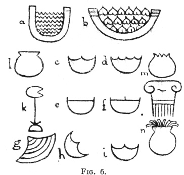
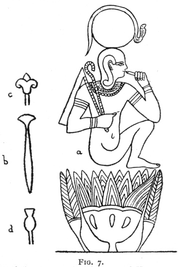

  
[Intangible Textual Heritage](../../index)  [Legendary
Creatures](../index)  [Index](index)  [Previous](eod37)  [Next](eod39) 

------------------------------------------------------------------------

[Buy this Book at
Amazon.com](https://www.amazon.com/exec/obidos/ASIN/1434685950/internetsacredte)

------------------------------------------------------------------------

[Buy this Book on
Kindle](https://www.amazon.com/exec/obidos/ASIN/B002G9UG48/internetsacredte)

------------------------------------------------------------------------

  
*Evolution of the Dragon*, by G. Elliot Smith, \[1919\], at Intangible
Textual Heritage

------------------------------------------------------------------------

#### THE MOTHER POT.

In the lecture on "Incense and Libations" (Chapter I) I referred to the
enrichment of the conception of water's life-giving properties which the
inclusion of the idea of human fertilization by water involved. When
this event happened a new view developed in explanation of the part
played by woman in reproduction. She was no longer regarded as the real
parent of mankind, but as the matrix in which the seed was planted and
nurtured during the course of its growth and development. Hence in the
earliest Egyptian hieroglyphic writing the picture of a pot of water was
taken as the symbol of womanhood, the "vessel" which received the seed.
A globular water-pot, the common phonetic value of which is *Nw* or
*Nu*, was the symbol of the cosmic waters, the god *Nw* (*Nu*), whose
female counterpart was the goddess *Nut*.

In his report, "A Collection of Hieroglyphs," [3](#fn_330) Mr. F. Ll. Griffith discusses the bowl
of water (*a*) and says that it stands for the female principle in the
words for *vulva* and woman. When it is recalled that the cowry (and
other shells) had the same double significance, the possibility suggests
itself whether at times confusion may

p. 179

not have arisen between the not very dissimilar hieroglyphic signs for
"a shell" (*h*) and "the bowl of water" (woman) (*f*). [1](#fn_331)

Referring to the sign (*g* and *h*) for "a shell," Mr. Griffith says (p.
25): "It is regularly found at all periods in the word *h̯aw∙t* =
'altar, [2](#fn_332) and perhaps only in this
word: but it is a peculiarity of the Pyramid Texts that the sign shown
in the text-figures *c*, *h*, and *i* is in them used very commonly, not
as a word-sign, but also as a

 

(*a*) Picture of a bowl of water—the hieroglyphic sign equivalent to
*hm* (the word *hmt* means "woman")—Griffith, "Beni Hasan," Part III,
Plate VI, Fig. 88 and p. 29.

(*b*) "A basket of sycamore figs"—Wilkinson's "Ancient Egyptians," Vol.
I, p. 323.

(*c*) and (*d*) are said by Wilkinson to be hieroglyphic signs meaning
"wife" and are apparently taken from (*b*). But (*c*) is identical with
(*i*), which, according to Griffith (p. 14), represents a bivalve shell
(g, from Plate III, Fig. 3), more usually placed obliquely (*h*). The
varying conventionalizations of (*a*) or (*b*) are shown in (*d*),
(*e*), and (*f*) (Griffith, "Hieroglyphics," p. 34).

(*k*) The sign for a lotus leaf, which is a phonetic equivalent of the
sign (*h*), and, according to Griffith ("Hieroglyphics," p. 26), "is
probably derived from the same root, on account of its shell-like
outline".

(*l*) The hieroglyphic sign for a pot of water in such words as Nu and
Nut.

(*m*) A "pomegranate" (replacing a bust of Tanit) upon a sacred column
at Carthage (Arthur J. Evans, "Mycenæan Tree and Pillar Cult," p. 46).

(*n*) The form of the body of an octopus as conventionalized on the
coins of Central Greece (compare Fig. 24 (*d*)). Its similarity to the
Egyptian pot-sign (*l*) (which also has the significance of
mother-goddess) is worthy of note.

phonetic equivalent to the sign labelled *k* (in the text-figure) for
*h̯’* (*kha*), or apparently for *h̯* alone in many words.

"The name of the lotus leaf is probably derived from the same root, on
account of its shell-like outline or *vice versa*."

p. 180

The familiar representation of Horus (and his homologues in India and
elsewhere) being born from the lotus suggests that the flower represents
his mother Hathor. But as the argument in these pages has

 

(*a*) An Egyptian design representing the sun-god Horus emerging from a
lotus, representing his mother Hathor (Isis).

(*b*) Papyrus sceptre often carried by goddesses and animistically
identified with them either as an instrument of life-giving or
destruction.

(*e*) Conventionalized lily—the prototype of the trident and the
thunder-weapon.

(*d*) A water-plant associated with the Nile-gods.

led us towards the inference that the original form of Hathor was a
shell-amulet, [1](#fn_333) it seems not
unlikely that her identification with the lotus

  [  
Click to enlarge](img/fig24.jpg)  
Fig. 24  

(*a*) and (*b*) Two Mycenæan pots (after Schliemann).

(*a*) The so-called "owl-shaped" vase is really a representation of the
Mother-Pot in the form of a conventionalized Octopus (Houssay).

(*b*) The other vase represents the Octopus Mother-Pot, with a jar upon
her head and another in her hands—a three-fold representation of the
Great Mother as a pot.

(*c*) A Cretan vase from Gournia in which the Octopus-motive is
represented as a decoration upon the pot instead of in its form.

(*a*), (*e*), (*f*), (*g*), and (*h*) A series of coins from Central
Greece (after Head) showing a series of conventionalizations of the
Octopus, with its pot-like body and palm-tree-like arms (*f*).

(*i*) *Sepia officinalis* (after Tryon).

(*h*) and (*l*) The so-called "spouting vases" in the hands of the
Babylonian god Ea, from a cylinder seal of the time of Gudea, Patesi of
Tello, after Ward ("Seal Cylinders, etc.," p. 215).

The "spouting vases" have been placed in conjunction with the Sepia to
suggest the possibility of confusion with a conventionalized drawing of
the latter in the blending of the symbolism of the water-jar and
cephalopods in Western Asia and the Mediterranean.

p. 181

may have arisen from the confusion between the latter and the cowry,
which no doubt was also in part due to the belief that both the shell
and the plant were expressions of the vital powers of the water in which
they developed.

The identification of the Great Mother with a pot was one of the factors
that played a part in the assimilation of her attributes with those of
the Water God, who in early Sumerian pictures was usually represented
pouring the life-giving waters from his pot ([Fig. 24](#img_fig24), *h*
and *l*).

This idea of the Mother Pot is found not only in Babylonia, Egypt,
India, [1](#fn_334) and the Eastern
Mediterranean, but wherever the influence of these ancient civilizations
made itself felt. It is widespread among the Celtic-speaking peoples. In
Wales the pot's life-giving powers are enhanced by making its rim of
pearls. But as the idea spread, its meaning also became extended. At
first it was merely a jug of water or a basket of figs, but elsewhere it
became also a witch's cauldron, the magic cup, the Holy Grail, the font
in which a child is reborn into the faith, the vessel of water here
being interpreted in the earliest sense as the uterus or the organ of
birth. The Celtic pot, so Mr. Donald Mackenzie tells me, is closely
associated with cows, serpents, frogs, dragons, birds, pearls, and "nine
maidens that blow the fire under the cauldron"; and, if the nature of
these relationships be examined, each of them will be found to be a link
between the pot and the Great Mother.

The witch's cauldron and the maidens who assist in the preparation of
the witch's medicine seem to be the descendants respectively of Hathor's
pots (in the story of the Destruction of Mankind) and the Sekti who
churn up the *didi* and the barley with which to make the elixir of
immortality and the sedative draught for the destructive goddess
herself.

Mr. Donald Mackenzie has given me a number of additional references from
Celtic and Indian literature in corroboration of these widespread
associations of the pot with the Great Mother; and he reminds me that in
Oceania the coco-nut has the same reputation as the pot in the Indian
*Mahābhārata*. It is the source of food and anything else that is
wanted, and its supply can never be exhausted. \[On some future occasion
I hope to make use of the wonderful legends of the

p. 182

pot's life-giving powers, to which Mr. Mackenzie has directed my
attention. At present, however, I must content myself with the statement
that the pot's identity with the Great Mother is deeply rooted in
ancient belief throughout the greater part of the world. [1](#fn_335)\]

The diverse conceptions of the Great Mother as a pot and as an octopus
seem to have been blended in Mycenæan lands, where the so-called
"owl-shaped" pots were clearly intended to represent the goddess in both
these aspects united in one symbol. When the diffusion of these ideas
into more remote parts of the world took place syntheses with other
motives produced a great variety of most complex forms. In Honduras
pottery vessels have been found [2](#fn_336)
which give tangible expression to the blending of the ideas of the
Mother Pot, the crocodile-like *Makara*, star-spangled like Hathor's
cow, Aphrodite's

p. 183

pig, and Soma's deer, and provided with the deer's antlers of the
Eastern Asiatic dragon (see Chapter II, p. 103).

The New Testament sets forth the ancient conception of birth and
rebirth. When Nicodemus asks: "How can a man be born again when he is
old? Can he enter a second time into his mother's womb, and be born?" he
is told: "Except a man be born of water and of the spirit, he cannot
enter into the kingdom of God. That which is born of the flesh is flesh:
and that which is born of the spirit is spirit" (John iii. 4, 5, and 6).

The phrase "born of water" refers to the birth "of the flesh"; and the
mother's womb is the vessel containing "the water" from which the new
life emerges. Plutarch states, with reference to the birth of Isis:
"τετάρτη δε την Ἴσιν ἐν πανυγροις γενέσθαι". The great waters which
produced all living things, the Egyptian god Nun and the goddess Nut,
were expressed in hieroglyphic as pots of water. The goddess was
identified with Hathor's celestial star-spangled cow, the original
mother of the sun-god; and the word "Nun" was a symbol of all that was
new, young, and fresh, and the fertilizing and life-giving waters of the
annual inundation of the Nile. Hathor was the daughter of these waters,
as Aphrodite was sprung from the sea-foam.

------------------------------------------------------------------------

### Footnotes

[178:1](eod37.htm#fr_328) Cook, "Zeus," p. 346
*et seq*.

[178:2](eod37.htm#fr_329) This is well shown
upon the Copan representations (Fig. 19) of the elephant-headed god—see
Nature, November, 25, 1915, p. 340.

[178:3](eod38.htm#fr_330) *Archæol. Survey of
Egypt*, 1898, p. 3.

[179:1](eod38.htm#fr_331) Compare the two-fold
meaning of the Latin *testa* as "shell" and "bowl".

[179:2](eod38.htm#fr_332) Compare the
association of shells with altars in Minoan Crete and the widespread use
of large shells as bowls for "holy water" in Christian churches.

[180:1](eod38.htm#fr_333) Miss Winifred M.
Crompton, Assistant Keeper of the Egyptian Department of the Manchester
Museum, has called my attention to a remarkable piece of evidence which
affords additional corroboration of the view that Hathor was a
development of the cowry-amulet. Upon the famous archaic palette of
Narmer (), a sporran, composed of four representations of Hathor's head,
takes the place of the original cowries that were suspended from more
primitive girdles.

The cowries of the head ornament of primitive peoples of Africa and Asia
(and of the Mediterranean area in early times—Schliemann's "Ilios," Fig.
685) are often replaced in Egypt by lotus flowers (W. D. Spanton, "Water
Lilies of Egypt," *Ancient Egypt*, 1917, Part I, Figs. 19, 20, and 21).
Upon the head-band of the statue of Nefert, which I have reproduced in
Chapter I (Fig. 4), a conventional lotus design is found (see Spanton's
Fig. 19), which is almost identical with the classical thunder-weapon.

[181:1](eod38.htm#fr_334) Among the Dravidian
people at the present day the seven goddesses (corresponding to the
seven Hathors) are often represented by seven pots.

[182:1](eod38.htm#fr_335) The luxuriant crop of
stories of the Holy Grail was not inspired originally by mere literary
invention. A tradition sprung from the fountainhead of all mythology,
the parent-story of the Destruction of Mankind, provided the materials
which a series of writers elaborated into the varied assortment of
legends of the Mother Pot. The true meaning of the Quest of the Holy
Grail can be understood only by reading the fabled accounts of it in the
light of the ancient search for the elixir of life and the historical
development of the narrative describing that search.

A concise summary of the Grail literature will be found in Jessie L.
Weston's "The Quest of the Holy Grail" (1913). Her theory will be found,
after some slight modifications, to fall into line with the general
argument of this book.

Mr. F. Ll. Griffith tells me that the Egyptian hieroglyphic for the verb
"coire cum" gives frank expression to the real meaning of the symbolism
of the pot as the matrix which receives the seed. The same idea provides
the material for the incident of the birth of Drona (the pot-born) in
the Adi Parva (Sections CXXXI, CXXXIX, and CLXVIII, in Roy's
translation) of the Mahabharata, to which Mr. Donald A. Mackenzie has
kindly called my attention. Drona was conceived in a pot from the seed
of a Rishi. A widespread variant of the same story is the conception of
a child from a drop of blood in a pot (see, for example, Hartland,
"Legend of Perseus," Vol. I, pp. 98 and 144). If the pot can thus create
a human being, it is easy to understand how it acquired its reputation
of being also able to multiply food and provide an inexhaustible supply.
Similarly, all substances, such as barley, rice, gold, pearls, and jade,
to which the possession of a special vital essence or "soul substance"
was attributed, were believed to be able to reproduce themselves and so
increase in quantity of their own activities. As "givers of life" they
were also able to add to their own life-substance, in other words to
grow like any other living being.

[182:2](eod38.htm#fr_336) "An American Dragon,"
Man, November, 1918.

------------------------------------------------------------------------

[Next: Artemis and the Guardian of the Portal](eod39)
