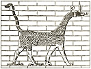

  
[Intangible Textual Heritage](../../index)  [Legendary
Creatures](../index)  [Index](index)  [Previous](eod45)  [Next](eod47) 

------------------------------------------------------------------------

[Buy this Book at
Amazon.com](https://www.amazon.com/exec/obidos/ASIN/1434685950/internetsacredte)

------------------------------------------------------------------------

[Buy this Book on
Kindle](https://www.amazon.com/exec/obidos/ASIN/B002G9UG48/internetsacredte)

------------------------------------------------------------------------

  
*Evolution of the Dragon*, by G. Elliot Smith, \[1919\], at Intangible
Textual Heritage

------------------------------------------------------------------------

#### THE SERPENT AND THE LIONESS.

When the development of the story of the Destruction of Mankind
necessitated the finding of a human sacrifice and drove the Great Mother
to homicide, this side of her character was symbolized by identifying
her with a man-slaying lion and the venomous uræus-serpent.

She had previously been represented by such beneficent food-providing
and life-sustaining creatures as the cow, the sow, and the gazelle
(antelope or deer): but when she developed into a malevolent creature
and became the destroyer of mankind it was appropriate that she should
assume the form of such man-destroyers as the lion and the cobra.

Once the reason for such identifications grew dim, the uræus-form of the
Great Mother became her symbol in either of her aspects, good or bad,
although the legend of her poison-spitting, man-destroying powers
persisted. [1](#fn_445) The identification of
the destroying-goddess with the moon, "the Eye of the Sun-god," prepared
the way for the rationalization of her character as a uræus-serpent
spitting venom and the sun's Eye spitting fire at the Sun-god's enemies.
Such was the

p. 229

goddess of Buto in Lower Egypt, whose uræus-symbol was worn on the
king's forehead, and was misinterpreted by the Greeks as not merely a
symbolic "eye," but an actual median eye upon the king's or the god's
forehead.

It is not without special significance that in the ancient legend (see
Sethe, *op. cit.*) the lioness-goddess Tefnut was reputed to have come
from Elephantine (or at any rate the region of Sehêl and Biga, which has
the same significance), which serves to demonstrate her connexion with
the story of the Destruction of Mankind and to corroborate the inference
as to its remote antiquity. She was identified with Hathor, Sekhet,
Bast, and other goddesses.

But the uræus was not merely the goddess who destroyed the king's
enemies and the emblem of his kingship: in course of time the Cobra
became identified with the ruler himself and the dead king, who was the
god Osiris. When this happened the snake acquired the god's reputation
of being the controller of water.

The fashionable speculation of modern scholars that the movements of the
snake naturally suggest rippling water [1](#fn_446) and provide "the obvious reason" which
led many people quite independently the one of the other to associate
the snake with water, is thus shown to have no foundation in fact.

One would have imagined that, if any natural association between snakes
and water was the reason for this association, a water-snake would have
been chosen to express the symbolism; or, if it was the mere rippling
motion of the reptile, that all snakes or any snake would have been
drawn into the analogy. But primarily only one kind of snake, a cobra,
was selected; [2](#fn_447) and it is not a
water snake, and cannot live in or under water. It was selected *because
it was venomous* and the appropriate symbol of man-slaying.

The circumstances which led to the identification of this particular
serpent with water were the result of a process of legend-making of so
arbitrary and eccentric a nature as to make it impossible seriously to
pretend that so tortuous a ratiocination should have been exactly
followed to the same unexpected destination also in Crete and Western

p. 230

\[paragraph continues\] Europe, in
Babylonia and India, in Eastern Asia, and in America, without prompting
the one of the other. No serious investigator who is capable of
estimating the value of evidence can honestly deny that the belief in
the serpent's control over water was diffused abroad from one centre
where a concatenation of peculiar circumstances and beliefs led to the
identification of the ruler with the cobra and the control of water.

We are surely on safe ground in assuming the improbability of such a
wholly fortuitous set of events happening a second time and producing
the same result elsewhere. Thus when we find in India the Nâga, rajas
identified with the cobra, and credited with the ability to control the
waters, we can confidently assume that in some way the influence of
these early Egyptian events made itself felt in India. As we compare the
details of the Nâga worship in India [1](#fn_448) with early Egyptian beliefs, all doubt
as to their common origin disappears.

The Nâga rulers were closely associated with springs, streams, and
lakes. "To this day the rulers of the Hindu Kush states, Hunza and
Nagar, though now Mohammedans, are believed, by their subjects, to be
able to command the elements."

Oldham adds: "This power is still ascribed to the serpent-gods of the
sun-worshipping countries of China, Manchuria, and Korea, and was so,
until the introduction of Christianity, in Mexico and Peru". This is put
forward in support of his argument that the Nâga kings’ "supposed
ability to control the elements, and especially the waters," arose "from
their connexion with the sun". But this is not so. [2](#fn_449) The belief in the Egyptian king's power
over water was certainly older than sun-worship, which did not begin
until Osirian beliefs and the personification of the moon as the Great
Mother brought the sky-deities and the control of water into correlation
the one with the other. The association of the sun and the serpent in
the royal insignia was a later development.

The early Egyptian goddess was identified with the uræus-serpent in that
vitally important nodal point of primitive civilization, Buto, in Lower
Egypt. The earliest deity in Crete and the Eastern Mediterranean

p. 231

seems to have been a goddess who was also closely associated with the
serpent. According to Langdon "the ophidian nature of the earliest
Sumerian mother-goddess *Innini* is unmistakable. … She carries the
caduceus in her hand, two serpents twining about a staff." [1](#fn_450)

The earliest Indian deities also were goddesses, and the first rulers of
whom any record has been preserved were regarded as divine cobras, to
whom was attributed the power of controlling water. These Nâgas, whether
kings or queens, gods or goddesses, were the prototypes of the Eastern
Asiatic dragon, whose origin is discussed in Chapter II.

In Japan the earliest sun-deity was a goddess who was identified with a
snake. Elsewhere in this volume (Chapter II) I have referred to the
completeness of the transference to America of these Old World ideas of
the serpent. Right on the route taken by the main stream of cultural
diffusion across the Pacific we still find in their fully-developed form
the old beliefs concerning the good Mother Serpent of the ancient
civilizations (C. E. Fox and F. H. Drew, *op. cit. supra*, p. 139). She
could be re-incarnated as a coconut: she controlled crops; she was
associated with the coming of death into the world, with the
introduction of agriculture and the discovery of fire. Like her
predecessors in the West she was also a Mother Pot or Basket that never
emptied.

All the *hiona* or *figona* (*i.e.* spirits) of San Cristoval have a
serpent incarnation from Agunua the creator, worshipped by every one, to
Oharimae and others, only known to particular persons. Other spirits,
called *ataro*, might be incarnate in almost any animal. Agunua, who
took the form of a serpent, was good, not evil (p. 134). Very many
pools, rocks, water-falls, or large trees were thought to be the abode
of *figona*. These serpent spirits could take the form of a stone, or
retire within a stone, and sacred stones seem to be connected with
*figona* rather than with *ataro* (p. 135). Almost all the local
*figona* are represented as female snakes, but Agunua is a male snake
(p. 137).

As the real significance of the snake's symbolism originated from its
identification with the Great Mother in her destructive aspect, it is
not surprising that the snake is the most primitive form of the evil

p. 232

dragon. The Babylonian Tiamat was originally represented as a huge
serpent, [1](#fn_451) and throughout the world
the serpent is pre-eminently a symbol of the evil dragon and the powers
of evil.

The serpent that tempted Eve was the homologue both of the mother of
mankind herself and also of the tree of paradise. It was the
representative of the dragon-protector of pearls and of other kinds of
treasure: it was also the goddess who animated the sacred tree as well
as the protector who attacked all who approached it. It was the evil
dragon that tempted Eve to eat of the forbidden fruit which brought her
mortality.

The identification of the Great Mother with the lioness (and the
secondary association of her husband and son with the lion) was
responsible for a widespread relationship of these creatures with the
gods and goddesses in Egypt and the Mediterranean, in Western Asia, in
Babylonia and India, in Eastern Asia \[tiger\] and America \[ocelot, and
forms borrowed from the conventionalized lions and tigers of the Old
World\].

The account of the Great Mother's attributes and associations throws
into clear relief certain aspects of the evolution of the dragon which
were left in a somewhat nebulous state in Chapter II. The earliest form
assumed by the power of evil was the serpent or the lion, because these
death-dealing creatures were adopted as symbols of the Great Mother in
her rôle as the Destroyer of Mankind. When Horus was differentiated from
the Great Mother and became her *locum tenens*, his falcon (or eagle)
was blended with Hathor's lioness to make the composite monster which is
represented on Elamite and Babylonian monuments (see [p.
79](eod21.htm#page_79)). But when the rôle of water as the instrument of
destruction became prominent, Ea's antelope and fish were blended to
make a monster, usually known as the "goat-fish," which in India and
elsewhere assumed a great variety of forms. Some of the varieties of
*makara* were sufficiently like a crocodile to be confused or identified
with this representative of the followers of Set.

The real dragon was created when ail three larval types—serpent,
eagle-lion, and antelope-fish—were blended to form a monster with bird's
feet and wings, a lion's forelimbs and head, the fish's scales, the
antelope's horns, and a more or less serpentine form of trunk and tail,

p. 233

and sometimes also of head. Repeated substitution of parts of other
animals, such as the spiral horn of Amen's ram, a deer's antlers, and
the elephant's head, led to endless variation in the dragon's traits.

The essential unity of the motives and incidents of the myths of all
peoples and of every age is a token, not of independent origin or the
result of "the similarity of the working of the human mind," but of
their derivation from the same ultimate source.

The question naturally arises: what is a myth? The dragon-myth of the
West is the religion of China. The literature of every religion is
saturated with the influence of the myth. In what respect does religion
differ from myth? In Chapter I, I attempted to explain how originally
science and religion were not differentiated. Both were the outcome of
man's attempt to peer into the meaning of natural phenomena, and to
extract from such knowledge practical measures for circumventing fate.
His ever-insistent aim was to combat danger to life.

Religion was differentiated from science when the measures for
controlling fate became invested with the assurance of supernatural
help, for which the growth of a knowledge of natural phenomena made it
impossible for the mere scientist to be the sponsor. It became a
question of faith rather than knowledge; and man's instinctive struggle
against the risk of extinction impelled him to cling to this larger hope
of salvation, and to embellish it with an ethical and moral significance
which at first was lacking in the eternal search for the elixir of life.

If religion can be regarded as archaic science enriched with the belief
in supernatural control, the myth can be regarded as effete religion
which has been superseded by the growth of a loftier ethical purpose.
The myth is to religion what alchemy is to chemistry or astrology is to
astronomy. Like these sciences, religion retains much of the material of
the cruder phase of thought that is displayed in myth, alchemy, and
astrology, but it has been refined and elaborated. The dross has been to
a large extent eliminated, and the pure metal has been moulded into a
more beautiful and attractive form. In searching for the elixir of life,
the makers of religion have discovered the philosopher's stone, and with
its aid have transmuted the base materials of myth into the gold of
religion.

If we seek for the deep motives which have prompted men in all ages so
persistently to search for the elixir of life, for some means of
averting the dangers to which their existence is exposed, it will be

p. 234

found in the instinct of self-preservation, which is the fundamental
factor in the behaviour of all living beings, the means of preservation
of the life which is their distinctive attribute and the very essence of
their being.

The dragon was originally a concrete expression of the divine powers of
life-giving; but with the development of a higher conception of
religious ideals it became relegated to a baser rôle, and eventually
became the symbol of the powers of evil.

 

 

 

 

 

 

ABERDEEN: THE UNIVERSITY PRESS.

------------------------------------------------------------------------

### Footnotes

[228:1](eod46.htm#fr_445) Sethe, "Zur
altägyptische Sage von Sonnenaugen das im Fremde war," *Untersuchungen
zur Geschichte and Altertumskunde Ægyptens*, V, p. 23.

[229:1](eod46.htm#fr_446) See especially the
claims put forward by Brinton, which have been accepted by Spinden,
Joyce, and many other recent writers.

[229:2](eod46.htm#fr_447) Possibly also the
Cerastes. At a relatively late period other snakes were adopted as
surrogates of the cobra and Cerastes.

[230:1](eod46.htm#fr_448) See Oldham, "Sun and
Serpent," p. 51 *inter alia*.

[230:2](eod46.htm#fr_449) Blackman, however,
has recently advanced this claim in reference to Egypt (*op. cit.*,
*Proc. Soc. Bibl. Archæology*, 1918, p. 57), as Breasted and others have
done before.

[231:1](eod46.htm#fr_450) S. Langdon, "A Seal
of Nidaba, the Goddess of Vegetation," *Proceedings of the Society of
Biblical Archæology*, Vol. XXXVI, 1914, p. 281.

[232:1](eod46.htm#fr_451) L. W. King,
"Babylonian Religion," p. 58.

------------------------------------------------------------------------

[Next: Advertisements](eod47)
