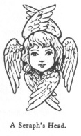

  
[Intangible Textual Heritage](../../index)  [Legendary
Creatures](../index)  [Symbolism](../../sym/index)  [Index](index) 
[Previous](fsca10)  [Next](fsca12) 

------------------------------------------------------------------------

[Buy this Book at
Amazon.com](https://www.amazon.com/exec/obidos/ASIN/B002D48Q8Y/internetsacredte)

------------------------------------------------------------------------

  
*Fictitious and Symbolic Creatures in Art*, by John Vinycomb, \[1909\],
at Intangible Textual Heritage

------------------------------------------------------------------------

p. 44

### Cherubim and Seraphim in Heraldry

"*On cherubim and seraphim  
 Full royally he rode*."  
                      Steenhold.

"*What, always dreaming over heavenly things,  
 Like* angel *heads in stone with pigeon wings*."  
                         Cowper,
"Conversation."

In heraldry A
Cherub (plural Cherubim) is always represented as the head of an
infant between a pair

|                                   |
|-----------------------------------|
|  |

of wings, usually termed a "cherub's head."

A Seraph (plural Seraphim), in like
manner, is always depicted as the head of a child, but with three pairs
of wings;

|                                    |
|------------------------------------|
|  |

the two uppermost and the two lowermost are contrarily crossed, or in
saltire; the two middle-most are displayed.

*Clavering*, of Callaby Castle, Northumberland, bears for crest a
cherub's head with wings erect. Motto: cœlos
volens.

On funereal achievements, setting forth the rank

p. 45

and circumstance of the deceased, it is usual to place over the
lozenge-shaped shield containing arms of a woman, whether spinster,
wife, or widow, a cherub's head, and knots or bows of ribbon in place of
crests, helmets, or its mantlings, which, according to heraldic law,
cannot be borne by any

|                                                                                         |
|-----------------------------------------------------------------------------------------|
|  |

woman, sovereign princesses only excepted.

In representing the cherubim by infants’ winged heads, the early
painters meant them to be emblematic of a pure spirit glowing with love
and intelligence, the head the seat of the soul, and the wings attribute
of swiftness and spirit alone retained.

The body or limbs of the cherub and seraph are never shown in heraldry,
for what reason it is difficult to say, unless it be from the ambiguity
of the descriptions in the sacred writings and consequent difficulty of
representing them. The heralds adopted the figure of speech termed
synecdoche, which adopts a part to represent the whole.

Sir Joshua Reynolds has embodied the modern conception in his exquisite
painting of cherubs’ heads, *Portrait Studies of Frances Isabella Ker,
daughter of Lord William Gordon*, now in the National Collection. It
represents five infants’ heads with wings, in

p. 46

different positions, floating among clouds. This idea of the cherub
seems to have found ready acceptance with poets and painters.
Shakespeare sings:

          "Look how the floor of heaven  
 Is thick inlaid with patines of bright gold:  
 There's not the smallest orb which thou beholdest  
 But in his motion like an angel sings,  
 Still quiring to the young-eyed cherubim—  
 Such harmony is in immortal souls:  
 But while this muddy vesture of decay  
 Doth grossly close it in, we cannot hear it."

Many of the painters of the period of the Renaissance represented the
cherub similarly to those in Reynolds’ picture. They were also in the
habit of introducing into their pictures of sacred subjects nude
youthful winged figures, "celestial loves," sporting in clouds around
the principal figure or figures, or assisting in some act that is being
done. Thus Spenser invests "The Queen of Beauty and of Love the Mother"
with a troop of these little loves, "Cupid, their elder brother."

"And all about her neck and shoulders flew  
 A flock of little loves, and sports and joys  
 With nimble wings of gold and purple hue;  
 Whose shapes seemed not like to terrestrial boys,  
 But like to angels playing heavenly toys."  
               *Faerie Queen*, Book x. cant. x. p. 153.

\[paragraph continues\] These must not,
however, be confounded with the cherub and seraph of Scripture. It was a
thoroughly

p. 47

pagan idea, borrowed from classic mythology, and unworthy of Christian
Art. It soon degenerated into "earthly loves" and "cupids," or amorini
as they were termed and as we now understand them.

------------------------------------------------------------------------

[Next: Cherubim & Seraphim of Scripture](fsca12)
