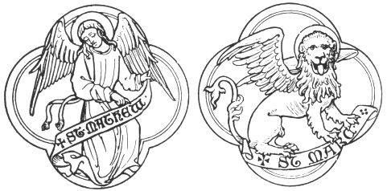
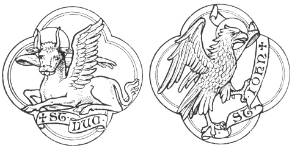

  
[Intangible Textual Heritage](../../index)  [Legendary
Creatures](../index)  [Symbolism](../../sym/index)  [Index](index) 
[Previous](fsca12)  [Next](fsca14) 

------------------------------------------------------------------------

[Buy this Book at
Amazon.com](https://www.amazon.com/exec/obidos/ASIN/B002D48Q8Y/internetsacredte)

------------------------------------------------------------------------

  
*Fictitious and Symbolic Creatures in Art*, by John Vinycomb, \[1909\],
at Intangible Textual Heritage

------------------------------------------------------------------------

### Emblems of the Four Evangelists

The winged living figures, symbols of the
evangelists, which are most frequently met with, and which have ever
been most in favour with Early Christian artists, appear to have been
used at a very early date. They are taken from the vision of Ezekiel and
the Revelation of St. John. "The writings of St. Jerome," says Audsley,
"in the beginning of the fifth century gave to artists authority for the
appropriation of the four creatures to the evangelists," and for reasons
which are there given at length.

St. Matthew: *Winged Man*,
Incarnation.—To St. Matthew was given the creature in human likeness,
because he commences his gospel with the human generation of Christ, and
because in his writings the human nature of Our Lord is more dwelt upon
than the divine.

St. Mark: *Winged Lion*, The
Resurrection.—*The Lion* was the symbol of St. Mark, who opens his
gospel with the mission of John the Baptist, "the voice of one crying in
the wilderness." He also sets forth the royal dignity of Christ and
dwells upon His power manifested in the resurrection from the dead. The
lion was accepted in early times as a symbol of

p. 54

 

the resurrection because the young lion was believed always to be born
dead, but was awakened to vitality by the breath, the tongue, and
roaring of its sire.

 

St. Luke: *Winged Ox*, Passion.—The form
of the ox, the beast of sacrifice, fitly sets forth the sacred

p. 55

office, and also the atonement for sin by blood, on which, in his
gospel, he particularly dwells.

St. John: *The Eagle*, Ascension.—The
eagle was allotted to St. John because, as the eagle soars towards
heaven, he soared in spirit upwards to the heaven of heavens to bring
back to earth revelation of sublime and awful mysteries.

Independently of their reference to the four evangelists these figures
sometimes refer to *the Incarnation*, *the Passion*, *the Resurrection*,
and *the Ascension*.

Sedulius, a priest and poet of the fifth century, says much the same in
the following verse:

**Hoc Matthæus agens, Hominem generaliter implet:  
Marcus ut alta fremit vox per deserta Leonis:  
Jura sacerdotis Lucas tenet ore Jubenci:  
More volens Aquilæ verbo petit Johannes**.

The Lion of St. Mark.—In the ninth
century the rapidly rising State of Venice was dignified by the
reception of the relics of St. Mark, transported thither from
Alexandria. "Few patron saints," says Theodore A. Buckley, "enjoy a
greater popularity, whether socially or locally exemplified. His lion
was emblazoned on the standard of the Republic, and stamped on the
current coins, while his name was identified with the pride, the power,
and glory of all Venice." [\*](#fn_4)

Emblems of the evangelists do not often appear in heraldry.

p. 56

Walter Reynolds, Archbishop of Canterbury, according to a manuscript at
Lambeth (executed for Archbishop Laud), bore *azure on a cross or,
between the symbols of the evangelists of the last, four lions rampant
gules*.

The Freemasons appear to use a similar coat of arms upon their seal,
viz., *a cross between the emblems of the four evangelists, and for
supporters two cherubims, all proper*.

 

------------------------------------------------------------------------

### Footnotes

[55:\*](fsca13.htm#fr_4) "Great Cities of the
Middle Ages."

------------------------------------------------------------------------

[Next: The Dragon](fsca14)
