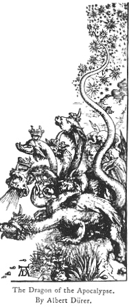
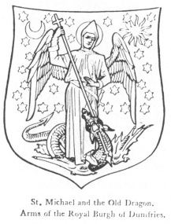
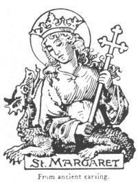

  
[Intangible Textual Heritage](../../index)  [Legendary
Creatures](../index)  [Symbolism](../../sym/index)  [Index](index) 
[Previous](fsca14)  [Next](fsca16) 

------------------------------------------------------------------------

[Buy this Book at
Amazon.com](https://www.amazon.com/exec/obidos/ASIN/B002D48Q8Y/internetsacredte)

------------------------------------------------------------------------

  
*Fictitious and Symbolic Creatures in Art*, by John Vinycomb, \[1909\],
at Intangible Textual Heritage

------------------------------------------------------------------------

### The Dragon in Christian Art

(The symbol of the Supreme Spirit of Evil, or the
Evil One)

It was believed that in the gloomy land
of the Cimmerians and the confines of Hades strange monsters were to be
met; and not only there, but in any part of the universe which was
conceived to be

p. 70

beyond the pale of human habitation these weird creatures might be
encountered. The same idea is recognised in the Semitic belief, that
uncanny beings lurked in the outer deserts, where men did not penetrate
at all, or did so only at great danger. The "place of dragons" is
associated with "the shadow of death" (Ps. xliv. 19). Dragons are also
associated with the waters of the deep (Ps. lxxiv. 13) and are called
upon to praise Jehovah (Ps. cxlviii. 7); and Isaiah (xxxiv.), describing
in vivid and picturesque language the destruction and utter desolation
which shall come on Zion's enemies, prophesies that her palaces and
fortresses "shall be a habitation for dragons."

The term dragon is applied by the translators of the Scriptures to some
monsters of which we have no knowledge. The word is used by
ecclesiastics of the Middle Ages as the symbol of sin in general and
paganism in particular, though ofttimes heresy is denoted. The metaphor
is derived from Rev. xii. 9, where Satan is termed the Great Dragon; in
Psalm xci. 13, it is said "the saints shall trample the dragon under
their feet."

In the book of Job we recognise in Leviathan a creature more like the
extinct saurians of the old world than any crocodile recorded in
historic times; and this leviathan is treated as still existing in the
days of David. In Psalm lxxiv. 13, 14, Jehovah is spoken of as having
broken the heads of the dragons in the waters; in Isaiah li. 9, as
having

p. 71

wounded the dragon; and pæans are sung on the punishment of "Leviathan,
that crooked serpent," and the slaying of "the dragon that is in the
sea" (Is. xxvii. 1). Finally, in the Apocalyptic

|                                                                  |
|------------------------------------------------------------------|
|  |

vision, "there appeared another wonder in heaven; and behold a great red
dragon, having seven heads, and ten horns, and seven crowns upon his
heads, and his tail drew the third part of the stars of heaven, and did
cast them to earth" (Rev. xii. 3, 4); "I saw an angel come down from
heaven, having the key of the bottomless pit and a great chain in his
hand, and he laid hold on the dragon, that old serpent, which is the
Devil and Satan, and bound him" (Rev. xx. 1, 2).

As a Christian emblem the dragon may be taken to symbolise the supreme
spirit of evil, a veritable devil whom it was the special mission of
militant saints to slay, as it had been the glory of the heroes of the
pagan mythology to conquer. "In pictures of sacred and legendary
subjects," says a late writer, "the

p. 72

dragon usually formed an important feature. The evil thing was
invariably depicted writhing under the foot of the saint, or transfixed
with his triumphant spear. In like manner *the virtues* trampled
tranquilly each on her complementary vice, embodied in the form of some
impossible creature; and if the rigid virtues were sometimes insipid, it
must be allowed that the demons were usually grotesquely characteristic,
and often delightful in colour."

The prostrate attitude usually signifies the triumph of Christianity
over Paganism, as in pictures of St. George and St. Sylvester; or over
heresy and schism,

<table data-align="LEFT">
<colgroup>
<col style="width: 100%" />
</colgroup>
<tbody>
<tr class="odd">
<td data-valign="CENTER"> 
St. Michael and the Old Dragon. Arms of the Royal Burgh of Dumfries.</td>
</tr>
</tbody>
</table>

as when it was adopted as the emblem of the Knights of the Order of the
Dragon, in Hungary, which was instituted for the purpose of contending
against the adherents of John Huss and Jerome of Prague. The dragon in
Christian Art is often very variously represented, sometimes as a
serpent, at other times as a dragon or wyvern, or again in the symbolic
figure partly human, under which form we find the "old serpent" (the
Devil) often represented, as in the conflict of St. Michael

p. 73

the Archangel. The numerous legends of saints who have fought and
overcome dragons prove the symbolic light in which the impersonation of
evil was generally viewed.

St. Margaret is the patron

|                                                       |
|-------------------------------------------------------|
|  |

saint of the borough of Lynn Regis, and
on the old corporation seal she is represented standing on a dragon and
wounding it with a cross. The Latin inscription on the seal is "Sub
Margaret teritur draco stat cruce læta." The modern shield of the town
is now blazoned: *azure three conger's* (or dragon's) *heads erased and
erect, the jaws of each pierced with a cross crosslet fitchée or*. In
paintings St. Margaret is represented as a young woman of great beauty
hearing the martyr's palm and olive crown, or with the dragon chained
and helpless at her feet as an attribute. Sometimes she is depicted
coming from the dragon's mouth, for the legend says the monster
swallowed her, but on her making the sign of the cross he was compelled
to free her again. A legend states that Olybus, Governor of Antioch,
captivated by the beauty of Margaret, wished to marry her; as she
rejected him with scorn he threw her into a dungeon, where the devil
appeared

p. 74

to her in the form of a horrible dragon and endeavoured to frighten her
from her path. Margaret held up the cross and the dragon fled. Other
legends say he burst asunder.

------------------------------------------------------------------------

[Next: St. George and the Dragon](fsca16)
