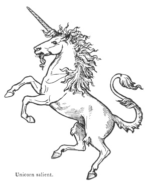
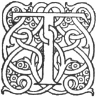
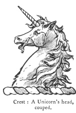

  
[Intangible Textual Heritage](../../index)  [Legendary
Creatures](../index)  [Symbolism](../../sym/index)  [Index](index) 
[Previous](fsca28)  [Next](fsca30) 

------------------------------------------------------------------------

[Buy this Book at
Amazon.com](https://www.amazon.com/exec/obidos/ASIN/B002D48Q8Y/internetsacredte)

------------------------------------------------------------------------

  
*Fictitious and Symbolic Creatures in Art*, by John Vinycomb, \[1909\],
at Intangible Textual Heritage

------------------------------------------------------------------------

p. 124 p. 125

# Other Chimerical Creatures and Heraldic Beasts

p. 126 p. 127

 

Unicorn salient. [\*](#fn_10)

### The Unicorn

"*Yon lion placed two unicorns between  
 That rampant with a silver sword is seen  
 Is for the king of Scotland's banner known*."  
                        Ariosto (Hoole's
translation).

"*The lion and the unicorn fighting for the crown*."  
                                      Old Nursery Rhyme.

|                    |
|--------------------|
|  |

THE unicorn is represented by heraldic usage as having the head and body
of a horse, with the tail of a lion, and the limbs and hoofs of a stag;
a twisted horn grows out from the centre of its forehead. It is rarely

p. 128

met with as a coat-of-arms. As a crest or supporter it is of more
frequent occurrence. A unicorn's head is a favourite bearing, either
*erased*, or *couped*, at the shoulder, and always represented in
profile.

The unicorn was a famous device all over Europe, and symbolised

|                                                    |
|----------------------------------------------------|
|  |

the virtue of the mind and the strength of the body. It is well known as
a supporter of the Royal Arms of England, a position it has occupied
since the accession of James VI. of Scotland to the English throne as
James I. *Two silver unicorns* were the supporters to the arms of that
kingdom. On the legislative union with England, the *red dragon of
Wales*, introduced by Henry VII., gave place to the unicorn as the
sinister supporter.

James III. of Scotland had it figured on coins which were thence called
"unicorns." James V. first used it with the national arms as supporters.
Although the silver unicorn came into England with James I., Queen Jane
Seymour had already adopted it.

"*Unicorn*" was the pursuivant of Lord Lyon King-at-Arms, the Royal
Scottish Herald.

As a supporter to the Royal arms it is thus blazoned: *A unicorn argent,
armed, unguled, crined and gorged or, with a royal coronet* (*i.e.*,
composed of crosses patée and fleurs-de -lis), *having a chain* 

p. 129

*affixed thereto, and reflexed over his back of the last*. The term
"*armed*" has reference to his horn, "*unguled*" to his hoofs, and
"*crined*" to his flowing mane. "*Gorged*" implies that the coronet
encircles his "gorge" or throat. The term "*or*" (that is, the metal
gold or the tincture of it) being only mentioned after the several parts
implies that they are all alike to be gold. "*Of the last*" means of the
last colour mentioned.

In "The History of Caricature and Grotesque in Literature and Art," by
Thomas Wright, M.A., F.S.A. (p. 8), appears a curious illustration from
an Egyptian papyrus of the Roman period, in the British Museum. It
represents a lion and a unicorn playing a game resembling draughts,
perhaps the earliest instance of the two animals depicted in
conjunction. As the author says: "The lion has evidently gained the
victory and is fingering the money; his bold air of swaggering
superiority as well as the look of surprise and disappointment of his
vanquished opponent are by no means ill-pictured."

The animosity which existed between the lion and unicorn is referred to
by Spenser, and is allegorical of the animosity which once existed
between England and Scotland:

"Like as a lyon whose imperiall powre  
 A proud rebellious unicorne defyes."  
                         *Faerie Queen*, ii. 5.

------------------------------------------------------------------------

### Footnotes

[127:\*](fsca29.htm#fr_10) But for an oversight
in the drawing, the unicorn should have been represented with the
divided hoofs of a stag.

------------------------------------------------------------------------

[Next: Mediaeval Conception of the Unicorn](fsca30)
