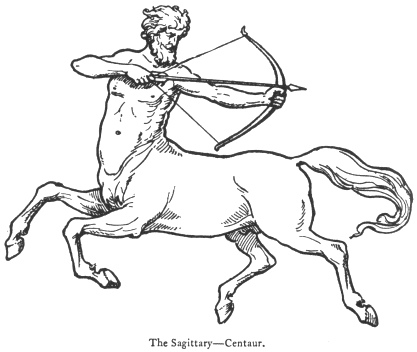
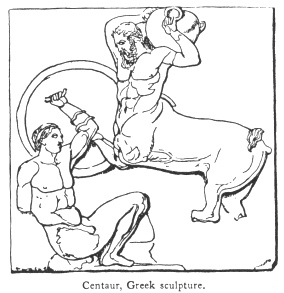

  
[Intangible Textual Heritage](../../index)  [Legendary
Creatures](../index)  [Symbolism](../../sym/index)  [Index](index) 
[Previous](fsca32)  [Next](fsca34) 

------------------------------------------------------------------------

[Buy this Book at
Amazon.com](https://www.amazon.com/exec/obidos/ASIN/B002D48Q8Y/internetsacredte)

------------------------------------------------------------------------

  
*Fictitious and Symbolic Creatures in Art*, by John Vinycomb, \[1909\],
at Intangible Textual Heritage

------------------------------------------------------------------------

### Sagittary, Centaur, Sagittarius, Centaurus, Hippocentaur

". . . *the dreadful sagittary  
  Appals our numbers*."  
     "Troilus and Cressida," Act v. sc. 5.

"*Feasts that Thessalian centaurs never knew*."  
                                 Thomson,
"Autumn."

Under these names is blazoned a fabled
monster of classic origin, half man, half horse, holding an arrow upon a
bended bow. It is one of the twelve signs of the Zodiac, commonly called
Sagittarius, otherwise Arcitenens, and marked by the hieroglyph ♐. In
its signification in arms it may properly be applied to those who are
eminent in the field.

The arms traditionally assigned to King Stephen

p. 142

are thus described by Nicholas Upton: "*Scutum rubeum, in quo habuit
trium leonum peditantium corpora, usque ad collum cum corporibus humanis
superius, aa modum signi Sagittarii, de auro*," In this, as in some

 

other early examples, it is represented as half man, half lion.

The arms of Stephen are sometimes represented with but one sagittary,
and is said to have been assumed by him in consequence of his having
commenced his reign under the sign of Sagittarius. Others say because he
gained a battle by the aid of his archers on entering the kingdom.
Others, again,

p. 143

say that the City of Blois used the ensign of a sagittary as an emblem
of the chase; and Stephen, son of the Compte de Blois, assumed that
ensign in his contest with the Empress Maude or Matilda. There is no
contemporary authority, however, it must be confessed, for any of these
derivations. A sagittary is seen upon the seal of William de Mandeville
(*temp*. Henry III.), but not as an heraldic bearing.

The crest of Lambart, Earl of Cavan, is: *On a mount vert, a centaur
proper, drawing his bow gules, arrow or*. It also appears as the crest
of Askelom, Bendlowes, Cromie, Cruell, Lambert, Petty,
Petty-Fitzmaurice.

The term *Centaur* is most probably derived from the words κεντέω (to
hunt, or to pursue) and ταῦρος (a bull), the Thracians and Thessalians
having been celebrated from the earliest times for their skill and
daring in hunting wild bulls, which they pursued mounted on the noble
horses of those districts, which were a celebrated breed even in the
later times of the Roman Empire. A centaur carrying a female appears on
a coin of Lete, which, according to Pliny and Ptolemy, was situated on
the confines of Macedonia, and the fables of the centaurs, &c., in that
and neighbouring districts abounding in a noble breed of horses, arose
no doubt from the feats performed by those who first subjugated the
horse to the will of man, and who mounted on one of these beautiful
animals and guiding it at will, to approach or retreat

p. 144

with surprising rapidity, gave rise in the minds of the vulgar to the
idea that the man and the horse were one being.

Sir John de Mandeville in his travels (printed by Wynken de Worde,
1499), tells us that in Bacharie

|                                                       |
|-------------------------------------------------------|
|  |

"ben many Ipotanes that dwellen sometime in the water and sometime on
the land; and thei ben half men and half hors and thei eten men when
thei may take him."

We have in modern history a singular and interesting example of a
similar superstition. When the natives of South America—where the horse
was unknown—first saw their invaders, the Spaniards, mounted on these
animals and in complete armour, they imagined that the cavalier and
steed formed but one being of supernatural powers and endowments.

Such groups as those exhibited on the rude money of Lete and other
places were doubtless the first steps toward the treatment of similar
subjects by Phidias, the celebrated Greek sculptor, whose works
illustrating the battle of the Lapithæ and the Centaurs adorned the
metopes of the Parthenon at Athens, to which they also bear a striking
affinity in the simplicity of their conception.

A curious example of the compounded human and

p. 145

animal forms similar to the sagittary is represented upon a necklace
found in the Isle of Rhodes, and now in the Musée Cluny, Paris. It is
formed of a series of thin gold plates whereon is represented in relief
the complete human figure conjoined to the hinder part of a stag (or
horse). This is alternated

 

with another compound figure, human and bird, holding up two animals by
the tails, both subjects, each in their own way, suggestive of the fleet
and dexterous hunter.

In Homer's account the centaurs are obviously no monsters, but an old
Thessalian mountain tribe, of great strength and savage ferocity. They
are merely said to have inhabited the mountain districts of Thessaly,
and to have been driven thence by the

p. 146

\[paragraph continues\] Lapithæ into the
higher mountains of Pindus. Their contest with the Lapithæ is generally
conceived as a symbol of the struggle of Greek civilisation with the
still existing barbarism of the Early Pelasgian period. This may be the
reason why Greek art in its prime directed itself so especially to this
subject.

 

The origin of this contest is referred to the marriage feast of
Pirithous and Hippodamia, to which the principal centaurs were invited.
The centaur Eurytion, heated with wine, attempted to carry off the
bride. This gave rise to a struggle for supremacy which, after dreadful
losses on both sides, ended in the complete defeat of the centaurs, who
were driven out of the country. The custom of depicting the centaurs as
half man, half horse arose in later times,

p. 147

and became a favourite subject of the Greek poets and artists.

Amongst the centaurs, Chiron, who was famous alike for his wisdom and
his knowledge of medicine, deserves mention as the preceptor of many of
the heroes of antiquity. Homer, who knew nothing of the equine shape of
the centaurs, represents him as the most upright of the centaurs, makes
him the friend of Achilles, whom he instructed in music, medicine and
hunting. He was also the friend of Heracles, who, by an unlucky
accident, wounded him with a poisoned arrow. The wound being incurable,
he voluntarily chose to die in the place of Prometheus. Jupiter placed
him among the stars, where he is called Sagittarius.

*Bucentaur*, from Greek βοῦς (bous) an ox, and κένταυρος (kentauros) a
centaur, was, in classic mythology, a monster of double shape, half man,
half ox. The state barge of the Doge of Venice was so termed.

The *Minotaur* slain by Theseus had the body of a man and the head of a
bull.

------------------------------------------------------------------------

[Next: The Griffin](fsca34)
