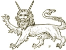

  
[Intangible Textual Heritage](../../index)  [Legendary
Creatures](../index)  [Symbolism](../../sym/index)  [Index](index) 
[Previous](fsca36)  [Next](fsca38) 

------------------------------------------------------------------------

[Buy this Book at
Amazon.com](https://www.amazon.com/exec/obidos/ASIN/B002D48Q8Y/internetsacredte)

------------------------------------------------------------------------

  
*Fictitious and Symbolic Creatures in Art*, by John Vinycomb, \[1909\],
at Intangible Textual Heritage

------------------------------------------------------------------------

 

### The Opinicus, or Epimacus

This creature appears to be a variety of
the griffin family. Authorities blazon it as having its body and four
legs like those of a lion; the head and neck and wings like an eagle,
and the short tail of a camel, sometimes borne sans wings.

Such a monster with wings endorsed or, was the crest of the *Barber
Surgeons of London*.

*Two opinici vert, purfled or, beaked sable, wings gules*, support the
insignia of the *Plasterers’ Company*.

------------------------------------------------------------------------

[Next: The Sphynx](fsca38)
