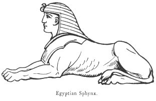
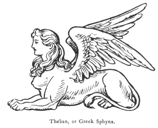

  
[Intangible Textual Heritage](../../index)  [Legendary
Creatures](../index)  [Symbolism](../../sym/index)  [Index](index) 
[Previous](fsca37)  [Next](fsca39) 

------------------------------------------------------------------------

[Buy this Book at
Amazon.com](https://www.amazon.com/exec/obidos/ASIN/B002D48Q8Y/internetsacredte)

------------------------------------------------------------------------

  
*Fictitious and Symbolic Creatures in Art*, by John Vinycomb, \[1909\],
at Intangible Textual Heritage

------------------------------------------------------------------------

p. 163

 

### The Sphynx

"That monster whom the Theban knight  
 Made kill herself for very heart's despite  
 That he had read her riddle, which no wight  
 Could ever loose, but suffered deadly doole."  
                 Spenser's "Faerie
Queen," Bk. v. cxi.

According to some heraldic writers, the
sphynx should possess the head and bust of a woman, the paws of a lion,
the body of a dog, and the tail of a dragon. In Lord Chancellor Bacon's
book on "The Wisdom of the Ancients," there is an exposition of the
meaning of the sphynx, which, says Dr. Woodward, is as curious as the
creature itself.

It frequently figures in heraldry as a convenient hieroglyph to
commemorate some service in Egypt. It is the crest of British families
of *Asgill*, Baronets

p. 164

\[paragraph continues\] *Lambert*,
*Goatley*, &c., and appears in the arms of *Sir John Moore*, the hero of
Corunna.

The strange combination of human and animal features in the figure known
as the sphynx is of

 

frequent occurrence in both Greek and Egyptian mythology and art. The
Egyptian [sphynx](errata.htm#4) is supposed to represent the combination
of physical power, or the kings, as incarnations of such attributes.
They are also associated with the special forms and attributes of the
great Egyptian deities Osiris and Ammon, Neph or Jupiter, and Phreh or
Helios. That is, we have the *man-sphynx*, the *ram-sphynx*, and the
*hawk-sphynx*, or the lion's body with the head of the man, the ram, or
the hawk, according to the deity worshipped. The sphynx itself was
probably a religious symbol of the Egyptians, which was transferred

p. 165

to Greece, and subsequently underwent a change of meaning. Among the
Egyptians the sphynx seems to have been a symbol of Royal dignity
betokening a combination of wisdom and strength. By the Greeks, however,
it appears to have been regarded as the symbol of the burning
pestilence-breeding heat of the summer sun. The form of the Theban
sphynx was that of a lion, generally in a recumbent position, with the
breast and upper part of a beautiful woman, and was in imitation of the
original male sphynxes of Egypt. Greek Art was only acquainted with the
sphynx in its female form, and also departed from the Egyptian type by
adding wings to the lion's body.

"There is a great difference," says Sir Gardiner Wilkinson in his
account of the sphynx, [\*](#fn_17) between the
Greek and Egyptian sphynxes. The latter is human-headed, ram-headed, or
hawk-headed, and is always male; while the Greek is female, with the
head of a woman, and always has wings, which the Egyptian never has."

In the Greek story the monster was sent by Hera (Juno) to devastate the
land of Thebes. Seated on a rock close to the town, she put to every one
that passed by the riddle, "What walks on four legs in the morning, on
two legs at noon, and on three legs in the evening?" Whoever was unable
to solve the riddle was cast by the sphynx from the rock into a deep
abyss. Œdipus succeeded in answering

p. 166

it, and thus delivered the country from the monster, who cast herself
into the abyss.

The sphynx occurs upon a coin of Chios (B.C. 478–412). It is represented
seated before an amphore, above which is a bunch of grapes. Chios was
famed for its wine, and the sphynx was a symbol of Dionysius. [\*](#fn_18)

The Emperor Augustus, on his seal, used the device of the sphynx—"maid's
face, bird's wings, and lion's paws"—"implying," says Mrs. Bury Palliser
("Historical Devices," &c.), "that the secret intentions of a prince
should not be divulged. When Augustus was in Asia, he authorised Agrippa
and Mecænas, who administered affairs during his absence, to open and
read the letters he addressed to the Senate before any one else; and for
this purpose he gave them a seal upon which was engraved a sphynx, the
emblem of secrecy. The device gave occasion to ridicule, and to the
saying that it was not surprising if the sphynx proposed riddles; upon
which Augustus discontinued it, and adopted one with Alexander the
Great, to show that his ideas of dominion were not inferior to
Alexander's. Subsequently Augustus used his own effigy, which practice
was continued by his successors."

Maurice ("Oriental Trinities," p. 315) says the sphynx was the Egyptian
symbol of profound theological mystery, and was therefore placed on
either side of the *dromoi*, or paths leading to the temples

p. 167

of the gods. "They are black," he says, "in allusion to the obscure
nature of the deity and his attributes. The white head-dress may allude
to the linen tiaras wrapped round the heads of the priests." The origin
of the myth was not definitely known even to the ancients. Some early
writers say it was symbolical of the overflowing of the Nile, which
happened when the sun was in the signs of Leo and Virgo; and that it had
its name from this circumstance. "For," they say, "the word sphynx in
the Chaldæan language signifies overflowing." The fact of the Egyptian
sphynx being always male does not, however, accord with this derivation.

A statue of the Theban sphynx found in Colchester, and now in the museum
of that town, gives the Greek conception of that creature. It is carved
in oolite, twenty-five inches high, evidently a relic of the Roman
occupation of Britain. It represents the monster seated over the mangled
remains of one of its victims. Llewellin Jewett, in the *Art Journal*
1871, p. 113, describes it as "combining the five-fold attributes of a
virgin, a lion, a bird, a dog, and a serpent. The head, breast and arms
are those of a beautiful virgin; the body and teats of a female dog;
hinder parts, hind legs and fore paws are those of a lioness; the tail
doubled in short folds is serpent, and the wings those of a bird."

The same writer says: "The sphynx appears on the reverses of some coins
of Cunobeline (Cymbeline,

p. 168

of Shakespeare), struck in the city of Camalodunum (Colchester).

The gigantic statue of the sphynx half buried in the sand near the Great
Pyramids, at Gizeh, is hewn and sculptured out of a spur of solid rock,
to which masonry was added in places to complete the form. The actual
age of the great sphynx is not known, but it is supposed to have been
commenced under Cheops and finished by order of King Chefren, under
whose reign also was probably built the second great pyramid. The able
author of "Eothen" thus describes the appearance of the sphynx of Egypt,
and the sentiments to which its contemplation gave rise in his mind:
"And near the Pyramids, more numerous and more awful than all else in
the land of Egypt, there rests the lonely sphynx. Comely the creature
is, but the comeliness is not of this world. The once worshipped beast
is a deformity and a monster to this generation, and yet you can see
that these lips, so thick and heavy, were fashioned according to some
ancient mould of beauty—some mould of beauty now forgotten—forgotten
because that Greece drew forth Cytheræa from the flashing bosom of the
Ægean, and in her image created new forms of beauty, and made it a law
among men that the short and proudly wreathed lips should stand for the
sign and main condition of loveliness through all generations to come!
Yet there still lives on the race of those who were beautiful in the
fashion of the elder world; and

p. 169

\[paragraph continues\] Christian girls of
Coptic blood will look on you with sad, curious gaze, and kiss your
charitable hand with the big pouting lips of the very sphynx. Laugh and
mock if you will at the worship of stone idols; but mark ye this, ye
breakers of images, that in one regard the stone idol bears awful
semblance of deity—unchangefulness in the midst of change—the same
seeming will and intent for ever inexorable! Upon ancient dynasties of
Ethiopian and Egyptian kings—upon Greek and Roman, upon Arab and Ottoman
conquerors—upon Napoleon dreaming of an Eastern empire—upon battle and
pestilence—upon the ceaseless misery of the Egyptian race—upon keen-eyed
travellers—Herodotus yesterday and Warburton to-day—upon all, and more,
this unworldly sphynx has watched, and watched like a Providence, with
the same earnest eyes and the same sad, tranquil mien. And we shall die,
and Islam shall wither away; and the Englishman, straining far over to
hold his loved India, will plant a firm foot on the banks of the Nile,
and sit on the seats of the faithful; and still that sleepless rock will
lie watching and earnest the work of the new busy race with those same
sad eyes and the same tranquil mien everlasting. You dare not mock at
the sphynx." The conclusion of this rhapsody at the present time sounds
almost like a half-fulfilled prophecy.

The sphynx is the special device of several British regiments which
landed in Egypt, in the Bay of Aboukir, in the face of the French Army;
and borne

p. 170

as a memento of the battle of Alexandria, when General Sir Ralph
Abercrombie fell in the moment of victory. It also appears upon the war
medals of the English occupation of Egypt, resulting in the battle of
Tel-el-Kebir, 1882, and subsequent victories. In heraldry the sphynx is
usually couchant; it is, however, borne in other positions, sometimes
winged, and when so borne the wings are always endorsed, *i.e.*, back to
back.

*A sphynx passant, wings endorsed argent crined or*, is the crest of
Asgill (Bart. 1701).

 

------------------------------------------------------------------------

### Footnotes

[165:\*](fsca38.htm#fr_17) "Manners and Customs
of the Ancient Egyptians."

[166:\*](fsca38.htm#fr_18) W. Noel Humphry's
"Coin Collector's Manual."

------------------------------------------------------------------------

[Next: The Phœnix Bird of the Sun](fsca39)
