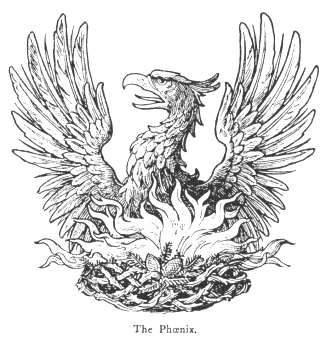

  
[Intangible Textual Heritage](../../index)  [Legendary
Creatures](../index)  [Symbolism](../../sym/index)  [Index](index) 
[Previous](fsca38)  [Next](fsca40) 

------------------------------------------------------------------------

[Buy this Book at
Amazon.com](https://www.amazon.com/exec/obidos/ASIN/B002D48Q8Y/internetsacredte)

------------------------------------------------------------------------

  
*Fictitious and Symbolic Creatures in Art*, by John Vinycomb, \[1909\],
at Intangible Textual Heritage

------------------------------------------------------------------------

p. 171

 

### The Phœnix Bird of the Sun

"*Rara avis in terris*."

An imaginary bird, described by ancient
writers as in form like an eagle, but more beautiful in its plumage.
Among the ancient classical writers it was an emblem of those existing
in paradise, enjoying eternal youth and never-ending pleasure. Tacitus
[describes](errata.htm#5) the phœnix as a singular bird, consecrated to
the sun, and distinguished by its rich appearance and variegated
colours. Herodotus naïvely says: "I

p. 172

never saw one, indeed, but in a picture, but if he is like his picture
his plumage is partly golden and partly red." Philippe de Thaun says:
"The phœnix lives five hundred years and a little more, when it will
become young again and leave its old age." It was said to be sometimes
seen in Egypt, and only one was believed to exist at a time. When it is
advanced in age and its time of change is at hand, it hides itself away
somewhere in Arabia, and makes itself a nest of the rarest spices,
which, by the heat of the sun or other secret agency, and the fanning of
the sacred bird's own wings, soon rises into flames and consumes it. Out
of its ashes rises another with new life and vigour to pursue the same
never-ending life and re-birth.

*Fum* or *Fung* (the phœnix) is one of the four symbolical animals
supposed to preside over the destinies of the Chinese Empire; the sacred
*Ho-ho* or phœnix also figures with the dragon largely in Japanese
mythology, and bears a striking analogy to the bird of classic fame. It
is fabled to have a miraculous existence, and is sent on earth for the
performance of extraordinary works in the manifestation of the Divinity
and in the development of humanity and nature. It appears at different
stages of the world's progress and in successive ages; after the
accomplishment of which it reascends to heaven to come down again at the
commencement of a new era.

From the pagans the Early Christians adopted the

p. 173

symbol, and with them its significance had reference to the resurrection
and immortality. Like the pelican "in her piety," it was peculiarly an
emblem of our Saviour in His resurrection. As the phœnix when old and
wearied seeks the rays of the sun to consume its body, again to be
revived in life and vigour, so the Christian, worn and exhausted by
worldly labour and suffering, turns to the Son of Righteousness for
regeneration and newness of life. Tertullian makes the phœnix an image
of the resurrection.

In corroboration of this it must be borne in mind that Jesus Christ, who
died A.D. 34, is termed *the phœnix* by monastic writers.

The Phœnix period or cycle is said to consist of 300 years. "The bird of
wonder" is said to have appeared in Egypt five times:

1\. In the reign of Sesostris, B.C. 866.

2\. In the reign of Amasis, B.C. 566.

3\. In the reign of Ptolemy Philadelphus, B.C. 266.

4\. In the reign of Tiberius, 34 A.D.

5\. In the reign of Constantine, 334 A.D.

Tacitus in the "*Annales*," vi. 28, mentions the first three of these
appearances.

The Phœnix-tree is the palm. In Greek φοίνιξ (*phoinix*) means both
phœnix and palm-tree. It is thus alluded to in Shakespeare:

"Now will I believe . . . that in Arabia  
 There is one tree, the phœnix throne—one phœnix  
 At this hour reigneth there."  
                  *The Tempest*, Act iii, sc. 3.

p. 174

Pliny [\*](#fn_19) gives minute particulars
concerning the natural history of this *rara avis in terris*. But the
ancient fable is most fully given by Ovid and translated by Dryden.
Ariosto, also, and many early writers refer to the wonderful creature
with fullest faith in its reality. It is no wonder then, that it became
a favourite emblem in an age when it was the fashion among persons of
distinction to have an impress or device with its accompanying legend or
motto. Many persons of historical importance employed the phœnix to
express in metaphor the idea they wished to convey regarding themselves.
Thus we find the phœnix in flames painted for the device of Jeanne
d’Arc, in the Gallery of the Palais Royal, with the motto: "Invito
funere vivat" ("Her death itself will make her live").

Vittoria Colonna (+ 1547) the beautiful and accomplished wife of the
Marquis of Pescara, used the device of a phœnix on her medal.

Mary Queen of Scots used the impress of her mother, Mary of Lorraine, a
phœnix in flames, and the motto: "En ma fin est mon commencement." A
phœnix in flames upon a castle was the badge of Queen Jane Seymour, the
crest of the Seymours being a phœnix in flames issuing from a ducal
coronet. Her son, Edward VI., added the motto, "Nascatur ut alter"
("That another may be born"), alluding to the nature of her death. She
lies buried in St. George's Chapel, Windsor, with a Latin

p. 175

epitaph by Bishop Godwin, which has been thus translated by his son
Morgan:

"Here a phœnix lieth, whose death  
 To another phœnix gave birth.  
 It is to be lamented much  
 The world at once ne'er knew two such."

Queen Elizabeth placed a phœnix upon her medals and tokens with her
favourite motto: "Semper eadem" ("Always the same"), and sometimes with
the motto "Sola phœnix omnis mundi" ("The sole phœnix of the whole
world"); and on the other side, "Et Angliæ gloria" ("And the glory of
England"), with her portrait full-faced. By the poets of the time,
Elizabeth was often compared to the phœnix. Sylvester, in his "Corona
Dedicatoria," says:

"As when the Arabian (only) bird doth burne  
 Her aged bodie in sweet flames to death,  
 Out of her cinders a new bird hath birth,  
 On whom the beauties of the first return;  
 From spicy ashes of the sacred urne  
 Of our dead phœnix (deare Elizabeth)  
 A new true phœnix lively flourisheth."

And Shakespeare, in the prophecy which he puts into the mouth of Cranmer
at the baptism of the Princess Elizabeth, her great and glorious reign
is foreshadowed, and finally:

                    ". . . as when  
 The bird of wonder dies, the maiden phœnix,  
 Her ashes new create another heir,  
 As great in admiration as herself."

p. 176

Shakespeare elsewhere uses the simile to denote a phœnix among women—a
phœnix, a paragon, unique, because alone of its kind:

"If she be furnished with a mind so rare,  
 She is alone the Arabian bird."  
                        *Cymbeline*, Act i. sc. 7.

Many other heraldic mottoes have been associated with this celebrated
device. The following are from "Historic Devices, Badges," &c., by Mrs.
Bury Palliser:

Eleanor, Queen of Francis I. of Austria: "Non est similis illi" ("There
is none like her"). She afterwards changed her motto, either showing how
much she was neglected, or to express her determination to remain
single: "Unica semper avis" ("Always a solitary bird").

Bona of Savoy: "Solo facta solum deum sequor."

Cardinal Trent: "Ut vivat" ("That it may live").

Linacre: "Vivat post funera virtus" ("Virtue survives death").

"De mi muerte ma vida" ("From my death my life").

"De mort à vie" ("From death to life").

"Et morte vitam protulit" ("And by death has prolonged his life").

"Ex morte, immortalitas" ("Out of death, immortality").

"Murio y nacio" ("I die and am born").

"Ne pereat" ("That it should not perish").

"O mors, ero mors tua" ("O death, I shall be thy death").

"Se necat ut vivat" ("Slays himself that he may live").

"Trouva sol nei tormenti it suo gioire ("It finds alone its joy in its
suffering").

p. 177

"Vivre pour mourir, mourir pour vivre" ("Live to die, die to live").

"Uror, morior, orior" ("I am burnt, I die, I arise").

The phœnix in heraldry is never represented in other than in one
position, *rising from flames*, that is, with expanded wings and
enveloped in flames of fire in which it is being consumed. It is usually
represented exactly as an eagle in shape, but may be of any of the
heraldic tinctures.

The phœnix is of frequent use in heraldry, and borne by many families in
the United Kingdom. A phœnix issuing from a ducal coronet is the crest
of the Duke of Somerset.

Linacre, founder of the College of Physicians, and honorary physician to
four sovereigns has on his tomb in Westminster Abbey the device of the
phœnix, with the motto, "Vivat post funera virtus" ("Virtue survives
death").

From the association of this fabulous bird with alchemy, Paracelsus
wrote concerning it, and several alchemists employed it to symbolise
their vocation. It was adopted by the Apothecaries’ Company as crest,
and is a frequent sign over chemists’ shops.

*A phœnix in flames proper, gorged with a mural coronet*, is the
allusive crest of the Fenwicks; the motto over the crest is the *cri de
guerre*, "A Fenwick! a Fenwick!" They were a family noted in border
warfare. "The house of Percy," says Mrs. Bury Palliser, "ever ranked the
Fenwicks among the most valiant of its retainers, and in border warfare
the

p. 178

banner of the gorged phœnix in the burning flame always appeared with
that of the silver crescent of the Percys."

The bird of paradise is interesting as having for a time been accepted
as the veritable phœnix, a fact which has escaped Gibbon. That luxurious
Emperor, Heliogabalus, having eaten, as he thought, of every known
delicacy, bethought him one day of the fabled phœnix. What mattered it
that only one bird existed at a time; *that one*, the imperial gourmand
must have, and was inconsolable that he had not thought of it before.
The zeal of proconsuls was equal to the great occasion, and from all
parts of the earth came strange and wondrous birds, each affirmed with
confidence to be "the sacred solitary bird, that knows no second, knows
no third." The cankerworm of doubt remains! At last, one day there was
brought to Rome from the far islands of the Eastern seas a bird, the
like of which for the glory of its plumage had never been seen out of
paradise, the veritable phœnix, Bird of the Sun!" The sight of the
magnificent creature carried conviction with it. Heliogabalus ate in
faith, and went to his fathers contented.

------------------------------------------------------------------------

### Footnotes

[174:\*](fsca39.htm#fr_19) Book x. ch. 2.

------------------------------------------------------------------------

[Next: The Harpy](fsca40)
