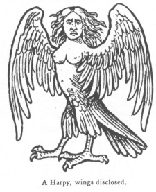
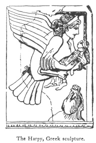
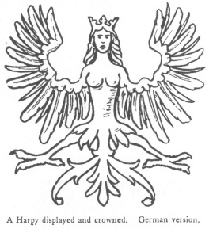

  
[Intangible Textual Heritage](../../index)  [Legendary
Creatures](../index)  [Symbolism](../../sym/index)  [Index](index) 
[Previous](fsca39)  [Next](fsca41) 

------------------------------------------------------------------------

[Buy this Book at
Amazon.com](https://www.amazon.com/exec/obidos/ASIN/B002D48Q8Y/internetsacredte)

------------------------------------------------------------------------

  
*Fictitious and Symbolic Creatures in Art*, by John Vinycomb, \[1909\],
at Intangible Textual Heritage

------------------------------------------------------------------------

p. 179

 

### The Harpy

"*Of monsters all, most monstrous this; no greater wrath  
 God sends ’mongst men; it cones from depth of pitchy hell:  
 And virgin's face, but womb like gulf unsatiate hath,  
 Her hands are griping claws, her colour pale and fell*."  
                                                        Virgil.

"*Thou art like the harpy,  
 Which to betray, doth wear an angel's face,  
 Seize with an eagle's talons*."  
             "Pericles Prince of Tyre," Act iv. sc. 4.

A poetical monstrosity of classical
origin, described as "winged creatures having the head and breasts of a
woman, and the body and limbs of a vulture; very fierce and loathsome,
living in an atmosphere of filth and stench, and contaminating anything
which they

p. 180

come near. Pale and emaciated, they were continually tormented with
insatiable hunger." They are

|                                               |
|-----------------------------------------------|
|  |

best known from the story of the Argonauts, where they appear as the
tormentors of the blind king Phineus, whose table they robbed of its
viands, which they either devoured or spoiled. They were regarded by the
ancients as ministers of sudden death.

In Miss Millington's admirable book, "Heraldry in History, Poetry and
Romance," it is stated that unlike the generality of such mythical
beings, the harpies appear originally, as in Homer's "Odyssey," as
persons instead of personations; while later authors for the most part
reduced them to whirlwinds and whirlpools. Homer mentions but one harpy.
Hesiod gives two, later writers three. The names indicate that these
monsters were impersonations of whirlwinds and storms. The names were:
*Ocypeta* (rapid), *Celeno* (blackness), *Aello* (storm).

"I will . . . do any embassage . . . rather than  
 Hold three words’ conference with this harpy."  
                *Much Ado About Nothing*, Act ii. sc 1.

p. 181

"Bravely the figure of this harpy hast thou  
 Performed, my Ariel; a grace it had devouring."  
                             *Tempest*, Act iii. sc. 3.

|                                                                  |
|------------------------------------------------------------------|
|  |

*Azure, a harpy with her wings disclosed, her hair flotant, or, armed of
the same*. This coat existed in Huntingdon Church in Guillam's time.

The arms of the City of Nuremberg are: *azure, a harpy displayed armed,
crined and crowned, or*. It occurs as the city device as early as 1243.
In German heraldry it is termed *jungfraundler*.

|                                        |
|----------------------------------------|
|  |

A creature very similar to the harpy (a combination of several badges),
was one of the favourite devices of Richard III., viz., a falcon with
the head of a maiden holding the white rose of York.

------------------------------------------------------------------------

[Next: The Heraldic Pelican](fsca41)
