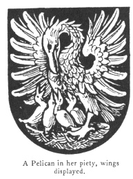
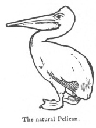

  
[Intangible Textual Heritage](../../index)  [Legendary
Creatures](../index)  [Symbolism](../../sym/index)  [Index](index) 
[Previous](fsca40)  [Next](fsca42) 

------------------------------------------------------------------------

[Buy this Book at
Amazon.com](https://www.amazon.com/exec/obidos/ASIN/B002D48Q8Y/internetsacredte)

------------------------------------------------------------------------

  
*Fictitious and Symbolic Creatures in Art*, by John Vinycomb, \[1909\],
at Intangible Textual Heritage

------------------------------------------------------------------------

p. 182

### The Heraldic Pelican

  "*Then sayd the pellycane  
   When my byrats be slayne  
With my bloude I them reuyue (revive)  
   Scrypture doth record,  
   The same dyd our Lord,  
And rose from deth to lyue*."  
                      Skelton, "Armory of
Birds."

The character ascribed to the pelican is
nearly as fabulous as that of the phœnix. From a clumsy,

|                                                            |
|------------------------------------------------------------|
|  |

gluttonous, piscivorous water-bird, it was by the growth of legends
transformed into a mystic emblem of Christ, whom Dante terms "Nostro
Pelicano." St. Hieronymus gives the story of the pelican restoring its
young ones destroyed by serpents as an illustration of the destruction
of man by the old Serpent, and his salvation by the blood of Christ.

The Pelican in Christian Art is an emblem of Jesus Christ, by "whose
blood we are healed." It is also a symbol of charity.

p. 183

The "Bestiarum" says that Physiologus tells us that the pelican is very
fond of its brood, but when the young ones begin to grow they rebel
against the male bird and provoke his anger, so that he kills them; the
mother returns to the nest in three days,

 

sits on the dead birds, pours tier blood over them, and they feed on the
blood.

Heralds usually represent this bird with wings endorsed and neck
embowed, wounding her breast with her beak. Very many early painters
mistakenly represented it similar to an eagle, and not as a natural
pelican, which has an enormous bag attached to the lower mandible, and
extending almost from the point of the bill to the throat. When in her
nest feeding her young with her blood, she is said to be in her piety.

The Romans called filial love piety, hence Virgil's

 

p. 184

hero is called the "pious Æneas," because he rescued his father from the
flames of Troy.

The myth that pelicans feed their young with their

 

blood arose from the following habit, on which the whole superstructure
of fable has been erected: They have a large bag attached to their
under-bill. When the parent bird is about to feed its brood, it

p. 185

macerates small fish in this bag or pouch; then, pressing the bag
against its breast, transfers the macerated food to the mouths of the
young ones.

The pelican in her piety is not an uncommon symbol upon monumental
brasses. That of William Prestwick, Dean of Hastings, in Warbleton
Church, Sussex, has it with the explanatory motto: "Sic Xtus dilexit
nos."

Examples.—*Gules, a pelican in her piety,
or*.—*Chauntrell*.

*Azure, three pelicans argent, vulning themselves proper*.—*Pelham*,
*Somerset*, &c.

A pelican's head erased, or otherwise detached from the body, must
always be drawn in the same position and vulning itself. It should
always be separated as low as the upper part of the breast.

It is said naturalists of old, observing that the pelican had a crimson
stain on the tip of its beak, reported that it was accustomed to feed
its young with the blood flowing from its breast, which it tore for the
purpose. In this belief the Early Christians adopted the pelican to
figure Christ, and set forth the redemption through His blood, which was
willingly shed for us His children.

Alphonso The Wise, King of Castile (+
1252). A pelican in its piety. Motto: "Pro lege et grege."

William of Nassau, founder of the
Republic of the United Provinces, one of the noblest characters of
modern history. He bore on some of his

p. 186

standards the pelican, and on others the motto: "Pro lege, grege et
rege."

Pope Clement IX. One of his devices was
the pelican in its piety. Motto: "Aliis non sibi

|                                        |
|----------------------------------------|
|  |

clemens" ("Tender-hearted to others, not himself").

Other mottoes for the pelican:

"Ut vitam habeant" ("That they may have life").

"Immemor ipse sui" ("Unmindful herself of herself").

"Mortuos vivificat" ("Makes the dead live").

"Nec sibi parcit" ("Nor spares herself").

------------------------------------------------------------------------

[Next: The Martlet](fsca42)
