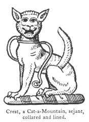

  
[Intangible Textual Heritage](../../index)  [Legendary
Creatures](../index)  [Symbolism](../../sym/index)  [Index](index) 
[Previous](fsca49)  [Next](fsca51) 

------------------------------------------------------------------------

[Buy this Book at
Amazon.com](https://www.amazon.com/exec/obidos/ASIN/B002D48Q8Y/internetsacredte)

------------------------------------------------------------------------

  
*Fictitious and Symbolic Creatures in Art*, by John Vinycomb, \[1909\],
at Intangible Textual Heritage

------------------------------------------------------------------------

p. 205

 

### Cat-a-Mountain—Tiger Cat or Wild Cat

The Clan Chattan, who gave their name to
the county of Caithness, bore as their cognisance the wild mountain cat,
and called their chieftain, the Earl of Sutherland, "Mohr an chat" (The
Great Wild Cat). The Mackintoshes still bear as their crests and
supporters these ferocious cats, with the appropriate warning as a
motto, "Touch not the cat but a glove."

The whole is a pun upon the word "Catti," the Teutonic settlers of
Caithness, *i.e.*, Catti-ness, and means "Touch not the Clan Cattan (or
mountain cat) without a glove." Here "but" is used in the

p. 206

original meaning, beout, *i.e.*, without. For another example of "but"
meaning without, see Amos iii. 7. The same words are also used as the
motto of several Scottish families.

None will forget how the cat-a-mountain showed her claws to the Clan
Kay, in the Wynds of Perth in Sir Walter Scott's "Fair Maid of Perth."

*The Heraldic Musion*.—Bossewell, in his work on

|                                                                        |
|------------------------------------------------------------------------|
|  |

heraldry published 1572, describes a musion as "a beaste that is enimie
to myse and rattes." He adds also that he is "slye and wittie, and seeth
so sharply, that he overcommeth darkness of the nighte by the shyninge
lighte of his eyne. In the shape of body, he is like unto a leoparde,
and hath a greate mouthe. He doth delighte that he enjoyeth his
libertie, and in his youthe he is swifte, plyante, and merrie. He maketh
a rufull noyse, and a gastefull when he proffereth to fighte with
another. He is a cruel beaste when he is wilde and falleth on his owne
feet from moste high places, and uneth (scarce) is hurte therewith. When
he hathe a fayre skinne, he is, as it were, prowde thereof, and then he
goeth fast aboute to be seene."

Childebert, King of France, in token of his having

p. 207

taken captive Gondomar of Bourgogne, assumed the device of a tiger-cat
or ounce behind a grating or troillis, gules cloué argent. This recalls
the famous scene between Sanglier Rouge and Toison d’Or in "Quentin
Durward," when Charles the Bold's jester professes to help the unhappy
envoy of De la Marck by describing it as a cat looking out of a dairy
window.

The cat, though domesticated, is considered as possessed of ingratitude;
in its friendship so uncertain and so vicious in its nature, "that," say
old writers, "it is only calculated for destroying the obnoxious race of
rats and other small game."

From the mediæval superstition that Satan's favourite form was a black
cat, it was superstitiously called "a familiar." Hence witches were said
to have a cat as their familiar.

The Cat: *A symbol of liberty*.—The Roman
goddess of Liberty was represented as holding a cup in one hand, a
broken sceptre in the other, and a cat lying at her feet. No animal is
so great an enemy to all constraint as a cat.

The cat was held in veneration by the Egyptians as sacred to the goddess
Bubastis. This deity is represented with a human body and a cat's head.
Diodorus tells us that whoever killed a cat, even by accident, was by
the Egyptians punished with death. According to Egyptian tradition,
Diana assumed the form of a cat, and thus excited the fury of the
giants. The *London Review* says: "The Egyptians worshipped

p. 208

the cat as a symbol of the moon, not only because it is more active
after sunset, but from the dilation and contraction of its orb,
symbolical of the waxing and waning of the night goddess."

In heraldry it should always be represented full-faced like the leopard.

*Erminois three cats-a-mountain passant gardant, in pale azure, each
charged on the body with an ermine spot or. Crest: a demi cat-a-mountain
gardant, azure, gorged with a collar gemel, and charged with ermine
spots, two and one*.—Tibbets.

The supporters of the Earl of Clanricarde are wild cats, and also those
of the Earl of Belmore. It is the crest of De Burgh.

"ÆNEAS.—His mantle was the lion's,  
   With all its tawny bars,  
 His falchion, like Orion's,  
   Was gemmed with golden stars.  
 Upon his lofty helmet  
   A brazen terror rode;  
 No sword could overwhelm it  
   When in the fight it glowed.  
 For like a wild cat brindled,  
   It spat with eyes on fire,  
 And in the battle kindled  
   Immortal rage and ire,  
 Now in the sunshine sleeping,  
   How gently it reposed;  
 But still in wisdom keeping  
   A single eye unclosed."  
                     *Queen Dido*, by T. S.

------------------------------------------------------------------------

[Next: The Salamander](fsca51)
