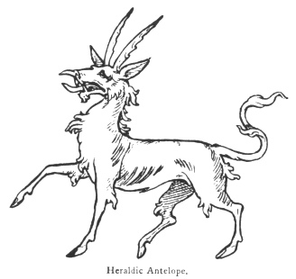

  
[Intangible Textual Heritage](../../index)  [Legendary
Creatures](../index)  [Symbolism](../../sym/index)  [Index](index) 
[Previous](fsca51)  [Next](fsca53) 

------------------------------------------------------------------------

[Buy this Book at
Amazon.com](https://www.amazon.com/exec/obidos/ASIN/B002D48Q8Y/internetsacredte)

------------------------------------------------------------------------

  
*Fictitious and Symbolic Creatures in Art*, by John Vinycomb, \[1909\],
at Intangible Textual Heritage

------------------------------------------------------------------------

### Heraldic Antelope

This fictitious animal, when depicted in
heraldry, has a body like that of a stag, the tail of a unicorn, a head
like the heraldic tiger, with two serrated horns, and a tusk growing
from the tip of his nose, a row of tufts down the back of his neck, and
the like on his tail, chest and thighs. Thus represented it is termed an
heraldic antelope to distinguish it from the real or natural antelope,
which is also borne in modern coats of arms.

The old heralds, with their scant knowledge of

p. 214

the rarer kinds of foreign animals, represented the antelope as a fierce
beast of prey, and totally unlike in appearance and in disposition to
the beautiful small-limbed gentle creature with which we are acquainted.
That such was the prevailing opinion

 

in the time of Spenser is evident. In the "Faerie Queen" he makes the
stout Sir Satyrane—

                      "In life and manners wild,  
Amongst wild beasts and woods from laws of man exiled."

\[paragraph continues\] —more than a match
for the most ferocious brutes, all of whom he subdues:

"Wild beasts in iron yokes he would compel;  
 The spotted panther, and the tuskéd boar;

p. 215

\[paragraph
continues\]  The pardale swift, and the tiger cruel,  
 The *antelope* and wolf, both fierce and fell;  
 And them constrain in equal team to draw."

Some authorities give the heraldic antelope with two straight horns, but
as the ancient badge of the House of Lancaster it was represented with
two serrated horns curving backward.

In blazon, the term "*heraldic antelope*" should always be used unless
the natural antelope is intended.

------------------------------------------------------------------------

[Next: Heraldic Ibex](fsca53)
