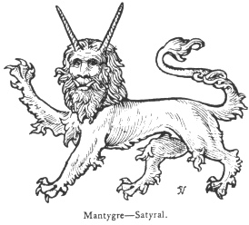
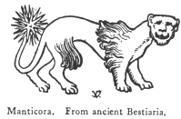

  
[Intangible Textual Heritage](../../index)  [Legendary
Creatures](../index)  [Symbolism](../../sym/index)  [Index](index) 
[Previous](fsca57)  [Next](fsca59) 

------------------------------------------------------------------------

[Buy this Book at
Amazon.com](https://www.amazon.com/exec/obidos/ASIN/B002D48Q8Y/internetsacredte)

------------------------------------------------------------------------

  
*Fictitious and Symbolic Creatures in Art*, by John Vinycomb, \[1909\],
at Intangible Textual Heritage

------------------------------------------------------------------------

p. 218

 

### Mantiger, Montegre or Manticora Satyral

A chimerical creature of mediæval
invention, having the body of an heraldic tiger with mane, and the head
of an old man with long spiral horns. Some heraldic authorities make the
horns more like those of an ox, and the feet like a dragon's.

*The Satyral* is apparently identical with the man-tiger.

The belief that certain persons have the power of assuming the shape of
the tiger is common in India, and the Khonds say that a man-killing
tiger is either an incarnation of the Earth's goddess or a transfigured
man. It is thus with the Lavas of Birma, supposed

p. 219

to be the broken-down remains of a cultured race and dreaded as
man-tigers. [\*](#fn_26)

Two satyrals supported the arms of the Lords Stawell.

The supporters of the arms of the Earl of Huntingdon are mantigers, but
are represented without horns.

From a mediæval "Bestiaria" we have a description and illustration of a
gruesome creature of this name (manticora), evolved no doubt from some
traveller's marvellous tale. We are

|                    |
|--------------------|
|  |

told that it is "bred among the Indians," has a triple row of teeth, in
bigness and roughness like a lion's, face and ears like a man's, a tail
like a scorpion's "with a sting and sharp-pointed quills," and that "his
voice is like a small trumpet," and that he is "very wild," and that
after having his tail bruised, he can be tamed without danger.

There are several other fictitious creatures, which, if we may believe
certain old writers, excited the minds of our credulous wonder-loving
forefathers. Of these little need be said, as they rarely, if ever,
appear in modern works on heraldry, and may therefore be classed as
extinct monsters.

------------------------------------------------------------------------

### Footnotes

[219:\*](fsca58.htm#fr_26) Tylor's "Primitive
Culture."

------------------------------------------------------------------------

[Next: Lamia or Emipusa](fsca59)
