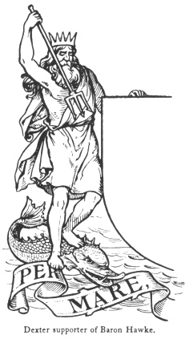

  
[Intangible Textual Heritage](../../index)  [Legendary
Creatures](../index)  [Symbolism](../../sym/index)  [Index](index) 
[Previous](fsca63)  [Next](fsca65) 

------------------------------------------------------------------------

[Buy this Book at
Amazon.com](https://www.amazon.com/exec/obidos/ASIN/B002D48Q8Y/internetsacredte)

------------------------------------------------------------------------

  
*Fictitious and Symbolic Creatures in Art*, by John Vinycomb, \[1909\],
at Intangible Textual Heritage

------------------------------------------------------------------------

p. 237

### Poseidon or Neptune

Poseidon or Neptune, the younger brother
of Zeus (Jupiter), sometimes appears in heraldry, usually as a
supporter. In the ancient

|                                                    |
|----------------------------------------------------|
|  |

mythology he was originally a mere symbol of the watery element, he
afterwards became a distinct personality; the mighty ruler of the sea
who with his powerful arms upholds and circumscribes the earth, violent
and impetuous like the element he represents. When he strikes the sea
with his trident, the symbol of his sovereignty, the waves rise with
violence, as a word or look from him suffices to allay the fiercest
tempest. Poseidon (Neptune) was naturally regarded as the chief patron
and tutelary deity of the seafaring Greeks. To him they addressed their
prayers before entering on a voyage, and to him they

p. 238

brought their offerings in gratitude for their safe return from the
perils of the deep.

In a famous episode of the "Faerie Queen" (Book iv. c. xi.) Spenser
glowingly pictures the procession of all the water deities and their
attendants:

"First came great Neptune with his three-forked mace,  
 That rules the seas and makes them rise and fall;  
 His dewy locks did drop with brine apace  
 Under his diadem imperial:

"And by his side his Queen with coronal,  
 Fair Amphitrite, most divinely fair,  
 Whose ivory shoulders weren covered all,  
 As with a robe, with her own silver hair,  
 And decked with pearls which the Indian seas for her prepare."

Amphitrite, his wife, one of the Nereids in ancient art, is represented
as a slim and beautiful young woman, her hair falling loosely about her
shoulders, and distinguished from all the other deities by the royal
insignia. On ancient coins and gems she appears enthroned on the back of
a mighty triton, or riding on a sea-horse, or dolphin.

Examples.—Baron Hawke bears for
supporters to his shield an aggroupment of classic personations of a
remarkable symbolic character, granted for the achievements of the
renowned Admiral and Commander-in-Chief of the Fleet, Vice-Admiral of
Great Britain, &c. &c., created Baron Hawke of Tarton, Yorks, 1776. *The
dexter supporter is a figure of* 

p. 239

\[paragraph continues\] *Neptune, his
mantle vert, edged argent, crowned with an eastern crown, or, his dexter
arm erect and holding a trident pointing downwards in the act of
striking, sable, headea silver, and resting his left foot on a dolphin
proper*.

Sir Isaac Heard, Somersetshire; Lancaster Herald, afterwards Garter. His
arms, granted 1762, are thus blazoned in Burke's "General Armory"
*Argent a Neptune crowned with an eastern crown of gold, his trident
sable headed or, issuing from a stormy ocean, the sinister hand grasping
the head of a ship's mast appearing above the waves, as part of a wreck,
all proper; on a chief azure, the Arctic pole-star of the first between
two water-bougets of the second*.

------------------------------------------------------------------------

[Next: Merman or Triton](fsca65)
