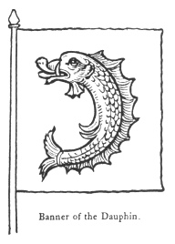

  
[Intangible Textual Heritage](../../index)  [Legendary
Creatures](../index)  [Symbolism](../../sym/index)  [Index](index) 
[Previous](fsca68)  [Next](fsca70) 

------------------------------------------------------------------------

[Buy this Book at
Amazon.com](https://www.amazon.com/exec/obidos/ASIN/B002D48Q8Y/internetsacredte)

------------------------------------------------------------------------

  
*Fictitious and Symbolic Creatures in Art*, by John Vinycomb, \[1909\],
at Intangible Textual Heritage

------------------------------------------------------------------------

### The Dauphin of France

In France the bearing of the dolphin was
exclusively restricted to the Dauphin or heir to the throne of the
kingdom. Brydson

|                                          |
|------------------------------------------|
|  |

mentions that one of the first of the troubadours was called the
Dauphin, or Knight of the Dolphin, from bearing that figure on his
shield, adding that "the name in his successors became a title of
sovereign dignity."

The title "Dauphin," borne by the eldest son and heir-apparent of the
kings of France under the Valois and Bourbon dynasties, originated in
the Dauphins of Viennois, sovereigns of the province of Dauphiné. Guy
VIII., Count of Vienne, was the first so styled. The title descended in
the family till 1349, when

p. 266

\[paragraph continues\] Humbert II., *de
la Tour de Pisa*, sold his seigneurie, called the Dauphiné, to Philippe
VI. (de Valois), on condition that the heir of France assumed the title
of "Le Dauphin." The first French prince so called was Jean, who
succeeded Philippe; and the last was the Duc d’Angoulême, son of Charles
X., who renounced the title in 1830. In 1601, when Louis XIII. was born,
there had not been a Dauphin since Francis II. (the husband of Mary,
Queen of Scots)—eighty-four years. The province of Dauphiné sent a
deputation to Fontainebleau, headed by the Archbishop of Vienne, to
recognise the infant as their sovereign, and make him a present of an
entire service of richly chased plate with various figures of dolphins,
estimated at 12,000 crowns.

Grand Dauphin.—Louis, duc de Bourgogne,
eldest son of Louis XIV., for whom was published the edition of the
Latin classics entitled "Ad usum Delphini" (1661–1711).

Second, or Little Dauphin.—Louis, son of
the Grand Dauphin (1682–1712).

Shakespeare, by an anachronism of a hundred years, introduced into King
John

"Lewis, the Dauphin and the heir of France."

Mary Queen of Scots bore the title on her marriage in 1558 to the
Dauphin, afterwards Francis II., and styled by her adherents:

     "Mary, Queen, and Dolphiness of Fraunce,  
The nobillest lady in earth."

------------------------------------------------------------------------

[Next: The Heraldic Dolphin](fsca70)
