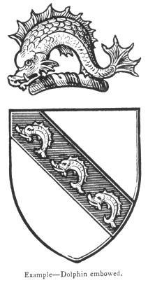

  
[Intangible Textual Heritage](../../index)  [Legendary
Creatures](../index)  [Symbolism](../../sym/index)  [Index](index) 
[Previous](fsca69)  [Next](fsca71) 

------------------------------------------------------------------------

[Buy this Book at
Amazon.com](https://www.amazon.com/exec/obidos/ASIN/B002D48Q8Y/internetsacredte)

------------------------------------------------------------------------

  
*Fictitious and Symbolic Creatures in Art*, by John Vinycomb, \[1909\],
at Intangible Textual Heritage

------------------------------------------------------------------------

p. 267

### The Heraldic Dolphin

The heraldic dolphin, as, usually
represented by modern heralds, is an ornamental monstrosity bearing but
slight resemblance to

|                                            |
|--------------------------------------------|
|  |

the natural form of this celebrated historic marine symbol; a nearer
resemblance to the natural shape is decidedly preferable. Some of the
early heraldic representations, though a little crude, are very
characteristic and thoroughly heraldic in treatment, though at the same
time very unlike the real dolphin.

In its series of leaps out of the water the dolphin appears with high
arched back, just as we see it represented in antique works; its natural
shape, however, is straight, the back being but slightly curved. The
broad tail paddle being placed in a horizontal position necessitates an
up and down stroke, which makes their swimming to appear

p. 268

a series of leaps and divings. Like its near relative the porpoise, it
is an air-breathing animal; its apparent gambollings on the water may,
therefore, be more truly attributed to its breathing and blowing whilst
in pursuit of its prey.

The Dolphin is generally, if not always, depicted in heraldry *embowed*,
that is, having its back greatly incurvated. In blazon the word
*Dolphin*, alone, implies that its natural position, *naiant* (swimming)
and embowed, is understood, but for the sake of accuracy it is better
always to give the description in full, as a doubt may arise as to the
omission of a word indicating its position.

*Torqued*, *torquend*, *torgant*, or *targant*, from the Latin
*torquere*, to twist, are old terms for embowed, or bowed embowed, bent
in the form of the letter S, turning contrary ways at each bending;
applicable also to serpents.

*Hauriant*, from the Latin *ab hauriendo*, is a term applied to fishes
generally when placed in an upright position or in pale, as if putting
the head above water to get air.

 

p. 269

Shell-fish are blazoned *erect* or *upright*, the term hauriant being
only applicable to fishes with scales and fins.

*Urinant* (from the Latin *urino*, to duck or dive under water)
signifies borne with the head downwards and the tail erect, the reverse
position of hauriant.

Two dolphins are occasionally borne together, sometimes endorsed, or
back to back; sometimes respecting each other.

As signifying the conquest of the sea, it appears in the shields of many
seaport cities. It figures on the well-known bearings of the towns of
Brighton, Dunkirk, Poole, &c.

The Dolphin appears in English heraldry as early as the middle of the
thirteenth century. In a roll of arms of that date, a dolphin is given
as the coat of Gile de Fiseburn.

"The Godolphins of Helston," says Miss Millington, "who had estates in
that part of the kingdom (Cornwall) at the time of the Conquest, bore
*argent three dolphins embowed, sable*." Similar arms are borne by many
English families.

The Godolphins, Franklins, Franklands, Frenches, Fishers and Kennedys,
in many of their branches, bear the dolphin fish as their crest.

A man playing the harp on a dolphin is the heraldic cognisance of the
Walterton family.

------------------------------------------------------------------------

[Next: The Sea-Horse](fsca71)
