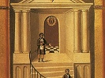

  
[Intangible Textual Heritage](../../index)  [Freemasonry](../index) 
[Index](index)  [Previous](dun00)  [Next](dun02) 

------------------------------------------------------------------------

[Buy this Book at
Amazon.com](https://www.amazon.com/exec/obidos/ASIN/B0021YV4ZS/internetsacredte)

------------------------------------------------------------------------

  
*Duncan's Masoic Ritual and Monitor*, by Malcom C. Duncan, \[1866\], at
Intangible Textual Heritage

------------------------------------------------------------------------

p. 3

# PREFACE

THE objects which Freemasonry was founded to subserve are honorable and
laudable; nor is it intended in the following pages to disparage the
institution or to undervalue its usefulness. It has, at various times
and in several countries, incurred the ill-will of political parties and
of religious bodies, in consequence of a belief, on their part, that the
organization was not so purely benevolent and philanthropic as its
members proclaimed it to be. In the State of New York, many years ago,
it was supposed, but we think unjustly, to wield a powerful political
influence, and to employ it unscrupulously for sinister ends. The war
between Masonry and Anti-Masonry which convulsed the State at that
period is still fresh in the remembrance of many a party veteran. The
Order, however, has long since recovered from the obloquy then heaped
upon it, and is now in a flourishing condition in most parts of the
civilized world.

The purpose of this work is not so much to gratify the curiosity of the
uninitiated as to furnish a guide for the neophytes of the Order, by
means of which their progress from grade to grade may be facilitated.
Every statement in the book is authentic, as every proficient Mason will
admit to himself, if not to be public, as he turns over its pages. The
non-Masonic reader, as he peruses them, will perhaps be puzzled to
imagine why matters of so little real importance to society at large
should have been so industriously concealed for centuries, and still
more surprised that society should have been so extremely inquisitive
about them. "But such," as Old Stapleton says, in 'Jacob Faithful,' "is
human nature." The object of the Order in making a profound mystery of
its proceedings is obvious enough. Sea-birds are not more in-variably
attracted toward a lighted beacon on a dark night, than men to whatever
savors of mystery. Curiosity has had a much greater influence in
swelling the ranks of Masonry than philanthropy and brotherly love. The
institution, however, is now sufficiently popular to stand upon its own
merits, without the aid of clap-trap, so "via the mantle that shadowed
Borgia."

It will be observed by the initiated, that the following exposition
gives no information through which any person not a Mason could obtain
admission to a Lodge. It is due to the Order that its meetings should
not be disturbed by the intrusion of persons who do not contribute to
its support, or to the furtherance of its humane design, and whose
motives in seeking admission to its

p. 4

halls would be impertinent and ungentlemanly. The clew to the *Sanctum
Sanctorum* is, therefore, purposely withheld.

In its spirit and intention Masonry is certainly not a humbug, and in
its enlightened age so excellent an institution should not incur the
liability of being classed with the devices of charlatanry by affecting
to wear a mystic veil which has long been lifted, and of which we are
free to say, that, unlike that of the false prophet of Kohrassan, it has
no repulsive features behind it.

The author of the following work does not conceive that it contains a
single line which can in any way injure the Masonic cause; while he
believes, on the other hand, that it will prove a valuable made mecum to
members of the Order, for whose use and guidance it is especially
designed.

It will be seen that the "work" quoted in this treatise differs from
that of Morgan, Richardson, and Alleyn; but as this discrepancy is fully
explained at the close of the remarks on the Third Degree, it is not
deemed necessary to make further allusion to it here.

p. 5

### THE AUTHORITIES REFERRED TO IN THIS WORK ARE AS FOLLOWS:

"THE HISTORICAL LANDMARKS." By the Rev. G. Oliver, D. D. In two volumes.
London: R. Spencer. 1845.

"THE THEOCRATIC PHILOSOPHY OF FREEMASONRY." By the same author and
publisher. 1840.

"ORIGIN OF THE ENGLISH ROYAL ARCH." By the same, &c., &c., &c.

"A LEXICON OF FREEMASONRY." By Albert G. Mackey, M. D. Charleston:
Burges & James. 1845.

"THE FREEMASON'S TREASURY." By the Rev. George Oliver, D. D. London: R.
Spencer. 1863.

"THE INSIGNIA OF THE ROYAL ARCH." By the same author. London: R.
Spencer. 1847.

"EXPOSITION OF THE MYSTERIES." An Inquiry into the Origin, History, and
Purport of Freemasonry. By John Fellows, A. M. New York. 1835.

"BOOK OF THE CHAPTER." By Albert G. Mackey, M. D. New York: Macoy &
Sickles. 1864.

"ALLYN'S RITUAL." New York: John Gowan.

"WEBB'S MONITOR." New York: Macoy & Sickles.

"TENT LIFE IN THE HOLY LAND." By Rev. Irenæus Prime, D. D. New York:
Harper & Bros.

"MONITOR OF FREEMASONRY." By Jabez Richardson. Philadelphia. Pa.

------------------------------------------------------------------------

[Next: Entered Apprentice, or First Degrees](dun02)
