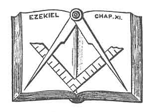
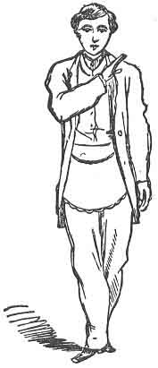
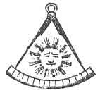

  
[Intangible Textual Heritage](../../index)  [Freemasonry](../index) 
[Index](index)  [Previous](dun05)  [Next](dun07) 

------------------------------------------------------------------------

[Buy this Book at
Amazon.com](https://www.amazon.com/exec/obidos/ASIN/B0021YV4ZS/internetsacredte)

------------------------------------------------------------------------

  
*Duncan's Masoic Ritual and Monitor*, by Malcom C. Duncan, \[1866\], at
Intangible Textual Heritage

------------------------------------------------------------------------

p. 184

 

# PAST MASTER, OR FIFTH DEGREE

THIS degree in Masonry was instituted to try the qualifications of a
Master Mason before becoming Master of a Lodge, and no Mason can
constitutionally preside over a Lodge of Master Masons unless he has
been admitted to this Degree. A Mason usually takes this Degree before
offering himself as a candidate for presiding in a Master's Lodge; but
should it so happen that a Mason is elected Master of a Lodge who is not
a Past Master, the Past Master's Degree may be conferred upon him
without any other ceremony than that of administering the obligation. In
such a case it is usually done by Royal Arch Masons, acting by order of
a Grand Master.

The Past Master's Lodge consists of seven officers, as follows:--

1\. Right Worshipful Master; 2. Senior Warden; 1. Junior Warden; 4.
Secretary; 5. Treasurer; 6. Senior Deacon; 7. Junior Deacon. [1](#fn_61)

The interior arrangement is the same as in the first degree, and the
officers are similarly seated. (See [p. 8](dun02.htm#page_8).)

p. 185

The symbolic color of the Past Master's Degree is purple. The apron is
of white lambskin, edged with purple, and should have the jewel of the
Degree inscribed upon it. The collar is of purple, edged with gold. But,
as Past Masters' Lodges are held under the warrants of Royal Arch
Chapters, the collars, aprons, and jewels of the Chapter are generally
made use of is conferring the Past Master's Degree.

When a Lodge of Past Masters is opened in due form, the ceremony is
similar to that of a Master's Lodge. If there is a candidate in waiting
he is usually introduced into the Lodge as though it were open on the
Mark Master's Degree, and he is made a Past Master before he is aware of
it. Since the many disclosures of this and other Degrees in Masonry, it
requires a great deal of tact and ingenuity to confer this Degree so as
to produce the effect desired. The candidate is elected to the Degree in
the Royal Arch Chapter, as no business is permitted to be done in this
Degree except that of initiation. Formerly it was the custom for all the
members to wear their hats while conferring this Degree, but now no
member wears his hat except the Right Worshipful Master. We will now
proceed to give the manner of conferring this Degree "in old times," as
described by Richardson, and, at the close, will give the reader an idea
of the modern way of conferring it. By comparing this with Richardson's
work, the initiated will perceive that we have made some trifling
alterations, and corrected several errors which occur in that book.

A Master Mason wishing to enter on the Degree of Past Master, petitions
the Chapter, and is balloted for in the same way that a candidate would
be in one of the first Degrees; but he is received very differently.
Having had the requisite ballot, the Junior Deacon conducts him into the
Lodge, places him on a seat, and then repairs to his own station near
the Senior Warden in the west. Soon after, a heavy alarm is given at the
outer door.

J. D. (to the Master, rising.)--There is an alarm at the outer door,
Right Worshipful.

R. W. M.--Attend to the alarm, and see who comes there.

Junior Deacon goes to the door, and soon returns, bringing a letter to
the Master, who opens it, and reads aloud to the Lodge as follows:--

DEAR BROTHER--Our dear mother has been taken suddenly very ill, and the
physician despairs of saving her life. Come home immediately; do not
lose a moment in delay.

Your affectionate sister,           
ALICE.       

p. 186

R. W. M. (addressing the Lodge.)--Brethren, you see by the tenor of this
letter to me that it is necessary I should leave immediately. You must
appoint some one to fill the chair, for I cannot stay to confer this
Degree.

J. W.--Right Worshipful, I certainly sympathize with you for the
afflicting calamity which has befallen your family, and am sorry that it
seems so urgently necessary for you to leave; but could you not stop a
few moments? Brother Gabe has come on purpose to receive this Degree,
and expects to receive it. I believe he is in the room, and can speak
for himself; and unless he is willing to put off the ceremony, I do not
see how you can avoid staying.

The candidate, sympathizing with the Master, says he consents to wait,
and by no means desires the Right Worshipful to stay one moment on his
account.

J. W.--I thank our brother for his courtesy, but I have other reasons,
Right Worshipful, why I desire you should stay to confer this Degree
to-night. In the first place, it is uncertain when I myself shall be
able to attend again--then we might not get so many brethren together at
another meeting; and as this is a very difficult Degree to confer, I
feel that you ought to stay.

R. W. M.--Brethren, it is impossible for me to stay. You will therefore
appoint some one to fill the chair. There are a number of brethren
present who are well qualified to confer the degree; you will therefore
please to nominate.

J. W.--I nominate our Brother Senior Warden to fill the chair.

R. W. M.--Brethren, it is moved and seconded that Brother Senior Warden
fill the chair this evening, to confer this Degree on Brother Gabe. All
those in favor will signify it by saying aye. (Two or three of the
members respond by saying aye.) Those opposed will say no. (Nearly all
the members exclaim, No!) It is not a vote. Brethren will please
nominate a new Master.

S. W.--I nominate Brother Junior Warden to fill the chair.

The Master puts the question with a similar result, when some member
nominates Brother Gabe (the candidate), who is unanimously voted for and
declared duly elected.

R. W. M.--Brother Gabe, you are elected Master of this Lodge. Will you
please to step this way and take the chair?

The candidate goes forward to take the chair, when the Right Worshipful
Master pushes him back, and says:

R. W. M.--Before you occupy the Master's chair, you must

p. 187

first assent to the ancient regulations, and take an obligation to
discharge with fidelity the duty of Master of the Lodge.

The candidate having no objection, the Master addresses him as
follows:--

1\. You agree to be a good man and true, and strictly to obey the moral
law?

2\. You agree to be a peaceful subject, and cheerfully to conform to the
laws of the country in which you reside?

3\. You promise not to be concerned in any plots or conspiracies against
government; but patiently to submit to the decisions of the supreme
legislature?

4\. You agree to pay a proper respect to the civil magistrates, to work
diligently, live creditably, and act honorably by all men?

5\. You agree to hold in veneration the original rules and patrons of
Masonry, and their regular successors, supreme and subordinate,
according to their stations, and to submit to the awards and resolutions
of your brethren, when convened, in every case consistent with the
Constitution of the Order?

6\. You agree to avoid private piques and quarrels, and to guard against
intemperance and excess?

7\. You agree to be cautious in carriage and behavior, courteous to your
brethren, and faithful to your Lodge?

8\. You promise to respect genuine brethren, and discountenance
impostors, and all dissenters from the original plan of Masonry?

9\. You agree to promote the general good of society, to cultivate the
social virtues, and to propagate the knowledge of the arts?

10\. You promise to pay homage to the Grand Master for the time being,
and to his office when duly installed, strictly to con-form to every
edict of the Grand Lodge, or general assembly of Masons, that is not
subversive to the principles and groundwork of masonry?

11\. You admit that it is not in the power of any man, or body of men to
make innovations in the body of Masonry?

12\. You promise a regular attendance on the committees and
communications of the Grand Lodge, on receiving proper notice, and to
pay attention to the duties of Masonry on all convenient occasions?

13\. You admit that no new Lodge can be formed without permission of the
Grand Lodge, and that no countenance be given to any irregular Lodge, or
to any person clandestinely initiated therein, being contrary to the
ancient charges of the Order?

14\. You admit that no person can be regularly made a Mason in, or
admitted a member of, any regular Lodge, without previous

p. 188

notice, and due inquiry into his character?

15\. You agree that no visitors shall be received into your Lodge
without due examination, and producing proper vouchers of their having
been initiated into a regular Lodge?

Do you submit to these charges, and promise to support these
regulations, as Masters have done in all ages before you?

Candidate--I do.

R. W. M.--You will now take upon yourself the obligation of this Degree.
Please to kneel at the altar.

The candidate is conducted to the altar, kneels on both knees, lays both
hands on the Holy Bible, square, and compasses, and takes the following
oath:

I, Peter Gabe, of my own free-will and accord, in presence of Almighty
God, and this Worshipful Lodge of Past Master Masons, erected to him,
and dedicated to the Holy Saints John, do hereby and hereon, most
solemnly and sincerely promise and swear, in addition to my former
obligations, that I will not give the secrets of a Past Master Mason, or
any of the secrets pertaining thereto, to any one of an inferior Degree,
nor to any person in the known world, except it be to a true and lawful
brother, or brethren, Past Master Masons, or within the body of a just
and lawfully constituted Lodge of such; and not unto him or unto them
whom I shall hear so to be, but unto him and them only whom I shall find
so to be, after strict trial and examination, or lawful information.

Furthermore do I promise and swear, that I will obey all regular signs
and summonses sent, thrown, handed, or given from the hand of a brother
of this Degree, or from the body of a just and lawfully constituted
Lodge of Past Masters.

Furthermore do I promise and swear, that I will support the constitution
of the General Grand Royal Arch Chapter of the United States; also, that
of the Grand Chapter of the State in which this Lodge is located, and
under which it is held, and conform to all the by-laws, rules, and
regulations of this, or any other Lodge of which I may at any time
become a member, so far as in my power.

Furthermore do I promise and swear, that I will not assist or be present
at the conferring of this Degree upon any person who has not, to the
best of my knowledge and belief, regularly received (in addition to the
Degrees of Entered Apprentice, Fellow Craft, and Master Mason) the
Degree of Mark Master, or been elected Master of a regular Lodge of
Master Masons.

Furthermore do I promise and swear, that I will aid and assist all poor
and indigent Past Master Masons, their widows

p. 189

and orphans, wherever dispersed around the globe, they applying to me as
such, and I finding them worthy, so far as is in my power without
material injury to myself or family.

Furthermore do I promise and swear, that the secrets of a brother of
this Degree, delivered to me in charge as such, shall remain as secure
and inviolable in my breast, as they were in his own before communicated
to me, murder and treason excepted, and those left to my own election.

Furthermore do I promise and swear, that I will not wrong this Lodge,
nor a brother of this Degree, to the value of one cent, knowingly,
myself, nor suffer it to be done by others, if in my power to prevent
it.

<table data-border="0">
<colgroup>
<col style="width: 50%" />
<col style="width: 50%" />
</colgroup>
<tbody>
<tr class="odd">
<td data-valign="top" width="327">
  
FIG. 25. DUEGARD AND STEP OF A PAST MASTER.
</td>
<td data-valign="top" width="327">
  
FIG. 26. SIGN OF A PAST MASTER.
</td>
</tr>
</tbody>
</table>

Furthermore do I promise and swear, that I will not govern this Lodge,
or any other over which I may be called to preside, in a haughty and
arbitrary manner; but will, at all times, use my utmost endeavors to
preserve peace and harmony among the brethren.

p. 190

Furthermore do I promise and swear, that I will never open a Lodge of
Master Masons unless there be present three regular Master Masons,
besides the Tyler; nor close the same without giving a lecture, or some
section or part of a lecture, for the instruction of the Lodge.

Furthermore do I promise and swear, that I will not sit in a Lodge where
the presiding officer has not taken the degree of Past Master Mason.

To all of which I do most solemnly and sincerely promise and swear, with
a fixed and steady purpose of mind to keep and perform the same; binding
myself under no less penalty than (in addition to all my former
penalties) to have my tongue split from tip to root, that I might
forever thereafter be unable to pronounce the word, should I ever prove
wilfully guilty of violating any part of this my solemn oath, or
obligation, of a Past Master Mason. So help me God, and make me
steadfast to keep and perform the same.

<table data-align="LEFT">
<colgroup>
<col style="width: 100%" />
</colgroup>
<tbody>
<tr class="odd">
<td data-valign="CENTER"> 
FIG. 27. PAST MASTER'S GRIP.</td>
</tr>
</tbody>
</table>

R. W. M. (to candidate.)--Kiss the Book five times.

The obligation having been administered, the candidate rises, when the
Master proceeds to give him the sign, word, and grip of this Degree, as
follows:

R. W. M. (to candidate.)--You now behold me approaching yon from the
east, under the step, sign, and duegard of a Past Master Mason.

The Master now steps off with his left foot, and then places the heel of
his right foot at the toe of the left, so as to bring the two feet at
right angles, and make them the right angle of a square. He then gives
the sign, placing the thumb of his right hand (fingers clinched) upon
his lips. It alludes to the penalty of having his tongue split from tip
to root. (See [Fig. 25](#img_18900), [p. 189](#page_189).)

The Master then gives a second sign by placing his right hand upon the
left side of his neck, and drawing it edgewise down-ward toward the
right side, so as to cross the three former penalties. (See [Fig.
26](#img_18901), [p. 189](#page_189).)

p. 191

R. W. M.--Brother, let me now have the pleasure of conducting you into
the *oriental chair* of King Solomon. (Places a large cocked hat on his
head, and seats him in a chair in front of the Master's chair ) That
wise king, when old and decrepit, was attended by his two friends,
Hiram, King of Tyre, and Hiram Abiff, who raised and seated him in his
chair by means of the Past Master's grip. (See [Fig. 27](#img_19000).)

The Master and Senior Warden now take the candidate by this grip, and
raise him on his feet several times, each time letting him sit back in
the chair again. The Senior Warden then goes back to his seat, the
candidate rises, and the Right Worshipful Master instructs him in the
grip and word of a Past Master Mason. They first take each other by the
Master Mason's grip (see [Fig. 17](dun04.htm#img_12000), [p.
120](dun04.htm#page_120)), and, putting the insides of their feet
together, the Master whispers GIBLEM [1](#fn_62)
in the ear of the candidate. At that moment they slip their right hands
so as to catch each other just above the wrist of the left arm, and
raise their left hands, catching each other's right elbow, the Master
saying, and the candidate repeating (in union with these motions), "From
a grip to a span, from a span to a grip," afterward (almost at the same
instant) letting the left hand slip up the right arm to the back of each
other, the Master saying, "A threefold cord is strong," and the
candidate (prompted) replying. "A fourfold cord is not easily broken."
(See [Fig. 27](#img_19000).)

The Right Worshipful Master seats the candidate in the Master's chair,
places a hat on his head, and then comes down in front, and says:

Worshipful brother, I now present you with the furniture and various
Masonic implements of our profession; they are emblematical of our
conduct in life, and will now be enumerated and explained as presented.

The Holy Writings, that great light in Masonry, will guide

p. 192

you to all truth; it will direct your path to the temple of happiness,
and point out to you the whole duty of man.

The Square teaches to regulate our actions by rule and line, and to
harmonize our conduct by the principles of morality and virtue.

The Compasses teach to limit our desires in every station; thus rising
to eminence by merit, we may live respected and die regretted.

The Rule directs that we should punctually observe our duty, press
forward in the path of virtue, and neither inclining to the right nor to
the left, in all our actions have eternity in view.

The Line teaches the criterion of moral rectitude; to avoid
dissimulation in conversation and action, and to direct our steps to the
path that leads to immortality.

The Book of Constitutions you are to search at all times; cause it to be
read in your Lodge, that none may pretend ignorance of the excellent
precepts it enjoins.

Lastly, you receive in charge the By-laws of your Lodge, which you are
to see carefully and punctually executed. I will also present you with
the Mallet; it is an emblem of power. One stroke of the mallet calls to
order, and calls up the Junior and Senior Deacons; two strokes call up
all the subordinate officers; and three, the whole Lodge.

R. W. M.--Brethren, please to salute your new Master.

All the brethren present, headed by the Master, now walk in front of the
chair, give the sign of an Entered Apprentice, and pass on. This is
repeated, with the sign of each Degree in Masonry up to that of Past
Master.

R. W. M. (to candidate.)--I now leave you to the government of your
Lodge. (Master takes his seat with the brethren.)

The Senior Warden now steps forward and delivers up his jewel and his
gavel to the new Master, and each of the other officers of the Lodge
does the same, taking his turn according to rank. Presently the retired
Master rises.

Retired Master (addressing the Chair.)--Right Worshipful, in consequence
of my resignation, and the election of a new Master, the seats of the
Wardens have become vacant. It is necessary you should have Wardens to
assist you in the government of your Lodge. I presume the brethren who
have held these stations will continue to serve, if you so request.

The new Master requests the Senior Warden to resume his jewel and gavel,
when the other officers (who had left their places) also resume their
seats.

Retired Master--Right Worshipful, I would respectfully suggest to you,
that as the office of Treasurer is one of considerable

p. 193

responsibility--he holding all the funds and property of the Lodge--you
should direct that he be nominated and elected by the members present.
This has been customary, and if you order a nomination to be made in
this manner, I have no doubt that we shall select some one who will be
satisfactory to you.

Candidate (acting as Master.)--The brethren will please nominate a
Treasurer for this Lodge.

Here a scene of confusion takes place, which is not easily described.
The newly installed Worshipful is made the butt for every worthy brother
to exercise his wit upon. Half-a-dozen are up at a time, soliciting the
Master to nominate them, urging their several claims, and decrying the
merits of others with much zeal; crying out, "Order, Worshipful! keep
order!" Others propose to dance, and request the Master to sing for
them; others whistle, or sing, or jump about the room; or scuffle and
knock down chairs or benches. One proposes to call from labor to
refreshment; another makes a long speech, advocating the reduction of
the price of the Chapter Degrees from twenty dollars to ten, and
recommending that it be permitted to pay for them in flour, or any other
produce. His motion is seconded, and the new Master is pressed on all
sides to put the question. If the question is put, the brethren all vote
against it, and accuse the new Master of breaking his oath, when he
swore he would support the Constitution of the General Grand Royal Arch
Chapter, which establishes the price of the four Chapter Degrees at
twenty dollars. If the blaster attempts to exercise the power of the
gavel, it often has the contrary effect; for if he gives more than one
rap, and calls to order, every one obeys the signal with the utmost
promptness, and drops on the nearest seat. The next instant, before the
Master can utter a word, all are on their feet again, and as noisy as
ever. Some brother now proposes that the Lodge be closed; another one
hopes it will be closed in a short way.

Retired Master (to candidate.)--Right Worshipful, it is moved and
seconded that this Lodge be closed. You can close it as you please. You
can merely declare the Lodge closed, or in any other way.

The candidate, being much embarrassed, will often attempt to close the
Lodge by rapping with his gavel, and declaring it closed. Should he do
so, the retired Master stops him as follows:

Retired Master--Right Worshipful, you swore in your obligation, that you
would not close this or any other Lodge over which you should be called
to preside, without giving a lecture or some part thereof. Do you intend
to break your oath?

Candidate--I had forgotten that in this confusion. I hope the brethren
will excuse me.

p. 194

A brother goes and whispers to the candidate, telling him that he can
resign the chair to the old Master, and have him close the Lodge, if he
so prefers. The candidate is very glad to do this, and cheerfully
abdicates his seat.

R. W. M. (resuming the chair.)--Brother, the lesson we have just given,
notwithstanding its apparent confusion, is designed to convey to you, in
a striking manner, the necessity of at all times abstaining from
soliciting, or accepting any office or station that you do not know
yourself amply qualified to fill.

The Master now delivers the lecture in this Degree. It is divided into
five sections. The first treats of the manner of constituting a Lodge of
Master Masons. The second treats of the ceremony of installation,
including the manner of receiving candidates to this Degree, as given
above. The third treats of the ceremonies observed at laying the
foundation-stones of public structures. The fourth section, of the
ceremony observed at the dedication of Masonic Halls. The fifth, of the
ceremony observed at funerals, according to the ancient custom, with the
service used on the occasion. The lecture is usually read from a
Monitor, which is kept in every Lodge. (See Lecture, page
[197](#page_197).)

The foregoing includes all the ceremonies ever used in confer-ring the
Degree of Past Master; but the ceremonies are frequently shortened by
the omission of some part of them; the presenting of the various
implements of the profession, and their explanations, are often
dispensed with; and, still more often, the charge.

Such is the manner in which this Degree was formerly conferred; but, as
we have previously said, the ceremonies are now much abridged. The
method of initiation to this Degree now usually adopted is as follows
The candidate for the Degree of Past Master is invited into a Lodge of
Mark Masters, and as soon as he is seated, some one of the brethren
rises and moves that the Lodge be closed. Another brother immediately
gets up and proceeds to call the Master's attention to some unfinished
business or the report of some committee. This action is all a ruse, and
only intended to mislead the candidate from their real design. He (the
candidate) sits there, thinking all the while that he is witnessing the
regular business of a Mark Lodge, whereas he is in reality passing the
preliminary steps of initiation. One of the brethren now moves an
adjournment, another rises and opposes the motion, while a third asks
the Chapter to help him with a loan of money. Some one of the members
will oppose the loan, and high words frequently pass between the
brethren (all for effect). Finally, the Right Worshipful Master will
attempt to put to vote some resolutions on the subject, and a lengthy
debate ensues as to the legality of this disposition of

p. 195

the funds of the Chapter. After the debate has proceeded for some time,
one of the brethren rises and accuses the Right Worshipful Master of
corruption, and charges him in plain terms with being interested in
obtaining the loan. Upon this the Right Worshipful Master indignantly
repels the insinuation, and demands to be relieved from serving any
longer as Master of the Lodge. Another scene of excitement then
ensues--some of the brethren favor the removal of the Right Worshipful
Master, while others advocate his retaining his position. Finally, the
Right Worshipful Master refuses to serve under any consideration, and
peremptorily resigns. Some of the members now urge the pre-tended late
Right Worshipful Master to assist in instating his successor to office.
This he consents to do. The candidate is then nominated, elected, and
placed in the Oriental chair, etc. The balance of the Degree, from the
election of the Master, is correct, as given by Richardson in the
foregoing pages, only the candidate is very seldom treated so badly as
is represented there. The candidate is usually relieved from
embarrassment in good season by the retired Master, who resumes his seat
and reads the following charge to him:--

BROTHER--The conferring at this time of a Degree which has no historical
connection with the other capitular Degrees is an apparent anomaly,
which, however, is indebted for its existence to the following
circumstances:

Originally, when Royal Arch Masonry was under the government of symbolic
Lodges, in which the Royal Arch Degree was then always conferred, it was
a regulation that no one could receive it unless he had previously
presided as the Master of that or some other Lodge; and this restriction
was made because the Royal Arch was deemed too important a Degree to be
conferred only on Master Masons.

But, as by confining the Royal Arch to those only who had been actually
elected as the presiding officers of their Lodges, the extension of the
Degree would have been materially circumscribed, and its usefulness
greatly impaired, the Grand Master often granted, upon due petition, his
dispensation to permit certain Master Masons (although not elected to
preside over their Lodges) "to pass the chair," which was a technical
term, in-tended to designate a brief ceremony, by which the candidate
was invested with the mysteries of a Past Master, and, like him,
entitled to advance in Masonry as far as the Royal Arch, or the
perfection and consummation of the Third Degree.

When, however, the control of the Royal Arch was taken from the symbolic
Lodges and intrusted to a distinct organization--that, namely, of
Chapters--the regulation continued to be observed,

p. 196

for it was doubtful to many whether it could legally be abolished; and,
as the law still requires that the august Degree of Royal Arch shall be
restricted to Past Masters, our candidates are made to pass the chair
simply as a preparation and qualification toward being invested with the
solemn instructions of the Royal Arch.

The ceremony of passing the chair, or making you in this manner a Past
Master, does not, however, confer upon you any official rank outside of
the Chapter, nor can you in a symbolic Lodge claim any peculiar
privileges in consequence of your having received in the Chapter the
investiture of the Past Master's Degree. Those who receive the Degree in
symbolic Lodges as a part of the installation service, when elected to
preside, have been properly called "Actual Past Masters," while those
who pass through the ceremony in a Chapter, as simply preparatory to
taking the Royal Arch, are distinguished as "Virtual Past Masters," to
show that, with the investiture of the secrets, they have not received
the rights and prerogatives of the Degree.

With this brief explanation of the reason why this Degree is now
conferred upon you, and why you have been permitted to occupy the chair,
you will retire, and suffer yourself to be prepared for those further
and profounder researches into Masonry, which can only be consummated in
the Royal Arch Degree. [1](#fn_63)

If there is no further business, the lecture is delivered by the Right
Worshipful Master, and the Lodge closed with the following prayer: [2](#fn_64)

p. 197

Supreme Architect of the Universe, accept our humble praises for the
many mercies and blessings which Thy bounty has conferred on us, and
especially for this friendly and social intercourse. Pardon, we beseech
Thee, whatever Thou hast seen amiss in us since we have been together,
and continue to us Thy presence, protection and blessing. Make us
sensible of the renewed obligations we are under to love Thee supremely,
and to be friendly to each other. May all our irregular passions be
subdued, and may we daily increase in Faith, Hope, and Charity, but more
especially in that Charity which is the bond of peace, and the
perfection of every virtue. May we so practise Thy precepts that we may
finally obtain Thy promises, and find an entrance through the gates into
the temple and city of our God. So mote it be. Amen.

### LECTURE ON THE FIFTH, OR PAST MASTER'S DEGREE.--PART OF THE SECOND SECTION [1](#fn_65)

*Question*. Are you a Past Master?

*Answer*. I have the honor so to be.

Q. How gained you this distinguished honor?

A. By having been regularly elected and duly installed to preside over
and govern a Lodge of Free and Accepted Masons. Previous to my
installation I was caused to kneel at the altar in due form, and take
upon myself a solemn oath or obligation to keep and conceal the secrets
belonging to the chair.

Q. What is that due form?

A. Kneeling upon both knees, both hands covering the Holy Bible, square
and compasses, my body erect; in which due form I took upon myself the
solemn oath or obligation of a Past Master.

Q. Have you that obligation?

A. I have.

Q. Will you give it?

A. I will, with your assistance.

Q. Proceed. I, A. B., &c., &c. (See obligation of a Past Master.)

p. 198

Q. Have you a sign belonging to the Chair?

A. I have several.

Q. Show me a sign? (Give sign, thumb to mouth.)

Q. What is that called?

A. The duegard.

Q. To what, does it allude?

A. To the penalty of my obligation, that I would sooner have my tongue
cleave to the roof of my mouth, than divulge any of the secrets
belonging to the chair unlawfully.

Q. Show me another sign? (Give sign, drop your hand in from mouth in a
circular manner down over your breast to your right side.)

Q. What is that called?

A. The sign.

Q. To what does it allude?

A. To the additional portion of the penalty of my obligation, that I
would sooner suffer the severest inflictions of all my former penalties,
than divulge any of the secrets belonging to the chair unlawfully.

Q. Have you a grip belonging to the chair?

A. I have.

Q.. Communicate it to a brother. (Give the Past Master's grip. See the
grip.)

Q. Has it a name?

A. It has.

Q. Give it. (Give the word. See word of Past Master.)

Q. What does it signify?

A. Stone squarer.

Q. What were you presented with?

A. The jewel of my office--which is a square, and it was hoped I would
prepare a square stone in the Temple of Masonry.

Q. What were you next presented with?

A. The three great lights in Masonry, the Holy Bible, square and
compasses. Within that sacred volume I would find all that was necessary
for my counsel and guidance, these three great lights I was always to
see in proper position when the lodge was open. If in the E. A. degree,
that both points of the compasses are beneath the square; if in the F.
C. degree, one point is elevated above the square; if in the Master's
degree, both points are elevated above the square.

Q. What were you next presented with?

A. The charter or warrant, which would empower me to do all regular
Masonic work.

Q. What were you next presented with?

p. 199

A. The constitution, which I was carefully to search, and see that it
was not infringed.

Q. What were you next presented with?

A. The By-laws, which I was to carefully search and see that they were
strictly enforced.

Q. What were you next presented with?

A. The records, which I was to see carefully kept, that nothing improper
be transmitted to paper, and have a general supervision over the duties
of the secretary.

Q. What were you next presented with?

A. I, as Master should be covered; [1](#fn_66)
while the rest of the brethren remained uncovered.

Q. What were you next presented with?

A. Last, but not least, I was presented with the gavel, which I was
informed was an emblem of power, one blow of which would call the Lodge
to order; and in opening and closing, the deacons would arise; two blows
would call up the rest of the subordinate officers, on three blows, the
whole Lodge; one blow would again seat them and call the Lodge to order.

Q. How were you then disposed of?

A. I was conducted to the chair, once so ably filled by our Grand Master
Solomon, King of Israel, and it was hoped that a portion of his wisdom
would rest upon and abide with me.

Q. What are the duties of the chair?

A. They are many and various.

Q. Of what do they consist?

A. In opening, instructing and closing Lodges; of initiating, crafting,
and raising Masons; presiding at consecrations, dedications and
installations; at the laying of corner stones of public edifices;
presiding at funeral obsequies, and all other duties corresponding
thereunto and connected therewith.

   
PAST MASTER'S JEWEL.

 

------------------------------------------------------------------------

### Footnotes

[184:1](dun06.htm#fr_61) The regular officers of
a Past Masters' Lodge correspond exactly with those of a Lodge of Master
Masons.

The officers of a Chapter take rank in a Past Masters' Lodge as follows,
viz.: the High Priest as Master; the King as Senior Grand Warden; the
Scribe as .Junior Grand Warden: the Treasurer and Secretary occupy the
corresponding stations; the Principal Sojourner as Senior Deacon; the
Royal Arch Captain as Junior Deacon, and the Tyler at his proper
station.

[191:1](dun06.htm#fr_62) The Giblemites, or, as
they are called in Scripture, the *Giblim*, were inhabitants of the city
and district of Gebal, in Phoenicia, near Mount Lebanon, and were.
therefore, under the dominion of the King of Tyre. The Phœnician word
"*gibal*," which makes "*giblim*" in the plural, signifies a mason or
stone squarer. In the Second Book of Kings, v. 17, 18, we read that "the
King commanded, and they brought great stones, costly stones, and hewed
stones, to lay the foundation of the house. And Solomon's builders and
Hiram's builders did hew them, and the stone squarers." which last word
is, in the original, *giblim*. Gesenius says that the inhabitants of
Gebal were seamen and builders, and Sir William Drummond asserts that
"the Gibalim were Master Masons, who put the finishing hand to Solomon's
Temple." In this sense the word is also used in the Book of
Constitutions, which records that John de Spoulee, who, as one of the
deputies of Edward III., assisted in rebuilding Windsor Castle, was
called the "Master of the Ghiblim." The Giblim, or the Giblimites, were,
therefore, stone-squarers or Master Masons.--*Book of the Chapter*, p.
56.

[196:1](dun06.htm#fr_63) See Mackey's "Book of
the Chapter."

[196:2](dun06.htm#fr_64) The chief object of
this Degree In the United States is to exemplify the necessity of
government, and to enforce upon the minds of those who are called to
govern, the importance of qualifying themselves for the skilful and
efficient discharge of their duties. The ceremonies of the Degree extend
to no great length; but they are such as strongly to impress upon the
newly elected Master a sense of his own deficiencies in the matter of
government, and the need he has of promptness and energy in preserving
the discipline of the Society over which he is to preside. The process
of conferring the Degree, teaching by practical illustration, is
apparently grave, though withal rather amusing. After the Lodge is
opened upon the Third Degree, the Master receives intelligence from
without that some sudden emergency demands his presence in another
place. He therefore resigns the chair, and desires the brethren to elect
a successor. The new Master is placed in the chair; but from various
causes, too long to be enumerated here, he finds himself utterly unable
to keep order, when the old .Master reappears and kindly relieves him
from his embarrassment, by teaching him how to command obedience; for it
frequently happens that, in the plenitude of his power, a scrupulous
compliance with his own ignorant and inopportune mandates has occasioned
the very confusion which had appalled him.--*Historical Landmarks*, vol.
ii. p. 128.

PAST MASTERS--An honorary Degree conferred on the W. (*Worshipful*)
Master, at his installation into office. In this Degree, the necessary
instructions p. 197 are conferred respecting
the various ceremonies of the Order, such as installations, processions,
the laying of corner-stones, etc. The ceremonies of the Degree, when
properly conferred, inculcate a lesson of diffidence in assuming the
responsibilities of an office without a due preparation for the
performance of its duties.--*Lexicon*.

[197:1](dun06.htm#fr_65) This portion of the
second section of the Lecture on the Fifth Degree relates to the
induction of candidates, and is not given in the Monitors. With the
exception of this, the Lecture may be found in "Webb's Monitor."

[199:1](dun06.htm#fr_66) A hat.

------------------------------------------------------------------------

[Next: Most Excellent Master, or Sixth Degree](dun07)
