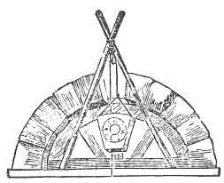

  
[Intangible Textual Heritage](../../index)  [Freemasonry](../index) 
[Index](index)  [Previous](dun06)  [Next](dun08) 

------------------------------------------------------------------------

[Buy this Book at
Amazon.com](https://www.amazon.com/exec/obidos/ASIN/B0021YV4ZS/internetsacredte)

------------------------------------------------------------------------

  
*Duncan's Masoic Ritual and Monitor*, by Malcom C. Duncan, \[1866\], at
Intangible Textual Heritage

------------------------------------------------------------------------

p. 200

 

# MOST EXCELLENT MASTER, OR SIXTH DEGREE.

No Mason can receive the Degree of Most Excellent Master until after he
has become a Past Master, and presided in a Lodge, or, in other words,
been inducted into the Oriental Chair of King Solomon. When the Temple
of Jerusalem was finished, [1](#fn_67) those who
had proved themselves worthy, by their virtue, skill, and fidelity, were
installed as Most Excellent Masters, and, even at this date, none but
those who have a perfect knowledge of all preceding Degrees are (or
should be) admitted. [2](#fn_68)

p. 201

A Lodge of Most Excellent Masters is opened in nearly the same manner as
Lodges in the preceding Degrees. The officers are, a Master, Senior and
Junior Wardens and Deacons, Secretary and Treasurer, and of course a
Tyler.

The officers of a Chapter rank as follows:--

The High Priest, as Right Worshipful Master; King, as Senior Warden;
Scribe, as Junior Warden; Principal Sojourner, as Senior Deacon; Royal
Arch Captain, as Junior Deacon. The Treasurer, Secretary, and Tyler
corresponding in rank with the same officers of other Degrees.

The symbolic color of the Most Excellent Master's Degree is purple. The
apron is of white lambskin, edged with purple. The collar is of purple,
edged with gold. But, as Lodges of this Degree are held under warrants
of Royal Arch Chapters, the collars, aprons, and jewels of the Chapter
are generally made use of in conferring the Degree.

The Right Worshipful Master represents King Solomon, and should be
dressed in a crimson robe, wearing a crown, and holding a sceptre in his
hand.

A candidate receiving this Degree is said to be "received and
acknowledged as a Most Excellent Master."

Lodges of Most Excellent Masters are "dedicated to King Solomon."

The officers of the Lodge are stationed as in the Entered Apprentice's
Degree, described on Page [8](dun02.htm#page_8). The Master presiding
calls the Lodge to order, and says:

Master (to the Junior Warden.)--Brother Junior, are they all Most
Excellent Masters in the south?

J. W.--They are, Right Worshipful.

Master (to the Senior Warden.)--Brother Senior, are they all Most
Excellent Masters in the west?

S. W.--They are, Right Worshipful.

Master--They are also in the east.

Master gives one rap, which calls up the two deacons.

Master (to Junior Deacon.)--Brother Junior, the first care of a Mason?

J. D.--To see the door tyled, Most Excellent.

Master--Attend to that part of your duty, and inform the Tyler that we
are about to open this Lodge of Most Excellent Masters, and direct him
to tyle accordingly.

Junior Deacon goes to the door and gives six knocks, which the Tyler
from without answers by six more. He then gives one knock, which the
Tyler answers with one, and he then partly

p. 202

opens the door, and informs the Tyler that by order of the Most
Excellent Master a Lodge of Most Excellent Masters is now about to be
opened in this place, and he must tyle accordingly. He then returns to
his place and addresses the Master:

J. D.--The Lodge is tyled, Most Excellent.

Master--By whom?

J. D.--By a Most Excellent Master Mason without the door, armed with the
proper implements of his office.

Master--His duty there?

J. D.--To keep off all cowans and eavesdroppers, and see that none pass
or repass without permission of the Right Worshipful Master.

The Master now questions each officer of the Lodge as to his duties,
which are recited by them as in the other Degrees.

Master (to Senior Warden.)--Brother Senior, you will assemble the
brethren around the altar for our opening.

S. W.--Brethren, please to assemble around the altar, for the purpose of
opening this Lodge of Most Excellent Master Masons.

The brethren now assemble around the altar, and form a circle, and stand
in such a position as to touch each other, leaving a space for the Right
Worshipful Master; they then all kneel on their left knee, and join
hands, each giving his right-hand brother his left hand, and his
left-hand brother his right hand; their left arms uppermost, and their
heads inclining downward: all being thus situated, the Right Worshipful
Master reads the following verses from Psalm xxiv:

"The earth is the Lord's, and the fulness thereof; the world, and they
that dwell therein. For he hath founded it upon the seas, and
established it upon the floods. Who shall ascend into the hill of the
Lord? and who shall stand in his holy place? He that hath clean hands,
and a pure heart: who hath not lifted up his soul unto vanity, nor sworn
deceitfully. He shall receive the blessing from the Lord, and
righteousness from the God of his salvation. This is the generation of
them that seek him, that seek thy face, O Jacob. Selah. Lift up your
heads, O ye gates (here the kneeling brethren alternately raise and bow
their heads as the reading proceeds); and be ye lifted up, ye
everlasting doors; and the King of glory shall come in. Who is this King
of glory? The Lord, strong and mighty; the Lord, mighty in battle. Lift
up your heads, O ye gates; even lift them up, ye everlasting doors; and
the King of glory shall come in. Who is this King of glory? The Lord of
hosts; he is the King of glory. Selah."

While reading these verses, the Right Worshipful Master advances

p. 203

toward the circle of kneeling brethren, taking his steps only when
reading those passages relative to the King of glory.

The reading being ended the Right Worshipful Master then kneels, joins
hands with the others, which closes the circle, and they all lift their
hands, as joined together, up and down, six times, keeping time with the
words as the Right Worshipful Master repeats them: "One, two, three;
one, two, three." This is Masonically called balancing. They then rise,
disengage their hands, and lift them up above their heads, with a
moderate and somewhat graceful motion, and cast up their eyes; turning
at the same time to the right, they extend their arms, and then suffer
them to fall loose and somewhat nerveless by their sides. This sign is
said by Masons, to represent the sign of astonishment made by the Queen
of Sheba, on first viewing Solomon's Temple. (See [Fig.
30](#img_21200).)

The Right Worshipful Master resumes his seat and says: "Brethren, attend
to the signs." He himself then gives all the signs, from an Entered
Apprentice up to this Degree, and the brethren join and imitate him.

Master (to the Senior Warden.)--Brother Senior, it is my will and
pleasure that this Lodge of Most Excellent Masters be now opened for
dispatch of business, strictly forbidding all private committees, or
profane language, whereby the harmony of the same may be interrupted,
while engaged in their lawful pursuits, under no less penalty than the
by-laws enjoin, or a majority of the brethren may see cause to inflict.

The Senior Warden repeats this to his Junior, and the Junior announces
it to the Lodge, as follows:

J. W.--Brethren, you have heard our Right Worshipful Master's will and
pleasure, as just communicated to me--so let it be done.

The Lodge being opened, the ordinary business of the evening in gone
through with, as in the former Degrees. If a candidate is to be
initiated, the Junior Deacon goes to the preparation-room, where he is
in waiting, and prepares him. He takes off the candidate's coat, puts a
cable-tow six times round his body, and conducts him to the door of the
Lodge, where he gives six distinct knocks (which are answered by the
Senior Deacon from within), and then one knock, which is answered in the
same manner.

S. D. (partly opening the door.)--Who comes there?

J. D.--A worthy brother, who has been regularly initiated as an Entered
Apprentice Mason; passed to the Degree of Fellow Craft; raised to the
sublime Degree of Master Mason; advanced to the honorary Degree of a
Mark Master Mason; presided in

p. 204

the chair as Past Master; and now wishes for further light in Masonry,
by being received and acknowledged as a most Excellent Master.

S. D.--Is it of his own free-will and accord he makes this request?

J. D.--It is.

S. D.--Is he duly and truly prepared?

J. D.--He is.

S. D.--Is he worthy and well qualified?

J. D.--He is.

S. D.--Has he made suitable proficiency in the preceding Degrees?

J. D.--He has.

S. D.--By what further right or benefit does he expect to obtain this
favor?

J. D.--By the benefit of a pass-word.

S. D.--Has he a pass-word?

J. D.--He has it not; but I have it for him.

S. D.--Give it to me.

Junior Deacon whispers in the ear of the Senior Deacon the word RABBONI.
(In many Lodges, the Past Master's word, GIBLEM, is used as pass-word
for this Degree, and the word RABBONI, [1](#fn_69) as the real word.)

S. D.--The word is right. You will wait until the Most Excellent Master
is made acquainted with your request, and his answer returned.

Senior Deacon repairs to the Right Worshipful Master in the east, and
gives six raps at the door.

Master--Who comes there?

S. D.--A worthy brother, who has been regularly initiated as an Entered
Apprentice; passed to the Degree of a Fellow Craft; raised to the
sublime Degree of a Master Mason; advanced to the honorary Degree of
Mark Master; presided as Master in the chair, and now wishes for further
light in Masonry, by being received and acknowledged as a Most Excellent
Master.

Master--Is it of his own free-will and accord he makes this request?

S. D.--It is.

Master--Is he duly and truly prepared?

S. D.--He is.

Master--Is he worthy and qualified?

S. D.--He is.

p. 205

Master--Has he made suitable proficiency in the preceding Degrees?

S. D.--He has.

Master--By what further right or benefit does he expect to obtain this
favor?

S. D.--By the benefit of a pass-word.

Master--Has he a pass-word?

S. D.--He has not; but I have it for him.

Master--Give it.

Senior Deacon whispers in his ear the word RABBONI.

Master--The pass is right. Since he comes endowed with all these
necessary qualifications, let him enter this Lodge of Most Excellent
Masters, in the name of the Lord.

The door is then flung open, and the Senior Deacon receives the
candidate upon the keystone. The candidate is then walked six times
around the Lodge by the Senior Deacon, moving with the sun. The first
time they pass around the Lodge, when opposite the Junior Warden, he
gives one rap with the gavel; when opposite the Senior Warden, he does
the same, and likewise when opposite the Right Worshipful Master. The
second time around each gives two blows; the third, three, and so on,
until they arrive to six. (See Note  [K](dun10.htm#xref_K), Appendix.)

During this time the Right Worshipful Master reads the following verses
from Psalm cxii.:

"I was glad when they said unto me, Let us go into the house of the
Lord. (• •)

"Our feet shall stand within thy gates, O Jerusalem. Jerusalem is
builded as a city that is compact together. (• • •)

"Whither the tribes go up, the tribes of the Lord, unto the testimony of
Israel, to give thanks unto the name of the Lord. (• • • •)

"For there are set thrones of judgment, the thrones of the house of
David. (• • • • •)

"Pray for the peace of Jerusalem: they shall prosper that love thee.
Peace be within thy walls, and prosperity within thy palaces.
(• • • • • •)

"For my brethren and companions' sakes, I will now say, Peace be within
thee. Because of the house of the Lord our God, I will seek thy good."

The reading of the foregoing is so timed as not to be fully ended until
the Senior Deacon and candidate have performed the sixth revolution.
Immediately after this the Senior Deacon and candidate arrive at the
Junior Warden's station in the south, where the same questions are asked
and the same answers returned as at the door. (Who comes there? &c.) The
Junior

p. 206

\[paragraph continues\] Warden then
directs the candidate to pass on to the Senior Warden in the west, for
further examination; where the same questions are asked and answers
returned as before. The Senior Warden directs him to be conducted to the
Right Worshipful Master in the east, for further examination. The Right
Worshipful Master asks the same questions and receives the same answers
as before.

Master (to Senior Deacon.)--Please to conduct the candidate back to the
west, from whence he came, and put him in the care of the Senior Warden,
and request him to teach the candidate how to approach the east, by
advancing upon six upright regular steps to the sixth step, and place
him in a position to take upon him the solemn oath, or obligation, of a
Most Excellent Master Mason.

The candidate is conducted back to the west, and the Senior Warden
teaches him how to approach the east in this Degree. First, by taking
the first step in Masonry, as in the Entered Apprentice's Degree, that
is, stepping off with the left foot, and bringing up the right foot so
as to form a square; then taking the steps as directed in the Fellow
Craft Degree, and so on up to this one--beginning always with the
Entered Apprentice's step. (See [Fig. 14](dun04.htm#img_09300), [p.
93](dun04.htm#page_93).)

On arriving at the altar the candidate kneels on both knees, and places
both hands on the Bible, square, and compasses. The Master then comes
forward and addresses him:

Master--Brother, you are now placed in a proper position to take upon
you the solemn oath or obligation of a Most Excellent Master Mason,
which I assure you, as before, is neither to affect your religion nor
politics. If you are willing to take it, repeat your name and say after
me:

I, Peter Gabe, of my own free-will and accord, in presence of Almighty
God and this Lodge of Most Excellent Master Masons, erected to Him and
dedicated to King Solomon, do hereby and hereon, most solemnly and
sincerely promise and swear, in addition to my former obligations, that
I will not give the secrets of Most Excellent Master to any one of an
inferior Degree, nor to any person in the known world, except it be to a
true and lawful brother of this Degree, and within the body of a just
and lawfully constituted Lodge of such; and not unto him nor them whom I
shall hear so to be, but unto him and them only whom I shall find so to
be, after strict trial and due examination, or lawful information.

Furthermore do I promise and swear, that I will obey all regular signs
and summonses handed, sent, or thrown to me from u brother of this
Degree, or from the body of a just and lawfully

p. 207

constituted Lodge of such; provided it be within the length of my
cable-tow.

Furthermore do I promise and swear, that I will support the Constitution
of the General Grand Royal Arch Chapter of the United States; also, that
of the Grand Chapter of this State, under which this Lodge is held, and
conform to all the by-laws, rules, and regulations of this, or any other
Lodge of which I may hereafter become a member.

Furthermore do I promise and swear, that I will aid and assist all poor
and indigent brethren of this Degree, their widows and orphans,
wheresoever dispersed around the globe, as far as in my power, without
injuring myself or family.

Furthermore do I promise and swear, that the secrets of a

   
FIG. 28. SIGN OF A MOST EXCELLENT MASTER

brother of this Degree, given to me in charge as such, and 1 knowing
them to be such, shall remain as secret and inviolable in my breast as
in his own, murder and treason excepted, and the same left to my own
free-will and choice.

Furthermore do I promise and swear, that I will not wrong

p. 208

this Lodge of Most Excellent Master Masons, nor a brother of this
Degree, to the value of any thing, knowingly, myself, nor suffer it to
be done by others if in my power to prevent it.

Furthermore do I promise and swear, that I will dispense light and
knowledge to all ignorant and uninformed brethren at all times, as far
as is in my power, without material injury to myself or family. To all
which I do most solemnly swear, with a fixed and steady purpose of mind
in me to keep and perform the same; binding myself under no less penalty
than to have my breast torn open, and my heart and vitals taken from
thence, and exposed to rot on the dunghill, if ever I violate any part
of this, my solemn oath, or obligation, of a Most Excellent Master
Mason. So help me God, and keep me steadfast in the due performance of
the same

Master (to the candidate.)--Detach your hands and kiss the book six
times. [1](#fn_70) (Candidate obeys.) You will
now rise and

   
FIG. 29. GRIP OF A MOST EXCELLENT MASTER.

receive from me the sign, grip, and word of a Most Excellent Master
Mason.

p. 209

The sign is given by placing your two hands, one on each breast, the
fingers meeting in the centre of the body, and jerking them apart as
though you were trying to tear open your breast. It alludes to the
penalty of the obligation. (See [Fig. 28](#img_20700).)

The grip is given by taking each other by the right hand, and clasping
them so that each compress the third finger of the other with his thumb.
(If one hand is large and the other small, they cannot both give the
grip at the same time.) It is called the grip of all grips, because it
is said to cover all the preceding grips. (See [Fig. 29](#img_20800).)

Master (holding candidate by his hand and placing the inside of his
right foot to the inside of candidate's right foot) whispers in his
ear--RABBONI.

Should there be more than one candidate for initiation, the ceremony
stops here until the others are advanced thus far, and then they all
receive the remainder together.

A noise of shuffling feet is now heard in the Lodge, which is purposely
made by some of the members.

Master (to Senior Warden.)--What is the cause of all this confusion?

S. W.--Is not this the day set apart for the celebration of the
cope-stone, Right Worshipful?

Master--Ah, I had forgotten. (To Secretary.) Is it so, Brother
Secretary?

Sec. (looking at his book.)--It is, Right Worshipful.

Master (to Senior Warden.)--Brother Senior, assemble the brethren and
form a procession, for the purpose of celebrating the cope-stone.

The candidate now stands aside, while the brethren assemble and form a
procession, double file, and march six times around the Lodge, against
the course of the sun, singing from the text-book the first three verses
of the Most Excellent Master's Song:

All hail to the morning that bids us rejoice;  
The Temple's completed, exalt high each voice;  
The cope-stone is finished, our labor is o'er;  
The sound of the gavel shall hail us no more. p.
210

To the power Almighty, who ever has guided  
  The tribes of old Israel, exalting their fame;  
To Him who hath governed our hearts undivided,  
  Let's send forth our voices to praise His great name.

Companions assemble on this joyful day  
(The occasion is glorious) the keystone to lay;  
Fulfilled is the promise, by the Ancient of Days,  
To bring forth the cope-stone with shouting and praise.

The keystone is now brought forward and placed in its proper place; that
is, two pillars or columns, called Jachin and Boaz (see pp.
[71](dun03.htm#page_71) and [83](dun03.htm#page_83)), each about five
feet high, are set up, and an arch placed on them, made of planks or
boards, in imitation of block-work, in the centre of which is a mortise
left for the reception of a keystone; the Most Excellent Master takes
the keystone and steps up into a chair, and places it into the arch, and
drives it down to its place by giving it six raps with his gavel. [1](#fn_71)

As soon as this ceremony is through, all the brethren move around as
before, continuing the song:

There is no more occasion  
For level or plumb-line,  
For trowel or gavel,  
For compass or square.

As they come to these words, all the brethren divest themselves of their
jewels, aprons, sashes, &c., and hang them on the arch as they pass
round.

Our works are completed,  
The ark safely seated,  
And we shall be greeted  
  As workmen most rare.

The Ark, which all this time has been carried round by four of the
brethren, is brought forward and placed on the altar, and a pot of
incense [2](#fn_72) is placed on the ark.

p. 211

Now those that are worthy,  
  Our toils who have shared,  
And proved themselves faithful,  
  Shall meet their reward;  
Their virtue and knowledge,  
  Industry and skill,  
Have our approbation--  
  Have gained our good-will.

The brethren now all halt, and face inward to the altar, and beckon the
candidate to come forward and join in the ceremonies. which he does.

We accept and receive them,  
Most Excellent Masters,  
Invested with honor  
  And power to preside  
Among worthy craftsmen,  
Wherever assembled,  
The knowledge of Masons  
  To spread far and wide.

As they begin the next verses, each one throws up his hands and rolls
his eyes upward--giving a sign of admiration or astonishment like that
described (see [p. 203](#page_203)) as having been expressed by the
Queen of Sheba on first viewing Solomon's Temple--and keeps them in that
position while singing these two verses of the song: (See [Fig.
30](#img_21200).)

*Almighty Jehovah*,  
  Descend now, and fill  
This Lodge with thy glory,  
  Our hearts will good-will;  
Preside at our meetings,  
  Assist us to find  
True pleasure in teaching  
  Good-will to mankind.

Thy wisdom inspired  
  The great institution;  
Thy strength shall support,  
  Till Nature expire;  
And when the creation  
  Shall fall into ruin,  
Its beauty shall rise  
  Through the midst of the fire.

p. 212

The brothers now all join hands as in opening, and while in this
attitude the Right Worshipful Master reads the following passage of
Scripture, 2 Chron, vii. 1, 4.

   
FIG. 30. SIGN OF ADMIRATION, OR ASTONISHMENT.

"Now when Solomon had made an end of praying, the fire came down from
heaven, and consumed the burnt-offering and the sacrifices; and the
glory of the Lord filled the house. And the priests could not enter into
the house of the Lord, because the glory of the Lord had filled the
Lord's house. And when all the children of Israel saw how the fire came
down, and the glory of the Lord upon the house, they bowed themselves
with their faces to the ground upon the pavement, and worshipped and
praised the Lord, saying, For he is good (here the Master, who is high'
priest of the Chapter, kneels and joins hands with the rest), for his
mercy endureth forever."

They all then repeat in concert the words, "*For he is good* (here one
of the brethren, standing behind the candidate, throws a piece of
blazing gum-camphor or other combustible matter into the *pot of
incense* standing on the altar, around which the brethren are kneeling),
*for his mercy endureth forever*," six times, each time bowing their
heads low toward the floor. The members

p. 213

now balance six times, as in opening (see page [203](#page_203)), rise
and balance six times more, then, disengaging themselves from each
other, take their seats.

Master (to candidate.)--Brother, your admission to this Degree of
Masonry is a proof of the good opinion the brethren of this Lodge
entertain of your Masonic abilities. Let this consideration induce you
to be careful of forfeiting, by misconduct and inattention to our rules,
that esteem which has raised you to the rank you now possess. It is one
of your great duties, as a Most Excellent Master, to dispense light and
truth to the uninformed Mason; and I need not remind you of the
impossibility of complying with this obligation without possessing an
accurate acquaintance with the lectures of each degree. If you are not
already completely conversant in all the Degrees heretofore conferred on
you remember that an indulgence, prompted by a belief that you will
apply yourself with double diligence to make yourself so, has induced
the brethren to accept you. Let it, therefore, be your unremitting study
to acquire such a degree of knowledge and information as shall enable
you to discharge with propriety the various duties incumbent on you, and
to preserve unsullied the title now conferred upon you of a Most
Excellent Master.

This charge closes the initiation, and a motion is generally made to
adjourn, and close the Lodge.

Master (to J. W.)--Brother Junior, you will please assemble the brethren
around the altar, for the purpose of closing this Lodge of Most
Excellent Masters.

The brethren immediately assemble around the altar in a circle, and
kneel on the right knee, put their left arms over, and join hands as
before. While kneeling in this position, the Master reads the following
verses from the one hundred and thirty-fourth Psalm:

"Behold, bless ye the Lord, all ye servants of the Lord, which by night
stand in the house of the Lord.

"Lift up your hands in the sanctuary, and bless the Lord. "The Lord,
that made heaven and earth, bless thee out of Zion."

The Master then closes the circle as in opening, when they balance six
times, rise and balance six times more, disengaging their hands, and
giving the signs from this Degree downward. The Lodge is then closed as
in the preceding Degrees. The following is read at closing:--

"The Lord is my shepherd; I shall not want. He maketh me to lie down in
green pastures; he leadeth me beside the still waters. He restoreth my
soul; he leadeth me in the paths of

p. 214

righteousness for his name's sake. Yea, though I walk through the valley
of the shadow of death, I will fear no evil; for thou art with me; thy
rod and thy staff they comfort me. Thou preparest a table before me in
the presence of mine enemies; thou anointest my head with oil; my cup
runneth over. Surely goodness and mercy shall follow me all the days of
my life; and I will dwell in the house of the Lord forever."--Psalm
xxiii. [1](#fn_73)

### LECTURE ON THE SIXTH, OR MOST EXCELLENT MASTER'S DEGREE.

*Question*. Are you a Most Excellent Master?

*Answer*. I am. Try me.

Q. How will you be tried?

A. By the cap stone.

Q. Why by the cap stone?

A. Because it completed King Solomon's Temple, upon the ceremonies of
the dedication of which this Degree is founded.

Q. Where were you received and acknowledged as a Most Excellent Master?

A. In a regular and duly constituted Lodge of Most Excellent Masters.

Q. How gained you admission?

A. By six distinct knocks. (• • • • • •)

O. To what do the six distinct knocks allude?

A. To the Sixth Degree of Masonry, it being that upon which I was about
to enter.

Q. What was said to you from within?

A. Who comes here?

Q. Your answer?

A. A worthy brother who has been duly initiated, passed to the degree of
Fellow Craft, raised to the sublime degree of Master Mason, advanced to
the degree of Mark Master, and regularly passed the chair, now wishes
for further promotion in Masonry, by being received and acknowledged as
a Most Excellent Master.

Q. What were you then asked?

A. If it was an act of my own free will and accord; if I was worthy and
well qualified; if I had made suitable proficiency in the preceding
degree, and was properly vouched for, all of which

p. 215

being answered in the affirmative, I was asked by what right or benefit
I expected to gain this important privilege.

Q. Your answer?

A. By the benefit of the pass.

Q. Give it. (Word---Mark Well.)

Q. What was then said to you?

A. I was directed to wait until the Right Worshipful Master could be
informed of my request, and his answer returned.

Q. What was his answer?

A. Let the candidate enter.

Q. How were you then disposed of?

A. I was conducted *six* times round the Lodge, to the Worshipful Senior
Warden in the West, where the same questions were asked and answers
returned as at the door.

Q. How did the Worshipful Senior Warden dispose of you? A. He directed
me to be conducted to the Right Worshipful Master in the East, where the
same questions were asked and answers returned as before.

Q. How did the Right Worshipful Master dispose of you?

A. He ordered me to be conducted to the Worshipful Senior Warden in the
West, who taught me to approach to the altar, advancing by six upright
Masonic steps, my feet forming a square and my body erect, to the Right
Worshipful Master.

Q. What did the Right Worshipful Master do with you? A. He made me a
Most Excellent Master.

Q. How?

A. In due form.

Q. What is that due form?

A. Kneeling upon both knees, both hands covering the Holy Bible, square
and compasses, my body erect, in which due form I took upon myself the
solemn oath of a Most Excellent Master.

Q. Have you that obligation?

A. I have.

Q. Will you give it?

A. I will with your assistance.

Q. Proceed. (I, A. B., etc., etc. See obligation.)

Q. Have you a sign belonging to this degree?

A. I have several.

Q. Show me a sign. (Give sign.)

Q. What is that called?

A. A duegard.

Q. Show me another sign. (Gives sign.)

Q. What is that called?

A. The sign.

Q. To what does it allude?

p. 216

A. To the penalty of my obligation, that I would have my breast torn
open--my heart torn out and exposed to rot upon the dung hill, sooner
than divulge any of the secrets of this degree unlawfully.

Q. Show me another sign. (Give sign of admiration.)

Q. What is that called?

A. The sign of admiration.

Q. To what does it allude?

A. To the wonder and admiration of our ancient brethren who were present
and permitted to view the interior of that magnificent edifice which
King Solomon had erected, and was about to dedicate to the service of
the Supreme Being.

Q. Have you a grip?

A. I have.

Q. Communicate it to a brother? (Give grip.)

Q. Has it a name?

A. It has.

Q. Give it. (Rabboni.)

Q. What does it signify?

A. Good Master or Most Excellent Master.

Q. What is it otherwise called?

A. The cover grip.

Q. Why?

A. Because as this covers grips of preceding degrees, so should we as
Most Excellent Masters, considering that man in his best estate is
subject to frailties and errors, endeavor to cover his faults and
imperfections with the broad mantle of charity and brotherly love.

Q. When originated this grip?

A. At the completion of the temple. When King Solomon entered he was so
well pleased with the master builder that he took him by the right hand
and exclaimed, Hail, Rabboni, which signifies Good Master and Most
Excellent Master.

Q. What followed?

A. A procession was formed, the ark safely seated, the cap stone placed
in the principal arch, and Lodge closed with solemn invocations to
Deity.

------------------------------------------------------------------------

### Footnotes

[200:1](dun07.htm#fr_67) The Masonic tradition
upon which the Degree is founded is described in the ancient Book of
Constitutions, in the following words.

"The Temple was finished in the short space of seven years and six
months, to the amazement of all the world; when the cope-stone was
celebrated by the fraternity with great joy. But their joy was soon
interrupted by the sudden death of their dear Master, Hiram Abiff, whom
they decently interred in the Lodge near the Temple, according to
ancient usage.

After Hiram Abiff was mourned for, the tabernacle of Moses and its holy
relics being lodged in the Temple, Solomon, in a general assembly,
dedicated or consecrated it by solemn prayer and costly sacrifices past
number, with the finest music, vocal and instrumental, praising Jehovah
upon fixing the holy ark in its proper place, between the cherubim; when
Jehovah filled his own Temple with a cloud of glory."

[200:2](dun07.htm#fr_68) It is an established
doctrine of the Order, that while three form a Lodge, and five may hold
it, seven only can make it perfect. In such a case there requires an
intermediate Degree to complete the series; for the Mark and Past
Masters have been already admitted into the Craft Lodges. This Degree,
as used by our transatlantic brethren, who are zealous and intelligent
Masons, is called the Excellent Master, and the routine is thus stated:
1, E. A. P.; 2. F. C.; 3. M. M.; 4. Mark Master; 5. Past p. 201 Master; 6. Excellent Master; 7. Royal
Arch.--*Historical Landmarks*. vol. ii, p. 669.

[204:1](dun07.htm#fr_69) "She turned herself,
and saith unto him, RABBONI; which is to say Master."--*St. John* xx.
16.

[208:1](dun07.htm#fr_70) We have seen in the
Masonic ceremonies a constant reiteration of the number three, and
sometimes thrice repeated, which is called giving the grand honors of
Masonry. There must have been some cause or reason for this custom. now
unknown. And I will venture to say, that its original intention was in
honor and out of reverence to the ancient Trinity. The practice seems to
be kept up by the Church of Rome, which goes to corroborate this
opinion. One of the rules established by the reverend mother abbess of
the Ursuline Convent at Charlestown, as reported by Miss Reed, one of
the novices in that institution, is, "before entering the room, to give
*three knocks* on the door, accompanied with some religious ejaculation,
and wait until they are answered by *three* from within." The Mason will
see that this is an exact copy of his rules and practice.

The reader has observed that the number *six*, in the Degree under
consideration, is particularly respected. In the opening scene of
initiations, not noticed above, the candidate is prepared with a rope
wound six times round his body, and is then conducted to the door of the
Lodge, against which he gives six distinct knocks, which are answered by
the same number from within; and, when admitted, he is walked six times
around the Lodge, *moving with the sun*. On the contrary, the brethren
more advanced form a procession, as above stated. and march six times
around the Lodge, *against* the course of the sun. Masons from habit
pass through these ceremonies, without stopping to examine into their
meaning and original intention.

The Druids also paid great veneration to the number six. "As to what
remains," says Mayo (vol. ii. p. 239), "respecting the superstitions
p. 209 of the Druids, I know not what was the
foundation of the religious respect which they had for the number six:
but it is certain they preferred it to all other numbers. It was the
sixth day of the moon that they performed their principal ceremonies of
religion, and that they began the year. They went six in number to
gather the mistletoe; and in monuments now extinct we often find six of
these priests together."--*Fellow's Inquiry into the Origin, History,
and Purport of Freemasonry*, p. 318.

[210:1](dun07.htm#fr_71) During the ceremonies
two pillars are erected. each of about five feet high, and an arch
placed over them, made in imitation of block-work, in the centre of
which a mortise is left for the reception of a KEYSTONE; the Most
Excellent Master, taking the keystone in his hand, places it. in the
arch, and drives it home with six raps of his gavel.--*Historical
Landmarks*, vol. ii. p. 128.

[210:2](dun07.htm#fr_72) This pot contains gum
camphor or other inflammable matter.

[214:1](dun07.htm#fr_73) "Recent discoveries in
Ethiopia have brought to light," says a writer on the Egyptian
antiquities in the British Museum, "arches regularly constructed with
the *key-stone*. The same arch is also found in the vaulted roof of a
small building or portico in the Egyptian style, which is attached to
one of the sides of the largest pyramids at Assour. At Jebel Barkal, Mr.
Waddington observed an arched roof in a portico attached to a pyramid."
These pyramids are supposed to be of higher antiquity than the building
of King Solomon's Temple.--*Theo. Phil.*, p. 208.

------------------------------------------------------------------------

[Next: Royal Arch, or Seventh Degree](dun08)
