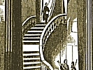

  
[Intangible Textual Heritage](../../index)  [Freemasonry](../index) 
[Index](index)  [Previous](gar28)  [Next](gar30) 

------------------------------------------------------------------------

[Buy this Book at
Amazon.com](https://www.amazon.com/exec/obidos/ASIN/B002AMUDMG/internetsacredte)

------------------------------------------------------------------------

  
*General Ahiman Rezon*, by Daniel Sickels, \[1868\], at Intangible
Textual Heritage

------------------------------------------------------------------------

### The Lights of the Lodge.

A Lodge has three symbolic lights:—one in the East, one in the West, and
one in the South.

\*       \*       \*       \*       \*       \*       \*

The fixed lights of the Lodge were formerly represented by "three
windows, supposed to be in every room where a Lodge is

p. 83

held; referring to the cardinal points of the compass, according to the
antique rules of Masonry." There was one in the East, another in the
West, and another in the South, to light the men *to*, *at*, and *from*
labor; but there was none in the North, because the sun darts no rays
from thence. These constitute the symbolic situations of the three chief
officers. Hence it is affirmed that "a Lodge is, or ought to be, a true
representation of King SOLOMON'S temple, which was situated north of the
ecliptic; the sun and moon, therefore, darting their rays from the
south, no light was to be expected from the north; we, therefore,
masonically, term the north a place of darkness." The Master's place is
in the East, to call the brethren *to* labor; the Junior Warden is
placed in the South, to cheer and encourage them *at* their work; and
the Senior Warden in the West, to dismiss them *from* their daily toil.

This description of a Masonic Lodge will be found to embrace a perfect
picture of the universe, both in its attributes and its extent. The sun
governs the day, the moon the night, and the stars illumine the spangled
canopy of heaven; while the earth is spread with a carpet of natural
mosaic work, beautiful to the eye, and administering to the necessities
of man.

A Lodge has six jewels; three movable and three immovable.

The immovable jewels are the SQUARE, LEVEL, and PLUMB. [\*](#fn_17)

The Square inculcates morality; the Level, equality; and the Plumb,
rectitude of conduct.

The movable jewels are the ROUGH ASHLAR, the PERFECT ASHLAR, and the
TRESTLE-BOARD. [†](#fn_18)

p. 84

The Rough Ashlar is a stone as taken from the quarry in its rude and
natural state. The Perfect Ashlar is a stone made ready by the hands of
the workmen, to be adjusted by the working-tools of the Fellow Craft.
The Trestle-board is for the Master-workman to draw his designs upon.

By the Rough Ashlar we are reminded of our rude and imperfect state by
nature; by the Perfect Ashlar, of that state of perfection at which we
hope to arrive by a virtuous education, our own endeavors, and the
blessing of God; and by the Trestle-board we are also reminded that, as
the operative workman erects his temporal building agreeably to the
rules and designs laid down by the Master on his Trestle-board, so
should we, both operative and speculative, endeavor to erect our
spiritual building in accordance with the designs laid down by the
Supreme Architect of the Universe, in the Great Book of Nature and
Revelation, which is our spiritual, moral, and Masonic Trestle-board.

The Trestle-board is for the Master to draw his plans and designs upon,
that the building may be constructed with order and regularity. It
refers to the Sacred Volume, which is denominated the Trestle-board of
the Grand Architect of the Universe, because in that Holy Book he has
laid down such magnificent plans and holy designs, that, were we
conversant therein and adherent thereto, it

p. 85

would prepare us for that building not made with hands, eternal in the
heavens.

------------------------------------------------------------------------

### Footnotes

[83:\*](gar29.htm#fr_17) They are called
Immovable jewels, because they are always to be found in the East, West,
and South parts of the Lodge, being worn by the Master, Senior Warden,
and Junior Warden.

[83:†](gar29.htm#fr_18) Such is the
generally-acknowledged division of the jewels in the Lodges in this
country; but in the English Lodges, the reverse is the case. There, the
Rough and Perfect Ashlars and the Trestle-board are the immovable
jewels, and the Square, Level, and Plumb are the movable, because they
descend from one set of officers to their successors.

------------------------------------------------------------------------

[Next: Situation of the Lodge](gar30)
