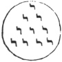

  
[Intangible Textual Heritage](../../index)  [Freemasonry](../index) 
[Index](index)  [Previous](gar30)  [Next](gar32) 

------------------------------------------------------------------------

[Buy this Book at
Amazon.com](https://www.amazon.com/exec/obidos/ASIN/B002AMUDMG/internetsacredte)

------------------------------------------------------------------------

  
*General Ahiman Rezon*, by Daniel Sickels, \[1868\], at Intangible
Textual Heritage

------------------------------------------------------------------------

### Dedication of Lodges.

Lodges were anciently dedicated to King SOLOMON, as he was our first
Most Excellent Grand Master; but Masons professing Christianity,
dedicate theirs to St. JOHN the Baptist and St. JOHN the Evangelist, who
were two eminent patrons of Masonry; and since their time, there is
represented in every regular and well-governed Lodge a certain *Point
within a Circle*—the point representing an individual brother; the
circle, the boundary-line of his conduct to GOD and man, beyond which he
is never to suffer his

p. 87

passions, prejudices, or interests to betray him, on any occasion. This
circle is embordered by two perpendicular parallel lines, representing
those Saints, who were perfect parallels in Christianity, as well as in
Masonry; and upon the vertex rests the Holy Scriptures, which point out
the whole duty of man. In going around this circle, we necessarily touch
upon these two lines, as well as upon the Holy Scriptures; and while a
Mason keeps himself thus circumscribed, it is impossible that he should
materially err.

"But though past all diffused, without a shore  
 His essence; local is his Throne, as meet  
 To gather the dispersed, as Standards call  
 The listed from afar; to fix a point,  
 A *central point*, collective of his sons,  
 Since finite every nature but his own,  
     \*    \*    \*    \*    \*    \*    \*  
 If earth's whole orb by some dire distant eye  
 Were seen at once, her towering Alps would sink,  
 And level’d Atlas leave an even sphere.  
 Thus earth, and all that earthly minds admire,  
 Is swallow’d In *Eternity's vast round*,"—YOUNG.

"Whether we regard this symbol in the purity of its legitimate
interpretation, or consider the unlimited corruption which it sustained
in its progress through the mysteries of idolatry, the general principle
will be found equally significant. It was originally the conservator of
a genuine moral precept, founded on a fundamental religious truth; but
innovation followed innovation, until this degraded symbol became the
dreadful depository of obscenity and lust.

"The use of this emblem is coeval with the first created man. A primary
idea which would suggest itself to the mind of ADAM, when engaged in
reflections on his own situation, the form of the universe, and the
nature of all the objects presented to his view, would

p. 88

be, that *the creation was a circle and himself the center*. This
figure, implanted without an effort, would be ever present in all his
contemplations, and would influence his judgment to a certain extent,
while attempting to decide on the mysterious phenomena which were
continually before him. To persons unacquainted with the intricate
philosophy of Nature, as we may fairly presume ADAM was, this is the
plain idea conveyed to the senses by a superficial view of Nature's
works. Ask an unlettered hind of the present day, and he will tell you
that the earth is a circular plane; and perhaps he will have some
indistinct notion that the expanse above his head is spherical, but he
will assuredly look upon *himself* as the common center of all. This is
consistent with the general appearance of things; for, if he look
around, be finds the horizon, unless intercepted by the intervention of
sensible objects, equally distant from the point of vision in all its
parts. And the experiment uniformly producing the same results, whether
made by night or day, he relies on the evidence of his senses, and
pronounces his own judgment correct and irrefutable. So the first
created man. Himself the center of the system, he would regard Paradise
as the limit of the habitable earth, and the expanse as the eternal
residence of the omnipresent Deity. A little reflection, however, would
soon bring him nearer to the truth. The garden of Eden was of a circular
form, and the Tree of Life was placed in the center. Now, as the fruit
of this tree was reputed to convey the privilege of immortality, the
center would hence be esteemed the most honorable situation, and be
ultimately assigned to the Deity, who alone enjoys the attributes of
immortality and eternity; for ADAM, in his progress to different parts
of this happy abode, would soon conclude that, however he might be
deceived by appearances, *he* himself could not be a permanent center,
because he was constantly c89}hanging his position.

"To this august Circle the two forbidden trees were the accompanying
perpendicular parallel lines, pointing out GOD'S equal *justice* and
*mercy*. When ADAM had violated the divine command, and eaten of the
tree of knowledge, *justice* demanded that the threatened penalty should
be paid. But here *mercy* interposed, and he was expelled from the abode
of purity and peace, now violated by transgression, 'lest he should put
forth his hand, and take also of the tree of life, and live for ever' in
a state of wickedness and sin. Hence arose the Masonic emblem of a Point
within a Circle."

p. 89

\*       \*       \*       \*       \*       \*       \*

"When mankind had transferred their adoration from the Creator to his
works, they advanced specious reasons to justify a devotion to spheres
and circles. Every thing great and sublime, which was continually
presented to their inspection, partook of this form. The sun, the
unequivocal source of light and heat, was a primary object of attention,
and became their chief deity. The earth, the planets, and fixed stars,
proceeding in all their majestic regularity, excited admiration, and
implanted devout feelings in their hearts. These were all spherical, as
was also the arch of heaven, illuminated with their unfading luster. The
next progressive observations of mankind would be extended to the
unassisted efforts of Nature in the production of plants and trees; and
these were found to exhibit, for the most part, the same uniform
appearances. From the simple stalk of corn, to the bole of the gigantic
lord of the forest, the cylinder and cone, and consequently the circle,
were the most common forms assumed by the vegetable creation. Every
fruit he plucked—every root he dug from the earth for food—was either
globular, cylindrical, or conical, each partaking of the nature of a
circle. If a tree were divided horizontally, the section uniformly
exhibited the appearance of a Point within a succession of concentric
circles. The same will be true of many varieties of vegetables; and
similar results would be produced from an inspection of animal bodies.
The trunk is a cylinder; and the intestines, so often critically
examined for the purposes of augury, presented to the curious inquirer
little variation from the general principle. Hence statues bearing these
forms were subsequently dedicated to the Olympic gods; a Cylinder, to
the earth; and a Cone to the sun.

"In this figure, Nature, in her most sportive mood, appeared exclusively
to delight. If a bubble were excited on the water, it was spherical; and
if any solid body were cast upon, the surface, the ripple formed itself
into innumerable concentric circles, rapidly succeeding each other, of
which the body, or moving cause, was the common center. If water were
cast into the air, they found that the drops invariably arranged
themselves into a globular form. This uniformity was soon observed, and
thought to be a preternatural indication of divinity; for if Nature
assumed one unvarying character in all her works, that character must be
an unquestionable symbol of the GOD of Nature. Hence the Circle, with
its center distinctly marked, became a most sacred emblem with every
nation of idolaters; adopted perhaps from the same symbol used by their

p. 90

forefathers on the plain of Shinar; referring primarily to the
immeasurable expanse occupied by infinite space; a proper type of
eternity, but now justified by a reference to the works of Nature. This
was the general belief, though the expression varied in different ages
and among the inhabitants of different nations.

"The tribes contiguous to Judea placed a *Jod* (‏י‎) in the center of a
circle, as a symbol of the Deity surrounded by Eternity, of which He was
said to be the inscrutable author, the ornament, and the support. The
Samothracians had a great veneration for the Circle, which they
considered as consecrated by the universal presence of the Deity; and
hence *rings* were distributed to the initiated, as amulets possessed of
the power of averting danger. The Chinese used a symbol which bore a
great resemblance to that which is the subject of this annotation. The
Circle was bounded north and south by two serpents, (equivalent to the
two perpendicular parallel lines of the Masonic symbol,) and was
emblematical of the *Universe*, protected and supported equally by the
*Power* and *Wisdom* of the Creator. The Hindoos believed that the
Supreme Being was correctly represented by a perfect sphere, without
beginning and without end. The first settlers in Egypt transmitted to
their posterity an exact copy of our Point within a Circle, expressed in
emblematical language. The widely-extended universe was represented as a
circle of boundless light, in the center of which the Deity was said to
dwell; or, in other words, the circle was symbolical of His *eternity;*
and the perpendicular parallel lines by which it is bounded, were the
two great luminaries of heaven, the sun and moon; the former denoting
His *virtue*—the latter His *wisdom*. And this idea was generally
expressed by a hawk's head in the center of a circle, or an endless
serpent inclosing an eye.

"But the most expressive symbol to this effect used by any people who
had renounced the true religion, was the famous emblem of 

|                    |
|--------------------|
|  |

PYTHAGORAS, who contrived not merely to express the only one GOD,
residing in the midst of eternity, but united with it an idea of the
divine Triad, and blended emblems of regeneration, morality, and
science. For this purpose he added to the central Jod nine other Jods,
disposed about the center in the form of an equilateral triangle, each
side consisting of the number FOUR. The disciples of PYTHAGORAS
denominated this symbol *Trigonon-mysticum*, because it was the
conservator of many awful and important truths.

p. 91

"1. The *Monad*, or active principle.

"2. The *Duad*, or passive principle.

"3. The *Triad*, or world proceeding from their union.

"4. The sacred *Quarternary*, involving the liberal Sciences, Physics,
Morality, etc., etc.

"Of this remarkable emblem, a full explanation may be equally
interesting and instructive.

"The symbol of all things, according to PYTHAGORAS, was *one* and *two*.
One added to two make *three;* and once the square of two make FOUR,
which is the perfect *Tetractys;* and 1+2+3+4=10, the consummation of
all things; and therefore the amount of the points contained within the
Pythagorean Circle is exactly TEN. Hence, because the first *four*
digits added into each other made up the number ten, this philosopher
called the number *four* πάντα ἀριθμὸν, *all number*, or the *whole
number;* and used it as the symbol of universality. [\*](#fn_20) To ascertain, however, the entire meaning
of this symbol, it will be necessary to take the numbers included within
the Circle in their natural order, and hear what hidden mystery the
philosophy of PYTHAGORAS attached to each.

"The number ONE was the Point within the Circle, and denoted the central
fire, or GOD; because it is the beginning and ending—the first and the
last. It signified, also, love, concord, piety, and friendship; because
it is so connected that it cannot be divided into parts. Two meant
darkness, fortitude, harmony, and justice; because of its equal parts;
and the moon, because she is forked. THREE referred to harmony,
friendship, peace, concord, and temperance. All these, and many other
virtues, depended on this number and proceeded from it. FOUR referred to
the Deity: for it was considered *the number of numbers*. It is the
first solid figure; a point being 1, a line 2, a superficies 3, and a
solid 4. It was also the Tetractys; a WORD sacred among the
Pythagoreans, and used as a most solemn oath; because they considered it
the root and principle, the cause and maker, of all things."
\*     \*     \*     \*

p. 92

"The Point within the Circle afterwards became a universal emblem to
denote the temple of the Deity, and was referred to the Planetary
Circle, in the *center* of which was fixed the sun, as the universal god
and father of nature; for the whole circle of heaven was called GOD."
\*    \*    \*    \*    \*    \*    \*

"SERVIUS tells us it was believed that *the center* of a temple was the
peculiar residence of the Deity; the exterior decorations being merely
ornamental. Hence the astronomical character used to denote or represent
the sun, is a Point within a Circle; because that [figure](errata.htm#1)
is the symbol of perfection. The most perfect metal, gold, is also
designated in chemistry by the same character.

"With this reference the Point within a Circle was an emblem of great
importance among the British Druids. Their temples were circular, many
of them with a single stone erected in the center; their solemn
processions were all arranged in the same form; their weapons of war—the
circular shield with a central boss, the spear with a hollow globe at
its end, etc.—all partaking of this general principle; and without a
circle it was thought impossible to obtain the favor of the gods."

------------------------------------------------------------------------

### Footnotes

[91:\*](gar31.htm#fr_20) The sum of all the
principles of PYTHAGORAS is this:—"The Monad is the principle of all
things. From the Monad came the Indeterminate Duad, as matter subjected
to the cause of Monad; from the Monad and the indeterminate Duad,
numbers; *from numbers, points; from points, lines; from lines,
superficies; from superficies, solids;* from these solid bodies, whose
elements are four—Fire, Water, Air, and Earth—of all which transmuted,
and totally changed, the WORLD consists."

------------------------------------------------------------------------

[Next: Great Tenets of a Freemason](gar32)
