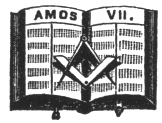

  
[Intangible Textual Heritage](../../index)  [Freemasonry](../index) 
[Index](index)  [Previous](gar35)  [Next](gar37) 

------------------------------------------------------------------------

[Buy this Book at
Amazon.com](https://www.amazon.com/exec/obidos/ASIN/B002AMUDMG/internetsacredte)

------------------------------------------------------------------------

  
*General Ahiman Rezon*, by Daniel Sickels, \[1868\], at Intangible
Textual Heritage

------------------------------------------------------------------------

p. 114 p. 115

### DEGREE OF FELLOW-CRAFT.

#### Symbolism of the Degree

IF the object of the first degree be to symbolize the struggles of a
candidate groping in darkness for intellectual light, that of the second
degree represents the same candidate laboring amid all the difficulties
that encumber the young beginner in the attainment of learning and
science. The Entered Apprentice is to emerge from darkness to light—the
Fellow-Craft is to come out of ignorance into knowledge. This degree,
therefore, by fitting emblems, is intended to typify these struggles of
the ardent mind for the attainment of truth—moral and intellectual
truth—and, above all, that Divine truth, the comprehension of which
surpasseth human understanding, and to which, standing in the Middle
Chamber, after his laborious ascent of the Winding Stairs, he can only
approximate by the reception of an imperfect and yet glorious reward, in
the revelation of that "hieroglyphic light which none but Craftsmen ever
saw."

\_\_\_\_\_\_\_\_\_\_\_

SECOND LECTURE.

MASONRY is a progressive science, and is divided into different classes,
or degrees, for the more regular advancement in the knowledge of its
mysteries. According to the progress we make, we limit or extend our
inquiries: and, in proportion

p. 116

to our capacity, we attain to a less or greater degree of perfection.

Freemasonry includes within its circle almost every branch of polite
learning. Under the vail of its mysteries is comprehended a regular
system of science. Many of its illustrations, to the confined genius,
may appear unimportant; but the man of more enlarged faculties will
perceive them to be, in the highest degree, useful and interesting. To
please the accomplished scholar and ingenious artist, Freemasonry is
wisely planned; and, in the investigation of its latent doctrines, the
philosopher and mathematician may experience equal delight and
satisfaction.

To exhaust the varied subjects of which it treats, would transcend the
powers of the brightest genius; still, however, nearer approaches to
perfection may be made; and the man of wisdom will not check the
progress of his abilities, though the task he attempts may at first seem
insurmountable. Perseverance and application remove each difficulty as
it occurs; every step he advances, new pleasures open to his view, and
instruction of the noblest kind attends his researches. In the diligent
pursuit of knowledge, the intellectual faculties are employed in
promoting the glory of GOD and the good of man.

The first degree is well calculated to enforce the duties of morality,
and imprint on the memory the noblest principles which can adorn the
human mind. It is, therefore, the best introduction to the second
degree, which not only extends the same plan, but comprehends a more
diffusive system of knowledge. Here, practice and theory join in
qualifying the industrious Mason to share the pleasures which an
advancement in the art must necessarily afford. Listening with attention
to the wise opinions of experienced Craftsmen, on important subjects, he
gradually familiarizes his mind to useful instruction, and is soon
enabled to investigate truths of the utmost concern in the general
transactions of life.

p. 117

From this system proceeds a rational amusement; while the mental, powers
are fully employed, the judgment is properly exercised; a spirit of
emulation prevails; and all are induced to contend who shall most excel
in promoting the valuable rules of the institution.

#### SECTION I.

THE first section of the second degree accurately elucidates the mode of
introduction into that particular class, and instructs the diligent
Craftsman how to proceed in the proper arrangement of the ceremonies
used on the occasion. It qualifies him to judge of their importance, and
convinces him of the necessity of strictly adhering to every established
usage of the Order. Here he is intrusted with particular tests, to
enable him to prove his title to the privileges of this degree, while
satisfactory reasons are given for their origin. Many duties, which
cement in the firmest union well-informed brethren, are illustrated in
this section; and an opportunity is given to make such advances in
Masonry as will always distinguish the abilities of those who have
arrived at preferment.

The Square is an important emblem in this degree. The Fellow-Craft is
instructed, on his entrance, that this symbol should be the rule and
guide of his conduct with all mankind, but especially with a brother
Mason.

The following passage of Scripture is rehearsed in this degree:

"Thus he showed me: and behold the LORD stood upon a wall made by a
plumb-line, with a plumb-line in his hand. And the LORD said unto me,
Amos, what seest thou? and I said, A plumb-line.

p. 118

\[paragraph continues\] Then said the
LORD, Behold, I will set a plumb-line in the midst of my people Israel;
I will not again pass by them any more."—Amos vii. 7, 8.

Or the following ODE may be sung:

  [  
Click to enlarge](img/11800.jpg)  
AIR.—What Fairy-like Music.  

Come, Craftsmen, assembled, our pleasure to share,  
Who work by the Plumb, and remember the Square;  
While trav’ling, in love, on the Level of time,  
Sweet hope shall light on to a far better clime.

p. 119

We'll seek, in our labors, the Spirit Divine,  
Our Temple to bless, and our hearts to refine;  
And thus to our altar a tribute we'll bring,  
While, joined in true friendship, our anthem we sing.

See Order and Beauty rise gently to view,  
Each Brother a column, so perfect and true!  
When Order shall cease, and when temples decay,  
May each fairer columns immortal survey.

\*       \*       \*       \*       \*       \*       \*

 

\*       \*       \*       \*       \*       \*       \*

The three   allude to the
three \* \* \*, which are the Attentive Ear, the Instructive Tongue, and
the Faithful Breast.

------------------------------------------------------------------------

[Next: Symbolical Jewels](gar37)
