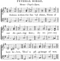

  
[Intangible Textual Heritage](../../index)  [Freemasonry](../index) 
[Index](index)  [Previous](gar52)  [Next](gar54) 

------------------------------------------------------------------------

[Buy this Book at
Amazon.com](https://www.amazon.com/exec/obidos/ASIN/B002AMUDMG/internetsacredte)

------------------------------------------------------------------------

  
*General Ahiman Rezon*, by Daniel Sickels, \[1868\], at Intangible
Textual Heritage

------------------------------------------------------------------------

\*       \*       \*       \*       \*       \*       \*

#### FUNERAL DIRGE.

 
[  
Click to enlarge](img/19800.jpg)  
Music—*Pleyel's Hymn*.  

Solemn strikes the fun’ral chime,  
Notes of our departing time;  
As we journey here below,  
Thro’ a pilgrimage of woe.

p. 199

Mortals, now indulge a tear,  
For Mortality is here!  
See how wide her trophies wave  
O’er the slumbers of the grave!

Here another guest we bring;  
Seraphs of celestial wing,  
To our fun’ral altar come,  
Waft our friend and brother home.

There, enlarged, thy soul shall see  
What was wailed in mystery;  
Heavenly glories of the place  
Show his Maker, face to face.

LORD of all! below—above—  
Fill our hearts with truth and love;  
When dissolves our earthly tie,  
Take us to thy Lodge on high.

Prayer at raising a brother to Master Mason's degree:

THOU, O GOD! knowest our down-sitting and our up-rising, and
understandeth our thoughts afar off. Shield and defend us from the evil
intentions of our enemies, and support us under the trials and
afflictions we are destined to endure, while traveling through this vale
of tears. Man that is born of a woman is of few days, and full of
trouble. He cometh forth like a flower, and is cut down; he fleeth also
as a shadow, and continueth not. Seeing his days are determined, the
number of his months are with thee; thou hast appointed his bounds that
he cannot pass;

p. 200

turn from him that he may rest, till he shall accomplish his day. For
there is hope of a tree, if it be cut down, that it will sprout again,
and that the tender branch thereof will not cease. But man dieth, and
wasteth away; yea, man giveth up the ghost, and where is he? As the
waters fail from the sea, and the flood decayeth and drieth up, so man
lieth down, and riseth not up till the heavens shall be no more. Yet, O
LORD! have compassion on the children of thy creation; administer them
comfort in time of trouble, and save them with an everlasting
salvation.—AMEN.

*Response*.—So mote it be.

------------------------------------------------------------------------

[Next: Rites of Sepulture—Hebrew Customs](gar54)
