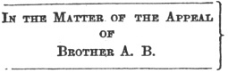

  
[Intangible Textual Heritage](../../index)  [Freemasonry](../index) 
[Index](index)  [Previous](gar74) 

------------------------------------------------------------------------

[Buy this Book at
Amazon.com](https://www.amazon.com/exec/obidos/ASIN/B002AMUDMG/internetsacredte)

------------------------------------------------------------------------

  
*General Ahiman Rezon*, by Daniel Sickels, \[1868\], at Intangible
Textual Heritage

------------------------------------------------------------------------

p. 389

### APPENDIX.

#### FORM OF PETITION FOR A NEW LODGE.

To the M. W. Grand Master of Masons of the State of

THE undersigned petitioners, being Ancient Free and Accepted Master
Masons, having the prosperity of the fraternity at heart, and willing to
exert their best endeavors to promote and diffuse the genuine principles
of Masonry, respectfully represent—That they are desirous of forming a
new Lodge in the ...... of ....... to be named ...... No. .... They
therefore pray for letters of dispensation, to empower them to assemble
as a regular Lodge, to discharge the duties of Masonry, in a regular and
constitutional manner, according to the original forms of the Order, and
the regulations of the Grand Lodge. They have nominated and do recommend
Brother A. B. to be the first Master; Brother C. D. to be the first
Senior Warden, and Brother E. F. to be the first Junior Warden, of said
Lodge. If the prayer of this petition shall be granted, they promise a
strict conformity to the edicts of the Grand Master, and the
constitution, laws and regulations of the Grand Lodge.

#### FORM OF DISPENSATION FOR A NEW LODGE.

*To all whom it may concern:*

KNOW YE, That we, A. B., Most Worshipful Grand Master of Ancient, Free
and Accepted Masons of ......, having received a petition from a
constitutional number of brethren, who have been properly vouched for as
Master Masons in good standing, setting forth that, having the honor and
prosperity of the Craft at heart, they are desirous of establishing a
new Lodge at ...... under our masonic jurisdiction, and requesting a
Dispensation for the same:

p. 390

\[paragraph continues\] And whereas there
appears to us good and sufficient cause for granting the prayer of the
said petition; we, by virtue of the powers in us vested by the ancient
Constitutions of the Order, do grant this our DISPENSATION, empowering
Brother A. B. to act as Worshipful Master, Brother C. D. to act as
Senior Warden, and Brother E. F. to act as Junior Warden of a Lodge to
be held under our jurisdiction at ...... by the name of ...... And we
further authorize the said brethren to *Enter*, *Pass*, and *Raise*
Freemasons, according to the Ancient Constitutions of the Order, the
customs and usages of the Craft, and the Rules and Regulations of the
Most Worshipful Grand Lodge of ......, and not otherwise. And this our
DISPENSATION shall continue of force until the Grand Lodge aforesaid
shall grant a Warrant of Constitution for the same, or this DISPENSATION
be revoked by us, or the authority of the aforesaid Grand Lodge.

<table data-border="0">
<colgroup>
<col style="width: 50%" />
<col style="width: 50%" />
</colgroup>
<tbody>
<tr class="odd">
<td data-valign="top" width="327">
[L. S.]
</td>
<td data-valign="top" width="327">
Given under our hand, and the seal [L. S.] of the Grand Lodge, at ..... this .... day of ......,A∴L∴ 58   .
</td>
</tr>
<tr class="even">
<td data-valign="top" width="327">
Y...... Z......, 
     <em>Grand Secretary</em>.
</td>
<td data-valign="top" width="327">
Q...... R....., 
      <em>Grand Master</em>.
</td>
</tr>
</tbody>
</table>

#### FORM OF WARRANT FOR A LODGE.

<table data-border="0">
<colgroup>
<col style="width: 100%" />
</colgroup>
<tbody>
<tr class="odd">
<td data-valign="top">
GRAND MASTER. 
DEP. G. MASTER. 
SEN. G. WARDEN. 
JUN. G. WARDEN.
</td>
</tr>
</tbody>
</table>

WE, the Grand Lodge of the Most Ancient and Honorable Fraternity of Free
and Accepted Masons, of the State of ......, in Ample Form assembled,
according to the Old Constitutions, regularly and solemnly established
under the auspices of Prince Edwin, at the city of York, in Great
Britain, in the year of Masonry 4926, viz.:

|                      |                 |
|----------------------|-----------------|
| The Most Worshipful  | Grand Master,   |
| The Right Worshipful | Dep. G. Master, |
| The Right Worshipful | Sen. G. Warden, |

do, by these presents, appoint, authorize, and empower our worthy

p. 391

brother ........ to be the Master; our worthy brother ........ to be the
Senior Warden; and our worthy brother ........ to be the Junior Warden,
of a Lodge of Free and Accepted Masons, to be, by virtue hereof,
constituted, formed, and held in ............ which Lodge shall be
distinguished by the name or style of ...... and the said Master and
Wardens, and their successors in office, are hereby respectively
authorized and directed, by and with the consent and assistance of a
majority of the members of the said Lodge, duly to be summoned and
present upon such occasions, to elect and install the officers of the
said Lodge as vacancies happen, in manner and form as is, or may be,
prescribed by the Constitution of this Grand Lodge.

And further, the said Lodge is hereby invested with full power and
authority to assemble upon proper and lawful occasions, to make Masons,
and to admit members, as also to do and perform all and every such acts
and things appertaining to the Craft as have been and ought to be done,
for the honor and advantage thereof, conforming in all their proceedings
to the Constitution of this Grand Lodge, otherwise this Warrant, and the
powers thereby granted, to cease and be of no further effect.

Given under our hands and the seal of our Grand Lodge, at the city of
......, in the United States of America, this .... day of ......, in the
year of our Lord one thousand eight hundred and ......, and in the year
of Masonry five thousand eight hundred and ......

............   ............         
*Grand Secretary*.

Registered in the Book of the Grand Lodge,  
       Page ....

#### FORM OF A LODGE CERTIFICATE.

TO ALL FREE AND ACCEPTED MASONS ON THE FACE OF THE GLOBE—GREETING:

We, the Master and Wardens of ...... Lodge No. .... Free and Accepted
Masons, constituted under a charter from the M. W. Grand Lodge of the
State of ......, do certify that our worthy brother ...... has been
regularly initiated as an Entered Apprentice,

p. 392

passed to the degree of Fellow Craft, and raised to the sublime degree
of Master Mason, and is distinguished for his zeal and fidelity to the
Craft. We do therefore recommend that he be received and acknowledged as
such by all true and accepted Freemasons wheresoever dispersed.

In testimony whereof we have granted him this certificate under our
hands and the seal of the Lodge (having first caused our worthy brother
to sign his name in the margin), this .... day of .... A. D. 18.., A. L.
58..

|                                          |       |
|------------------------------------------|-------|
| W. M.                                    | S. W. |
| Sec’y.                                   | J. W. |

This is to certify that ...... Lodge No. .. is a legally constituted
Lodge, working under the jurisdiction of the M. W. Grand Lodge of ......

             ...... 585.

                          ............ Grand Sec’y.

#### FORM OF A GRAND LODGE DIPLOMA.

*We, the Grand Lodge of the State of New York*, by these presents
testify and declare to all whom it may concern, that our brother ......,
who has signed his name in the margin hereof, is a regular Master Mason
of ...... Lodge No. .., as appears to us by the certificate of the said
Lodge held under our jurisdiction in the ...... county of ...... State
of New York, in the United States of America. In testimony whereof we
have caused our seal to be hereunto affixed, and our Grand Secretary to
subscribe the same, at the city of New York, this .. day of .... A. D.
18.. A. L. 58..

............ ...... Grand Secretary.

#### FORM OF A DIMIT.

#### FREE AND ACCEPTED MASONS.

|                           |                |
|---------------------------|----------------|
| ...... .................. | Lodge No. .... |

Acknowledging the jurisdiction of the Grand Lodge of the State of
......, to all whom it may concern, erecting: This certifies

p. 393

that brother ......, whose name appears in the margin of this dimit, is
a Master Mason, and was a member of this Lodge in good standing and
clear of the books, and as such we do cordially commend him to the
fraternal guard of all true Free and Accepted Masons, wherever dispersed
around the globe.

In testimony whereof we have caused this dimit to be signed by the
Master, and the seal of the Lodge to be attached, this .... day of A. D.
18.., A. L. 68..

|                                |                            |
|--------------------------------|----------------------------|
| ............ ...... Secretary. | .................. Master. |

#### FORM OF TRIALS AND APPEALS.

THE first step to be taken toward a Masonic trial is, of course, to
prefer charges, or make a complaint. The important requisites of a
complaint are, that it should be brief, and yet comprehensive, clearly
defining the nature of the offense charged, with an accurate specifying
of the time, place and circumstances of its commission. This, when the
transaction took place out of the Lodge, may be preferred by any
brother, but should properly be presented by the Junior Warden. It may
be in this form:

#### 1.—Complaint.

To the W. Master, Wardens and Brethren of Triluminar Lodge, No. 800:
Brother A. B. is hereby charged with *immoral and unmasonic conduct:*

*First Specification*.—That the said A. B., on the first day of April
1859, in the public street, at Freetown, in the county of ......, was in
a state of intoxication from the use of strong and spirituous
[liquors](errata.htm#8), in violation of his duty as a Mason, and to the
scandal and disgrace of the Masonic Fraternity.

*Second Specification*.—That the said A. B., on the first day of April,
1859, at Freetown aforesaid, and at various other times and places, in
the year 1859, was intoxicated with strong and spirituous liquors,
although admonished therefor by the Master and Wardens of this Lodge, in
violation of his duty as a Mason, to the great scandal and disgrace of
the Fraternity; and it is hereby demanded, that the said A. B. be dealt
with therefor, according to Masonic law and usage.

|                      |                         |
|----------------------|-------------------------|
| Dated April 9, 1859. | R. L., *Junior Warden*. |

p. 394

#### 2.—Complaint (in another form.)

To the W. Master, Wardens and Brethren of Triluminar Lodge, No. 800:
Brother C. D. is hereby charged with *immoral and unmasonic conduct:*

*First Specification*.—That the said C. D., on the first day of April,
1859, at Freetown, in the county of ......, in the presence and hearing
of Bro. E. F., and others, spoke and declared of Bro. G. H., of Anchor
Lodge, No. 801, these words in substance: that the said G. H. was a
dishonest man; that he was a knave and a cheat; and that he was a liar,
to the great injury of the said G. H., and to the common scandal and
disgrace of the Masonic Fraternity.

*Second Specification*.—That the said C. D., on the first day of April,
1859, at Freetown aforesaid, in the presence and hearing of Mr. Y. Z.,
and others, publicly spoke and declared of the said G. H., who was not
present, that he, the said G. H., was a dishonest man, a knave, a cheat
and a liar, in violation of the duties of the said C. D. as a Master
Mason, to the great injury of the said G. H., and to the common scandal
and disgrace of the said Anchor Lodge, No. 801, and of the Masonic
Fraternity; and it is therefore hereby demanded, that the said C. D. be
put upon trial therefor.

S. L., *Junior Warden*.

Dated April 9, 1859.

These forms might be indefinitely multiplied, but these will be
sufficient to show the manner and importance of specifying time, place
and circumstances constituting the offense.

This charge (and that contained in the first form will hereafter he
followed) having been presented in open Lodge, and received, the Master
thereupon appoints commissioners to hear and try the same, pursuant to
the provisions of the constitution, which is entered upon the minutes.
The charges need not be entered, but the nature of them should be. It is
then the duty of the Secretary immediately to serve upon the accused a
copy of the charges, with the following notice annexed:

#### 3.—Notice of Charges.

Bro. A. B. Take notice, that the within (or foregoing) is a copy of the
charges preferred against you, at a stated communication of Triluminar
Lodge, No. 800, held on the 9th of April, inst., and

p. 395

that Bros. R. S., T. U. and V. N. were appointed commissioners to hear
and try the same.

P. Q., *Secretary*.

Dated, April 10, 1859.

Should the commissioners determine, at the time the charges are
preferred (and it is recommended that they should in all cases, if
possible), when and where they will meet for trial, the Secretary may
add to the above notice the following: "and that they will meet for that
purpose on the 20th instant, at 7 o’clock P.M., at Triluminar Lodge
room, at Freetown, at or before which time you are required to answer
said charges."

In case the accused absent himself, so that the charges cannot he
personally served, the copy may be transmitted by mail, if his residence
be known; if not, after a reasonable time, and after diligent inquiry,
the Secretary should report the fact to the Lodge for their further
action. In all cases the prosecutor or Secretary should take care that
the accused be served with notice of the time and place of meeting of
the commissioners for trial, at the time of service of the charges.

The charges being served, it is the first duty of the accused, if he has
an objection to any of the commissioners, to make his challenge, that
the master, if satisfied that there is ground for it, may supply the
vacant place by another appointment. If there be doubts as to its
foundation, the master, or other commissionors, may act as triers; but
it is recommended that if there be reasonable objection, or probable
cause therefor be manifest, that the commissioner challenged remove all
question by resignation.

The tribunal being properly constituted, it is next the duty of the
accused to answer the charges. As this must be in every case equivalent
to the well-known plea of "Not Guilty," it is scarcely necessary to
furnish a form, yet, for the sake of making up a complete record, in
cases of appeal, one is subjoined:

#### 4.—Answer.

C. D., in person, denies the charges made against him, and every matter
and thing contained in the several specifications of the same, and
demands trial thereon.

Of course this answer will vary according to the facts of each case. One
specification may be admitted and another denied.

p. 396

The charge and specifications may be admitted, and matters set up in
extenuation or excuse. Assuming the answer to be a denial the issued is
formed, and the parties proceed to trial. To procure the attendance of
witnesses on either side, some process may be necessary. If the witness
be not a Mason, his attendance must, of course, be voluntary; but a
Mason is bound to obey a summons. This may be issued by any master of a
Lodge (Constitution § 56), and in the following form:

#### 5.—Summons for Witness.

To Bro. I. J.: You are hereby summoned and required to at-. tend as a
witness before the commissioners appointed for the trial of A. B., on
certain charges preferred against him, on the 20th day of April,
instant, at 7 o'clock P.M., at the Lodge room of Triluminar Lodge, No.
800, in Freetown, and there to testify the truth, according to your
knowledge.

K. L., *Master*.

Dated, April 16, 1859.

This may be made to answer for several witnesses, by inserting their
names and adding the words "and each of you" after the word "you." The
brother disobeying such a summons may be proceeded against as in case of
disobedience to any other summons. For this purpose the person serving
it should note upon it when and how it is served.

The commissioners, having met for trial, should organize; that is to
say, one of their number (and usually the first named) should preside,
though they may choose another for that purpose; and another of them
should be chosen to act as their clerk, and keep the minutes of their
proceedings. A copy of the resolution under which they were appointed,
together with their appointment, should be furnished them by the
Secretary. They should keep minutes of their proceedings, which may be
in this form:

#### 6.—Minutes of Commissioners.

The commissioners appointed for the trial of A. B., on the charges a
copy of which is hereto annexed (marked A) pursuant to the following
resolution (copy resolution), assembled at the Lodge room of Triluminar
Lodge, No. 800, on Wednesday evening, the 20th of April, 1859:

p. 397

Present: R. S., T. U. and V. N., commissioners. R. S. officiated as
chairman, and V. N. was chosen clerk.

A. B. appeared before them and objected to T. U., one of the
commissioners, on the ground that he was present at the meeting of the
Lodge when the charges were preferred, and voted for their reference.

Bro. T. U. stated that he had formed no opinion on the subject, and the
other commissioners decided that he was competent to act as
commissioner, to which Bro. B. took an exception.

The charges were then read by Bro. S. L., Junior Warden, together with
the answer of Bro. A. B.

Bro. B. requested that P. S., Esq., an attorney and not a Ma son, should
examine the witnesses on his behalf and assist him in his defense. The
commissioners decided against the request, but further decided that he
might employ the services of any brother to assist him in defense; to
which Bro. B. took an exception. He then employed Bro. N. O. to assist
him as counsel. Bro. O. objected to the form of the charges as being
vague and uncertain, but the commissioners decided them to be
sufficient; to which Bro. O. took an exception.

Bro. E. F. was then introduced as a witness by the Junior Warden, and
testified as a Master Mason as follows: I am acquainted with Bro. A. B.;
I saw him on Main street, in Freetown, on the first day of April last; I
was on the opposite side of the street; he appeared to be much
intoxicated (objection was made to the *appearance* of accused, but it
was overruled and an exception taken) he was there for about half an
hour; he reeled as he walked, &c.

On cross-examination Bro. E. F. further testified: I know that Bro. B.
had been sick, &c.

The commissioners then adjourned to meet at the same place on Thursday
evening, the 21st April 1859, at 7 o'clock Y. M.

*Thursday evening*, *April* 21, 1859.

The commissioners met pursuant to adjournment: present all the
commissioners and also Bro. L. the Junior Warden and Bro. A. B. and his
counsel Bro. O.

Bro. U. officiated as chairman.

Mr. H. C. was then introduced as a witness by the Junior Warden, and
stated as follows:

I was in Freetown on the first day of April instant, &e.

p. 398

The proofs on the part of the complainant here rested.

Bro. O., on behalf of Bro. A. B., then produced the sworn affil. davit
of Mr. J. B., to which the Junior Warden objected, on the ground that
Mr. B. should be produced for cross-examination.

The commissioners sustained the objection on that ground, and Bro. O.
took an exception.

Mr. B. was then produced, and the Junior Warden then consented that his
affidavit might be read, which was read accordingly, and is hereto
annexted (marked B).

The Junior Warden then cross-examined Mr. B., who stated as follows, dc.

The proofs being closed, after hearing both parties, the commissioners
decided to meet again on the 23d day of April instant, to determine on
their report.

*Saturday, April* 23, 1859.

The commissioners again met by themselves, and after consultation
decided upon their report, a copy of which is hereto annexed (marked C),
and notified the parties thereof.

Signed by the Commissioners.

These minutes have been given in this extended form because hey present
a convenient way of stating certain facts and proceedings on trial.
Thus, the statement of formal objections and the grounds of them,
together with the decision thereon of the commissioners (which should
always be stated), are here set forth; also, that the Junior Warden
acted as prosecutor; that the employment of an attorney not being a
Mason was not permitted, but that the accused was permitted to have
counsel; that the first witness testified in his character as a Master
Mason, and that the second witness, not being a Mason, made his
statement merely, no oath being administered to either; that the
testimony is taken down in the words of the witness, and of course in
the first person as be spoke; that the precise point objected to is
stated; that the time and place of each adjournment are noted; that a
sworn affidavit was not admitted because no opportunity was given for
cross-examination; and, finally, that the commissioners met alone and
decided upon their report, and then gave notice to the parties; all of
which may furnish useful hints to those engaged in such trials, without
further comment; it being presumed that

p. 399

the usual forms of such proceedings and the ordinary rules of evidence
are understood and will be observed. It is at the option of the
commissioners whether they will admit any one to be present but the
parties and the witnesses testifying, but on all such occasions none but
Masons should be admitted, except the witness not a Mason, and while
testifying.

As the form of the notice given to the parties by the commissioners
(Constitution, § 57) may be desired, it is here given, and may be as
follows.

#### 7.—Notice of Decision.

To Bro. S., Junior Warden, and Bro. A. B.

You will each take notice that we have agreed upon and signed our report
in the matter of charges against Bro. A. B., referred to us, by which we
have found the charges sustained, and Brother B. guilty thereof, and
that the expenses of the proceedings be paid by him; and that we shall
present the report to Triluminar Lodge at its stated communication, on
the 30th April instant.

(Signed by the Commissioners.)

Dated April 23d, 1859.

The trial being concluded and the report thus agreed upon, the
commissioners will have it drawn up in form for the action of the Lodge.
This report need not, in the first place, contain anything but the facts
found and the conclusions arrived at thereon by the commissioners. These
conclusions, like those of any other committee, should be in the form of
resolutions, for the definite action of the Lodge. Should the Lodge, on
the report coming in, desire to hear the testimony read or any of the
decisions stated, it will be the duty of the commissioners to comply.

The report may be in the following form:

#### 8.—Report of Commissioners.

To the W. Master, Wardens and Brethren of Triluminar Lodge, No. 800.

The commissioners appointed for the trial of Bro. A. B., on charges of
intoxication heretofore preferred in this Lodge, respectfully report:

That they met at the Lodge room of this Lodge on Wednesday evening, the
20th of April last past, and proceeded to hear and try the matters
referred to them.

p. 400

That objections were presented to Bro. U., one of their number, which
they overruled, and also refused to permit Bro. B. to appear by counsel,
not being a Mason, and thereupon Bro. N. O. appeared for him. That
objections were made to the charges, which were overruled.

That they proceeded to take testimony (in the course of which they
decided not to admit a sworn affidavit), and Bro E. F. and Mr. H. C. and
Mr. J. B. were examined as witnesses.

That they held three meetings, the last of which was for the purpose of
agreeing upon and preparing their report.

That from the testimony before them they find the following facts:

1\. That Bro. A. B. was intoxicated with strong and spirituous liquors,
in a public place, at Freetown, on the first day of April, 1859.

2\. That Bro. A. B. has been at least twice intoxicated in a public
place, in Freetown aforesaid, within two weeks previous to the said
first day of April, 1859.

They therefore recommend the adoption of the following resolutions:

*Resolved*, That the charges of intoxication against Bro. A. B., made
and presented to this Lodge on the 9th day of April, 1859, are
sustained, and that he is guilty of the said charges.

*Resolved*, That Bro. A. B. be and he is hereby suspended from this
Lodge, and from the rights and privileges of Masonry, for the space of
three months from this date.

The charges and expenses of the commissioners amount to the sum of three
dollars, which they adjudge that Bro. A. B. should pay, of all which
they have notified the Junior Warden and Bro. A. B. All of which is
respectfully submitted,

|       |                  |
|-------|------------------|
| R. S. |                  |
| T. U. | *Commissioners*. |
| V. W. |                  |

Dated, April 23, 1859.

If the resolutions be adopted, the Secretary of the Lodge should
transcribe them on his minutes, together with the adjudication as to
charges and expenses. The resolutions, however, are subject to the
action of the Lodge, who may reverse the decision of the commissioners,
or, if sustained, may amend the resolution as to the penalty by
increasing or diminishing it; the decision of the commissioners,

p. 401

however, as to expenses is final (Cons. § 61.) Should the resolutions be
adopted (and for this purpose a majority vote is sufficient, unless the
by-laws provide differently,) and the accused be absent from the Lodge,
it is the duty of the Secretary to furnish him immediately with a copy
of the resolutions and of the award as to expenses, with a notice, which
may be in this form:

#### 9.—Notice of Judgment.

To Bro. A. B.:

Take notice, that the foregoing is a copy of resolutions adopted by
Triluminar Lodge, No. 800, at their communication held at their Lodge
room in Freetown, on the 30th day of April instant, together with a copy
of the award made by the commissioners as to expenses.

P. Q. *Secretary*.

Dated, April 30th, 1859.

Thus have been presented the ordinary proceedings from complaint to
judgment on a Masonic trial on charges preferred *in a Lodge*. Some of
them may be found practically unnecessary, but the complaint, minutes
and report are deemed important, and should be substantially followed in
every case. Other proceedings, under the title of the Constitution,
entitled "Of Trial and Its Incidents," may be adapted to them, varying
the allegations to suit the case, and bearing in mind that in all the
cases mentioned in section 54 the decision of the commissioners is
final, unless an appeal be taken from it. (§ 58.) In these cases the
report will be made to the Grand Lodge, and the minutes, with the report
annexed, filed in the office of the Grand Secretary, and notice given to
the parties by the commissioners. Their report, in such cases, need not
conclude with resolutions, but with an award of judgment in the nature
of both a verdict and sentence. It may be in this form, in place of the
recommendation of resolutions:

#### 10.—Report of Commissioners (*another form*).

The said commissioners do therefore adjudge and determine as follows:

1\. That the charges of intoxication against Bro. A. B., of Triluminar
Lodge, No. 800, preferred by Bro. C. D., of Anchor Lodge, No. 801, on
the 9th day of April, 1859, are sustained, and that he is guilty of the
said chargers.

p. 402

2\. That the said Bro. A. B. be and he is hereby suspended from said
Triluminar Lodge, and from the rights and privileges of Masonry, for the
space of three months from this date.

3\. That the said A. B. be adjudged to pay the charges and expenses of
the proceedings on this trial.

The charges and expenses, &c., (as in the preceding report, except as to
parties notified, and add) and our report has been duly filed with the
R. W. Grand Secretary (dated and signed by the commissioners).

The following may be the form of their notice:

#### 11.—Notice of Judgment by Commissioners.

To ....... and .......

Take notice that we have this day made and signed our report to the
Grand Lodge, by which we have adjudged and determined that Bro. A. B. is
guilty of the charges preferred against him, and that he is suspended
from Triluminar Lodge, No. 800, and from the rights and privileges of
Masonry, for the space of three months, and that he do pay the costs and
expenses of the proceedings before us; amounting to the sum of three
dollars.

Signed by the Commissioners.

Dated, April 23, 1859.

The subject of Appeals next claims our attention, and we shall still
follow the form of proceedings after trial on charges preferred in a
Lodge against a member.

The time limited in every case for bringing an appeal is six months (§
58); but where a party is intending to appeal it is advisable that he
give notice of it immediately, which may be in the following form:

#### 12.—Notice of Appeal.

To P. Q., Secretary of Triluminar Lodge, No. 800:

Take notice, that I shall bring an appeal from the action of said Lodge
on the 30th day of April, 1859, in passing sentence of suspension on me
for three months, to the M. W. Grand Lodge of the State of New York (or
the M. W. Grand Master, R. W. Deputy Grand Master, or R. W. District
Deputy Grand Master of this district, as he may choose,) on the grounds
to be stated in my appeal.

A. B.

Dated, May 4. 1859.

p. 403

On receiving this notice, the Secretary of the Lodge—or, in all cases
not under section 60, the commissioners—will transmit to the Grand
Lodge, or Grand officer, as the case may be, a copy of the minutes of
proceedings embracing the evidence, with n copy of the report, to the
Lodge—marked C and numbered 8—annexed, all duly attested and certified;
and by carefully observing these directions it may always be done
promptly. This, if filed with the Grand Secretary, may be furnished to
the Grand Lodge, or its Committee on Appeals, or to the Grand officer
appealed to, when desired. When the appeal is to a Grand officer, the
report may be transmitted to him directly, to be by him afterwards filed
with the Grand Secretary. The appellant should next prepare his appeal,
which may be in this form:

#### 13.—Appeal.

To the M. W. Grand Lodge of the State of New York (or M. W. Grand
Master):

The undersigned hereby appeals to you from the decision of Triluminar
Lodge, No. 800, made April 30, 1859, in passing sentence of suspension
on him for three months, and he specifies the following as the ground of
his appeal:

1\. That F. U., one of the commissioners on his trial, was incompetent
to act, having been present at the meeting of said Lodge when the
charges were preferred, and voted for their reference.

2\. That the commissioners erred in deciding that P. S., Esq., should
not be allowed to assist the undersigned in his defense.

3\. That the second specification of the charges is vague and uncertain.

4\. That the commissioners erred in receiving testimony as to
appearances of intoxication.

5\. That they erred in rejecting the sworn affidavit of J. R.

6\. That the proofs in the case were not sufficient to warrant the
finding of the commissioners.

7\. That the Lodge erred in passing the resolution of suspension by a
majority vote.

All of which appears by the papers, proceedings and evidence in the
case.

A. B.

Dated, May 11, 1859.

A copy of this appeal should be served on the Secretary of the

p. 404

\[paragraph continues\] Lodge; and it is
best, also, to serve a copy on the appellate tribunal or officer. Within
ten days (this is suggested as an admirable time, there being no
regulation on the subject,) an answer should be made to the appeal by
the Lodge. As in most cases this is merely taking issue, the form of an
answer on appeal may be unnecessary; yet one is subjoined, as follows:

#### 14.—Answer to Appeal.

Triluminar Lodge, No. 800, answers the appeal of A. B. and says:

That the said Lodge denies that there is any error in the proceedings of
said Lodge, or of the commissioners appointed for the trial of the said
A. B., and further says that the decision of said Lodge in said case is
sustained both by the law and evidence therein applicable thereto.

S. L., *Junior Warden*.

Dated, May 21, 1859.

This is very general, and if a specific denial is deemed
necessary—taking issue upon each of the grounds of appeal and assigning
reasons therefor—it may be made after the foregoing form in
commencement, and adding thereto as follows:

Because the said Lodge says as to the first ground of appeal, &c.

And because the said Lodge says as to the second ground of appeal, &c.

The case being thus fairly brought up on appeal, the Grand Lodge or
Grand officer may hear the same, either by oral argument, or the appeal
and answer thereto may be made sufficiently full to call attention to
all the points in the case and the reasons therefor. If the Secretary of
the Lodge shall have omitted a transcript of the proceedings of the
Lodge, and the same be required to make the case perfectly understood,
the Grand Master, Deputy Grand Master, or District Deputy Grand Master
may make an order in this form:

#### 15.—Order on Appeal.

OFFICE OF THE GRAND MASTER OF MASONS,  
May 28, 18..                   

To the W. Master, Warden and Brethren of Triluminar Lodge, No. 800:

Bro. A. B. having duly appealed from the decision of your Lodge made on
the 30th April, 1859, suspending him for three

p. 405

months, you are hereby required to transmit, by the hand of your
Secretary and seal of your Lodge, a transcript of all the proceedings of
your Lodge, in the case of the said A. B., from the time of the
presentation of the charges against him until the final action of your
Lodge thereon, with the several dates thereof, together with all papers
and documents relating thereto not heretofore returned, within .... days
from the receipt of this order by you.

Given under my hand and private seal on the day  
and year first above written.

....... ......., *Grand Master*.

After argument the appellate tribunal will, with all convenient
dispatch, pronounce the decision. If made by a Grand officer, it should
be filed, together with the appeal papers, in the office of the Grand
Secretary, and may be in this form:

#### 16.—Decision on Appeal.

OFFICE OF THE GRAND MASTER OF MASONS, &c., June 4, 1859.

 

|                                                                                     |
|-------------------------------------------------------------------------------------|
|  |

Brother A. B. having appealed from the decision of Triluminar Lodge, No.
800, made on the 30th day of April, 1859, by which he was suspended from
the rights and privileges of Masonry for three months, on charges of
intoxication; and having heard the case, I have carefully considered the
facts appearing on said appeal, and the grounds of error alleged by him.
There does not seem to be any error or irregularity in the proceedings,
or in the several decisions of the commissioners on the trial, and the
facts of the case warrant the conclusions of the commissioners and the
decision of the Lodge.

\[If the officers desire to review the facts or comment upon any of the
points taken, he may here insert his remarks and reasons.\]

My judgment and decision, therefore, is, that the proceedings and
decisions of Triluminar Lodge, No. 800, in the case of Bro. A. B., be
and the same are hereby affirmed.

....... ......., *Grand Master*.

If the decision be reversed, the appellate officer will vary the second
paragraph and give his reasons for dissenting from the conclusions

p. 406

of the commissioners and Lodge, and use the word "reversed" in the last
paragraph, instead of "affirmed." Should he desire to make any special
order in the case, it may be added at the end.

When an appeal is taken from the decision of a Grand officer, on appeal
to the Grand Lodge the case will be heard on the papers which were
before him, and it will only need the following and final form of an
appeal to bring up the matter, which should be served on the Lodge
through its proper officer, a reasonable time (say twenty days) before
the annual communication of the Grand Lodge, and a copy transmitted to
the Grand Secretary forthwith.

#### 17.—Final Appeal to Grand Lodge.

To the M. W. Grand Master (or R. W. Deputy Grand Master) and the W.
Master Wardens and Brethren of Triluminar Lodge, No. 800:

The undersigned, A. B., hereby appeals to the M. W. Grand Lodge of the
State of New York, from the decision of the M. W. Grand Master, made in
and by his order of June 4th, 1859, in the case of this appellant,
affirming the decision of said Lodge on the 30th April, 1859, in the
same case, on the grounds particularly stated and set forth in his
appeal to the M. W. Grand Master, dated May 11, 1859, and respectfully
prays your consideration thereof and judgment thereon.

|                      |       |
|----------------------|-------|
| Dated, June 6, 1859. | A. B. |

In the nature of the case, no answer to this appeal is required; and
when the appeal comes before the Grand Lodge it will take the direction
prescribed by its rules and usages.

From the foregoing general forms and directions, sufficient may be
gathered to apply to every case of Masonic discipline and trial, between
any parties and whatever may be the decision. To have extended the
forms, or adapted those given to every varying change, would be great
labor without adequate benefit, and especially in the great variety of
charges. It should be remarked that, when the charges are based upon a
section of the constitution, or of the Lodge by-laws, it should be
plainly and distinctly referred to.

Should the accused admit the charges when served upon him, proof of such
admission or confession will be all that the commissioners

p. 407

are required to have made, and they will make up their minutes, and
report accordingly, adopting the foregoing forms.

If the accused fails to appear and answer the charges after personal
service, the Commissioners may proceed, after taking proof of such
service, to take proof of the charges, and in such case the Master
should appoint some brother to appear for him. The minutes and report in
such cases should be full, and the forms given can readily be modified
to snit such a state of facts.

#### DISPENSATION TO A LODGE TO CONTINUE ITS LABORS, AFTER THE DESTRUCTION OR LOSS OF ITS WARRANT.

WE, ........, Most Worshipful Grand Master of Masons, in and for the
State of ........, to the Worshipful Master, Wardens, and members of
........ Lodge, No ...., held in .............. GREETING: WHEREAS, our
Right Worshipful Grand Lodge, by warrant under the hands of the then R.
W Grand Officers, and seal of the Grand Lodge, bearing date ...... the
...... day of in the year of our LORD one thousand ...... hundred and
......, and of Masonry five thousand ...... hundred and ......, and
recorded in the book of warrants ......, page ..., authorized the
holding of a Lodge under their jurisdiction, in ............, or within
five miles thereof, to be called ............ No. .., which Lodge was
duly constituted on the ............, and the labors thereof carried on
agreeably to the Ancient Landmarks, so far as our Grand Lodge has
information respecting the same:

And, WHEREAS, it has been represented to us that the said warrant has
been lost or mislaid: Now, therefore, by virtue of the powers and
authorities in us vested, we do hereby authorize, empower, and request
you, the present, and succeeding Worshipful Master, Wardens, and members
of the said Lodge, No. ..., to continue your Masonic labors, in the same
full and complete manner, to all intents and purposes, as you could, or
might legally have done, if your said warrant had not been ...... and
was still in existence, agreeably to all the usages, rules and
regulations of the ancient craft, and especially to those of our Grand
Lodge, and not contrarywise.

Given under our hand and seal, at the city of .., in the State of ..,
this ... day of ...., in the year of our LORD one thousand eight hundred
and. ...., and of Masonry five thousand eight hundred and .......

|           |                                         |
|-----------|-----------------------------------------|
| \[L. S.\] | ...... ...... ......, *Grand Master*.   |
| Attest,   | ...... ...... ...... *Grand Secretary*. |

p. 408

#### CERTIFICATE OF ELECTION.

The certificate of the election of officers in a Subordinate Lodge
should be in the following form, and said officers cannot be recognized
as members of the Grand Lodge until a proper certificate of election is
filed in the Grand Secretary's office:

Be it known, that on the ....... day of ....... A. L. 58.., at a regular
meeting of ....... Lodge, No. ... held in the ......., county of .......
in the State of ......., our worthy Brother ....... was elected Master;
our worthy Brother ....... Senior Warden, and our worthy Brother .......
Junior Warden of the said Lodge, for the ensuing year, and that said
Master and Wardens have been duly installed.

In testimony whereof we, the members of the said Lodge, have caused the
seal thereof to be hereunto affixed, and our Secretary to sign the same.

|            |                           |
|------------|---------------------------|
| \[L. S. \] | ....... .......Secretary. |

#### FORM OF A PROXY.

The Proxy of the Subordinate Lodges should be in the following form,
viz:

At a meeting of ....... Lodge, No. ......., held at ......., in the
county of ......., in the State of ......., on the ... day of ... A. L.
58..

*Resolved*, That our Worshipful Brother ......., Past Master (or Master,
as the case may be,) of   Lodge, No. ..., be and he is hereby appointed
Proxy, to represent this Lodge in the Grand Lodge of the State of
......., and he is fully empowered to act in our behalf, in all the
transactions of the Grand Lodge, as effectually as if we ourselves were
personally present.

All which we have caused to be certified by our Master and Wardens, and
the seal of our Lodge to be affixed.

|                             |                                 |
|-----------------------------|---------------------------------|
| \[L. S.\]                   | ....... ......., Master.        |
|                             | ....... ......., Senior Warden. |
|                             | ....... ......., Junior Warden. |
| ....... ......., Secretary. |                                 |

 

 

 
